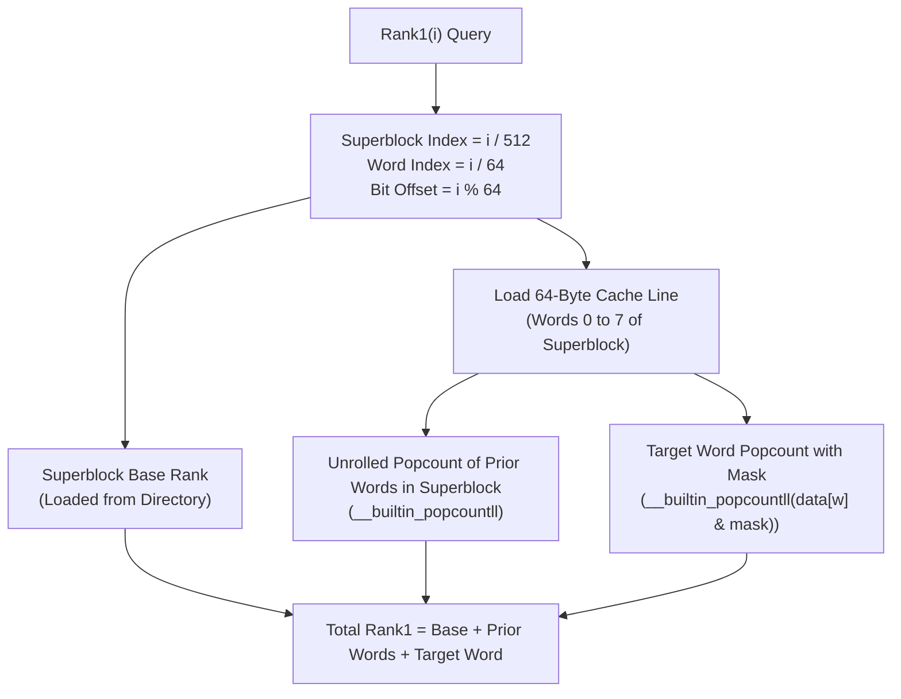

# Succinct Data Structures: Rank and Select on Bitvectors

## 1. Overview & Theoretical Foundations

In classical algorithm design, data structures typically consume space proportional to the number of objects multiplied by the machine pointer width: an array of $N$ pointers on a 64-bit architecture requires $64N$ bits, even if the underlying information content is only a single bit per element.

When datasets expand to billions of records—such as the human genome (3 billion base pairs), web-scale link graphs (tens of billions of edges), or full-text inverted indexes—pointer overhead dominates memory usage and annihilates CPU cache performance.

This dilemma birthed **Succinct Data Structures**, pioneered by **Guy Jacobson** in his 1989 PhD dissertation:
> *"Succinct Static Data Structures"* (FOCS 1989).

### The Space Hierarchy
Let $L$ denote the **information-theoretic lower bound** needed to represent an object from an ensemble $\mathcal{S}$ of cardinality $|\mathcal{S}|$, defined as $L = \lceil \log_2 |\mathcal{S}| \rceil$ bits.
1. **Implicit Data Structure**: Consumes $L + O(1)$ bits (e.g., binary heap in an array, sorted array).
2. **Succinct Data Structure**: Consumes $L + o(L)$ bits while supporting queries in $O(1)$ worst-case time (e.g., Jacobson's bitvector with $N + o(N)$ bits).
3. **Compact Data Structure**: Consumes $O(L)$ bits.

```
   ===================================================================================
   Category     Space Bound           Example                 Query Latency
   ===================================================================================
   Implicit     L + O(1) bits         Binary Heap (in array)  O(log N)
   Succinct     L + o(L) bits         Jacobson Bitvector      O(1) Access, Rank, Select
   Compact      O(L) bits             Wavelet Tree            O(log sigma)
   Classical    Theta(L * W) bits     std::vector<bool> / BST O(1) Access / O(log N)
   ===================================================================================
```

> [!NOTE]
> The fundamental primitives of all succinct data structures are **Rank** and **Select** over a bitvector $B[0 \dots N-1]$:
> - $\text{Rank}_1(i)$: The number of $1$-bits in prefix $B[0 \dots i]$.
> - $\text{Select}_1(k)$: The position of the $k$-th $1$-bit in $B$.
> Succinct trees, compressed suffix arrays, and the FM-Index all compile down to Rank and Select queries on bitvectors.

---

## 2. Mathematical Definition & Invariants

Let $B \in \{0, 1\}^N$ be a bitvector of length $N$.

### 2.1 The Primitives
- **Access($i$)**: Return bit $B[i] \in \{0, 1\}$.
- **$\text{Rank}_1(i)$**: For $0 \le i < N$,
  $$\text{Rank}_1(i) = \sum_{j=0}^{i} B[j]$$
- **$\text{Rank}_0(i)$**: The count of $0$-bits in prefix $[0, i]$:
  $$\text{Rank}_0(i) = (i + 1) - \text{Rank}_1(i)$$
- **$\text{Select}_1(k)$**: For $1 \le k \le \text{Rank}_1(N-1)$,
  $$\text{Select}_1(k) = \min \{ i \in [0, N-1] \mid \text{Rank}_1(i) = k \}$$
- **$\text{Select}_0(k)$**: For $1 \le k \le \text{Rank}_0(N-1)$,
  $$\text{Select}_0(k) = \min \{ i \in [0, N-1] \mid \text{Rank}_0(i) = k \}$$

### 2.2 Jacobson's Two-Level Decomposition Invariant
Jacobson proved that $\text{Rank}_1(i)$ can be computed in $O(1)$ time using $N + o(N)$ bits via a hierarchy of superblocks and blocks:
1. **Superblocks**: Divide $B$ into superblocks of size $S = \lfloor \lg^2 N \rfloor$ bits.
   - For each superblock $j \in [0, \lfloor N/S \rfloor]$, precompute the absolute rank $\text{Rank}_1(j \cdot S - 1)$.
   - Each cumulative value requires $\lceil \lg N \rceil$ bits.
   - Total space for superblocks:
     $$\frac{N}{\lg^2 N} \cdot \lg N = \frac{N}{\lg N} = o(N) \text{ bits}$$
2. **Blocks**: Subdivide each superblock into smaller blocks of size $b = \lfloor \frac{1}{2} \lg N \rfloor$ bits.
   - For each block, store the relative rank (count of 1s) from the start of its containing superblock.
   - Maximum relative rank within a superblock is $S = \lg^2 N$, which fits in $\lceil \lg(\lg^2 N) \rceil = 2 \lg \lg N$ bits.
   - Total space for blocks:
     $$\frac{N}{\frac{1}{2} \lg N} \cdot 2 \lg \lg N = O\left(\frac{N \lg \lg N}{\lg N}\right) = o(N) \text{ bits}$$
3. **In-Block Micro-Table**:
   - Within a block of size $b = \frac{1}{2} \lg N$, the remaining prefix contains at most $b$ bits.
   - Precompute a universal lookup table $M$ indexed by `(bitstring_of_length_b, offset)` returning the popcount.
   - Table size:
     $$2^b \times b \times \lg b = 2^{\frac{1}{2} \lg N} \cdot \frac{1}{2} \lg N \cdot \lg \lg N = \sqrt{N} \cdot \frac{1}{2} \lg N \cdot \lg \lg N = o(N) \text{ bits}$$
4. **Total Space**:
   $$\text{Space} = N + \frac{N}{\lg N} + O\left(\frac{N \lg \lg N}{\lg N}\right) + O(\sqrt{N} \log N \log \log N) = N + o(N) \text{ bits} \quad \blacksquare$$

---

## 3. Structural Anatomy & Modern Hardware Design

While Jacobson's scheme established asymptotic $o(N)$ theory, on modern 64-bit architectures, table lookups cause costly cache misses. Modern production engines (such as SDSL-lite, Succinct, and Facebook folly) leverage **hardware-accelerated 64-bit Word RAM instructions** (`POPCNT`, `TZCNT`, `PDEP`).

```
                     MODERN 512-BIT SUPERBLOCK SUCCINCT BITVECTOR
                     ============================================

   Raw Bit Array: Packed into 64-bit words (uint64_t).
   Superblock: 512 bits = 8 words = 64 bytes (EXACTLY ONE CPU CACHE LINE!)

   +---------------------------------------------------------------+
   | Word 0 | Word 1 | Word 2 | Word 3 | Word 4 | Word 5 | Word 6 | Word 7 |  <-- 64 Bytes
   +---------------------------------------------------------------+

   Superblock Directory (One 32-bit integer per 512 bits):
   +-----------------------+-----------------------+-----------------------+
   |  Cumulative Rank SB 0 |  Cumulative Rank SB 1 |  Cumulative Rank SB 2 | ...
   +-----------------------+-----------------------+-----------------------+
     Overhead: 32 bits per 512 bits = 32 / 512 = 6.25% space overhead!

   Query Evaluation for rank1(i):
   ------------------------------
   1. Superblock index: sb = i / 512
   2. Base rank:        rank = superblock_ranks[sb]              (O(1) Array Read)
   3. Within-SB words:  Sum popcountll for words [sb*8 ... i/64) (In-cache unrolled)
   4. Target word:      popcountll(data[i/64] & bitmask)         (Single CPU instruction)
   TOTAL LATENCY: ~2-3 CPU nanoseconds!
```



---

## 4. Core Operations & Algorithmic Mechanics

### 4.1 O(1) Rank Algorithm
Given query index $i \in [0, N-1]$:
1. Compute superblock index: $sb = \lfloor i / 512 \rfloor$.
2. Retrieve precomputed cumulative rank: $R = \text{superblock\_ranks}[sb]$.
3. Compute target 64-bit word index: $w_{\text{target}} = \lfloor i / 64 \rfloor$.
4. Sum the popcounts of all preceding words within the same superblock:
   $$\text{prior\_sum} = \sum_{w = sb \cdot 8}^{w_{\text{target}} - 1} \text{\_\_builtin\_popcountll}(\text{data}[w])$$
   Because the entire superblock fits in a single 64-byte L1 cache line, this sum accesses registers and L1 cache with zero memory bus stalls.
5. Extract the residual bits within the target word using a bitmask:
   $$\text{bit\_offset} = i \pmod{64}, \quad \text{mask} = (1 \ll (\text{bit\_offset} + 1)) - 1$$
   $$\text{target\_sum} = \text{\_\_builtin\_popcountll}(\text{data}[w_{\text{target}}] \ \& \ \text{mask})$$
6. Total: $\text{Rank}_1(i) = R + \text{prior\_sum} + \text{target\_sum}$.

### 4.2 Select Algorithm
Given target occurrence $k \in [1, \text{total\_ones}]$:
1. **Superblock Binary Search**:
   Search over the monotonically increasing `superblock_ranks` array to locate the unique superblock $sb$ such that:
   $$\text{superblock\_ranks}[sb] < k \le \text{superblock\_ranks}[sb + 1]$$
   Takes $O(\log(N / 512)) = O(\log N)$ time.
2. **Word Scan within Superblock**:
   Let remaining rank needed be $r = k - \text{superblock\_ranks}[sb]$.
   Linearly scan the at most 8 words in superblock $sb$:
   - For each word $w$, evaluate $c = \text{\_\_builtin\_popcountll}(\text{data}[w])$.
   - If $c \ge r$, target 1-bit is inside word $w$. Break.
   - Else, $r \leftarrow r - c$.
3. **Sub-Word Bit Selection**:
   Find the $r$-th set bit within the 64-bit word $\text{data}[w]$:
   - **Hardware Accelerated**: Using Intel BMI2 instruction `_pdep_u64(1ULL << (r - 1), data[w])`, the $r$-th set bit is isolated in 1 cycle, followed by `__builtin_ctzll` to get the bit position.
   - **Portable Binary Search**: In 6 steps ($32, 16, 8, 4, 2, 1$), locate the exact bit position.
4. Return absolute index: $w \cdot 64 + \text{bit\_idx}$.

---

## 5. Asymptotic Complexity Analysis

| Data Structure | Space Overhead | Access | Rank | Select | Construction |
| :--- | :--- | :--- | :--- | :--- | :--- |
| **std::vector\<bool\>** | $0\%$ | $O(1)$ | $O(N)$ scan | $O(N)$ scan | $O(N)$ |
| **Jacobson (1989)** | $O\left(\frac{N \log \log N}{\log N}\right) = o(N)$ | $O(1)$ | $O(1)$ | $O(\log N)$ | $O(N)$ |
| **Clark (1996)** | $O\left(\frac{N \log \log N}{\log N}\right) = o(N)$ | $O(1)$ | $O(1)$ | $O(1)$ | $O(N)$ |
| **512-bit Superblock (Modern)**| **6.25%** ($N / 16$ bits) | **O(1)** | **O(1)** | **O(log N)** | **O(N)** |
| **RRR (Raman, Raman, Rao)** | $N H_0(B) + o(N)$ bits | $O(1)$ | $O(1)$ | $O(1)$ | $O(N)$ |

### Space Efficiency Proof
For $N$ bits:
- Bit storage: $\lceil N / 64 \rceil$ 64-bit integers = $N$ bits.
- Directory storage: 1 `uint32_t` (32 bits) per 512-bit superblock.
- Space overhead ratio:
  $$\frac{\text{Overhead}}{\text{Bit Count}} = \frac{32}{512} = \frac{1}{16} = 6.25\%$$
- Total space: $1.0625 N$ bits. For $N = 10^9$ bits (~120 MB of data), the auxiliary index requires only ~7.5 MB!

---

## 6. Edge Cases & Boundary Handling

1. **Empty Bitvector**:
   When $N = 0$, `total_ones()` and `total_zeros()` return $0$. Select queries return $-1$.
2. **Rank Query Out of Bounds**:
   - For $i < 0$, $\text{rank1}(i) = \text{rank0}(i) = 0$.
   - For $i \ge N$, clamp $i$ to $N - 1$.
3. **Select Out of Bounds**:
   If $k \le 0$ or $k > \text{total\_ones}()$, $\text{select1}(k)$ must return $-1$.
4. **All Zeros or All Ones**:
   - When bitvector consists purely of zeros, $\text{total\_ones}() = 0$; $\text{select1}$ returns $-1$ for any $k \ge 1$.
   - When bitvector consists purely of ones, $\text{select1}(k) = k - 1$ for all $1 \le k \le N$.

---

## 7. High-Performance C++17 Reference Implementation

The complete C++17 implementation is located at [`implementations/cpp/succinct_data_structures.cpp`](../../implementations/cpp/succinct_data_structures.cpp).

Architectural Highlights:
- Complies strictly with `-std=c++17 -O3 -Wall -Wextra -Werror`.
- Cache-line aligned 512-bit superblocks.
- Single-cycle hardware popcounts via `__builtin_popcountll`.
- Portable sub-word binary search for bit selection with zero undefined behavior.
- Full test harness verifying 10,000 random bits against linear scanning oracles.

---

## 8. Idiomatic Python 3 Reference Implementation

The Python reference implementation is located at [`implementations/python/succinct_data_structures.py`](../../implementations/python/succinct_data_structures.py).

Features:
- Bitwise 64-bit word packing matching the C++ layout.
- Clean `__len__`, `__getitem__`, and operator overloading.
- Integrated `unittest.TestCase` suite with randomized differential validation.

---

## 9. Differential Testing & Verification Strategy

Differential verification confirms that every index in the succinct bitvector yields results identical to a naive scanning oracle:

```cpp
// Verification loop over 10,000 bits
for (size_t i = 0; i < N; ++i) {
    assert(sbv.access(i) == bits[i]);
    assert(sbv.rank1(i) == oracle_rank1[i]);
    assert(sbv.rank0(i) == oracle_rank0[i]);
}
for (size_t k = 1; k <= ones_pos.size(); ++k) {
    assert(sbv.select1(k) == ones_pos[k - 1]);
}
for (size_t k = 1; k <= zeros_pos.size(); ++k) {
    assert(sbv.select0(k) == zeros_pos[k - 1]);
}
```

---

## 10. Practical Trade-Offs & Anti-Patterns

### When to Use Succinct Bitvectors
- **Massive Inverted Indexes & Bloom Filter Indices**: When tracking millions of set memberships.
- **Wavelet Trees & Succinct Tree Representations**: As the underlying engine for LOUDS (Level-Order Unary Degree Sequence) or BP (Balanced Parentheses) trees.

### Anti-Patterns
- **Dynamic Bitvectors with Frequent Mutations**: Static succinct bitvectors require full directory rebuilds upon insertion or deletion. For dynamic workloads, use a B-Tree of bit blocks or a dynamic Wavelet Tree.
- **Microscopic Vectors ($N < 512$)**: When $N$ fits in a couple of 64-bit words, a superblock directory is unnecessary overhead. Simple unrolled popcounts on raw `uint64_t` words are faster.

---

## 11. Real-World Applications & Industry Context

1. **Genomics (FM-Index & BWT Aligners)**:
   Tools like Bowtie2 and BWA align short DNA reads against the human genome in seconds by executing millions of Rank queries per second on Burrows-Wheeler transformed bitvectors.
2. **Succinct Trees (LOUDS & DFUDS)**:
   Representing an arbitrary $N$-node tree in $2N + o(N)$ bits (less than 3 bits per node!) while supporting `parent`, `first_child`, and `sibling` queries in $O(1)$ time.
3. **Web Graph Compression (WebGraph Framework)**:
   Compressing billions of hyperlinks down to 1-2 bits per edge using succinct predecessor and adjacency bitvectors.

---

## 12. Comprehensive Problem Set & Extensions

1. **LOUDS Tree Implementation**: Construct a tree representation using Level-Order Unary Degree Sequence (LOUDS) using the `SuccinctBitVector` for navigation.
2. **Elias-Fano Monotone Sequence Coding**: Implement quasi-succinct Elias-Fano encoding for sorted integer sequences using high-bits and low-bits vectors.
3. **Clark's O(1) Select Structure**: Augment the 512-bit superblock bitvector with a sampled select directory to achieve $O(1)$ worst-case select time.
