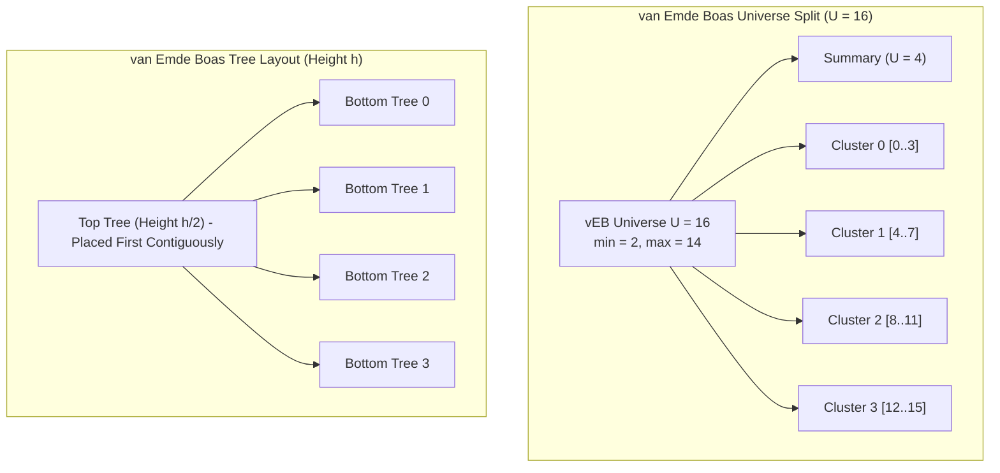
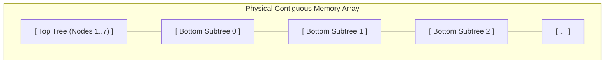

# van Emde Boas Trees and Cache-Oblivious Layouts

> [!NOTE]
> **The Two Manifestations of the van Emde Boas Principle:**
> The core insight of Peter van Emde Boas (1975) is **recursive square-root decomposition**:
> 1. **van Emde Boas Tree (Algebraic Split):** Decomposes an integer universe of size $U$ into a summary of size $\sqrt{U}$ and $\sqrt{U}$ clusters of size $\sqrt{U}$, achieving **$O(\log \log U)$ time** for all dynamic dictionary operations.
> 2. **van Emde Boas Memory Layout (Geometric Split):** Decomposes a complete binary search tree of height $h$ by cutting it at height $h / 2$ into one top tree and $2^{h/2}$ bottom trees laid out contiguously in memory. This achieves the optimal **$O(\log_B N)$ cache-miss bound** across *all* levels of the memory hierarchy simultaneously, without knowing the cache line size $B$ (**cache-oblivious**).

> [!TIP]
> **The $O(\log \log U)$ Recurrence:**
> Binary search over an array of size $N$ cuts the search space in half: $T(N) = T(N/2) + O(1) \implies O(\log N)$.
> A van Emde Boas structure cuts the **number of bits** in half: $T(U) = T(\sqrt{U}) + O(1)$.
> Substituting $U = 2^k \implies T(2^k) = T(2^{k/2}) + O(1) \implies O(\log k) = O(\log \log U)$.

> [!WARNING]
> **The Min/Max Invariant in vEB Trees:**
> In a van Emde Boas tree, the minimum element is stored **only in the root** of the structure and is **never** inserted into the underlying subclusters.
> This invariant is what prevents deletion and insertion from triggering multiple recursive subcalls, preserving the strict single-branch $O(\log \log U)$ time bound.



---

## 1. Core Mental Model & Motivation

### 1.1 The Integer Predecessor Problem
Comparison-based search trees (AVL, Red-Black, B-Trees) are bounded by Information Theoretic lower bounds: they require $\Omega(\log N)$ comparisons to locate an element.

However, on word-RAM machines where keys are bounded integers $x \in \{0, 1, \dots, U - 1\}$, we can do significantly better. A van Emde Boas tree exploits bit-level structure:
- A $k$-bit integer $x$ can be viewed as two $k/2$-bit integers:
  $$\text{high}(x) = \lfloor x / \sqrt{U} \rfloor \quad \text{(the cluster index)}$$
  $$\text{low}(x) = x \bmod \sqrt{U} \quad \text{(the offset within the cluster)}$$
- Instead of checking elements one by one, the summary quickly determines which non-empty cluster contains the predecessor or successor.

### 1.2 The Cache-Oblivious Paradigm
Traditional external-memory structures (like B-Trees) require explicit knowledge of the memory block transfer size $B$ and RAM capacity $M$. While optimal for a single specific hardware tier (such as disk block size = 4KB), modern computers have multi-tier memory hierarchies (L1 = 64B, L2 = 64B, L3 = 64B, RAM pages = 4KB, NVMe blocks = 4KB).

The **van Emde Boas Layout (Prokop, 1999; Bender et al., 2000)** organizes a static binary search tree into memory so that subtrees of size roughly $B$ are stored contiguously in memory **without knowing $B$**. Thus, a binary search incurs:
$$Q(N) = O(\log_B N) \text{ cache misses}$$
simultaneously across L1, L2, L3, and main memory.

---

## 2. Mathematical Formulation & Structural Invariants

### Invariant 1: Root Min/Max Storage
For a vEB node of universe size $U$:
- `min` stores the smallest element currently present.
- `max` stores the largest element currently present.
- If the structure is non-empty, `min` and `max` are valid integers in $[0, U - 1]$.
- **Crucial Rule:** The element stored in `min` **does not appear** in any cluster. The element stored in `max` **does appear** in its respective cluster (unless `min == max`).

### Invariant 2: Summary Invariant
`summary` is a vEB tree of universe size $\sqrt{U}$:
- Cluster $i$ contains at least one element $\iff i$ is present in `summary`.
- When cluster $i$ becomes empty, $i$ must be deleted from `summary`.
- When cluster $i$ receives its first element, $i$ must be inserted into `summary`.

### Invariant 3: van Emde Boas Height Partition (Cache-Oblivious)
For a complete binary search tree of height $h$:
- Split the tree at height $\lfloor h / 2 \rfloor$.
- The **top tree** has height $\lfloor h / 2 \rfloor$ and $2^{\lfloor h / 2 \rfloor} - 1$ nodes.
- There are $2^{\lfloor h / 2 \rfloor}$ **bottom subtrees**, each of height $\lceil h / 2 \rceil$.
- In the memory array, the top tree is laid out recursively first, immediately followed by each of the bottom subtrees laid out recursively.



---

## 3. Concrete Operations: van Emde Boas Tree

### 3.1 Universe Coordinate Transformations
For power-of-two universe $U = 2^k$:
$$\text{upper\_bits}(k) = \lceil k / 2 \rceil, \quad \text{lower\_bits}(k) = \lfloor k / 2 \rfloor$$
$$\text{high}(x) = x \gg \text{lower\_bits}, \quad \text{low}(x) = x \ \& \ ((1 \ll \text{lower\_bits}) - 1)$$
$$\text{index}(c, i) = (c \ll \text{lower\_bits}) \mid i$$

### 3.2 Successor Query ($O(\log \log U)$)
```text
successor(x):
    if universe == 2:
        if x == 0 and max == 1: return 1
        return null
    if min != null and x < min:
        return min
    max_in_cluster = cluster[high(x)].max
    if max_in_cluster != null and low(x) < max_in_cluster:
        offset = cluster[high(x)].successor(low(x))
        return index(high(x), offset)
    else:
        succ_cluster = summary.successor(high(x))
        if succ_cluster == null: return null
        offset = cluster[succ_cluster].min
        return index(succ_cluster, offset)
```

### 3.3 Insertion ($O(\log \log U)$)
```text
insert(x):
    if min == null:
        min = max = x
        return
    if x < min:
        swap(x, min)  // new min stored in root; old min pushed into cluster
    if universe > 2:
        c = high(x), i = low(x)
        if cluster[c].min == null:
            summary.insert(c)
            cluster[c].insert(i)
        else:
            cluster[c].insert(i)
    if x > max:
        max = x
```

### 3.4 Deletion ($O(\log \log U)$)
```text
delete(x):
    if min == max:
        min = max = null
        return
    if universe == 2:
        min = max = (x == 0) ? 1 : 0
        return
    if x == min:
        first_cluster = summary.min
        x = index(first_cluster, cluster[first_cluster].min)
        min = x
    c = high(x), i = low(x)
    cluster[c].delete(i)
    if cluster[c].min == null:
        summary.delete(c)
        if x == max:
            sum_max = summary.max
            if sum_max == null: max = min
            else: max = index(sum_max, cluster[sum_max].max)
    else if x == max:
        max = index(c, cluster[c].max)
```

---

## 4. Cache-Oblivious van Emde Boas Search Layout

In a standard pointer-based binary search tree, nodes are scattered unpredictably across the heap, leading to $O(\log_2 N)$ cache misses per lookup.
In an in-order array, binary search jumps by $N/2, N/4, N/8$, hopping between distant cache lines until the interval fits inside a single block.

### The van Emde Boas Layout Algorithm
To lay out a static tree of $N = 2^h - 1$ keys in an array `A[0..N-1]`:
1. If $h = 1$, store the single key.
2. Otherwise, recursively lay out the top tree of height $h_{top} = \lfloor h / 2 \rfloor$.
3. Sequentially lay out each of the $2^{h_{top}}$ bottom subtrees of height $h_{bot} = h - h_{top}$.

```text
Recursive Layout Memory Footprint:
Level 0:  [ Entire Tree of Height h ]
Level 1:  [ Top Tree h/2 ] [ Bottom 0 ] [ Bottom 1 ] ...
Level k:  When subtree height <= log2(B), the entire subtree fits inside a single cache block B!
```

### Why It Achieves $O(\log_B N)$ Without Knowing $B$:
Consider any cache block of size $B$. There exists a level in the recursive decomposition where the subtrees have size $\le B$ but parent subtrees have size $> B$.
- The height of these subtrees is at least $\frac{1}{2} \log_2 B$.
- Any path from root to leaf visits at most $\frac{\log_2 N}{\frac{1}{2} \log_2 B} = 2 \log_B N$ such subtrees.
- Because each such subtree is laid out **contiguously** in memory, entering a subtree incurs at most **$O(1)$ cache misses** (at most 2 blocks if unaligned).
- Therefore, the total cache misses is:
$$Q(N) \le 4 \log_B N = O(\log_B N)$$
matching the optimal I/O bound of a B-Tree tuned specifically for $B$!

---

## 5. Algorithmic Complexity Comparison

| Structure | Predecessor / Successor | Insert / Delete | Cache Misses ($Q(N)$) | Parameter Required? |
| :--- | :--- | :--- | :--- | :--- |
| **Standard Binary Search Tree** | $O(\log N)$ | $O(\log N)$ | $O(\log_2 N)$ | No |
| **B-Tree ($B$-way)** | $O(\log_B N \cdot \log B)$ | $O(\log_B N)$ | $O(\log_B N)$ | **Yes (tuned to $B$)** |
| **Cache-Oblivious vEB Layout** | $O(\log N)$ comparisons | Static / Amortized $O(\log^2 N)$ | **$O(\log_B N)$** | **No (Parameter-Free)** |
| **van Emde Boas Tree** | **$O(\log \log U)$** | **$O(\log \log U)$** | $O(\log \log U)$ | Universe size $U$ |

---

## 6. Arthur's Two-Layer API Implementation

Following repository standards:
- **Layer A (Fast Preconditioned Core):**
  - `uint64_t min() const`: Precondition: `!empty()`, debug `assert(!empty())`.
  - `uint64_t max() const`: Precondition: `!empty()`.
  - `uint64_t successor(uint64_t x) const`: Returns successor value.
- **Layer B (Safe Adapter API):**
  - `const uint64_t* try_min() const`: Returns pointer to min or `nullptr`.
  - `const uint64_t* try_max() const`: Returns pointer to max or `nullptr`.
  - `const uint64_t* try_successor(uint64_t x) const`: Zero-copy pointer check.

---

## 7. Edge Cases & Failure Modes

1. **Universe Size Boundary:** Base case universe $U = 2$. Bits operations must terminate cleanly without allocating sub-clusters.
2. **Successor to Max Key:** Querying successor of an element $\ge \text{max}$ must safely return null without invalid summary lookups.
3. **Empty vs Single-Element Tree:** When deleting the sole remaining element, both `min` and `max` reset to null simultaneously without invoking cluster deletion.
4. **Duplicate Insertions:** vEB trees model mathematical sets; inserting an existing key must be a no-op to preserve cluster emptiness invariants.

---

## 8. Reference Implementation Architecture

Both C++17 and Python 3 reference implementations provide:
- **`VanEmdeBoasTree`**: Dynamic $O(\log \log U)$ integer set with full predecessor/successor queries.
- **`CacheObliviousTree`**: Complete binary search tree using the recursive van Emde Boas height-split layout with $O(\log_B N)$ memory locality.
- **`SetOracle`**: Ground-truth differential verification oracle using balanced BST / `std::set`.

---

## 9. Differential Testing & Oracle Verification Strategy

- **Set Differential Testing:** 1,000 randomized operations (`insert`, `delete`, `successor`, `predecessor`, `min`, `max`) tested against `std::set` / Python's `bisect`.
- **Layout Search Verification:** Random search queries verified between the Cache-Oblivious vEB layout array and `std::lower_bound`.

---

## 10. Engineering Pitfalls & Optimization Notes

> [!CAUTION]
> **Cluster Pointer Overhead in Small Universes:**
> Naively instantiating pointers for every cluster creates huge memory waste for large $U$. In production, clusters are instantiated lazily on-demand or backed by hash maps when sparse.

> [!TIP]
> **Bit-Shift Masking:**
> Never use integer division or modulo for $U = 2^k$. Always use `>> (k >> 1)` and `& ((1ULL << (k >> 1)) - 1)` for sub-nanosecond coordinate transformations.

---

## 11. Real-World Applications & Industry Context

1. **Router Forwarding & IP Lookup:** Longest prefix matching and fast routing tables over 32-bit and 64-bit address spaces.
2. **Real-Time Priority Scheduling:** Operating system task schedulers where priority levels are discrete integers and min/successor must be bounded in sub-microsecond time.
3. **Columnar Database Engines:** Fast dictionary-encoded column scans using cache-oblivious B-trees for multi-core memory locality across diverse cloud CPU architectures.

---

## 12. Curated Academic References

1. **van Emde Boas, Peter (1975):** *Preserving order in a forest in less than logarithmic time*. Proceedings of the 16th Annual Symposium on Foundations of Computer Science (FOCS '75), pp. 75–84.
2. **Prokop, Harald (1999):** *Cache-Oblivious Algorithms*. Master's thesis, Massachusetts Institute of Technology.
3. **Bender, Michael A., Demaine, Erik D., & Farach-Colton, Martin (2000):** *Cache-Oblivious B-Trees*. FOCS 2000.
4. **Cormen, Leiserson, Rivest, Stein (CLRS):** *Introduction to Algorithms* (3rd ed.). Chapter 20: "van Emde Boas Trees".
