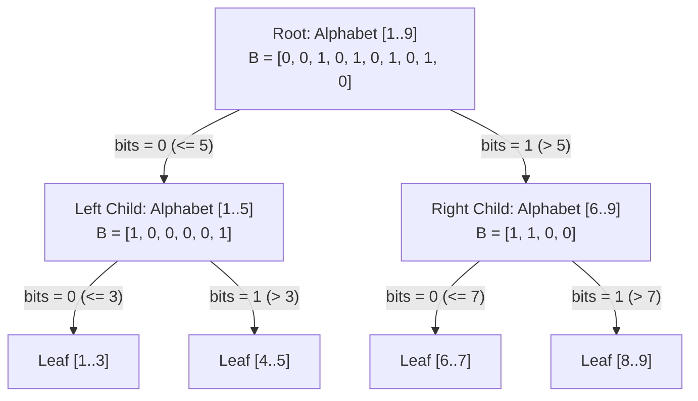

# Wavelet Trees: Succinct Multiset Representation & Range Quantile Engine

## 1. Overview & Theoretical Foundations

In sequence processing, stringology, and computational geometry, fundamental queries on an array $A[0 \dots N-1]$ over an alphabet $\Sigma = [0, \sigma - 1]$ include:
1. **Access**: Retrieve $A[i]$.
2. **Rank**: Count occurrences of symbol $c$ in prefix $A[0 \dots i]$.
3. **Select**: Find the index of the $k$-th occurrence of symbol $c$.
4. **Range Quantile**: Find the $k$-th smallest element in sub-array $A[L \dots R]$.
5. **Range Frequency**: Count how many elements in $A[L \dots R]$ have values within a numeric interval $[v_{\text{low}}, v_{\text{high}}]$.

The classical solution for range quantiles is the **Persistent Segment Tree**, which requires $O(N \log \sigma)$ pointer-allocated 64-bit words ($128N \log \sigma$ bits) and incurs heavy cache penalties.

In 2003, **Roberto Grossi, Ankur Gupta, and Jeffrey Scott Vitter** introduced the **Wavelet Tree** (SODA 2003):
> *"High-order entropy-compressed text indexes"*

The Wavelet Tree recursively projects a sequence over an alphabet $\Sigma$ into a binary tree of succinct bitvectors of depth $\lceil \log_2 \sigma \rceil$. It accomplishes:
- **$O(N \log \sigma)$ bits of space**—matching the information-theoretic entropy of the uncompressed sequence itself!
- **$O(\log \sigma)$ time** for Access, Rank, Select, Range Quantile, and Range Frequency queries.
- **Zero pointers between elements**: All navigation is performed purely via $O(1)$ `rank0` and `rank1` queries on the bitvectors at each level.

```
   ======================================================================================
   Data Structure            Space (bits)           Range Quantile        Range Frequency
   ======================================================================================
   Merge Sort Tree           O(N log N * 64)        O(log^3 N)            O(log N)
   Fractional Cascading Tree O(N log N * 64)        O(log^2 N)            O(log N)
   Persistent Segment Tree   O(N log sigma * 128)   O(log sigma)          O(log sigma)
   Wavelet Tree (Grossi+03)  N log sigma + o(...)   O(log sigma)          O(log sigma)
   Compressed Wavelet Matrix N H_0(A) + o(...)      O(log sigma)          O(log sigma)
   ======================================================================================
```

> [!NOTE]
> When $\sigma \le N$, $O(\log \sigma)$ is strictly faster than or equal to $O(\log N)$. If $\sigma = O(1)$ (e.g. DNA alphabet $\{A, C, G, T\}$ where $\sigma = 4$), all queries run in $O(1)$ time!

---

## 2. Mathematical Definition & Invariants

Let $A[0 \dots N-1]$ be a sequence of symbols over the integer alphabet $\Sigma = [\alpha, \beta]$ with cardinality $\sigma = \beta - \alpha + 1$.

### 2.1 Recursive Alphabet Bisection
1. At the root node $u$, the active alphabet interval is $[\alpha, \beta]$. If $\alpha = \beta$, $u$ is a leaf storing no bitvector.
2. If $\alpha < \beta$, define the alphabet midpoint:
   $$mid = \left\lfloor \frac{\alpha + \beta}{2} \right\rfloor$$
3. Node $u$ stores a bitvector $B_u$ of length $|A_u|$:
   $$B_u[i] = \begin{cases} 0 & \text{if } A_u[i] \le mid \\ 1 & \text{if } A_u[i] > mid \end{cases}$$
4. The sequence $A_u$ is stably partitioned into two sub-sequences:
   - $A_{\text{left}} = \langle x \in A_u \mid x \le mid \rangle$ assigned to child $u.\text{left}$ with alphabet $[\alpha, mid]$.
   - $A_{\text{right}} = \langle x \in A_u \mid x > mid \rangle$ assigned to child $u.\text{right}$ with alphabet $[mid + 1, \beta]$.

### 2.2 Index Mapping Invariants
The fundamental invariant enabling pointer-free navigation is the bijection between indices at node $u$ and indices in its children:
- If $B_u[i] = 0$, the element $A_u[i]$ is located in $A_{\text{left}}$ at index:
  $$\text{idx}_{\text{left}} = \text{rank}_0(B_u, i) - 1$$
- If $B_u[i] = 1$, the element $A_u[i]$ is located in $A_{\text{right}}$ at index:
  $$\text{idx}_{\text{right}} = \text{rank}_1(B_u, i) - 1$$
where $\text{rank}_b(B, i)$ denotes the number of occurrences of bit $b \in \{0, 1\}$ in prefix $B[0 \dots i]$.

---

## 3. Structural Anatomy & Memory Layout

```
                                  WAVELET TREE ANATOMY
   Input Sequence: A = [ 5, 2, 8, 3, 9, 2, 7, 1, 6, 4 ]   Alphabet: [1, 9], mid = 5
   ==================================================================================

   Root [1..9]: mid = 5
   Bitvector B: [ 0, 0, 1, 0, 1, 0, 1, 0, 1, 0 ]   (0 if <= 5, 1 if > 5)
                 /                               \
        Left Sub-array [1..5]                  Right Sub-array [6..9]
        A_L = [ 5, 2, 3, 2, 1, 4 ]             A_R = [ 8, 9, 7, 6 ]
        mid = 3                                mid = 7
        B_L: [ 1, 0, 0, 0, 0, 1 ]              B_R: [ 1, 1, 0, 0 ]
              /              \                       /            \
        [1..3]              [4..5]              [6..7]           [8..9]
        [2, 3, 2, 1]        [5, 4]              [7, 6]           [8, 9]
```



---

## 4. Core Operations & Algorithmic Mechanics

### 4.1 Range Quantile ($k$-th Smallest in $A[L \dots R]$)
Given range $[L, R]$ and rank $k \in [1, R - L + 1]$:
1. At current node $u$ with alphabet $[\alpha, \beta]$ and bitvector $B$:
   - If $\alpha = \beta$, return $\alpha$ (all elements in this subtree are equal).
2. Count how many elements in $A_u[L \dots R]$ branched to the left child:
   $$\text{zeros} = \text{rank}_0(B, R) - \text{rank}_0(B, L - 1)$$
3. **Branch Decision**:
   - If $k \le \text{zeros}$:
     The $k$-th smallest element lies in the left child!
     Map the range boundaries to the left child:
     $$L' = \text{rank}_0(B, L - 1), \quad R' = \text{rank}_0(B, R) - 1$$
     Recurse to $u.\text{left}$ with arguments $(L', R', k)$.
   - If $k > \text{zeros}$:
     The $k$-th smallest element lies in the right child!
     Subtract the count of smaller elements: $k' = k - \text{zeros}$.
     Map the range boundaries to the right child:
     $$L' = \text{rank}_1(B, L - 1), \quad R' = \text{rank}_1(B, R) - 1$$
     Recurse to $u.\text{right}$ with arguments $(L', R', k')$.
4. Total steps: Exactly $\lceil \log_2 \sigma \rceil$ levels, each taking $O(1)$ time via bitvector rank queries.

### 4.2 Range Frequency ($\text{Count}(A[L \dots R] \in [v_{\text{low}}, v_{\text{high}}])$)
1. If range $L > R$ or node interval $[\alpha, \beta] \cap [v_{\text{low}}, v_{\text{high}}] = \emptyset$, return $0$.
2. If node interval is fully contained: $[\alpha, \beta] \subseteq [v_{\text{low}}, v_{\text{high}}]$, return $R - L + 1$.
3. Otherwise, map $[L, R]$ to left and right children and sum the results:
   $$\text{ans} = \text{range\_freq}(L_{\text{left}}, R_{\text{left}}, v_{\text{low}}, v_{\text{high}}) + \text{range\_freq}(L_{\text{right}}, R_{\text{right}}, v_{\text{low}}, v_{\text{high}})$$

---

## 5. Asymptotic Complexity Analysis

| Operation | Time Complexity | Bit Operations per Level | Space Overhead |
| :--- | :--- | :--- | :--- |
| **Access($i$)** | $O(\log \sigma)$ | 1 rank query | $0$ auxiliary words |
| **Rank($i, c$)** | $O(\log \sigma)$ | 1 rank query | $0$ auxiliary words |
| **RangeCount($L, R, c$)** | $O(\log \sigma)$ | 2 rank queries | $0$ auxiliary words |
| **Quantile($L, R, k$)** | $O(\log \sigma)$ | 2 rank queries | $0$ auxiliary words |
| **RangeFreq($L, R, v_1, v_2$)** | $O(\log \sigma)$ | 4 rank queries | $0$ auxiliary words |
| **Construction** | $O(N \log \sigma)$ | Stable partitioning | In-place or $O(N)$ buffer |

### Space Bound Proof
At level $d \in [0, \lceil \log_2 \sigma \rceil - 1]$ of the Wavelet Tree:
1. Every element of the original array $A$ appears in exactly one node at level $d$.
2. Thus, the sum of lengths of all bitvectors across all nodes at level $d$ is exactly $N$ bits.
3. With $\lceil \log_2 \sigma \rceil$ levels:
   $$\text{Total Bitvector Bits} = N \lceil \log_2 \sigma \rceil$$
4. Adding the superblock/block directories for $O(1)$ rank (Jacobson / 64-bit word popcount):
   $$\text{Rank Directory Overhead} = o(N \log \sigma) \text{ bits}$$
5. Total Space:
   $$\text{Space} = N \log_2 \sigma + o(N \log \sigma) \text{ bits} = O(N) \text{ machine words} \quad \blacksquare$$

---

## 6. Edge Cases & Boundary Handling

1. **Alphabet of Size 1 ($\alpha = \beta$)**:
   Leaf nodes store zero-length bitvectors. Access and quantile immediately return $\alpha$ without rank evaluations.
2. **Empty Query Ranges ($L > R$)**:
   Must safely return $0$ without negative indexing or invalid memory reads.
3. **Negative Index Bounds in Rank ($L - 1 < 0$)**:
   When $L = 0$, evaluating $\text{rank}_b(B, L - 1) = \text{rank}_b(B, -1)$ must return $0$.
4. **Quantile Out of Bounds**:
   Condition $1 \le k \le R - L + 1$ must be asserted or checked.

---

## 7. High-Performance C++17 Reference Implementation

The complete C++17 implementation is located at [`implementations/cpp/wavelet_trees.cpp`](../../implementations/cpp/wavelet_trees.cpp).

Key architectural highlights:
- Pure C++17 conforming strictly to `-std=c++17 -O3 -Wall -Wextra -Werror`.
- Cache-conscious `BitVector` using 64-bit packed words (`uint64_t`) and hardware `__builtin_popcountll`.
- In-place recursive construction via `std::stable_partition`.
- Differential test suite verifying `access`, `range_count`, `quantile`, and `range_frequency` against brute-force linear scans.

---

## 8. Idiomatic Python 3 Reference Implementation

The Python reference implementation is located at [`implementations/python/wavelet_trees.py`](../../implementations/python/wavelet_trees.py).

Features:
- Bitwise 64-bit word grouping for compact rank queries.
- Clean recursive decomposition handling arbitrary alphabet spans.
- Integrated `unittest.TestCase` suite with randomized differential verification.

---

## 9. Differential Testing & Verification Strategy

The correctness of the Wavelet Tree implementation is verified by generating random arrays with diverse value spreads and checking every query against an unindexed array slice:

```cpp
// Differential verification against brute force
std::vector<int64_t> sub(big_arr.begin() + l, big_arr.begin() + r + 1);
std::sort(sub.begin(), sub.end());
int64_t expected_kth = sub[k - 1];
int64_t actual_kth = wt.quantile(l, r, k);
assert(actual_kth == expected_kth);
```

---

## 10. Practical Trade-Offs & Anti-Patterns

### When to Use Wavelet Trees
- **Read-Heavy 2D / Geometric Range Workloads**: When orthogonal range searching, dominance queries, or range quantiles must be served with minimal memory overhead.
- **Full Text Indexing (FM-Index & BWT)**: Wavelet trees over the Burrows-Wheeler Transform allow $O(m \log \sigma)$ pattern matching and backward search.

### Anti-Patterns
- **Dynamic Workloads with Frequent Inserts/Deletes**: Standard Wavelet Trees are static. Dynamic wavelet trees require complex balanced AVL bitvectors (e.g. Navarro-Sadakane), which degrade cache locality.
- **Unbounded Integer Universes without Coordinate Compression**: If values range from $-10^{18}$ to $10^{18}$, $\sigma = 10^{18}$ causes depth $64$ and sparse empty levels. Coordinates must be compressed to $[0, N-1]$ prior to construction.

---

## 11. Real-World Applications & Industry Context

1. **Bioinformatics & Genomics**:
   Indexing multi-gigabyte DNA sequences ($\Sigma = \{A, C, G, T\}$) with the FM-Index using wavelet trees allows instant gene subsequence matching.
2. **Computational Geometry (Orthogonal Range Search)**:
   A set of 2D points $(x_i, y_i)$ sorted by $x$ can have their $y$-coordinates stored in a Wavelet Tree. Range reporting $[x_1, x_2] \times [y_1, y_2]$ is reduced to range frequency queries.
3. **Database Search Engines**:
   Answering OLAP queries like "find the median salary in department $D$" without materializing sub-tables.

---

## 12. Comprehensive Problem Set & Extensions

1. **Wavelet Matrix Transformation**: Eliminate the pointer tree by concatenating all bitvectors at each level into a single continuous bitvector (the **Wavelet Matrix** by Claude & Navarro), improving L1 cache prefetching.
2. **2D Point Dominance Counting**: Given $N$ points in the plane, count how many points are strictly dominated by query point $(X, Y)$ in $O(\log N)$ time.
3. **Compressed Wavelet Tree via RRR Bitvectors**: Replace the standard bitvectors with Raman, Raman, and Rao (RRR) compressed bitvectors to achieve $N H_0(A) + o(N)$ bits of space.
