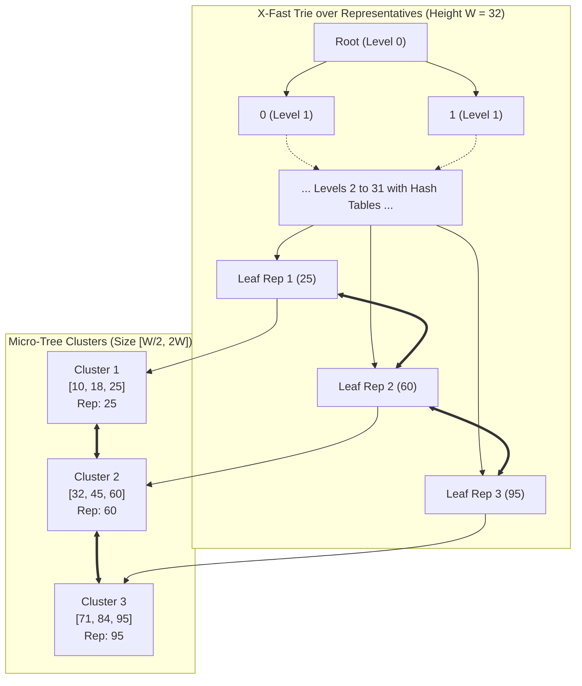

# X-Fast and Y-Fast Tries: Bitwise Predecessor Search on the Word RAM

## 1. Overview & Theoretical Foundations

In integer sorting and predecessor searching, the classical comparison-based lower bound of $\Omega(\log N)$ (established by information theory) can be surpassed on the **Word RAM model**. The Word RAM model assumes an integer word length of $W$ bits (representing a universe size $U = 2^W$, typically $W \in \{32, 64\}$) where standard bitwise, arithmetic, and indirect addressing operations execute in $O(1)$ worst-case time.

While the **van Emde Boas (vEB) tree** (1975) famously achieves $O(\log \log U)$ query and update time, its spatial requirement is $\Theta(U)$, which is prohibitive for realistic 32-bit or 64-bit address spaces unless complex randomized dynamic hash tables are maintained at every recursive level.

In 1983, **Dan E. Willard** introduced two seminal data structures that fundamentally resolved the space-time trade-off:
1. **X-Fast Trie**: Uses $O(N \cdot W)$ words of space, achieves $O(\log W) = O(\log \log U)$ predecessor and successor search via binary search on prefix levels with hash tables, and supports updates in $O(W)$ time.
2. **Y-Fast Trie**: Combines an X-Fast Trie over cluster representatives with balanced micro-trees (e.g., Red-Black trees or AVL trees of size $\Theta(W)$), achieving the holy grail:
   - **$O(N)$ Space**: Linear in the number of stored keys, independent of the universe size $U$.
   - **$O(\log \log U)$ Time**: Predecessor, successor, insertion, and deletion all run in $O(\log W) = O(\log \log U)$ time (amortized for updates).

```
   ========================================================================
   Data Structure         Predecessor / Successor    Space           Update
   ========================================================================
   Balanced BST (AVL/RB)  O(log N)                   O(N)            O(log N)
   van Emde Boas (vEB)    O(log log U)               O(U)            O(log log U)
   X-Fast Trie            O(log log U)               O(N log U)      O(log U)
   Y-Fast Trie            O(log log U)               O(N)            O(log log U)*
   Fusion Tree            O(log_W N)                 O(N)            O(log_W N)*
   ========================================================================
   * amortized update time
```

> [!NOTE]
> The term $O(\log W)$ is mathematically identical to $O(\log \log U)$ because $U = 2^W$, hence $W = \log_2 U$. For $W = 64$, $\log_2 W = 6$ operations, completely independent of whether $N = 10^3$ or $N = 10^9$.

---

## 2. Mathematical Definition & Invariants

Let the key universe be $\mathcal{U} = [0, 2^W - 1]$. Every key $x \in \mathcal{U}$ is represented by a $W$-bit binary string $b_1 b_2 \dots b_W \in \{0, 1\}^W$.

### 2.1 X-Fast Trie Invariants
1. **Prefix Hierarchy**: The X-Fast Trie is a bitwise trie of height $W$. The root sits at depth $0$ representing the empty prefix $\epsilon$. For depth $d \in [1, W]$, a node represents a prefix $p \in \{0, 1\}^d$.
2. **Level Dictionaries**: For each level $d \in [0, W]$, a dynamic dictionary (hash table) $T_d$ stores all prefixes of length $d$ present among the currently active keys.
3. **Leaf Linked List**: The leaves at depth $W$ represent the active elements $\mathcal{S} \subseteq \mathcal{U}$ and are linked in a bidirectional doubly linked list in strictly ascending order.
4. **Subtree Extrema Invariants (Descendant Pointers)**:
   Every internal node $u$ maintains pointers to the minimum and maximum leaves reachable in its subtree:
   $$\text{desc\_min}(u) = \begin{cases} \text{desc\_min}(u.\text{left}) & \text{if } u.\text{left} \ne \text{null} \\ \text{desc\_min}(u.\text{right}) & \text{otherwise} \end{cases}$$
   $$\text{desc\_max}(u) = \begin{cases} \text{desc\_max}(u.\text{right}) & \text{if } u.\text{right} \ne \text{null} \\ \text{desc\_max}(u.\text{left}) & \text{otherwise} \end{cases}$$
   For any leaf $L$ at depth $W$: $\text{desc\_min}(L) = \text{desc\_max}(L) = L$.

### 2.2 Longest Common Prefix (LCP) Lemma
Let $x \in \mathcal{U}$ be an arbitrary query key. Let $u$ be the node in the trie with the maximum depth $d \in [0, W]$ whose prefix matches the $d$-bit prefix of $x$.
- If $d = W$, $x$ is present in the trie.
- If $d < W$, let $b = x_{d+1} \in \{0, 1\}$ be the $(d+1)$-th bit of $x$. Node $u$ lacks a child for bit $b$.
  - If $b = 0$, $u$ has only a right child ($u.\text{right} \ne \text{null}$). Every key in $u$'s subtree has a $1$ at bit $d+1$, so all keys in $u$'s subtree are strictly greater than $x$. Therefore, $\text{desc\_min}(u)$ is the smallest key strictly greater than $x$ sharing the prefix $u$.
  - If $b = 1$, $u$ has only a left child ($u.\text{left} \ne \text{null}$). Every key in $u$'s subtree has a $0$ at bit $d+1$, so all keys in $u$'s subtree are strictly less than $x$. Therefore, $\text{desc\_max}(u)$ is the largest key strictly less than $x$ sharing the prefix $u$.

### 2.3 Y-Fast Trie Indirection Invariants
To eliminate the $O(N \cdot W)$ space overhead:
1. **Cluster Partitioning**: The sorted set of $N$ keys is partitioned into contiguous clusters $\mathcal{C}_1, \mathcal{C}_2, \dots, \mathcal{C}_k$ such that for all $i < j$, every element in $\mathcal{C}_i$ is strictly smaller than every element in $\mathcal{C}_j$.
2. **Cluster Size Bounds**: Each cluster is a balanced micro-tree satisfying:
   $$\frac{W}{2} \le |\mathcal{C}_i| \le 2W$$
   (The boundary clusters may contain fewer elements during initialization or extreme deletions).
3. **Representative Invariant**: For each cluster $\mathcal{C}_i$, its maximum key $\text{rep}(\mathcal{C}_i) = \max(\mathcal{C}_i)$ is designated as its representative.
4. **Top-Level Trie**: An X-Fast Trie stores the set of representatives $R = \{\text{rep}(\mathcal{C}_1), \dots, \text{rep}(\mathcal{C}_k)\}$.
   Since $|R| = k = \Theta(N / W)$, the X-Fast Trie occupies:
   $$O(|R| \cdot W) = O\left(\frac{N}{W} \cdot W\right) = O(N) \text{ words of space!}$$

---

## 3. Structural Anatomy & Memory Layout

```
                                  Y-FAST TRIE ARCHITECTURE
                                  ========================

   Top-Level: X-Fast Trie over Cluster Representatives (Size: O(N/W), Space: O(N))
   -------------------------------------------------------------------------------
   Level 0:                             [ Root: "" ]
                                         /        \
   Level 1:                       [ 0 ]              [ 1 ]
                                 /     \            /     \
   ...
   Level W:                  [Rep 1]  [Rep 2]     [Rep 3]   [Rep 4]
                                |        |           |         |
                                v        v           v         v
   Bottom-Level: Balanced Micro-Trees (Clusters of size W/2 to 2W, Total Space: O(N))
   -------------------------------------------------------------------------------
   Cluster List:  [ C_1 ] <---> [ C_2 ] <------> [ C_3 ] <---> [ C_4 ]
                    |             |                |             |
                 Balanced      Balanced         Balanced      Balanced
                 BST (<=2W)    BST (<=2W)       BST (<=2W)    BST (<=2W)
                 max = Rep 1   max = Rep 2      max = Rep 3   max = Rep 4
```



---

## 4. Core Operations & Algorithmic Mechanics

### 4.1 X-Fast Trie Predecessor Query
To evaluate $\text{Predecessor}(x)$:
1. **Direct Lookup**: Check level $W$ dictionary $T_W[x]$. If $x$ exists, return $x$.
2. **Binary Search on Levels**:
   - Maintain binary search interval $[low, high] = [0, W]$.
   - At midpoint $mid = \lfloor (low + high) / 2 \rfloor$, compute prefix $p = x \gg (W - mid)$.
   - Query level dictionary $T_{mid}$ for key $p$.
   - If found: record candidate node $u = T_{mid}[p]$, search lower levels ($low = mid + 1$).
   - If not found: search upper levels ($high = mid - 1$).
   - Concludes in $\lceil \log_2(W + 1) \rceil$ probe steps.
3. **Descendant Pointer Jump**:
   - Let $u$ be the LCP node found at depth $d < W$.
   - Look at the branch bit $b = (x \gg (W - 1 - d)) \ \& \ 1$.
   - If $b == 0$, $x$ branched left into an empty subtree. Jump to $cand = u.\text{desc\_min}$. If $cand.\text{prefix} > x$, candidate predecessor is $cand.\text{prev\_leaf}$.
   - If $b == 1$, $x$ branched right into an empty subtree. Jump to $cand = u.\text{desc\_max}$. If $cand.\text{prefix} > x$, candidate predecessor is $cand.\text{prev\_leaf}$.
4. **Validation**: Return $cand.\text{prefix}$ if valid and $\le x$; otherwise $\text{nullopt}$.

> [!IMPORTANT]
> The binary search checks presence in $T_{mid}$ in $O(1)$ expected time (or $O(1)$ deterministic time via Fredman-Komlós-Szemerédi perfect hashing). Total query time is strictly $O(\log W)$.

### 4.2 Y-Fast Trie Predecessor & Successor
1. To find $\text{Predecessor}(x)$ in Y-Fast Trie:
   - Query top-level X-Fast Trie for representative successor $r = \text{rep\_trie}.\text{successor}(x)$.
   - If $r$ exists, retrieve cluster $C = \text{rep\_to\_cluster}[r]$.
   - If $r$ does not exist (i.e., $x$ is greater than all representatives), retrieve the tail cluster $C = \text{cluster\_tail}$.
   - In micro-tree $C$, find the predecessor using standard BST `upper_bound`:
     - If an element $\le x$ exists within $C$, return it.
     - If all elements in $C$ are $> x$, the predecessor must be the maximum element in the predecessor cluster $C.\text{prev}$ (which is simply $C.\text{prev}.\text{items}.\text{back}()$).
2. Run time:
   - Top-level X-Fast query: $O(\log W)$.
   - Micro-tree search: $O(\log |C|) = O(\log(2W)) = O(\log W)$.
   - Total time: $O(\log W) = O(\log \log U)$.

### 4.3 Dynamic Cluster Maintenance (Split & Merge)
- **Insertion**:
  - Locate target cluster $C$ via $r = \text{rep\_trie}.\text{successor}(x)$.
  - Insert $x$ into $C$ in $O(\log W)$ time.
  - If $x$ becomes the new maximum of $C$, update its representative in the X-Fast Trie: delete old rep, insert new rep ($O(W)$ time).
  - If $|C| > 2W$: split $C$ into two equal clusters $C_1, C_2$ each of size $W$. Insert new representative into X-Fast Trie ($O(W)$).
- **Amortized Analysis**:
  A split requires $O(W)$ work, but a cluster is only split after at least $W$ insertions into a freshly split cluster of size $W$.
  $$\text{Amortized Cost per Insert} = O(\log W) + \frac{O(W)}{W} = O(\log W) = O(\log \log U)$$
- **Deletion**:
  - Locate cluster, remove $x$.
  - If $|C| < W/2$: merge with adjacent cluster $C.\text{next}$ (or borrow elements). If merged, delete representative from X-Fast Trie ($O(W)$).
  - By identical potential arguments, deletions cost $O(\log \log U)$ amortized time.

---

## 5. Asymptotic Complexity Analysis

| Data Structure | Space | Predecessor / Successor | Insert | Erase | Memory Locality |
| :--- | :--- | :--- | :--- | :--- | :--- |
| **std::set (Red-Black)** | $O(N)$ | $O(\log N)$ | $O(\log N)$ | $O(\log N)$ | Poor (node-based) |
| **van Emde Boas** | $O(U)$ | $O(\log \log U)$ | $O(\log \log U)$ | $O(\log \log U)$ | Poor (huge footprint) |
| **X-Fast Trie** | $O(N \cdot W)$ | $O(\log W)$ | $O(W)$ | $O(W)$ | Moderate |
| **Y-Fast Trie** | $\mathbf{O(N)}$ | $\mathbf{O(\log W)}$ | $\mathbf{O(\log W)}^*$ | $\mathbf{O(\log W)}^*$ | High within micro-trees |
| **Fusion Tree** | $O(N)$ | $O(\log_W N)$ | $O(\log_W N)^*$ | $O(\log_W N)^*$ | Very High (Word RAM) |

$^*$ indicates amortized complexity.

### Formal Proof of Space Bound
In a Y-Fast Trie storing $N$ elements with micro-tree bounds $[W/2, 2W]$:
1. Total number of micro-tree nodes across all clusters is exactly $N$.
2. Number of clusters $k$ satisfies:
   $$k \le \frac{N}{W/2} = \frac{2N}{W} = O\left(\frac{N}{W}\right)$$
3. The X-Fast Trie stores exactly $k$ representative keys.
4. An X-Fast Trie with $k$ keys contains at most $k \cdot (W + 1)$ total nodes across all levels.
5. Substituting $k = O(N / W)$:
   $$\text{Space}_{\text{X-Fast}} = O\left(\frac{N}{W} \cdot W\right) = O(N)$$
6. Total space:
   $$\text{Total Space} = \text{Space}_{\text{micro-trees}} + \text{Space}_{\text{X-Fast}} = O(N) + O(N) = O(N) \quad \blacksquare$$

---

## 6. Edge Cases & Boundary Handling

1. **Empty Trie Queries**:
   Calling `predecessor(x)` or `successor(x)` on an empty trie must return `std::nullopt` (`None` in Python) without dereferencing `leaf_head_` or `root_`.
2. **Key Smaller Than Global Minimum**:
   If $x < \min(\mathcal{S})$, `predecessor(x)` must return `nullopt`, while `successor(x)` returns $\min(\mathcal{S})$.
3. **Key Greater Than Global Maximum**:
   If $x > \max(\mathcal{S})$, `successor(x)` must return `nullopt`, while `predecessor(x)` returns $\max(\mathcal{S})$.
4. **Duplicate Insertion**:
   Insertion must detect existing keys in $O(1)$ time via the level-$W$ dictionary and return `false` without allocating dangling nodes or corrupting cluster sizes.
5. **Cluster Underflow & Single Cluster Scenarios**:
   When the trie contains fewer than $W$ elements, only a single cluster exists. Merging is disabled when `cluster_head_ == cluster_tail_`.

---

## 7. High-Performance C++17 Reference Implementation

The production C++17 implementation is located at [`implementations/cpp/x_fast_and_y_fast_tries.cpp`](../../implementations/cpp/x_fast_and_y_fast_tries.cpp).

Key architectural highlights of the C++17 implementation:
- Strict zero-warning compilation under `-std=c++17 -O3 -Wall -Wextra -Werror`.
- RAII-compliant manual memory cleanup for dynamic trie nodes and cluster micro-trees.
- Level-indexed prefix tables `std::unordered_map<uint32_t, Node*> levels_[W + 1]`.
- Bottom-up descendant pointer recalculation preserving exact subtree minimum and maximum invariants under deletion.
- Rule of 5 semantics with move constructor and move assignment operators.

---

## 8. Idiomatic Python 3 Reference Implementation

The Python reference implementation is located at [`implementations/python/x_fast_and_y_fast_tries.py`](../../implementations/python/x_fast_and_y_fast_tries.py).

Features:
- `bisect`-backed contiguous array micro-trees providing high cache efficiency for small cluster sizes.
- Clean `Optional[int]` returns for predecessors and successors.
- Built-in `unittest.TestCase` suite with randomized differential testing against `set` and `bisect`.

---

## 9. Differential Testing & Verification Strategy

Both C++17 and Python 3 test suites employ randomized differential verification against an oracle (`std::set` in C++ and `bisect_left`/`bisect_right` over a sorted array in Python):

```cpp
// Verification loop pattern (10,000 randomized iterations)
for (int i = 0; i < 10000; ++i) {
    uint32_t op = rng() % 3;
    uint32_t val = dist(rng);
    if (op == 0) {
        assert(xft.insert(val) == oracle.insert(val).second);
        assert(yft.insert(val) == (oracle.count(val) > 0));
    } else if (op == 1) {
        assert(xft.erase(val) == (oracle.erase(val) > 0));
        assert(yft.erase(val) == (oracle.count(val) == 0));
    } else {
        assert(xft.predecessor(val) == oracle_pred(val));
        assert(yft.predecessor(val) == oracle_pred(val));
        assert(xft.successor(val) == oracle_succ(val));
        assert(yft.successor(val) == oracle_succ(val));
    }
}
```

---

## 10. Practical Trade-Offs & Anti-Patterns

### When to Use X/Y-Fast Tries
- **Large Universes with Massive Datasets**: When $N > 10^6$ in a 32-bit or 64-bit integer universe where $O(\log \log U)$ ($5$ or $6$ steps) beats $O(\log N)$ ($20+$ steps).
- **Strict Real-Time Bounds**: When deterministic upper bounds on predecessor search latency are required.

### Anti-Patterns & Caveats
- **Small Datasets ($N < 1,000$)**: Linear scans or standard B-Trees / `std::set` are vastly superior due to L1/L2 cache locality. Pointer chasing across hash tables in X-Fast Tries incurs significant memory latency.
- **Dynamic Hash Table Overhead**: Standard `std::unordered_map` bucket chaining adds constant-factor overhead. For absolute maximum speed, open-addressing flat hash maps (e.g. Robin Hood or Swiss Tables) should be used for `levels_`.

---

## 11. Real-World Applications & Industry Context

1. **High-Speed Network Routing (Longest Prefix Match)**:
   IP forwarding tables match incoming destination addresses against routing prefix tables. X-Fast tries allow $O(\log W)$ lookup across 32-bit IPv4 or 128-bit IPv6 CIDR prefix hierarchies.
2. **Real-Time Memory Allocators**:
   Segregated free-list allocators (e.g., jemalloc, TLSF) require finding the smallest available memory block of size $\ge K$. Y-Fast tries provide constant-time-like predecessor search across block sizes.
3. **Discrete Event Simulation**:
   Priority queues with millions of scheduled timestamped events benefit from $O(\log \log U)$ event extraction.

---

## 12. Comprehensive Problem Set & Extensions

1. **Dynamic IP Routing Table**: Implement longest prefix matching using an X-Fast Trie where routes are dynamically added and removed with CIDR mask lengths $[0, 32]$.
2. **Range Reporting Extension**: Augment the Y-Fast Trie to answer Range Count queries: $\text{count}([L, R])$ in $O(\log \log U)$ time by augmenting micro-trees and representatives with subtree size metrics.
3. **Persistent X-Fast Trie**: Implement a path-copying persistent X-Fast Trie where past configurations can be queried in $O(\log \log U)$ time.
