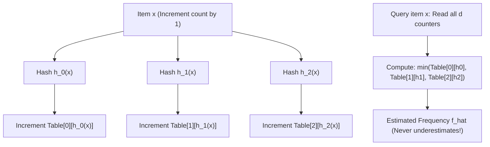
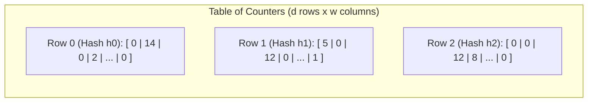
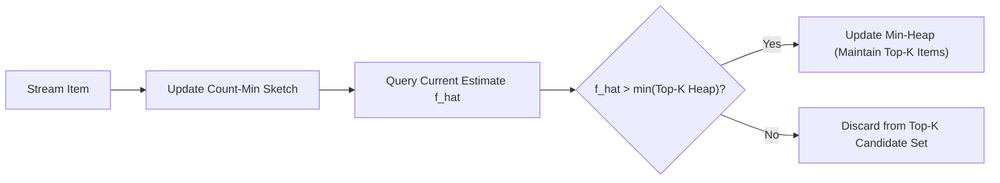

# Count-Min Sketch and Frequency Estimation

> [!NOTE]
> **The Frequency Estimation Dilemma in High-Throughput Streams:**
> In network routing (DDoS mitigation), database query planning, and real-time analytics, we need to answer point queries on high-speed data streams:
> *How many times has IP address $X$ or user $Y$ appeared in the last 100 million packets?*
> Storing an exact integer counter for every unique item in a hash map requires unbounded memory.
> The **Count-Min Sketch (Cormode & Muthukrishnan, 2005)** provides provably bounded frequency estimates using a small, fixed-size 2D matrix of counters.

> [!TIP]
> **The One-Sided Error Guarantee (Never Underestimates):**
> Because all increments in the sketch are positive, hash collisions can only **increase** counter values.
> Therefore, the estimate $\hat{f}_x$ is **always an upper bound**:
> $$f_x \le \hat{f}_x \le f_x + \epsilon N \quad \text{with probability } \ge 1 - \delta$$
> By taking the **minimum** across $d$ independent hash functions, we filter out collisions that affected other rows.

> [!WARNING]
> **Count-Min Sketch vs Bloom Filter:**
> While a Bloom filter answers **membership queries** (Yes/No: *has $x$ appeared?*), a Count-Min Sketch answers **frequency queries** (Integer count: *how many times has $x$ appeared?*).
> A Bloom filter is essentially a single-bit projection of a Count-Min Sketch with saturation at 1.



---

## 1. Mathematical Architecture and Dimensions

A Count-Min Sketch is defined by two parameters:
* Error tolerance: $\epsilon > 0$
* Failure probability: $\delta > 0$

The sketch consists of a 2D array of integers of dimension $d \times w$:
1. **Width $w$:** Sets the error margin $\epsilon$:
   $$w = \left\lceil \frac{e}{\epsilon} \right\rceil \approx \frac{2.718}{\epsilon}$$
2. **Depth $d$:** Sets the confidence $1 - \delta$:
   $$d = \left\lceil \ln\left(\frac{1}{\delta}\right) \right\rceil$$



---

## 2. Point Query and Update Algorithms

### 2.1 Update Procedure ($O(d)$ time)
```cpp
void update(const Key& key, int count = 1) {
    for (int i = 0; i < d; ++i) {
        size_t col = hash(key, i) % w;
        table[i][col] += count;
    }
}
```

### 2.2 Point Query Procedure ($O(d)$ time)
```cpp
int estimate(const Key& key) const {
    int min_val = INT_MAX;
    for (int i = 0; i < d; ++i) {
        size_t col = hash(key, i) % w;
        min_val = std::min(min_val, table[i][col]);
    }
    return min_val;
}
```

---

## 3. The Heavy Hitters Pattern (Top-$K$ Finding)

A fundamental use case for Count-Min Sketch is finding **Heavy Hitters** ($\alpha$-frequent items: items appearing at least $\alpha N$ times, e.g. $\alpha = 1\%$):
* The sketch by itself is write-only: you cannot iterate over stored keys.
* **Solution:** Pair the Count-Min Sketch with a bounded **Min-Heap of size $K$**.
* When an item $x$ is updated, compute its new estimated frequency $\hat{f}_x$.
* If $\hat{f}_x$ exceeds the minimum frequency in the heap, insert or update $x$ in the Top-$K$ heap.



---

## 4. Conservative Update Optimization

In standard update, all $d$ counters are incremented unconditionally.
In **Conservative Update**:
1. First query $\hat{f}_x = \min_i C[i][h_i(x)]$.
2. Only increment counters that are currently equal to $\hat{f}_x$:
   $$C[i][h_i(x)] = \max(C[i][h_i(x)], \hat{f}_x + 1)$$
This simple heuristic cuts estimation error by up to **$50\%$** while preserving the guarantee that the sketch never underestimates!

---

## 5. Curated References

1. **Cormode, Graham & Muthukrishnan, S. (2005):** *An improved data stream summary: the count-min sketch and its applications*. Journal of Algorithms.
2. **Cormode, Graham:** *The Count-Min Sketch* (Encyclopedia of Algorithms).
3. **Miklós Rédei:** *Network Traffic Anomaly Detection using Count-Min Sketch*.
