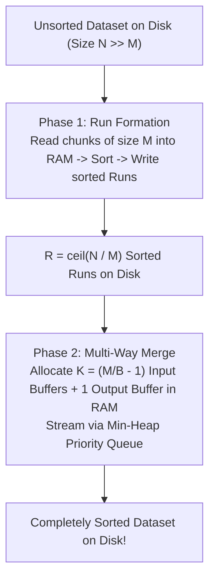
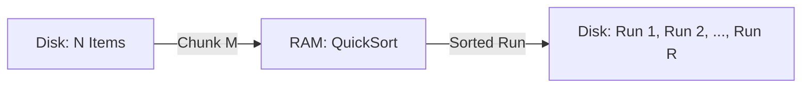
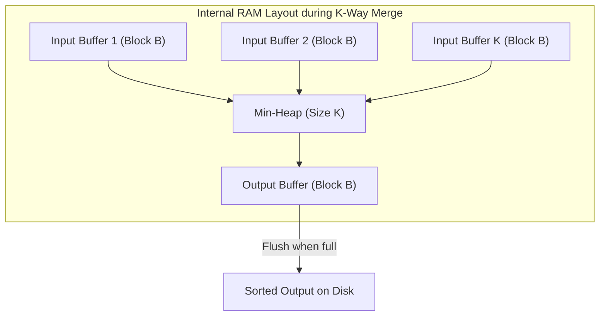

# Multi-Way External Merge Sort

> [!NOTE]
> **The Problem of Sorting Beyond RAM:**
> Suppose you need to sort a $1\text{ TB}$ database table on a machine with only $16\text{ GB}$ of RAM.
> Standard internal memory algorithms fail catastrophically:
> * An in-memory Quicksort triggers millions of OS page faults, reducing throughput to less than $1\text{ MB/s}$ as the disk head thrashes.
> **Multi-Way External Merge Sort** sorts petabyte-scale datasets on secondary storage in only **2 to 3 sequential I/O passes**, achieving the theoretical lower bound:
> $$\text{Sort}(N) = \Theta\left( \frac{N}{B} \log_{M/B} \frac{N}{B} \right) \text{ I/Os}$$

> [!TIP]
> **The Power of Multi-Way Merging ($K \gg 2$):**
> Standard internal merge sort merges $K = 2$ lists at a time ($\log_2 N$ passes).
> In external memory, internal RAM can buffer hundreds or thousands of blocks simultaneously.
> By setting the merge fan-in to:
> $$K = \frac{M}{B} - 1$$
> We can merge thousands of sorted runs in a **single pass**, collapsing what would have been 30 passes down to 2!

> [!WARNING]
> **Random vs Sequential I/O Throughput:**
> Even on modern NVMe PCIe 4.0 SSDs:
> * Sequential I/O throughput: $\approx 7,000\text{ MB/s}$.
> * Random 4 KB I/O throughput: $\approx 400\text{ MB/s}$ ($17\times$ slower!).
> Multi-Way Merge Sort guarantees that **100% of all disk reads and writes are large, sequential, streamable block transfers**.

---

## 1. The Two-Phase Protocol

Let $N$ be dataset size, $M$ be available RAM size, and $B$ be block size.

### 1.1 Phase 1: Run Generation
1. Read a chunk of $M$ items from disk into RAM.
2. Sort the $M$ items using in-memory QuickSort or Timsort in $O(M \log M)$ CPU time.
3. Write the sorted chunk (a **Run**) back to disk sequentially.
4. Repeat until all $N$ items have been processed.
* **Result:** $R = \lceil N / M \rceil$ sorted runs stored on disk.
* **I/O Cost:** Exactly $2 \cdot \frac{N}{B}$ block transfers (1 full scan read + 1 full scan write).

### 1.2 Phase 2: $K$-Way Merge
Allocate RAM as follows:
* Reserve $K = \lfloor M/B \rfloor - 1$ page frames as **Input Buffers** (one buffer per active run).
* Reserve $1$ page frame as the **Output Buffer**.
* Maintain an in-memory **Min-Heap** of size $K$ storing `{value, run_id}`.

**Merge Loop:**
1. Insert the first element of each input buffer into the min-heap.
2. Extract the minimum element from the heap and append it to the Output Buffer.
3. Advance the pointer in the corresponding input buffer. If an input buffer empties, read the next block of size $B$ from that run on disk.
4. When the Output Buffer fills ($B$ items), flush it to disk sequentially.
5. If $R \le K$, the dataset is completely sorted in this single merge pass!

---

## 2. Total I/O Complexity Analysis

If the number of runs $R = N / M$ exceeds the fan-in $K \approx M/B$, merging requires multiple passes:
$$\text{Number of Merge Passes} = \left\lceil \log_{M/B - 1} \frac{N}{M} \right\rceil$$

Each pass reads and writes the entire dataset of $N$ items sequentially ($2 \frac{N}{B}$ I/Os).
$$\text{Total I/Os} = 2 \frac{N}{B} \left( 1 + \left\lceil \log_{M/B - 1} \frac{N}{M} \right\rceil \right)$$

### Real-World Numbers:
* Dataset $N = 1\text{ TB}$, RAM $M = 16\text{ GB}$, Block $B = 4\text{ MB}$.
* $R = 1024 / 16 = 64$ initial runs.
* Buffer fan-in $K = (16\text{ GB} / 4\text{ MB}) - 1 = 4095$.
* Since $R = 64 \le 4095$, **only ONE merge pass is needed!**
* The entire $1\text{ TB}$ dataset is sorted in **exactly 2 disk passes** ($4\text{ TB}$ total I/O transfer).

---

## 3. Replacement Selection (Longer Initial Runs)

In Phase 1, instead of creating runs of size $M$, we can use **Replacement Selection**:
1. Load $M$ items into a min-heap in RAM.
2. Extract min $x$, write to current run.
3. Read next item $y$ from disk. If $y \ge x$, insert into heap (it can join the current run!). If $y < x$, set aside for the next run.
* **Mathematical Result:** For random inputs, replacement selection produces initial runs of average length **$2M$** ($2\times$ longer than memory capacity!), halving the number of initial runs $R$.

---

## 4. Curated References

1. **Knuth, Donald E.:** *The Art of Computer Programming, Volume 3: Sorting and Searching* (Section 5.4: External Sorting).
2. **Aggarwal & Vitter (1988):** *The Input/Output Complexity of Sorting and Related Problems*.
3. **Graefe, Goetz (2006):** *Implementing Sorting in Database Systems*. ACM Computing Surveys.
