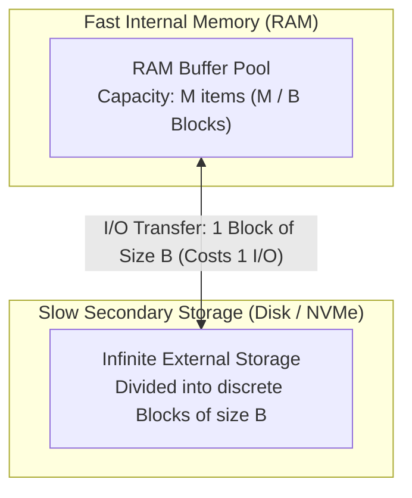
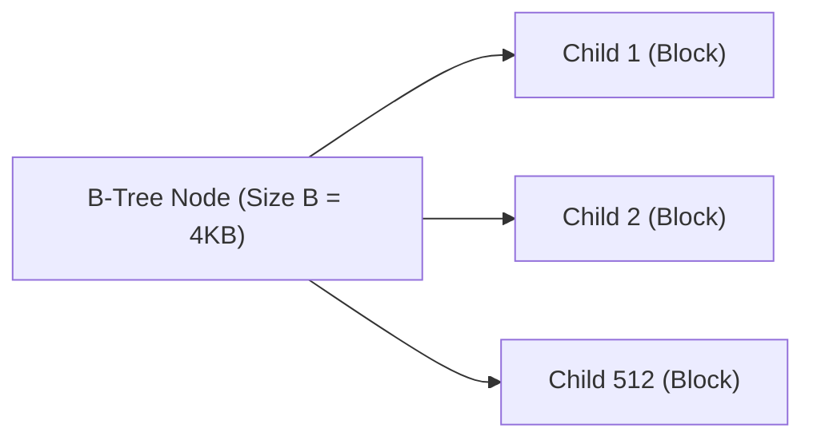
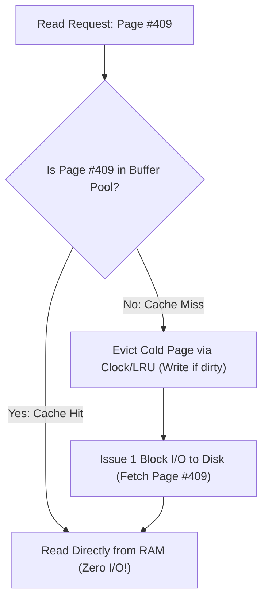

# The External Memory (I/O) Model

> [!NOTE]
> **The Disk and Storage Bottleneck:**
> When datasets exceed the capacity of physical RAM ($N \gg M$), algorithms become bottlenecked by secondary storage (SSD, NVMe, spinning disk).
> An NVMe random read takes $\sim 10,000\text{ ns}$ ($30,000$ CPU cycles), while a spinning hard drive takes $\sim 10,000,000\text{ ns}$ ($30,000,000$ CPU cycles!).
> CPU instruction counts are irrelevant: **the only metric that determines execution time is the number of I/O block transfers.**

> [!TIP]
> **The Aggarwal-Vitter Model (1988):**
> Computer science formalizes disk-bound computation using the **External Memory (Two-Level Memory) Model**:
> * **$N$**: Total number of items in the problem.
> * **$M$**: Number of items that fit into fast internal RAM ($M \ll N$).
> * **$B$**: Number of items transferred in a single contiguous **I/O Block** ($1 \le B \le M/2$).
> **Complexity is measured strictly in $I/O\text{ operations}$ (number of blocks transferred between disk and RAM).**

> [!WARNING]
> **The Binary Search Tree Failure in External Storage:**
> In internal memory, a Red-Black Tree or AVL Tree searches $N$ items in $O(\log_2 N)$ comparisons.
> On disk, each child pointer dereference triggers a separate random 4 KB block read.
> Searching $10^9$ keys on disk using a binary tree requires $\log_2(10^9) \approx 30\text{ disk I/Os}$ ($\approx 300\text{ milliseconds}$).
> A **B-Tree** with block branching factor $B \approx 512$ searches the same $10^9$ keys in $\log_{512}(10^9) \approx 3\text{ disk I/Os}$ ($10\times$ faster!).

---

## 1. The Fundamental I/O Bounds

Every algorithm designer working with databases, search engines, or big data must know the three canonical I/O complexity bounds:

### 1.1 Scanning $N$ Elements ($\text{Scan}(N)$)
Reading or writing an array of $N$ contiguous items from disk:
$$\text{Scan}(N) = \Theta\left( \frac{N}{B} \right) \text{ I/Os}$$
Each I/O read loads $B$ useful items into memory.

### 1.2 Sorting $N$ Elements ($\text{Sort}(N)$)
Using **Multi-Way External Merge Sort**:
$$\text{Sort}(N) = \Theta\left( \frac{N}{B} \log_{M/B} \frac{N}{B} \right) \text{ I/Os}$$
In practice, $\log_{M/B}(N/B) \le 2$ or $3$ for petabyte-scale datasets. External sorting requires only 2 to 3 passes over disk!

### 1.3 Searching $N$ Elements in a Dynamic Dictionary
Using a **B-Tree**:
$$\text{Search}(N) = \Theta\left( \log_B N \right) \text{ I/Os}$$

---

## 2. Comparing Internal vs External Complexity

| Operation | Standard RAM Model (CPU) | External Memory Model (I/O) | Speedup Factor via Block Transfers |
| :--- | :--- | :--- | :--- |
| **Linear Scan** | $O(N)$ operations | $O(N / B)$ I/Os | **$B\times$ faster** ($\sim 512\times - 4096\times$) |
| **Search** | $O(\log_2 N)$ comparisons | $O(\log_B N)$ I/Os | $\log_2(B)\times$ faster ($\sim 10\times$) |
| **Sorting** | $O(N \log_2 N)$ comparisons | $O((N/B) \log_{M/B} (N/B))$ I/Os | Massive ($B \cdot \log_2(M/B)$ reduction) |

---

## 3. The Buffer Pool Architecture

Real database management systems (PostgreSQL, MySQL InnoDB, SQLite) implement an in-memory **Buffer Pool**:
* Memory is partitioned into $M / B$ page frames.
* Pages are tracked with a Hash Table mapping `(file_id, page_id) -> memory_frame`.
* Page replacement algorithms (LRU, 2Q, CLOCK) maintain hot disk pages in RAM.

---

## 4. Common Pitfalls & Anti-Patterns

### Anti-Pattern 1: Applying Binary Search Directly to Disk Files
Running `std::lower_bound` on an un-indexed $100\text{ GB}$ sorted binary file. Binary search jumps across memory in strides that miss all prefetching buffers, issuing $\approx 25$ independent random disk reads per query. Use a B-Tree or sparse indexed file format (e.g. Parquet metadata).

### Anti-Pattern 2: Unbuffered I/O System Calls
Calling `read(fd, &byte, 1)` in a loop to parse a file. Each individual byte read invokes an OS context switch into kernel space. Always read in chunks of $4\text{ KB}$ or $64\text{ KB}$ (e.g. `fread` with buffer or `mmap`).

---

## 5. Curated References

1. **Aggarwal, Alok & Vitter, Jeffrey S. (1988):** *The Input/Output Complexity of Sorting and Related Problems*. Communications of the ACM.
2. **Vitter, Jeffrey S. (2008):** *Algorithms and Data Structures for External Memory*. Foundations and Trends in Theoretical Computer Science.
3. **Graefe, Goetz (2011):** *Modern B-Tree Techniques*. Foundations and Trends in Databases.
