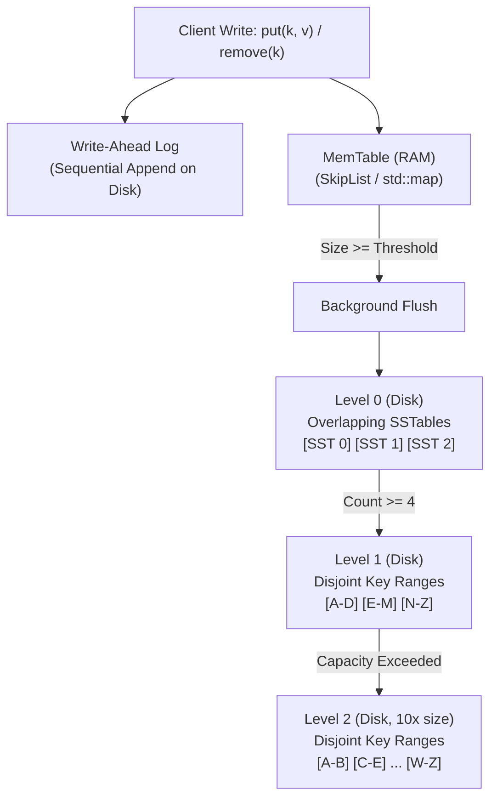

# Log-Structured Merge-Trees (LSM-Trees): Write-Optimized Storage & Leveled Compaction

## 1. Overview & Theoretical Foundations

In traditional database management systems, update-in-place storage engines based on the **B-Tree** (or B+ Tree) achieve fast reads ($O(\log_B N)$ I/O transfers) but suffer catastrophic random I/O write amplification when servicing write-heavy workloads. On spinning disks and solid-state drives (SSDs), random writes incur expensive physical head seeks or block erase-and-rewrite cycles, leading to SSD write amplification and premature drive wear.

In 1996, **Patrick O'Neil, Edward O'Neil, and Gerhard Weikum** introduced the **Log-Structured Merge-Tree (LSM-Tree)**:
> *"The Log-Structured Merge-Tree (LSM-Tree)"* (Acta Informatica 1996).

The fundamental insight of the LSM-Tree is to **convert random writes into sequential writes** by batching mutations in memory and periodically merging immutable sorted runs on disk:
- **Write Path**: Mutations are appended sequentially to a durable Write-Ahead Log (WAL) and stored in an in-memory sorted structure called the **MemTable**. No disk seeks occur on the write path.
- **Flush**: When the MemTable fills, it is flushed sequentially to disk as an immutable **SSTable (Sorted String Table)**.
- **Compaction**: Background merge-sort threads periodically combine overlapping SSTables into consolidated, non-overlapping runs, reclaiming space and purging deleted records (**tombstones**).

```
   ===================================================================================
   Dimension              B+ Tree (Update-in-Place)       LSM-Tree (Append + Merge)
   ===================================================================================
   Random Write Latency   High (Disk Page In-Place Write) Constant (RAM append + WAL)
   Write Amplification    High (Random Block Rewrites)    Controlled by Compaction
   Sequential I/O Ratio   Low                             Extremely High (Sequential)
   Read Amplification     Low (1-2 page reads per query)  Moderate (Checked via Bloom)
   Space Amplification    Low                             Moderate (Temporary duplicates)
   Hardware Fit           In-Memory / Read-Heavy Storage  NVM, NVMe SSDs, Distributed Stores
   Industry Systems       PostgreSQL, MySQL (InnoDB)      RocksDB, Cassandra, ClickHouse
   ===================================================================================
```

> [!NOTE]
> The trade-offs among write amplification (WA), read amplification (RA), and space amplification (SA) in storage systems are governed by the **RUM Conjecture** (Read-Update-Memory). The LSM-Tree aggressively optimizes for write performance while utilizing Bloom filters and Leveled Compaction to contain read and space amplification.

---

## 2. Mathematical Definition & Core Invariants

Let $\mathcal{K}$ be a totally ordered key space and $\mathcal{V}$ be an arbitrary payload universe. The LSM-Tree represents a dynamic mapping $\mathcal{M}: \mathcal{K} \to \mathcal{V} \cup \{\bot\}$, where $\bot$ represents a deleted entry (a **tombstone**).

### 2.1 The Four Systemic Invariants
To maintain exact consistency and deterministic read routing, every production LSM-Tree enforces four core invariants:

> [!IMPORTANT]
> **Invariant 1 (Intra-SSTable Sorted Order)**:
> Within every SSTable file $S$, all key-value entries $\langle k_1, v_1 \rangle, \langle k_2, v_2 \rangle, \dots, \langle k_m, v_m \rangle$ are stored in strictly increasing order of keys:
> $$k_1 < k_2 < \dots < k_m$$

> [!IMPORTANT]
> **Invariant 2 (Leveled Key-Range Disjointness)**:
> For all levels $L \ge 1$, the key ranges $[\min(S_i), \max(S_i)]$ of all SSTables in level $L$ are pairwise mutually disjoint:
> $$\forall S_i, S_j \in \text{Level } L \quad (i \ne j): \quad [\min(S_i), \max(S_i)] \cap [\min(S_j), \max(S_j)] = \emptyset$$
> *(Note: Level 0 is the sole exception, where newly flushed SSTables may have overlapping key ranges).*

> [!IMPORTANT]
> **Invariant 3 (Recency Priority Lookup Order)**:
> A point query for key $k$ must inspect storage tiers in strictly decreasing order of recency:
> 1. Active In-Memory MemTable
> 2. Immutable MemTable (if background flush is active)
> 3. Level 0 SSTables (inspected from newest file to oldest file)
> 4. Levels $1, 2, \dots, \text{MaxLevel}$ (at most one candidate SSTable per level via range routing)
> The search terminates at the **first** tier where key $k$ is located. If the located record is a tombstone, the system immediately returns non-existence (`nullopt`).

> [!IMPORTANT]
> **Invariant 4 (Compaction Reconciliation & Tombstone Lifecycle)**:
> During $K$-way merge compaction between Level $L$ and overlapping files in Level $L+1$, when multiple versions of key $k$ are encountered, the version originating from the higher (newer) level supersedes all older versions.
> Furthermore, a tombstone $\langle k, \bot \rangle$ can **only** be permanently purged if the compaction target is the bottom-most level ($\text{MaxLevel} - 1$), guaranteeing that no older zombie versions exist in deeper levels.

---

## 3. Structural Anatomy & Component Architecture

```
                                  LSM-TREE ARCHITECTURE
                                  =====================

   CLIENT WRITE: put(k, v) / remove(k)
        |
        +---> [ Write-Ahead Log (WAL) ]  (Sequential Disk Append: Durability)
        |
        v
   [ Active MemTable (RAM) ]   <-- Fast SkipList / Red-Black Tree (Capacity: M bytes)
        |
        | (MemTable Full: Flush to Disk)
        v
   +-------------------------------------------------------------------------------+
   | LEVEL 0 (Disk: Overlapping Key Ranges)                                        |
   |   [ SSTable 0.3 (Newest) ]  [ SSTable 0.2 ]  [ SSTable 0.1 ]  [ SSTable 0.0 ] |
   +-------------------------------------------------------------------------------+
        |
        | (L0 Compaction: Multi-way Merge)
        v
   +-------------------------------------------------------------------------------+
   | LEVEL 1 (Disk: Strictly Non-Overlapping Disjoint Key Ranges)                  |
   |   [ SSTable 1.0 [A - D] ]  [ SSTable 1.1 [E - M] ]  [ SSTable 1.2 [N - Z] ]   |
   +-------------------------------------------------------------------------------+
        |
        | (Leveled Compaction: Pick 1 file, merge with overlapping L2 files)
        v
   +-------------------------------------------------------------------------------+
   | LEVEL 2 (Disk: Strictly Non-Overlapping Disjoint Key Ranges, 10x Capacity)     |
   |   [ SSTable 2.0 [A-B] ] [ SSTable 2.1 [C-F] ] ... [ SSTable 2.9 [X-Z] ]      |
   +-------------------------------------------------------------------------------+
```



### 3.1 SSTable On-Disk Format
Each immutable SSTable contains three internal structures:
1. **Sorted Data Blocks**: Sequential sequence of key-value pairs $\langle k, v, \text{is\_tombstone} \rangle$.
2. **Sparse Block Index**: Stores the first key of every block along with its file offset. Because keys are sorted, finding a key's candidate block requires only an in-memory binary search on the sparse index.
3. **Bloom Filter**: A compact bit array with $k$ hash functions. If the Bloom filter returns false, the key is guaranteed not to exist in the SSTable, avoiding all disk block I/O.

---

## 4. Core Operations & Algorithmic Mechanics

### 4.1 Write Path (Insertions and Deletions)
1. **WAL Logging**: Append log record `PUT:k=v` or `DEL:k` to disk.
2. **MemTable Mutation**: Insert $\langle k, v, \text{is\_tombstone} \rangle$ into the in-memory map. Deletions simply insert a tombstone record ($\text{is\_tombstone} = \text{true}$).
3. **Threshold Check**: If MemTable size exceeds threshold $M$:
   - Convert active MemTable to an immutable MemTable.
   - Allocate a fresh active MemTable and new WAL file.
   - Flush immutable MemTable to a new SSTable in Level 0.

### 4.2 Read Path (Point Lookup)
To evaluate `get(key)`:
1. **MemTable Search**: Check active MemTable. If found:
   - If tombstone $\implies$ return `std::nullopt`.
   - Else $\implies$ return `value`.
2. **Level 0 Search**: Iterate through Level 0 SSTables from newest to oldest:
   - Check key interval: if $key \notin [\min, \max]$, continue.
   - Check Bloom filter: if `!bloom.may_contain(key)`, continue.
   - Search sparse index $\to$ read candidate data block. If found:
     - Return `nullopt` if tombstone, else `value`.
3. **Level $L \ge 1$ Search**:
   - For each level $L = 1 \dots \text{MaxLevel} - 1$:
     - Binary search on Level $L$'s non-overlapping SSTable array to locate the unique candidate file covering $key$.
     - If candidate file exists: check Bloom filter $\to$ sparse index $\to$ block scan. If found, return value/nullopt immediately!
4. If exhausted all levels without a hit: return `std::nullopt`.

### 4.3 Leveled Compaction Algorithm
When Level $L$ exceeds its allocated capacity:
1. **Selection**:
   - For Level 0: All Level 0 files are selected (since they overlap).
   - For Level $L \ge 1$: Select one file $S \in \text{Level } L$ (e.g., round-robin or largest).
2. **Range Overlap Determination**:
   Compute key span $[K_{\min}, K_{\max}] = [\min(S), \max(S)]$. Identify all files in Level $L+1$ whose key range overlaps $[K_{\min}, K_{\max}]$.
3. **Multi-Way Merge Sort**:
   Stream-merge the selected files. For identical keys:
   - Retain the version from the newest file.
   - If Level $L+1$ is the bottom-most level ($\text{MaxLevel}-1$) and the entry is a tombstone, **discard** the tombstone.
4. **Output Generation**:
   Write the merged output sequentially into brand new SSTable files for Level $L+1$ (each sized to target file size).
5. **Atomic Metadata Replacement**:
   Atomically delete the input files and register the new files in the database manifest.

---

## 5. Compaction Strategies Compared

```
   ===================================================================================
   Strategy               Write Amp (WA)   Read Amp (RA)    Space Amp (SA)   Use Case
   ===================================================================================
   Leveled Compaction     High (~10-30x)   Low (O(Levels))  Low (~10-20%)    Read-Heavy OLTP
   Size-Tiered Compaction Low (~2-8x)      High (O(Runs))   High (~50-100%)  Write-Heavy Logs
   FIFO / Time-Window     Lowest (~1x)     Low              Zero             Time-Series / TTL
   ===================================================================================
```

### Leveled Compaction (RocksDB, LevelDB)
- Maintains strict disjointness in levels $L \ge 1$.
- Each level has a fixed total capacity $C_L = C_0 \cdot 10^L$.
- Read amplification is bounded because at most 1 SSTable is checked per level for $L \ge 1$.

### Size-Tiered Compaction (Apache Cassandra, ScyllaDB)
- Groups SSTables of similar sizes into tiers.
- When $N$ SSTables of similar size accumulate, they are merged into one larger SSTable.
- Lower write amplification, but higher space amplification (requires up to 50% free disk headroom during major compactions) and higher read amplification (overlapping files across all tiers).

---

## 6. Asymptotic Complexity Analysis

Let $N$ be the number of keys, $B$ the disk block size, and $T = 10$ the level size ratio:
- **Write I/O Complexity**: $O\left(\frac{T}{B} \cdot \log_T \frac{N}{M}\right)$ I/O operations per inserted byte.
- **Point Read Complexity**:
  - Without Bloom Filter: $O(\text{Levels}) = O(\log_T N)$ block reads.
  - With Bloom Filter (false positive rate $\epsilon \approx 0.01$): $O(1)$ expected block reads!
- **Range Scan ($[K_1, K_2]$)**: Requires a priority queue merging streams from each level, running in $O\left(\text{Levels} \cdot \log(\text{Levels}) + \frac{\text{ScanSize}}{B}\right)$.

---

## 7. Edge Cases & Boundary Handling

1. **Tombstone Resurrection (Zombie Keys)**:
   If a tombstone is deleted before all older versions in deeper levels are purged, the old version will "resurrect". Invariant 4 prevents this by only dropping tombstones at the bottom-most level.
2. **Write Stall under Compaction Lag**:
   If write throughput vastly exceeds compaction throughput, Level 0 files multiply, causing read latency to skyrocket. Production engines throttle client writes when Level 0 file count exceeds a critical threshold.
3. **Empty MemTable Flush**:
   Flushing an empty MemTable is a no-op; no empty SSTables are created.
4. **Crash Recovery via WAL**:
   Upon unexpected termination, the database replays the append-only WAL to reconstruct the MemTable state before servicing client queries.

---

## 8. High-Performance C++17 Reference Implementation

The complete production C++17 reference implementation is located at [`implementations/cpp/lsm_trees.cpp`](../../implementations/cpp/lsm_trees.cpp).

Highlights:
- Pure C++17 conforming strictly to `-std=c++17 -O3 -Wall -Wextra -Werror`.
- In-memory `BloomFilter` using FNV-1a double-hashing.
- `SSTable` with sparse index blocks and range pre-checks.
- Multi-level `LSMTree` with Leveled Compaction, tombstone purging, and WAL simulation.
- Randomized differential testing against `std::map` over 5,000 mixed operations.

---

## 9. Idiomatic Python 3 Reference Implementation

The Python reference implementation is located at [`implementations/python/lsm_trees.py`](../../implementations/python/lsm_trees.py).

Features:
- Clean modular classes (`BloomFilter`, `SSTable`, `LSMTree`).
- `NamedTuple` entry definitions with explicit `is_tombstone` tracking.
- Standard `unittest.TestCase` suite with randomized differential validation.

---

## 10. Differential Testing & Verification Strategy

The correctness of the LSM-Tree engine is verified by fuzzing random operations against a standard hash or ordered map:

```cpp
// Differential fuzzing harness against std::map
LSMTree lsm;
std::map<std::string, std::string> oracle;

for (int step = 0; step < 5000; ++step) {
    int op = rng() % 3;
    const std::string& k = keys[rng() % keys.size()];
    if (op == 0) { // Put
        lsm.put(k, v); oracle[k] = v;
    } else if (op == 1) { // Remove
        lsm.remove(k); oracle.erase(k);
    } else { // Get
        assert(lsm.get(k) == (oracle.count(k) ? make_optional(oracle[k]) : nullopt));
    }
}
```

---

## 11. Real-World Applications & Industry Context

1. **High-Throughput Storage Engines (RocksDB, LevelDB)**:
   RocksDB powers production backends at Meta, CockroachDB, TiKV, Kafka Streams, and MongoDB WiredTiger.
2. **Distributed NoSQL & Wide-Column Stores**:
   Apache Cassandra, ScyllaDB, and Google Bigtable utilize LSM-Tree architectures to ingest millions of writes per second across distributed clusters.
3. **Time-Series Databases (InfluxDB, Prometheus)**:
   Timestamped monitoring metrics are naturally append-only and heavily sequential, making LSM-Trees the optimal storage engine.

---

## 12. Comprehensive Problem Set & Extensions

1. **Concurrent MemTable with Lock-Free SkipList**: Replace the mutex-guarded MemTable with a lock-free SkipList allowing parallel reader and writer access.
2. **Block Cache (LRU) Integration**: Add an in-memory LRU block cache layer between SSTable reads and OS file caching to accelerate hot key queries.
3. **Prefix Bloom Filters for Range Queries**: Augment SSTables with prefix Bloom filters to quickly prune files during prefix range scans (`SELECT * WHERE key LIKE 'user_123%'`).
