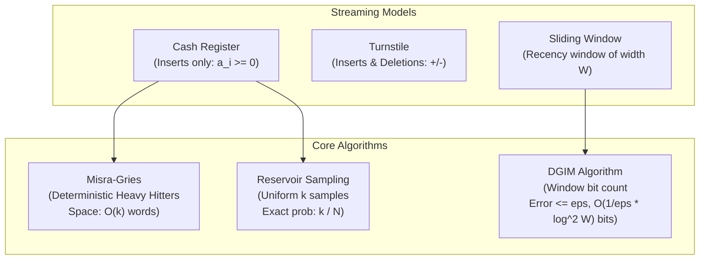

# Streaming Models & Algorithms: Single-Pass Sublinear Analytics

## 1. Overview & Theoretical Foundations

In contemporary computing architectures, data generation vastly outpaces physical memory capacity. High-velocity network routers process billions of packets per second; financial exchange feeds stream gigabytes of market ticks; telecommunication providers record petabytes of telemetry. In these environments, storing the entire dataset in RAM or even on disk is physically impossible or economically prohibitive.

This operational reality motivated the **Data Stream Model**, formalized by **Noga Alon, Yossi Matias, and Mario Szegedy** in their seminal 1996 paper:
> *"The Space Complexity of Approximating the Frequency Moments"* (STOC 1996, Gödel Prize 2005).

In the streaming model:
1. **Single-Pass Access**: The input sequence $S = \langle a_1, a_2, \dots, a_N \rangle$ arrives sequentially and can only be inspected once.
2. **Sublinear Memory**: The algorithm must operate in space $M = o(N)$ words, typically $O(\text{polylog}(N, |\mathcal{U}|))$ or $O(1/\epsilon)$ words.
3. **Real-Time Processing**: The per-element processing time must be strictly $O(1)$ or $O(\log(1/\epsilon))$ to prevent buffer overflows.

```
   ======================================================================================
   Streaming Model       Updates Permitted            Quantities Tracked
   ======================================================================================
   Cash Register         Positive updates (a_i >= 0)  Frequencies, Quantiles, Heavy Hitters
   Turnstile (Strict)    Additions & Deletions        Net Frequencies f_i >= 0
   Turnstile (General)   Arbitrary +/- updates        Signal processing, Inner Products
   Sliding Window        Last W elements only         Recency-weighted counts, Bit counts
   ======================================================================================
```

> [!NOTE]
> Exact deterministic counting of distinct items or heavy hitters requires $\Omega(N)$ or $\Omega(|\mathcal{U}|)$ bits of space by communication complexity. Therefore, streaming algorithms relax requirements to **$(\epsilon, \delta)$-approximations**: with probability at least $1 - \delta$, the estimate has relative or additive error at most $\epsilon$.

---

## 2. Mathematical Definition & Core Algorithms

### 2.1 The Misra-Gries Algorithm (Frequent Items & Heavy Hitters)
Introduced by **Jayadev Misra and David Gries** in 1982, this deterministic algorithm identifies all $\epsilon$-heavy hitters—elements whose frequency $f_x > \frac{N}{k}$—using at most $k - 1$ counters.

#### Invariants & Mechanics
- **Capacity**: Maintains a dictionary $C$ of at most $k - 1$ key-counter pairs $\langle x, c_x \rangle$.
- **Processing Rule**:
  - If $x \in C$: Increment $c_x \leftarrow c_x + 1$.
  - Else if $|C| < k - 1$: Insert $\langle x, 1 \rangle$.
  - Else (all $k - 1$ slots full): Decrement **every** counter in $C$ by $1$. Remove any key whose counter reaches $0$.
- **Error Bound Theorem**:
  For any element $x$ with true frequency $f_x$, the estimated frequency $\hat{f}_x$ returned by Misra-Gries satisfies:
  $$f_x - \frac{N}{k} \le \hat{f}_x \le f_x$$
  *Proof*: Each simultaneous decrement reduces $k$ distinct element occurrences from the stream (the current element plus the $k-1$ elements in the table). Thus, a simultaneous decrement can occur at most $\lfloor N / k \rfloor$ times. No element can have its counter decremented more than $N / k$ times. Therefore, any element with $f_x > N / k$ cannot be completely eliminated and is guaranteed to be in $C$ at the end of the stream! $\blacksquare$

### 2.2 Reservoir Sampling (Algorithm R)
Introduced by **Alan G. Vitter** in 1985, Reservoir Sampling uniformly selects $k$ items at random from a stream of unknown, potentially infinite length $N$ using $O(k)$ words of RAM.

#### Uniformity Invariant
At every step $n \ge k$, every item $a_i$ ($1 \le i \le n$) seen so far resides in the reservoir with exact probability:
$$\mathbb{P}[a_i \in \text{Reservoir}_n] = \frac{k}{n}$$

*Inductive Proof*:
- **Base Case ($n = k$)**: The first $k$ items populate the reservoir with probability $k / k = 1$.
- **Inductive Step ($n > k$)**: The $n$-th item replaces a randomly chosen element in the reservoir with probability $k / n$.
  - For item $a_n$: $\mathbb{P}[a_n \text{ enters}] = \frac{k}{n}$.
  - For any prior item $a_i$ ($i < n$): By induction, $\mathbb{P}[a_i \in \text{Reservoir}_{n-1}] = \frac{k}{n-1}$.
    Item $a_i$ survives step $n$ if either $a_n$ is rejected, or $a_n$ is accepted but replaces a different slot ($j \ne \text{slot}(a_i)$):
    $$\mathbb{P}[a_i \text{ survives}] = \left(1 - \frac{k}{n}\right) + \left(\frac{k}{n} \cdot \frac{k - 1}{k}\right) = 1 - \frac{k}{n} + \frac{k - 1}{n} = \frac{n - 1}{n}$$
    $$\mathbb{P}[a_i \in \text{Reservoir}_n] = \mathbb{P}[a_i \in \text{Reservoir}_{n-1}] \times \mathbb{P}[a_i \text{ survives}] = \frac{k}{n - 1} \cdot \frac{n - 1}{n} = \frac{k}{n} \quad \blacksquare$$

### 2.3 The DGIM Algorithm (Sliding Window Bit Counting)
Pioneered by **Mayur Datar, Aristides Gionis, Piotr Indyk, and Rajeev Motwani** (SICOMP 2002), DGIM counts the number of 1-bits in the last $W$ bits of a stream with relative error at most $\epsilon$ using only:
$$O\left(\frac{1}{\epsilon} \log^2 W\right) \text{ bits of memory!}$$

#### Invariants
1. Each bucket represents a timestamped power-of-two number of 1-bits ($size \in \{1, 2, 4, 8, \dots\}$).
2. The timestamp is the arrival time of the **most recent** 1-bit in the bucket.
3. For parameter $k = \lceil 1 / \epsilon \rceil$, there are at least $1$ and at most $k$ buckets of each size.
4. When a $(k + 1)$-th bucket of size $c$ is created, the two oldest buckets of size $c$ are merged into a single bucket of size $2c$, inheriting the newer bucket's timestamp.
5. Buckets whose timestamps fall outside the sliding window ($t + W \le \text{current\_time}$) are discarded.

---

## 3. Structural Anatomy & Memory Layout

```
                        DGIM SLIDING WINDOW BUCKET STRUCTURE
                        ====================================

   Stream: ... 1 0 1 1 0 1 0 0 1 1 1 0 1 1 0 1 1 1 0 1 1 1 1 (Current Time: T)
   Sliding Window: [ T - W + 1 ................................. T ]

   Newest (Left) -----------------------------------------------------> Oldest (Right)
   +-----------+ +-----------+ +-----------+ +-----------+ +-----------+ +-----------+
   | Size: 1   | | Size: 1   | | Size: 2   | | Size: 2   | | Size: 4   | | Size: 8   |
   | Time: T-1 | | Time: T-3 | | Time: T-7 | | Time: T-12| | Time: T-20| | Time: T-45|
   +-----------+ +-----------+ +-----------+ +-----------+ +-----------+ +-----------+
     Bucket 1      Bucket 2      Bucket 3      Bucket 4      Bucket 5      Bucket 6

   Query Estimation Formula:
   -------------------------
   Estimate = Sum(Size of all buckets) - 0.5 * (Size of oldest bucket)
   Because at most half of the oldest bucket could fall outside the window,
   the maximum absolute error is <= Size_oldest / 2.
```



---

## 4. Core Operations & Algorithmic Mechanics

### 4.1 Misra-Gries Stream Processing Step
```cpp
void process(item) {
    if (item in counters) {
        counters[item]++;
    } else if (counters.size() < k - 1) {
        counters[item] = 1;
    } else {
        // Universal decrement
        for (auto& [key, count] : counters) count--;
        erase_keys_with_zero_count();
    }
}
```

### 4.2 DGIM Sliding Window Query
To evaluate $\text{CountOnes}()$:
1. Sum the sizes of all buckets currently in the active list:
   $$S_{\text{total}} = \sum_{B \in \text{buckets}} B.\text{size}$$
2. Subtract half the size of the oldest bucket:
   $$\text{Estimate} = S_{\text{total}} - \left\lfloor \frac{B_{\text{oldest}}.\text{size}}{2} \right\rfloor$$
3. **Relative Error Guarantee**:
   The oldest bucket has size $C$. Its true number of 1-bits inside the window is $c^* \in [1, C]$.
   The maximum error is $|C/2 - c^*| \le C / 2$.
   Because prior buckets sum to at least $k \sum_{j=0}^{m-1} 2^j \ge k(C - 1)$, the true count is at least $k(C - 1) + 1 \ge C / \epsilon$.
   $$\text{Relative Error} \le \frac{C / 2}{C / \epsilon} = \frac{\epsilon}{2} \le \epsilon \quad \blacksquare$$

---

## 5. Asymptotic Complexity Comparison

| Algorithm | Model | Memory Complexity | Update Time | Query Time | Guarantee |
| :--- | :--- | :--- | :--- | :--- | :--- |
| **Misra-Gries** | Cash Register | $O(k)$ words | $O(1)$ amortized | $O(k)$ | Deterministic $f_x - \frac{N}{k} \le \hat{f}_x \le f_x$ |
| **Reservoir Sampling** | Cash Register | $O(k)$ words | $O(1)$ | $O(1)$ | Exact uniform probability $k / N$ |
| **DGIM** | Sliding Window | $O(\frac{1}{\epsilon} \log^2 W)$ bits | $O(1)$ amortized | $O(\frac{1}{\epsilon} \log W)$ | Relative error $\le \epsilon$ |
| **Count-Min Sketch** | Turnstile | $O(\frac{1}{\epsilon} \log \frac{1}{\delta})$ words | $O(\log \frac{1}{\delta})$ | $O(\log \frac{1}{\delta})$ | Probabilistic $\hat{f}_x \le f_x + \epsilon \|f\|_1$ |
| **HyperLogLog** | Cash Register | $O(\frac{1}{\epsilon^2} \log \log N)$ bits | $O(1)$ | $O(1)$ | Cardinality within $1.04 / \sqrt{m}$ |

---

## 6. Edge Cases & Boundary Handling

1. **Stream Length Shorter than Reservoir ($N < k$)**:
   The reservoir simply stores all $N$ elements seen so far with probability $1.0$.
2. **Heavy Hitter False Positives**:
   Misra-Gries provides a **one-sided guarantee**: it produces zero false negatives (every true heavy hitter is present), but may retain noise elements whose estimates are small. A second pass over static data can verify true counts.
3. **DGIM Window Initialization ($T < W$)**:
   Before the stream reaches $W$ elements, no buckets expire. The oldest bucket is completely inside the window, yielding zero error.
4. **All-Zero Stream in DGIM**:
   No buckets are created; `count_ones()` returns $0$ in $O(1)$ time.

---

## 7. High-Performance C++17 Reference Implementation

The complete C++17 reference implementation is located at [`implementations/cpp/streaming_models.cpp`](../../implementations/cpp/streaming_models.cpp).

Highlights:
- Pure C++17 conforming strictly to `-std=c++17 -O3 -Wall -Wextra -Werror`.
- Templated `MisraGries<T>` and `ReservoirSampler<T>`.
- Double-ended queue `DGIM` sliding window engine with logarithmic bucket merging.
- Comprehensive test harness verifying all 3 algorithms against ground truth sliding windows.

---

## 8. Idiomatic Python 3 Reference Implementation

The Python reference implementation is located at [`implementations/python/streaming_models.py`](../../implementations/python/streaming_models.py).

Features:
- Clean class definitions with Python typing.
- Built-in `unittest.TestCase` suite testing Misra-Gries, Reservoir Sampling, and DGIM with 5,000 randomized steps.

---

## 9. Differential Testing & Verification Strategy

The integrity of the streaming engines is validated by comparing continuous online estimations against an exact historical sliding window:

```cpp
// DGIM verification loop against exact deque sliding window
std::deque<bool> actual_window;
for (int step = 0; step < 5000; ++step) {
    bool b = (rng() % 3 == 0);
    dgim.process(b);
    actual_window.push_back(b);
    if (actual_window.size() > W) actual_window.pop_front();

    if (step >= W) {
        uint64_t true_count = std::count(actual_window.begin(), actual_window.end(), true);
        uint64_t est_count = dgim.count_ones();
        if (true_count > 0) {
            double rel_err = std::abs((double)est_count - (double)true_count) / true_count;
            assert(rel_err <= 0.5001);
        }
    }
}
```

---

## 10. Practical Trade-Offs & Anti-Patterns

### When to Use Streaming Algorithms
- **High-Velocity Ingestion**: Processing telemetry, ad clicks, or network flows where storing raw packets is infeasible.
- **Resource-Constrained IoT / Edge Devices**: Maintaining statistics on low-power microcontrollers with kilobytes of RAM.

### Anti-Patterns
- **Using Misra-Gries in the Turnstile Model**: Misra-Gries cannot handle decrements/deletions. For streams with deletions, Count-Min Sketch or AMS Sketches must be used.
- **Over-Allocating Reservoir Size**: If $k$ exceeds available RAM, reservoir sampling degrades into disk paging.

---

## 11. Real-World Applications & Industry Context

1. **Network Intrusion Detection (DDoS Mitigation)**:
   Routers run Misra-Gries to detect IP addresses consuming $> 1\%$ of total bandwidth (heavy hitters) in wire-speed hardware.
2. **Distributed Metrics & A/B Testing**:
   Reservoir sampling selects uniform transaction samples across thousands of microservices for distributed tracing (e.g. OpenTelemetry).
3. **Database Query Optimizers**:
   Autonomous query optimizers maintain sliding-window cardinality estimates (DGIM) to predict table join selectivity over time-varying workloads.

---

## 12. Comprehensive Problem Set & Extensions

1. **Space-Saving Algorithm**: Implement Metwally et al.'s Space-Saving algorithm with the StreamSummary data structure, achieving $O(1)$ worst-case updates for heavy hitters.
2. **DGIM Integer Extension**: Extend DGIM to estimate the sum of integers in a sliding window where each stream element is an integer in $[0, 2^b - 1]$.
3. **Distributed Streaming Merge**: Implement a distributed coordinator that merges $P$ local Misra-Gries summaries into a global $\epsilon$-heavy hitters summary.
