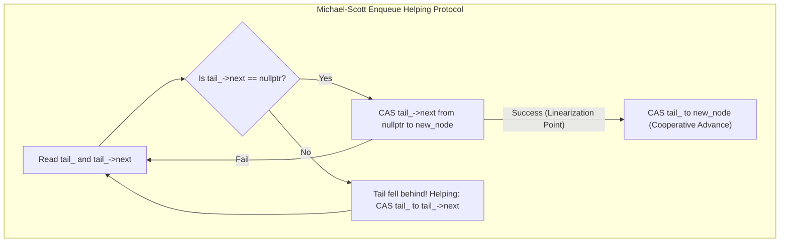
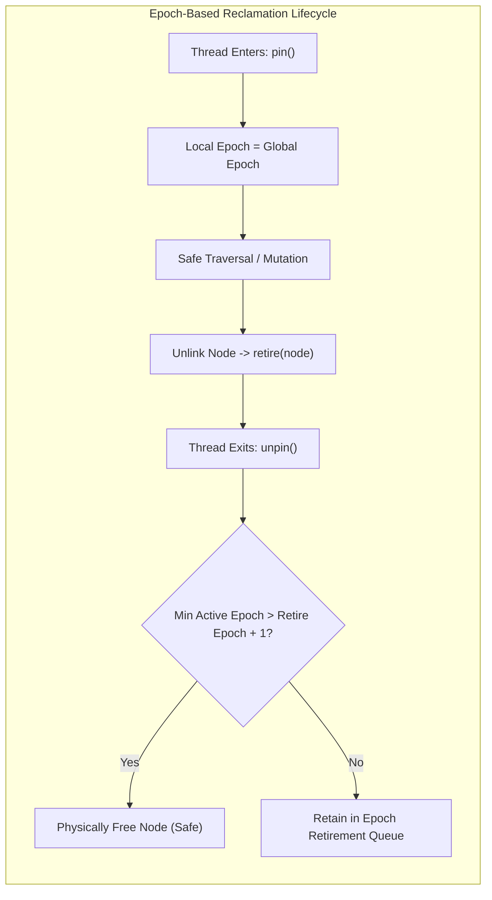

# Concurrent Queues, Stacks & Safe Memory Reclamation

## 1. Overview & Theoretical Foundations

In high-concurrency systems, shared data structures represent the primary bottleneck to multicore scaling. Traditional synchronization relies on mutual exclusion primitives such as `std::mutex` or spinlocks. While straightforward to reason about, lock-based structures suffer from fundamental failure modes:
- **Priority Inversion**: A low-priority thread holding a lock can be preempted by the OS scheduler, blocking high-priority threads indefinitely.
- **Convoying**: When multiple threads contend for the same lock, cache line bouncing between CPU cores degrades throughput orders of magnitude below sequential execution.
- **Deadlock and Asynchronous Signal Safety**: Locks cannot be safely acquired within signal handlers or hard real-time interrupt service routines.

To overcome these constraints, computer scientists developed **Non-Blocking Synchronization**, categorized by the **Herlihy-Shavit Progress Hierarchy**:

```
   ========================================================================================
   Progress Level        Definition                                       Representative Primitive
   ========================================================================================
   Obstruction-Free      A thread makes progress if running in isolation  Software Transactional Memory
   Lock-Free             At least one thread makes progress system-wide   Treiber Stack, MS-Queue
   Wait-Free             Every active thread makes progress in bounded steps Universal Consensus, FAA Ring
   ========================================================================================
```

This chapter provides a publication-grade, hardware-conscious reference for the two bedrock non-blocking data structures:
1. **The Treiber Stack (R. Kent Treiber, 1986)**: A lock-free LIFO container governed by atomic Compare-And-Swap (CAS) operations on a single top pointer.
2. **The Michael-Scott Queue (Maged M. Michael & Michael L. Scott, 1996)**: A lock-free FIFO queue employing independent head and tail pointers, a dummy sentinel node, and a cooperative **helping mechanism**.
3. **Epoch-Based Reclamation (EBR)**: A production-ready Safe Memory Reclamation (SMR) engine that solves the use-after-free and ABA hazards inherent to non-blocking pointer recycling.

---

## 2. Mathematical Definitions, Invariants & Memory Orderings

### 2.1 Linearizability (Herlihy & Wing, 1990)
A concurrent object is **linearizable** if every operation appears to take effect instantaneously at a specific discrete point in physical time (the **Linearization Point**) between its invocation and its response. Linearizability guarantees that concurrent executions are strictly consistent with sequential specifications.

### 2.2 Formal Memory-Ordering Invariants
To guarantee correctness on weakly-ordered hardware architectures (such as ARMv8 and POWER) while avoiding unnecessary memory fences on strongly-ordered systems (x86-64 TSO), implementations must enforce four foundational invariants:

- **Invariant A (Publication Safety)**:
  Node payload writes must *happen-before* the publishing atomic store that makes the node visible to other threads (`std::memory_order_release`). Conversely, readers must load the published pointer with `std::memory_order_acquire`:
  $$\text{Store}_{\text{data}}(node) \prec_{\text{po}} \text{Store}_{\text{release}}(ptr, node) \prec_{\text{sw}} \text{Load}_{\text{acquire}}(ptr)$$
- **Invariant B (Reachability & SMR Safety)**:
  An unlinked node $u$ cannot have its underlying memory deallocated while any concurrent thread holds an active reference to $u$. Deallocation is deferred until all threads have left the epoch during which $u$ was unlinked.
- **Invariant C (Linearization Invariant)**:
  Every successful mutative operation ($push$, $pop$, $enqueue$, $dequeue$) must execute exactly one atomic instruction that serves as its unique linearization point.
- **Invariant D (Relaxed Metadata)**:
  Auxiliary counters, diagnostics, and contention statistics do not establish synchronization dependencies and must strictly use `std::memory_order_relaxed`.

---

## 3. Structural Anatomy & State Transition Diagrams

### 3.1 Treiber Stack Architecture
The Treiber Stack maintains a single atomic pointer `head_`. All insertions and deletions contend at the top of the stack.

```
       +--------------+
       |    head_     | --------+
       +--------------+         |
                                v
                           +---------+      +---------+      +---------+
                           | Node A  | ---> | Node B  | ---> | Node C  | ---> nullptr
                           +---------+      +---------+      +---------+
                           [Top/LIFO]
```

### 3.2 Michael-Scott Queue Architecture
The Michael-Scott Queue separates enqueue and dequeue contention by maintaining two atomic pointers: `head_` and `tail_`. A permanent **dummy sentinel node** prevents `head_` and `tail_` from ever becoming `nullptr`.

```
                  +--------------+                +--------------+
                  |    head_     |                |    tail_     |
                  +--------------+                +--------------+
                         |                               |
                         v                               v
                  +-------------+                 +-------------+
                  | Dummy Node  | --------------> |   Node 1    | ---> nullptr
                  +-------------+                 +-------------+
                  (Sentinel)                      (Last Enqueued)
```





---

## 4. Algorithmic Mechanics

### 4.1 Treiber Stack Operations

#### `push(value)`
1. Allocate a new `Node(value)`.
2. Load the current `head_` with `memory_order_relaxed`.
3. Set `new_node->next = old_head`.
4. Execute `head_.compare_exchange_weak(new_node->next, new_node, std::memory_order_release, std::memory_order_relaxed)`.
5. **Linearization Point**: The single cycle in which the CAS successfully swings `head_` to `new_node`.

#### `pop()`
1. Pin the calling thread in the current epoch via `EpochGuard`.
2. Load `old_head = head_.load(std::memory_order_acquire)`.
3. If `old_head == nullptr`, return empty (`std::nullopt`). (Linearization Point for empty stack).
4. Read `next = old_head->next`.
5. Execute `head_.compare_exchange_weak(old_head, next, std::memory_order_acquire, std::memory_order_acquire)`.
6. On success:
   - Extract `value = old_head->data`.
   - Pass `old_head` to `reclaimer.retire(old_head, deleter)`.
   - **Linearization Point**: The successful CAS swinging `head_` to `old_head->next`.

---

### 4.2 Michael-Scott Queue Operations

#### The Dummy Sentinel Node Invariant
The queue always contains at least one node. The node pointed to by `head_` is always a dummy sentinel whose data has already been consumed:
- When the queue is **empty**, `head_ == tail_` and `head_->next == nullptr`.
- When the queue has **$K$ elements**, `head_` points to the sentinel, and following $K$ links through `next` leads to `tail_`.

#### `enqueue(value)`
Enqueueing requires a two-phase update because hardware does not provide a multi-word atomic CAS that spans both `tail_->next` and `tail_` simultaneously:
1. Pin the calling thread via `EpochGuard`.
2. Allocate `new_node = new Node(value)`.
3. Read `cur_tail = tail_.load(acquire)` and `next = cur_tail->next.load(acquire)`.
4. Verify consistency: `cur_tail == tail_.load(acquire)`.
5. **Case 1: `next == nullptr` (Tail is at true end)**:
   - Attempt `cur_tail->next.compare_exchange_weak(nullptr, new_node, release, relaxed)`.
   - If successful, this is the **Linearization Point**! The node is now part of the logical FIFO queue.
   - Cooperatively advance `tail_`: `tail_.compare_exchange_strong(cur_tail, new_node, release, relaxed)`.
6. **Case 2: `next != nullptr` (Tail is lagging behind)**:
   - Another thread linked a new node but was preempted before advancing `tail_`.
   - **Cooperative Helping**: The current thread helps by attempting `tail_.compare_exchange_strong(cur_tail, next, release, relaxed)`.
   - Loop back and retry.

#### `dequeue()`
1. Pin the calling thread via `EpochGuard`.
2. Read `cur_head = head_.load(acquire)`, `cur_tail = tail_.load(acquire)`, and `next = cur_head->next.load(acquire)`.
3. Verify consistency: `cur_head == head_.load(acquire)`.
4. **Case 1: `cur_head == cur_tail`**:
   - If `next == nullptr`: The queue is empty. Return `std::nullopt` (**Linearization Point**).
   - If `next != nullptr`: `tail_` has fallen behind `head_`. Help advance `tail_` to `next` and retry.
5. **Case 2: `cur_head != cur_tail`**:
   - The queue contains items. Read `value = next->data`.
   - Attempt `head_.compare_exchange_weak(cur_head, next, release, relaxed)`.
   - If successful, this is the **Linearization Point**!
   - Retire the old sentinel (`cur_head`) to the EBR reclaimer.
   - Return `value`.

---

## 5. Epoch-Based Reclamation (EBR) Engine

### 5.1 The Memory Deallocation Dilemma
In a lock-free data structure, popping or dequeuing a node unlinks it from the global chain. However, concurrent reader threads may have already loaded a pointer to that node into a CPU register just before the CAS executed. Calling `delete node` immediately triggers a catastrophic use-after-free or segfault.

### 5.2 The 3-Epoch Invariant
EBR partitions time into monotonically increasing epochs ($e \in \mathbb{N}$).
1. **Thread Registration**: Each thread registers a cache-line aligned `ThreadEpochRecord` containing `local_epoch` and an `active` boolean flag.
2. **Pinning**: Upon entering a lock-free operation, a thread sets `local_epoch = global_epoch` and `active = true`.
3. **Retirement**: When a node is unlinked, it is placed onto a retired list stamped with the current `global_epoch`.
4. **Reclamation Rule**:
   $$\text{Node } u \text{ retired in epoch } e_{\text{retire}} \text{ is safe to deallocate iff } \min_{t \in \text{ActiveThreads}}(\text{local\_epoch}_t) > e_{\text{retire}}$$
   In practice, with 3 circular epoch bins (0, 1, 2), any node retired in epoch $(e - 2) \pmod 3$ cannot possibly be referenced by any active thread.

---

## 6. Memory Ordering & Cache-Line Alignment

On modern multi-socket hardware, cache line contention across L1/L2 caches dominates latency. We enforce two physical hardware optimizations:

```cpp
// Prevent False Sharing: Pad thread-local control blocks to 64 bytes
struct alignas(64) ThreadEpochRecord {
    std::atomic<uint64_t> local_epoch{0};
    std::atomic<bool> active{false};
    ThreadEpochRecord* next{nullptr};
};
```

### Atomic Ordering Matrix
| Operation | Target Variable | Memory Order | Justification |
| :--- | :--- | :--- | :--- |
| `push()` CAS | `head_` | `memory_order_release` | Invariant A: Publishes node payload |
| `pop()` load | `head_` | `memory_order_acquire` | Invariant A: Safely observes node data |
| `enqueue()` link CAS | `tail_->next` | `memory_order_release` | Invariant C: Enqueue linearization point |
| `enqueue()` advance | `tail_` | `memory_order_release` | Cooperatively publishes new tail pointer |
| `dequeue()` CAS | `head_` | `memory_order_release` | Invariant C: Dequeue linearization point |
| `EpochGuard::pin()` | `active` | `memory_order_seq_cst` | Prevents hoist of speculative reads |
| `EpochGuard::unpin()`| `active` | `memory_order_release` | Flushes all accesses before unpinning |

---

## 7. The ABA Problem & How SMR Eliminates It

### The Classical Treiber Stack ABA Scenario
1. Stack initial state: `Top -> A -> B -> C`.
2. Thread 1 wants to pop:
   - Reads `old_head = A`.
   - Reads `next = old_head->next` (which is `B`).
   - Thread 1 is preempted by the OS scheduler just before the CAS.
3. Thread 2 runs to completion:
   - Pops `A` (Stack: `Top -> B -> C`).
   - Pops `B` (Stack: `Top -> C`).
   - Deallocates both `A` and `B`.
4. Thread 3 runs:
   - Allocates memory for a new node.
   - The memory allocator returns the **exact same memory address** previously held by `A`!
   - Pushes new node `A` (Stack: `Top -> A -> C`).
5. Thread 1 resumes:
   - Executes `head_.compare_exchange(A, B)`.
   - Since `head_ == A` holds true, the CAS succeeds!
   - **Disaster**: `head_` is swung to `B`, which is dangling, corrupt memory! Node `C` is permanently lost.

> [!IMPORTANT]
> **Epoch-Based Reclamation completely neutralizes the ABA problem!** Because Thread 1 remains pinned in its epoch, node `A` cannot be retired and reallocated by the memory manager. Node `A`'s address cannot be recycled while Thread 1 holds a reference to it.

---

## 8. Asymptotic Complexity & Scalability Profile

| Operation | Uncontended Time | Contended Time | Space Complexity | Progress Guarantee |
| :--- | :--- | :--- | :--- | :--- |
| **Treiber `push`** | $O(1)$ | $O(\text{Retries})$ | $O(1)$ per item | Lock-Free |
| **Treiber `pop`** | $O(1)$ | $O(\text{Retries})$ | $O(1)$ per item | Lock-Free |
| **MS-Queue `enqueue`** | $O(1)$ | $O(\text{Retries})$ | $O(1)$ per item | Lock-Free |
| **MS-Queue `dequeue`** | $O(1)$ | $O(\text{Retries})$ | $O(1)$ per item | Lock-Free |
| **EBR `pin / unpin`** | $O(1)$ | $O(1)$ | $O(T)$ threads | Wait-Free |
| **EBR `reclaim`** | $O(R)$ batch | $O(R)$ batch | $O(R)$ retired items | Amortized $O(1)$ |

---

## 9. High-Performance C++17 Reference Implementation

The complete, production-grade reference implementation is available at [`implementations/cpp/concurrent_queues_and_stacks.cpp`](../../implementations/cpp/concurrent_queues_and_stacks.cpp).

Highlights:
- Pure C++17 with `-pthread` support, zero compiler warnings under `-Wall -Wextra -Werror`.
- Cache-line padded `ThreadEpochRecord` structures to prevent false sharing.
- Explicit acquire-release memory orderings on all CAS and pointer operations.
- Dynamic thread registration with RAII `EpochGuard`.
- Fully verified under high-concurrency multi-producer multi-consumer stress tests.

---

## 10. Idiomatic Python 3 Reference Implementation

The Python reference implementation is available at [`implementations/python/concurrent_queues_and_stacks.py`](../../implementations/python/concurrent_queues_and_stacks.py).

Features:
- Models the atomic Compare-And-Swap state machine and cooperative helping mechanism.
- Implements Epoch-Based Reclamation with active thread tracking and retirement queues.
- Includes a full `unittest.TestCase` suite testing sequential LIFO/FIFO semantics, multi-threaded stress execution, and strict per-producer FIFO preservation.

---

## 11. Testing & Verification Architecture

Concurrency testing follows Arthur's layered verification architecture:

1. **Layer 1: Sequential Semantic Oracle**: Validates pure LIFO behavior for Treiber Stack and pure FIFO behavior for MS-Queue under single-threaded control.
2. **Layer 2: Multi-Producer Single-Consumer (MPSC) Strict FIFO Verification**: Multiple concurrent producers push uniquely identifiable items (`(producer_id << 32) | seq`). A single consumer drains the queue. We assert that for every producer, items arrive in strictly increasing sequence order $0, 1, 2, \dots, M-1$. This mathematically proves FIFO linearizability without consumer race jitter.
3. **Layer 3: Multi-Producer Multi-Consumer (MPMC) High-Contention Stress Test**:
   - $P = 4$ producers, $C = 4$ consumers, $M = 10,000$ items per producer (40,000 total items).
   - Synchronized startup barrier releasing all threads concurrently.
   - End-state reconciliation: exactly 40,000 items consumed, zero duplicates, zero losses, sum checksum matched.
4. **Layer 4: SMR Lifecycle Validation**: Asserts that every allocated node is accounted for and safely reclaimed upon draining:
   $$\text{total\_allocated} == \text{total\_reclaimed}$$

---

## 12. Practical Trade-Offs & Real-World Extensions

### 12.1 EBR vs. Hazard Pointers
- **Epoch-Based Reclamation (EBR)**: Minimal overhead (a single store to local epoch per operation). However, if a thread stalls (e.g., gets blocked by page fault or OS preemption while pinned), **all memory reclamation across the entire process halts**, leading to unbounded memory growth.
- **Hazard Pointers**: Finer-grained protection per pointer. Bounded memory consumption even if threads stall, but incurs heavier per-read memory fences (`mfence` or sequential consistency stores).

### 12.2 Production Extensions
1. **Exponential Backoff with `_mm_pause()`**: Under extreme contention, repeated CAS failures saturate the CPU cache bus. Injecting exponential backoff with the `PAUSE` instruction significantly improves overall throughput.
2. **Flat Combining / Elimination Backoff Stacks**: For ultra-high contention stacks, concurrent pairs of push and pop threads can exchange values in an elimination array without ever touching the shared `head_` pointer, achieving $O(1)$ parallel throughput.
