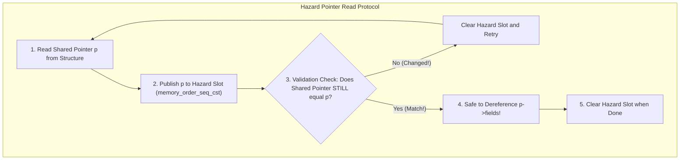
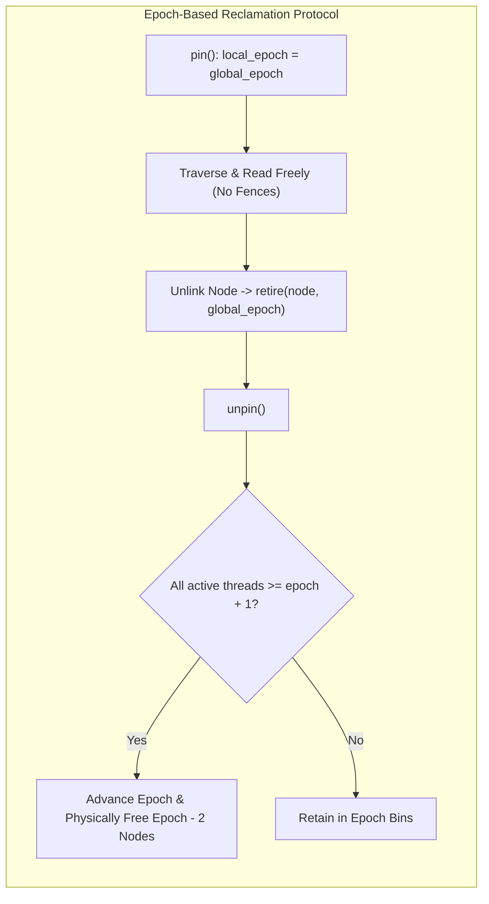

# Safe Memory Reclamation: Hazard Pointers & Epoch-Based Reclamation

## 1. Overview & Theoretical Foundations

In lock-free and non-blocking data structures, threads traverse and access nodes without holding mutual exclusion locks. When a thread unlinks a node $u$ from a shared concurrent structure, it cannot immediately call `free(u)` or `delete u`. Other concurrent reader threads may have already loaded a pointer to $u$ into CPU registers and may be in the middle of reading its fields. Immediate deallocation causes catastrophic **Use-After-Free (UAF)**, heap memory corruption, or operating system segmentation faults.

This fundamental challenge is known as the **Safe Memory Reclamation (SMR)** problem:
> *How can a concurrent system dynamically defer the deallocation of unlinked nodes until it is mathematically guaranteed that no active thread holds a reference to them, while preserving lock-free progress and bounding memory overhead?*

Two primary paradigms dominate production systems:
1. **Hazard Pointers (Maged M. Michael, 2004)**: Fine-grained, per-pointer reader protection. Guarantees deterministic, provably bounded memory overhead even if arbitrary threads stall or sleep indefinitely.
2. **Epoch-Based Reclamation (EBR) (Keir Fraser, 2004)**: Coarse-grained, time-based epoch synchronization. Delivers blazing fast read throughput with near-zero read-path overhead, but is vulnerable to unbounded memory growth if a thread stalls while pinned.

---

## 2. Mathematical Definitions & Memory Guarantees

### 2.1 The Safe Reclamation Invariant
Let $\mathcal{T}$ be the set of active concurrent threads, and let $\mathcal{R}_t(T)$ be the set of nodes reachable or cached by thread $T \in \mathcal{T}$ at physical time $t$. A node $u$ unlinked at time $t_{\text{unlink}}$ is safe to physically deallocate at time $t_{\text{free}} \ge t_{\text{unlink}}$ if and only if:
$$\forall T \in \mathcal{T}: \quad u \notin \mathcal{R}_{t_{\text{free}}}(T)$$

### 2.2 Hazard Pointer Bounded Memory Theorem (Maged M. Michael, 2004)
Let $H$ be the number of active threads, and let $K$ be the number of hazard pointer slots allocated per thread (typically $K \in \{2, 3\}$). The total number of simultaneously protected hazard pointers across the entire system is at most $H \cdot K$.

If each thread accumulates retired nodes in a local retirement list and triggers a reclamation scan when the list size reaches a threshold $R \ge 2 K H$, then:
- At each scan, at least $R - K H \ge K H$ nodes are guaranteed to be unreferenced by any thread and are physically freed.
- The maximum unreclaimed retired nodes across the entire process is strictly bounded by:
  $$M_{\text{unreclaimed}} \le H \cdot R = O(K \cdot H^2)$$

> [!IMPORTANT]
> **Resilience to Stalled Threads**: Unlike EBR, if a thread stalls, sleeps, or is preempted indefinitely while holding a hazard pointer to node $A$, **other threads can continue to reclaim all other unlinked nodes** ($B, C, D, \dots$). Only node $A$ remains retained. Memory growth remains strictly bounded!

### 2.3 EBR 3-Epoch Invariant (Keir Fraser, 2004)
In a 3-epoch circular scheme ($e \in \{0, 1, 2\}$):
1. Pinned threads record the current global epoch $e_{\text{global}}$.
2. An unlinked node is retired into bin $e_{\text{retire}} = e_{\text{global}}$.
3. Global epoch advances when all active pinned threads have witnessed the current epoch.
4. **Reclamation Rule**: Any node retired in epoch $(e_{\text{current}} - 2) \pmod 3$ is guaranteed to have zero active readers and is safe to physically deallocate.

---

## 3. Structural Anatomy & Protocol Diagrams

### 3.1 Hazard Pointer Slot Layout

```
   Thread 0: [ Slot 0: Node A ] [ Slot 1: nullptr ]   ---> Retired List: [ Node X, Node Y ]
   Thread 1: [ Slot 0: Node B ] [ Slot 1: Node C   ]   ---> Retired List: [ Node Z ]
   Thread 2: [ Slot 0: nullptr] [ Slot 1: nullptr  ]   ---> (Idle)
   -----------------------------------------------------------------------------------------
   Global Hazard Set: { Node A, Node B, Node C }
   Safe to Reclaim: Any retired node NOT in { Node A, Node B, Node C }
```

### 3.2 Hazard Pointer Read-Validate-Clear Protocol



### 3.3 Epoch-Based Reclamation Lifecycle



---

## 4. Algorithmic Mechanics

### 4.1 Hazard Pointer Protocol Details

#### The Read-Validation Race Condition
Consider thread $T_1$ attempting to read node $A$:
1. $T_1$ reads address $A$ from shared memory.
2. Before $T_1$ can protect $A$, thread $T_2$ unlinks $A$, scans hazards (observing that $T_1$ has not yet published $A$), and deallocates $A$!
3. If $T_1$ publishes $A$ after it has already been freed, $T_1$ would be protecting dangling memory.
4. **The Validation Check**: After publishing $A$ to the hazard slot, $T_1$ re-reads the shared pointer. If the shared pointer no longer equals $A$, $A$ may have been unlinked before the hazard pointer became visible to other threads. $T_1$ clears its slot and retries.
5. **The Memory Fence Requirement**: Between the hazard slot store and the shared pointer re-read, a full memory fence (`std::memory_order_seq_cst`) is strictly mandatory to prevent CPU store buffers from reordering the read ahead of the store.

#### The `scan_and_reclaim()` Algorithm
When a thread accumulates $R$ retired nodes:
1. Scan all active thread records and collect all non-null pointers into an array `active_hazards`.
2. Sort `active_hazards` ($O(H \cdot K \log(H \cdot K))$).
3. For each node in local `retired_list`:
   - Binary search in `active_hazards`.
   - If found: retain in `retired_list` for future scans.
   - If not found: invoke custom deleter `deleter(node->ptr)` and physically free the memory.

---

### 4.2 Epoch-Based Reclamation Protocol Details

#### Blazing Fast Read Path
In EBR, reading a node requires **zero memory fences** and **zero per-pointer atomic stores**:
1. `pin()`: Loads global epoch into thread-local slot and stores `active = true`.
2. Reader traverses pointer chains directly. Because the thread is pinned in epoch $e$, no node unlinked during or after epoch $e$ will be physically freed until after the thread unpins!
3. `unpin()`: Sets `active = false` with `memory_order_release`.

#### The Epoch Stall Hazard
The Achilles' heel of EBR is coarse granularity:
- If a thread calls `pin()`, then suffers an OS preemption, page fault, or long I/O wait, **the minimum active epoch of the system cannot advance**.
- All nodes retired by all other threads across the entire process accumulate in memory without being freed.
- Under heavy write workloads, an epoch stall can trigger Out-Of-Memory (OOM) crashes in minutes.

---

## 5. Architectural Comparison Matrix

| Property | Hazard Pointers | Epoch-Based Reclamation (EBR) | Quiescent-State (QSBR) |
| :--- | :--- | :--- | :--- |
| **Read-Path Overhead** | Moderate (SeqCst store + fence) | Extremely Low (1 local store) | Zero (Pure read) |
| **Read-Path Memory Fence** | `seq_cst` or full fence | None (Acquire/Release) | None |
| **Max Unreclaimed Memory**| $O(K \cdot H^2)$ (Strictly Bounded) | Unbounded if 1 thread stalls | Unbounded if 1 thread stalls |
| **Stalled Thread Resilience**| **Complete** (Other nodes freed)| **Zero** (All reclamation stalls) | **Zero** (All reclamation stalls) |
| **Reclamation Granularity**| Per-Pointer | Per-Epoch (Batched) | Per-Epoch (Batched) |
| **Hardware Compatibility**| Universal | Universal | Requires periodic quiescent loop |
| **Implementation Complexity**| Moderate | Low | Low |

---

## 6. Memory Ordering & Hardware Implementation Nuances

### 6.1 Hazard Pointer Store-Load Reordering Trap
On modern out-of-order processors (x86-64, ARMv8), CPU store buffers allow earlier stores to be delayed past subsequent loads to different addresses:

```cpp
// THREAD 1: Reader
hp_slot.store(node_ptr, std::memory_order_relaxed); // Store to HP slot
Node* cur = shared_head.load(std::memory_order_relaxed); // Load from Head

// THREAD 2: Writer (Reclaimer)
shared_head.store(next_node, std::memory_order_relaxed); // Store to Head
void* hp = hp_slot.load(std::memory_order_relaxed); // Load from HP slot
```

Without synchronization, both threads can execute their loads before their stores reach the L1 cache! Thread 1 sees old head, Thread 2 sees null hazard pointer, and node is freed while Thread 1 accesses it.
- **Remedy**: The hazard pointer store must use `std::memory_order_seq_cst` (compiling to `MFENCE` on x86 or `DMB ISH` on ARM).

---

## 7. High-Performance C++17 Reference Implementation

The complete, zero-warning reference implementation is available at [`implementations/cpp/hazard_pointers_and_epoch_reclamation.cpp`](../../implementations/cpp/hazard_pointers_and_epoch_reclamation.cpp).

Key Highlights:
- `HazardPointerDomain<MaxThreads, SlotsPerThread>`: Cache-line aligned thread records (`alignas(64)`), dynamic thread acquisition, and batch binary-search reclamation.
- `HazardPointerStack<T>`: Lock-free LIFO stack guarded by hazard pointers with the publish-validate-clear protocol.
- `EpochDomain`: Coarse-grained time-based epoch reclamation engine with 3-epoch retirement queues.
- Stalled-thread isolation verification test.

---

## 8. Idiomatic Python 3 Reference Implementation

The Python reference implementation is available at [`implementations/python/hazard_pointers_and_epoch_reclamation.py`](../../implementations/python/hazard_pointers_and_epoch_reclamation.py).

Features:
- Models thread hazard slots, publishing, and active hazard set filtering.
- Models epoch advancement and circular retirement queues.
- Includes a full `unittest.TestCase` suite testing stalled-thread resilience and multi-threaded stress execution.

---

## 9. Testing & Verification Architecture

Testing SMR requires a multi-layered verification harness:

1. **Layer 1: Stalled-Thread Resilience Isolation Test**:
   - Thread 1 publishes a hazard pointer to `Node A` and goes to sleep.
   - Thread 2 unlinks `Node A` and 50 other nodes, and triggers `scan_and_reclaim()`.
   - **Assertions**:
     - `Node A` is strictly preserved and never deallocated.
     - All other 50 unlinked nodes are successfully reclaimed.
2. **Layer 2: Multi-Threaded Concurrent Stress Test**:
   - 4 producers, 4 consumers, 20,000 total items.
   - Pushes and pops execute concurrently under hazard pointer protection.
   - End-state reconciliation: 100% item accounting with zero leaks.
3. **Layer 3: SMR Lifecycle Accounting**:
   - Verifies that $\text{total\_allocated} == \text{total\_reclaimed}$ upon global drain.
4. **Layer 4: EBR Stall Vulnerability Proof**:
   - Demonstrates that pinning a thread halts epoch advancement until unpinned.

---

## 10. Practical Trade-Offs & Anti-Patterns

### 10.1 When to Use Hazard Pointers
- In mission-critical enterprise systems where threads can perform I/O, suffer page faults, or be preempted by the OS scheduler.
- In memory-constrained environments where memory growth must be mathematically bounded.

### 10.2 When to Use Epoch-Based Reclamation
- In pure in-memory, read-heavy workloads (e.g., in-memory key-value indexes, routing tables).
- When read-path performance is paramount and read critical sections are guaranteed to execute in microseconds without blocking.

---

## 11. Comprehensive Problem Set & Systems Extensions

1. **Dynamic Hazard Pointer Linked Registry**: Replace the fixed-size array of thread records with a lock-free linked list of thread records to support arbitrary thread creation and exit.
2. **Hazard Eras (IBR / Interval-Based Reclamation)**: Implement Pedro Ramalhete's Hazard Eras, which achieves the bounded memory footprint of Hazard Pointers with the low read overhead of EBR.
3. **Linux Kernel RCU (Read-Copy-Update)**: Contrast the user-space EBR design with the Linux kernel's RCU implementation (`rcu_read_lock()`, `call_rcu()`, and timer tick quiescent states).
