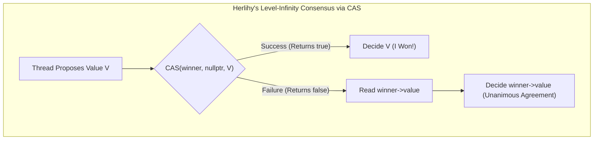
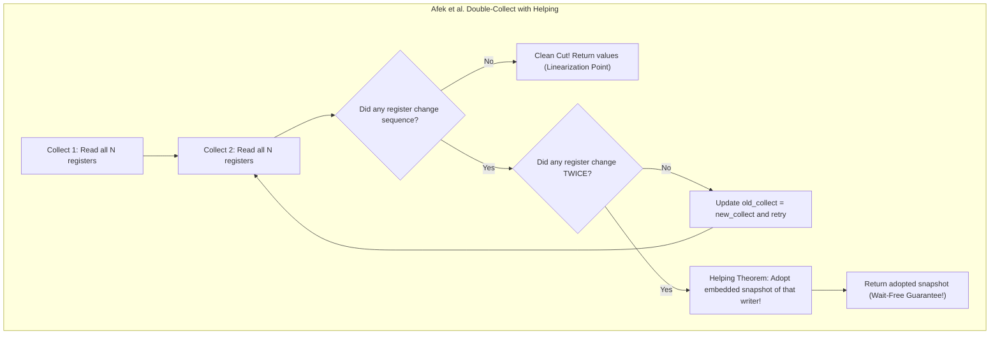

# Lock-Free and Wait-Free Basics: Progress Guarantees & Consensus

## 1. Overview & Theoretical Foundations

Modern multicore architectures expose severe challenges when coordinating parallel threads of execution. While mutual exclusion (locks) prevents race conditions, it introduces fundamental system-level vulnerabilities: deadlock, priority inversion, convoying, and lack of fault tolerance if a lock-holding thread crashes or is descheduled.

To provide robust execution guarantees, computer science developed **Non-Blocking Synchronization**, formalized by **Maurice Herlihy and Nir Shavit**. Non-blocking algorithms guarantee that the failure or suspension of any thread cannot halt the execution of other threads.

### 1.1 The Herlihy-Shavit Progress Hierarchy

```
   +---------------------------------------------------------------------------------------+
   | PROGRESS HIERARCHY (Stronger Guarantees Downward)                                     |
   +---------------------------------------------------------------------------------------+
   | 1. Blocking          | Mutex, Spinlock     | System halted if lock holder preempted.  |
   | 2. Obstruction-Free  | STM, Software CAS   | Progress guaranteed if run in isolation. |
   | 3. Lock-Free         | Treiber Stack, MS-Q | At least ONE thread makes progress.      |
   | 4. Wait-Free         | FAA Counter, Snap   | EVERY thread makes progress in bounded   |
   |                      |                     | number of its own execution steps.       |
   +---------------------------------------------------------------------------------------+
```

### 1.2 Maurice Herlihy’s Consensus Hierarchy (1991)
A central question of concurrent computing is: *What hardware atomic primitives are fundamentally required to implement wait-free data structures?*

In his seminal 1991 paper, Maurice Herlihy proved that atomic primitives form an infinite hierarchy based on their **Consensus Number**: the maximum number of concurrent threads for which the primitive can solve the binary **Consensus Problem** in a wait-free manner.

```
   ========================================================================================
   Consensus Level    Consensus Number    Hardware Primitives / Objects
   ========================================================================================
   Level 1            1                   Atomic Read/Write Registers (Memory loads & stores)
   Level 2            2                   Fetch-and-Add (FAA), Test-and-Set, Swap, FIFO Queue
   ...                ...                 ...
   Level Infinity     Infinity            Compare-and-Swap (CAS), Load-Linked / Store-Conditional
   ========================================================================================
```

> [!IMPORTANT]
> **Herlihy’s Universality Theorem**: Any concurrent object with a well-defined sequential specification can be implemented with **wait-free progress** on a system equipped with atomic registers and Level-$\infty$ consensus primitives (such as Compare-And-Swap).

---

## 2. Mathematical Definitions & Core Invariants

### 2.1 The Consensus Problem
In a consensus protocol, $N$ independent processes $P_0, P_1, \dots, P_{N-1}$ each propose an input value $v_i \in \mathcal{V}$. The protocol must satisfy three fundamental invariants:
1. **Invariant 1 (Agreement)**: No two processes decide different values:
   $$\forall i, j: \quad \text{decide}_i = \text{decide}_j$$
2. **Invariant 2 (Validity)**: The decided value must have been proposed by at least one participating process:
   $$\text{decision} \in \{v_0, v_1, \dots, v_{N-1}\}$$
3. **Invariant 3 (Wait-Free Termination)**: Every non-faulty process decides in a finite, bounded number of its own steps.

### 2.2 Wait-Free vs. Lock-Free Formal Specification
Let $\mathcal{E}$ be an infinite concurrent execution history:
- **Lock-Free Condition**:
  $$\forall \text{ state } s \in \mathcal{E}, \quad \exists \text{ thread } t \text{ that completes an operation within a finite number of global system steps.}$$
  *(Individual threads may experience starvation, but the system as a whole never livelocks).*
- **Wait-Free Condition**:
  $$\forall \text{ thread } t, \quad \exists B_t \in \mathbb{N} \text{ such that } t \text{ completes its operation within at most } B_t \text{ of its own steps.}$$
  *(Zero starvation. Bounded worst-case latency for every participant).*

---

## 3. Structural Anatomy & State Transition Diagrams

### 3.1 Herlihy’s Level-$\infty$ Consensus Object
With atomic Compare-And-Swap, consensus among an arbitrary number of threads is solved in exactly **one atomic step**:



### 3.2 Afek et al. Double-Collect Snapshot Algorithm
An atomic snapshot object provides an instantaneous view of an array of $N$ Single-Writer Multi-Reader (SWMR) registers without acquiring locks:



---

## 4. Algorithmic Mechanics

### 4.1 Wait-Free Consensus via CAS
Herlihy’s consensus object initializes a shared atomic pointer `proposed_winner_` to `nullptr`.
1. Each thread allocates a proposal node with its private value.
2. The thread attempts `proposed_winner_.compare_exchange_strong(nullptr, my_proposal)`.
3. If successful, the thread is the consensus winner and outputs its own value.
4. If unsuccessful, another thread won. The losing thread reads `proposed_winner_->value` and outputs the winner's proposal.
5. **Execution Bound**: Exactly 1 atomic instruction! This is $O(1)$ wait-free for any number of threads.

---

### 4.2 Afek et al. Wait-Free Atomic Snapshot (1993)
A naive reader might read registers $R_0, R_1, \dots, R_{N-1}$ sequentially. However, concurrent writers can cause **torn reads**, observing intermediate states that never existed simultaneously in physical time.

Afek, Attiya, Dolev, Gafni, Merritt, and Shavit solved this using **Cooperative Helping**:
- Each register stores a tuple: `(value, sequence_number, last_snapshot)`.
- When thread $i$ updates its register:
  1. It performs a `scan()` to capture the current global state.
  2. It increments its sequence number and publishes `(new_val, seq + 1, current_snap)`.
- When a reader scans:
  1. It performs a **Double-Collect**: reading all $N$ sequence numbers twice.
  2. If all sequence numbers match, no write occurred between the two collects; the read is atomic and linearizable.
  3. If thread $i$ changed sequence **twice**, thread $i$ must have started and finished a complete update (including its internal scan) entirely within the reader's execution window.
  4. **The Helping Theorem**: The reader can immediately adopt the `last_snapshot` embedded inside thread $i$'s second write! This guarantees termination in at most $2N$ collect rounds.

---

### 4.3 Hardware Fetch-And-Add (FAA) vs. CAS Retry Loops

Modern x86 CPUs provide `LOCK XADD`, and ARMv8.1 provides atomic `LDADD`. These instructions execute as a single read-modify-write cycle on the local L1 cache line:
- **`counter.fetch_add(1)`**: Hardware guarantees completion in bounded CPU cycles regardless of concurrent contention. **Wait-Free $O(1)$**.
- **`CAS Loop (compare_exchange_weak)`**: If 16 threads contend on a single pointer, 1 thread succeeds and 15 fail, retrying in a loop. Under high contention, threads can experience hundreds of thousands of collisions. **Lock-Free, but NOT Wait-Free**.

```cpp
// 1. Wait-Free FAA: Guarantees O(1) step bound per thread
uint64_t wait_free_ticket = counter.fetch_add(1, std::memory_order_acq_rel);

// 2. Lock-Free CAS: System-wide progress, individual thread starvation possible
uint64_t cur = counter.load(std::memory_order_relaxed);
while (!counter.compare_exchange_weak(cur, cur + 1, std::memory_order_acq_rel)) {
    // Retry storm under high thread contention
}
```

---

## 5. The Kogan-Petrank Fast-Path / Slow-Path Pattern

In 2011, Alex Kogan and Erez Petrank introduced the standard methodology for building practical wait-free data structures:
1. **Fast-Path (Lock-Free)**: A thread first attempts a fast, lightweight lock-free operation (e.g., direct CAS). If uncontended, it finishes in $O(1)$ time with zero helping overhead.
2. **Phase Transition**: If the thread fails $K$ consecutive times (e.g., $K = 4$), contention is detected. The thread transitions to the slow-path.
3. **Slow-Path (Wait-Free via Announcement)**:
   - The thread posts its operation into a shared **Announcement Array** indexed by thread ID: `announce[thread_id] = op`.
   - Before any thread executes its own operation, it scans the announcement array and **helps** all pending operations to completion.
   - Because all $N$ threads help pending requests, every announced operation is guaranteed to complete in $O(N)$ steps.

```
   Thread 0: [ Try Fast CAS (x4) ] ---> Contention! ---> [ Announce Op in Table ] <---+
                                                                                     |
   Thread 1: [ Enters Queue ] --------> [ Scans Announce Table & Helps Thread 0 ] ---+
                                        [ Completes Own Op ]
```

---

## 6. Asymptotic Complexity & Comparison Matrix

| Category | Primitive / Algorithm | Progress Guarantee | Contended Step Bound | Starvation Risk | Hardware Instruction |
| :--- | :--- | :--- | :--- | :--- | :--- |
| **Blocking** | `std::mutex` / Spinlock | Blocking | Indefinite (OS Preemption) | High | `CMPXCHG` + OS Futex |
| **Obstruction-Free** | Transactional Memory | Obstruction-Free | Bounded if isolated | High | Cache Abort / Software Rollback |
| **Lock-Free** | Treiber Stack / MS-Queue | Lock-Free | Unbounded retries | Possible | Atomic CAS loop |
| **Lock-Free** | CAS Sequencer | Lock-Free | Unbounded retries | Possible | `compare_exchange_weak` |
| **Wait-Free** | FAA Sequencer | Wait-Free | $O(1)$ steps | Zero | Hardware `LOCK XADD` / `LDADD` |
| **Wait-Free** | Herlihy Consensus | Wait-Free | $O(1)$ steps | Zero | Atomic `CMPXCHG` |
| **Wait-Free** | Afek Snapshot | Wait-Free | $O(N^2)$ reads | Zero | Read/Write registers |
| **Wait-Free** | Kogan-Petrank Queue | Wait-Free | $O(N)$ helping steps | Zero | Announcement matrix + CAS |

---

## 7. Memory Ordering & False-Sharing Prevention

To achieve true wait-free performance, thread announcement slots and register components must be isolated from **false sharing**:

```cpp
// Cache-line padding ensures no two thread slots share the same 64-byte L1 cache line
struct alignas(64) PaddedSlot {
    std::atomic<RegisterEntry*> reg{nullptr};
};
```

### Memory Ordering Rules
- **Announcement Store**: `memory_order_release` ensures operation parameters are fully written before publishing the pending flag.
- **Helping Load**: `memory_order_acquire` ensures helper threads see valid operation payloads.
- **Completion Flag**: `memory_order_acq_rel` establishes a bidirectional synchronization point between the requesting thread and the helper thread.

---

## 8. Failure Modes & Anti-Patterns

1. **Unbounded CAS Retries (Livelock Vulnerability)**:
   Under extreme thread contention (e.g., 64 threads modifying a single pointer), CAS loops can saturate the coherence bus, degrading throughput below that of a single mutex.
2. **Announcement Array Overhead**:
   Unconditional helping on every operation introduces $O(N)$ scanning overhead. The fast-path / slow-path pattern is essential: only announce when contention is detected.
3. **Register Reuse ABA Hazard**:
   In wait-free snapshot algorithms, if register nodes are reclaimed naively without Safe Memory Reclamation (EBR or Hazard Pointers), old snapshots can be corrupted by recycled pointers.

---

## 9. High-Performance C++17 Reference Implementation

The complete, zero-warning reference implementation is available at [`implementations/cpp/lock_free_and_wait_free_basics.cpp`](../../implementations/cpp/lock_free_and_wait_free_basics.cpp).

Key Highlights:
- `ConsensusObject<T>`: Herlihy's level-$\infty$ wait-free consensus object.
- `WaitFreeSnapshot<N, T>`: Production-grade Afek et al. atomic snapshot implementation with double-collect and helping.
- `WaitFreeFAASequencer` vs `LockFreeCASSequencer`: Empirical comparison demonstrating $O(1)$ wait-free execution vs collision retry storms.
- `WaitFreeAnnounceQueue<N>`: Kogan-Petrank helping matrix converting lock-free updates to wait-free execution.

---

## 10. Idiomatic Python 3 Reference Implementation

The Python reference implementation is available at [`implementations/python/lock_free_and_wait_free_basics.py`](../../implementations/python/lock_free_and_wait_free_basics.py).

Features:
- Models Herlihy's consensus protocol and proves Agreement and Validity under concurrent threads.
- Implements Afek et al.'s double-collect snapshot algorithm and verifies monotonicity across concurrent writes.
- Includes a full `unittest.TestCase` suite.

---

## 11. Testing & Verification Architecture

Testing non-blocking guarantees requires a multi-layered verification harness:

1. **Layer 1: Consensus Verification (Agreement & Validity)**:
   - 16 concurrent threads propose unique values simultaneously across an atomic barrier.
   - Asserts Invariant 1 (all threads observe identical decision) and Invariant 2 (decision is one of the proposed inputs).
2. **Layer 2: Atomic Snapshot Monotonicity Check**:
   - Multiple concurrent writer threads stream monotonically increasing counters into their dedicated registers.
   - A concurrent scanner thread repeatedly executes `scan()`.
   - Asserts that every observed snapshot represents a strictly monotonic consistent cut without torn reads:
     $$\forall i \in [0, N-1]: \quad \text{snapshot}_{k}[i] \ge \text{snapshot}_{k-1}[i]$$
3. **Layer 3: Contention Profile Verification**:
   - Measures retry counts under high contention: Wait-Free FAA achieves **0 retries** ($O(1)$ deterministic execution), whereas Lock-Free CAS experiences hundreds of thousands of collision retries.

---

## 12. Practical Trade-Offs & Real-World Systems Extensions

### 12.1 Lock-Free vs. Wait-Free in Production
- **General Systems (Databases, Web Servers)**: Lock-free algorithms (e.g., Michael-Scott Queue, Treiber Stack) are overwhelmingly preferred because their uncontended fast path is extremely fast and hardware-friendly.
- **Hard Real-Time & Mission-Critical Systems**: Aerospace flight controllers, medical telemetry, high-frequency trading matching engines, and OS kernel interrupt handlers require **Wait-Free** algorithms. In these domains, unbounded retry loops represent an unacceptable latency tail risk.

### 12.2 Advanced Extensions
1. **LMAX Disruptor Ring Buffer**: Utilizes hardware wait-free FAA sequence counters to achieve millions of operations per second with predictable microsecond tail latencies.
2. **Universal Wait-Free Construction**: Any deterministic sequential data structure can be converted to wait-free by logging state transitions onto a consensus chain with cooperative helping.
