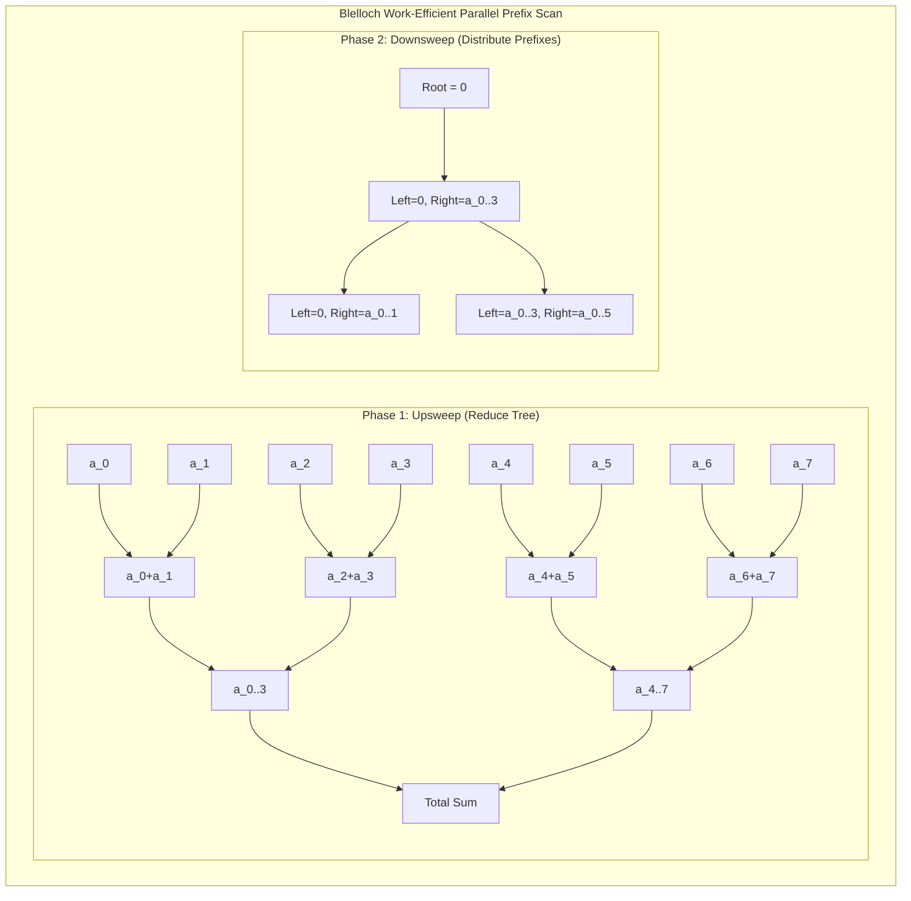

# Parallel Algorithm Basics: The Work-Depth Model & Algorithmic Primitives

## 1. Overview & Theoretical Foundations

Classical algorithm analysis relies on the sequential **Random Access Machine (RAM)** model, where operations execute strictly one after another and complexity is measured by single-threaded time $T(N)$. However, modern hardware scaling is driven almost exclusively by parallelism: multicore CPUs with tens of hardware threads, manycore GPUs with thousands of ALUs, and distributed clusters.

To analyze algorithms that exploit concurrency without being tied to specific hardware core counts, computer scientists developed the **DAG Model of Dynamic Multithreading** (also known as the **Work-Span** or **Work-Depth Model**), formulated by **Guy Blelloch, Charles Leiserson, and Robert Blumofe**.

In this model, a parallel computation is modeled as a **Directed Acyclic Graph (DAG)**:
- **Vertices**: Unit-time computational operations (instructions).
- **Directed Edges**: Dependencies between operations ($u \to v$ means $v$ cannot execute until $u$ completes).

```
   ===================================================================================
   Metric            Symbol         Definition
   ===================================================================================
   Work              T_1            Total time on 1 processor (sum of all DAG vertices)
   Span (Depth)      T_infinity     Longest directed path in the DAG (critical path)
   Parallelism       T_1 / T_inf    Maximum theoretical speedup possible with infinite cores
   Parallel Slackness T_1 / (P*T_inf) Degree to which parallelism exceeds physical cores P
   ===================================================================================
```

> [!NOTE]
> When parallel slackness $\frac{T_1}{P \cdot T_\infty} \gg 1$, a simple greedy task scheduler achieves near-linear speedup: $T_P \approx \frac{T_1}{P}$.

---

## 2. Mathematical Definition & Invariants

Let $G = (V, E)$ be the computation DAG of an algorithm on input of size $N$.

### 2.1 The Two Fundamental Laws of Parallel Execution
For any parallel execution on $P$ processors, the running time $T_P$ is strictly bounded by two physical constraints:
1. **The Work Law**:
   $$T_P \ge \frac{T_1}{P}$$
   *(A system with $P$ processors cannot perform more than $P$ units of work per unit time).*
2. **The Span Law**:
   $$T_P \ge T_\infty$$
   *(Even with an infinite number of processors, the computation cannot finish faster than the critical path dependencies).*

### 2.2 Brent’s Scheduling Theorem
In 1974, **Richard Brent** proved that any computation DAG with work $T_1$ and span $T_\infty$ can be scheduled on $P$ processors by a greedy scheduler (a scheduler that never leaves a processor idle if there is an unblocked task ready to execute) in time:
$$T_P \le \frac{T_1 - T_\infty}{P} + T_\infty \le \frac{T_1}{P} + T_\infty$$

*Proof Intuition*:
At each step of a greedy schedule, processors are either all fully occupied ($P$ tasks executed) or there are fewer than $P$ ready tasks, meaning all available ready tasks are executed and the remaining critical path length decreases by at least $1$. There can be at most $\lfloor (T_1 - T_\infty) / P \rfloor$ steps where all $P$ processors are busy, and at most $T_\infty$ steps where some processors are idle. Adding these yields Brent's bound. $\blacksquare$

### 2.3 Amdahl’s Law vs. Gustafson’s Law
- **Amdahl’s Law (Fixed-Size Speedup)**: If fraction $s = 1 - f$ of an algorithm is strictly serial, maximum speedup on $P$ processors is:
  $$S(P) = \frac{1}{(1 - f) + \frac{f}{P}} \le \frac{1}{1 - f}$$
- **Gustafson’s Law (Scaled Speedup)**: As problem size expands to fill available hardware:
  $$S(P) = P - (1 - f)(P - 1)$$

---

## 3. Structural Anatomy & Computation DAGs

```
                      PARALLEL REDUCTION TREE (Work: O(N), Span: O(log N))
                      =====================================================

   Level 0 (Leaves): [ a_0 ]   [ a_1 ]   [ a_2 ]   [ a_3 ]   [ a_4 ]   [ a_5 ]   [ a_6 ]   [ a_7 ]
                        \         /         \         /         \         /         \         /
   Level 1:              [ a_01 ]              [ a_23 ]              [ a_45 ]              [ a_67 ]
                             \                    /                      \                    /
   Level 2:                         [ a_0123 ]                                  [ a_4567 ]
                                         \                                          /
   Level 3 (Root):                                      [ Sum ]
```



---

## 4. Core Algorithmic Primitives

### 4.1 Parallel Reduction
Computes $\bigoplus_{i=0}^{N-1} A[i]$ for an associative operator $\oplus$:
- **Divide-and-Conquer**: Recursively divide the range in half, spawn parallel tasks for left and right subranges, and combine:
  $$T(N) = 2 T(N/2) + O(1) \implies \text{Work } T_1 = O(N), \quad \text{Span } T_\infty = O(\log N)$$

### 4.2 Blelloch’s Parallel Prefix Scan (Upsweep & Downsweep)
Given array $A[0 \dots N-1]$, computes exclusive prefix sums: $P[i] = \sum_{j=0}^{i-1} A[j]$ in $O(N)$ work and $O(\log N)$ span:
1. **Upsweep Phase (Reduce Tree)**:
   Build a binary sum tree bottom-up. At step $d$, for each node $i$:
   $$\text{tree}[i] \leftarrow \text{tree}[2i] + \text{tree}[2i + 1]$$
2. **Root Zeroing**: Set $\text{tree}[1] \leftarrow 0$.
3. **Downsweep Phase (Distribution Tree)**:
   Traverse top-down from root to leaves. At node $i$:
   $$\text{temp} \leftarrow \text{tree}[2i]$$
   $$\text{tree}[2i] \leftarrow \text{tree}[i]$$
   $$\text{tree}[2i + 1] \leftarrow \text{tree}[i] + \text{temp}$$
4. Copies back exact exclusive prefix sums in $O(N)$ total operations!

### 4.3 Parallel Filter (Stream Compaction / Pack)
Filters elements satisfying predicate $\mathcal{P}$:
1. **Flag Generation**: In parallel, set $flags[i] = \mathcal{P}(A[i]) ? 1 : 0$ ($O(N)$ work, $O(1)$ span).
2. **Scan**: Compute exclusive prefix sums of $flags \to offsets$ ($O(N)$ work, $O(\log N)$ span).
3. **Scatter**: In parallel, if $flags[i] == 1$, copy $A[i]$ to $out[offsets[i]]$ ($O(N)$ work, $O(1)$ span).
- **Total**: Work $O(N)$, Span $O(\log N)$.

---

## 5. Layer B: Practical Mapping to C++17 Parallel Policies

Modern C++17 integrates these parallel primitives directly into the `<numeric>` and `<algorithm>` headers under the standard execution policies:

```cpp
#include <numeric>
#include <execution>

// 1. Parallel Reduction
int64_t sum = std::reduce(std::execution::par, arr.begin(), arr.end(), 0LL);

// 2. Parallel Transform-Reduce (Fusing Map + Reduce)
int64_t dot_product = std::transform_reduce(
    std::execution::par,
    vec1.begin(), vec1.end(), vec2.begin(), 0LL,
    std::plus<int64_t>{}, std::multiplies<int64_t>{}
);

// 3. Parallel Prefix Scan
std::vector<int64_t> prefix(N);
std::inclusive_scan(std::execution::par, arr.begin(), arr.end(), prefix.begin());
```

### Execution Policies Defined
- `std::execution::seq`: Sequential execution (single thread).
- `std::execution::par`: Parallel execution across multiple threads. User code must be thread-safe (no unprotected data races).
- `std::execution::par_unseq`: Parallel and vectorized (SIMD) execution. User code must additionally not acquire locks or use thread-local storage, allowing SIMD interleaving within a thread.

> [!WARNING]
> Implementation Quality Caveat: On GCC/Clang on Linux, standard execution policies often require linking Intel Threading Building Blocks (`-ltbb`). Without proper backend support, implementations may fall back to sequential execution. Always verify runtime scalability.

---

## 6. Asymptotic Complexity Comparison

| Algorithm | Sequential Work | Parallel Work $T_1$ | Parallel Span $T_\infty$ | Theoretical Parallelism |
| :--- | :--- | :--- | :--- | :--- |
| **Map / For-Each** | $O(N)$ | $O(N)$ | $O(1)$ | $O(N)$ |
| **Reduce** | $O(N)$ | $O(N)$ | $O(\log N)$ | $O(N / \log N)$ |
| **Prefix Scan (Blelloch)** | $O(N)$ | $O(N)$ | $O(\log N)$ | $O(N / \log N)$ |
| **Filter / Pack** | $O(N)$ | $O(N)$ | $O(\log N)$ | $O(N / \log N)$ |
| **Parallel Merge Sort** | $O(N \log N)$ | $O(N \log N)$ | $O(\log^2 N)$ | $O(N / \log N)$ |

---

## 7. Common Failure Modes in Parallel Systems

1. **Grain-Size Collapse (Task Spawn Overhead)**:
   Spawning a parallel task has non-trivial overhead (~1,000 CPU cycles). Parallelizing a loop of size 10 across 10 threads runs orders of magnitude slower than sequential execution. A **coarsening threshold** (e.g., $N_{\text{cutoff}} \approx 1024$) must be enforced.
2. **False Sharing**:
   When multiple threads write to independent variables located on the **same 64-byte CPU cache line**, the hardware cache-coherence protocol constantly invalidates cache lines, destroying speedup. Fix via `alignas(64)` padding.
3. **Data Races on Shared State**:
   Accessing shared variables without synchronization or atomic operations causes undefined behavior.
4. **Non-Associative Operators in Reduction**:
   Floating-point addition is mathematically non-associative ($(a + b) + c \ne a + (b + c)$). Parallel reduction changes evaluation order and can produce slight numerical variations.

---

## 8. High-Performance C++17 Reference Implementation

The complete reference implementation is available at [`implementations/cpp/parallel_algorithm_basics.cpp`](../../implementations/cpp/parallel_algorithm_basics.cpp).

Highlights:
- Pure C++17 with `-pthread` support, zero compiler warnings under `-Wall -Wextra -Werror`.
- `ForkJoinRunner` utility enforcing grain-size coarsening thresholds to prevent scheduler overload.
- Explicit algorithmic implementations of reduction, Blelloch exclusive scan, parallel filter, and parallel merge sort.
- Randomized verification against sequential algorithms.

---

## 9. Idiomatic Python 3 Reference Implementation

The Python reference implementation is available at [`implementations/python/parallel_algorithm_basics.py`](../../implementations/python/parallel_algorithm_basics.py).

Features:
- Models the tree-level DAG transformations for reduction and Blelloch prefix scan.
- Fully verified via `unittest.TestCase` against standard library functions.

---

## 10. Testing & Verification Strategy

Concurrency testing follows Arthur's layered architecture:
1. **Layer 1: Sequential Semantic Oracle**: Every parallel primitive is compared against its standard sequential counterpart (`std::accumulate`, `std::sort`, single-threaded loop).
2. **Layer 2: Deterministic Interleaving**: Algorithmic reduction tree levels are structured deterministically.
3. **Layer 3: End-State Reconciliation**: Output counts, sums, and order are verified over arrays of size $N = 10,000$.

```cpp
// Differential verification against single-threaded oracle
int64_t expected = std::accumulate(arr.begin(), arr.end(), 0LL);
int64_t actual = parallel_reduce(arr, 0, N, 0LL, std::plus<int64_t>{}, 256);
assert(actual == expected);
```

---

## 11. Practical Trade-Offs & Anti-Patterns

### Practical Guidelines
- **Measure Before Parallelizing**: A fast sequential algorithm with good L1/L2 cache locality frequently beats a poorly parallelized algorithm with memory bus contention.
- **Prefer Parallelism at the Highest Coarse-Grained Level**: Parallelizing 10 independent requests is much simpler and faster than fine-grained parallelization within each request.

---

## 12. Comprehensive Problem Set & Extensions

1. **Parallel Matrix Multiplication**: Implement Cannon's algorithm or recursive divide-and-conquer parallel matrix multiplication with $O(N^3)$ work and $O(\log N)$ span.
2. **Work-Stealing Task Scheduler**: Build a lightweight task scheduler using thread-local deques and randomized work stealing.
3. **Parallel Radix Sort**: Implement parallel MSD radix sort using parallel histogram reductions and parallel scatter steps.
