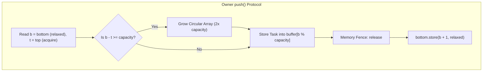
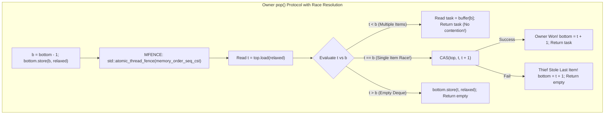
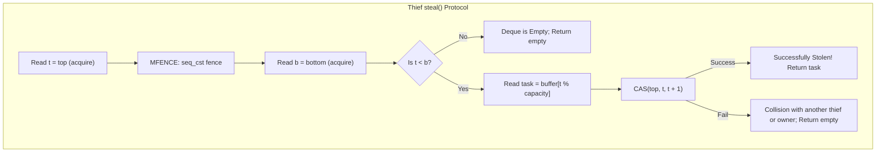

# Work-Stealing Deques: The Chase-Lev Lock-Free Deque

## 1. Overview & Theoretical Foundations

In parallel runtime schedulers—such as the Go runtime, Rust Tokio and Rayon, Java `ForkJoinPool`, Intel oneTBB, and LLVM OpenMP—thousands of fine-grained asynchronous tasks are dynamically spawned and executed across physical CPU cores.

A naive scheduler uses a single, centralized concurrent task queue protected by locks or atomic operations. Under high thread counts ($P \ge 16$), this centralized queue becomes a catastrophic scalability bottleneck: threads spend more time contending for the queue lock than executing application logic ($O(P)$ serial bottleneck).

To achieve scalable parallel execution, **Robert Blumofe and Charles Leiserson (1999)** formulated the **Work-Stealing Scheduling Paradigm**:
- Every worker thread maintains its own private task container: a **Work-Stealing Deque**.
- When a worker generates new tasks (e.g. during a recursive divide-and-conquer fork), it pushes them to the **bottom** of its own deque.
- When a worker needs work, it pops from the **bottom** of its own deque in **LIFO order** (Depth-First Search).
- When a worker exhausts its own tasks, it becomes a **thief**: it picks a random victim worker and **steals** a task from the **top** of the victim's deque in **FIFO order** (Breadth-First Search).

```
   ========================================================================================
   Operation       Target End    Accessing Thread     Ordering     Asymptotic Intuition
   ========================================================================================
   push()          Bottom        Owner Only           LIFO         Local, depth-first (cache locality)
   pop()           Bottom        Owner Only           LIFO         Local, depth-first (cache locality)
   steal()         Top           Thief Threads        FIFO         Remote, breadth-first (steals largest work)
   ========================================================================================
```

### 1.1 The Duality of Scheduling
The combination of owner LIFO and thief FIFO produces an optimal scheduling profile:
1. **LIFO for the Owner**: Exploits temporal and spatial CPU cache locality. The task pushed most recently is processed next, when its input data is still warm in the processor's L1/L2 cache.
2. **FIFO for Thieves**: In a divide-and-conquer computation DAG, tasks near the root of the tree (oldest tasks at the top of the deque) represent large subtrees of computation. Stealing from the top steals the **coarsest-grained work**, amortizing the cost of the steal and maximizing parallel slackness!

In 2005, **David Chase and Yossi Lev** published the definitive Single-Producer Multi-Consumer (SPMC) lock-free implementation: **The Chase-Lev Deque**.

---

## 2. Mathematical Definitions & Core Invariants

### 2.1 Index Space & Three Operational Regimes
The Chase-Lev deque uses a circular array of capacity $C = 2^k$ governed by two 64-bit integer indices:
- `top`: The index of the oldest task (incremented by thieves during steals).
- `bottom`: The index of the next vacant slot (incremented and decremented exclusively by the owner).

```
   Top                                                 Bottom
    |                                                    |
    v                                                    v
   [ Task 0 ]  [ Task 1 ]  [ Task 2 ]  [ Task 3 ]  [   ]   [   ]   [   ]   [   ]
   <--------- Oldest (Thieves Steal) --------- Newest (Owner Pops) --------->
```

The number of active tasks is given by the signed difference $S = bottom - top$:
1. **Regime 1: $S > 1$ (Uncontended Execution)**:
   The deque contains multiple tasks. The owner pops at $bottom$ without encountering any contention from thieves stealing at $top$.
2. **Regime 2: $S = 1$ (The Single-Item Race Window)**:
   Exactly one task remains. The owner's `pop()` and concurrent thieves' `steal()` target the exact same slot! An atomic Compare-And-Swap (CAS) on `top` deterministically resolves the race: exactly one thread succeeds, and the loser detects task exhaustion.
3. **Regime 3: $S \le 0$ (Empty Deque)**:
   The deque contains zero tasks. Both `pop()` and `steal()` return `std::nullopt`.

---

## 3. Structural Anatomy & Protocol Diagrams







---

## 4. Algorithmic Mechanics & Memory Fences

### 4.1 The StoreLoad Hazard & Sequential Consistency
The most subtle and critical aspect of the Chase-Lev algorithm is the memory barrier in owner `pop()`:

```cpp
int64_t b = bottom_.load(std::memory_order_relaxed) - 1;
bottom_.store(b, std::memory_order_relaxed);

// MANDATORY SEQUENTIAL CONSISTENCY FENCE
std::atomic_thread_fence(std::memory_order_seq_cst);

int64_t t = top_.load(std::memory_order_relaxed);
```

#### Why `std::memory_order_seq_cst` is mandatory:
On modern out-of-order processors (such as x86, ARMv8, and POWER), the hardware uses **Store Buffers**. A CPU core executing `pop()` will buffer the store to `bottom_` while speculatively executing the subsequent load of `top_`.

Without a full sequential consistency fence (`MFENCE` on x86, `DMB ISH` on ARM):
1. The owner decrements `bottom` to indicate it is claiming an item, but the update sits buffered.
2. The owner loads `top` and sees $t < b$, assuming multiple items exist.
3. Concurrently, a thief loads `top` and `bottom` (still seeing the unbuffered old `bottom`), reads the task, and executes CAS on `top`.
4. The owner also reads the task and returns it!
5. **The Bug**: The exact same task is returned to both the owner and the thief (**double execution**), corrupting the task DAG!
The `seq_cst` fence guarantees that the store to `bottom_` is globally serialized before `top_` is sampled.

---

### 4.2 Dynamic Array Resizing Without Blocking Steals
When $bottom - top \ge capacity$:
1. A new `CircularArray` is allocated with $2 \times capacity$.
2. Elements in range $[top, bottom)$ are copied from the old array to the new array.
3. The old array pointer is placed onto a retirement list (to be freed safely via EBR or after quiescence).
4. The atomic pointer `array_` is updated with `std::memory_order_release`.
5. Thieves reading `array_` with `memory_order_consume` or `acquire` safely observe either the old array or the new array, ensuring continuous lock-free progress without locks.

---

## 5. Blumofe-Leiserson Theorem & Steal Complexity

In their seminal 1999 paper *Scheduling Multithreaded Computations by Work Stealing*, Robert Blumofe and Charles Leiserson proved that randomized work stealing achieves near-optimal execution time and communication bounds:

### Theorem (Blumofe & Leiserson, 1999)
For any computation DAG with work $T_1$ (total serial execution time) and critical path span $T_\infty$, running on $P$ processors with randomized work stealing:
1. **Expected Running Time**:
   $$\mathbb{E}[T_P] \le \frac{T_1}{P} + O(T_\infty)$$
2. **Total Number of Steal Attempts**:
   The expected total number of steals across the entire execution is strictly bounded by:
   $$\mathbb{E}[\text{Total Steals}] = O(P \cdot T_\infty)$$

> [!NOTE]
> Because communication occurs *only during steals*, and the total number of steals depends only on the critical path $T_\infty$ (which is typically logarithmic, $O(\log N)$), work stealing produces negligible interconnect traffic compared to centralized schedulers!

---

## 6. Asymptotic Complexity & Comparison Matrix

| Property | Chase-Lev Deque | Centralized Mutex Queue | Michael-Scott Queue | Work-Stealing Ring |
| :--- | :--- | :--- | :--- | :--- |
| **Owner Push** | $O(1)$ amortized | $O(\text{Lock Contention})$ | $O(\text{CAS Contention})$ | $O(1)$ bounded |
| **Owner Pop** | $O(1)$ (No CAS if $S > 1$) | $O(\text{Lock Contention})$ | $O(\text{CAS Contention})$ | $O(1)$ bounded |
| **Thief Steal** | $O(1)$ uncontended | $O(\text{Lock Contention})$ | $O(\text{CAS Contention})$ | $O(1)$ uncontended |
| **Concurrency Model** | **SPMC** (Single Producer) | MPMC (Multi Producer) | MPMC (Multi Producer) | SPMC (Bounded) |
| **Contention Profile**| Local (Zero inter-core bus) | Global (Severe bus traffic)| Global (Interconnect storm)| Local |
| **Execution Order** | Owner LIFO, Thief FIFO | Strict FIFO | Strict FIFO | Owner LIFO, Thief FIFO |

---

## 7. Hardware Nuances & False Sharing Prevention

On modern multicore architectures, `top_` and `bottom_` must be physically separated into distinct CPU cache lines:

```cpp
// Cache-Line Padding prevents false sharing between Owner and Thieves
alignas(64) std::atomic<int64_t> top_{0};
alignas(64) std::atomic<int64_t> bottom_{0};
alignas(64) std::atomic<CircularArray*> array_{nullptr};
```

If `top_` and `bottom_` shared the same 64-byte L1 cache line, every local `push` or `pop` by the owner would invalidate the cache line for remote thieves, destroying throughput.

---

## 8. High-Performance C++17 Reference Implementation

The complete, production-grade reference implementation is available at [`implementations/cpp/work_stealing_deques.cpp`](../../implementations/cpp/work_stealing_deques.cpp).

Highlights:
- Pure C++17 with `-pthread` support, zero compiler warnings under `-Wall -Wextra -Werror`.
- Full Chase-Lev algorithm with dynamic power-of-two circular buffer growth.
- Cache-line padded atomic indices (`alignas(64)`).
- Realistic multi-threaded `WorkStealingScheduler` running parallel divide-and-conquer task DAGs with randomized victim selection.
- Verified single-item race test (1 owner vs. 3 thieves over 500 trials; exactly 1 winner per trial).

---

## 9. Idiomatic Python 3 Reference Implementation

The Python reference implementation is available at [`implementations/python/work_stealing_deques.py`](../../implementations/python/work_stealing_deques.py).

Features:
- Models the asymmetric synchronization: owner LIFO push/pop vs. thief FIFO steal.
- Implements buffer resizing and single-item race condition resolution.
- Includes a full `unittest.TestCase` suite verifying LIFO semantics, race resolution, and multi-threaded stress reconciliation.

---

## 10. Testing & Verification Architecture

Testing work-stealing deques requires a multi-layered verification strategy:

1. **Layer 1: Owner LIFO Sequential Semantic Oracle**:
   - Pushes 100 elements; verifies that owner `pop()` returns elements in strict reverse order ($100, 99, \dots, 1$).
2. **Layer 2: Single-Item Race Verification (Owner vs. 3 Thieves)**:
   - Sets up a deque with exactly one item.
   - Owner and 3 thief threads race concurrently across an atomic barrier.
   - Repeated for 500 consecutive trials: asserts that in every trial, **exactly one thread claims the item**, and the deque ends cleanly empty.
3. **Layer 3: Parallel Divide-and-Conquer Computation (Parallel Tree Sum)**:
   - Simulates a realistic parallel runtime.
   - Workers recursively partition a numeric range, spawning tasks onto their local deques and stealing from random victims when idle.
   - Asserts exact numerical sum ($N(N-1)/2$) and reports total work steals.
4. **Layer 4: High-Contention Stress Reconciliation**:
   - 1 owner thread pushes 30,000 items while popping periodically; 4 thief threads steal concurrently.
   - End-state reconciliation: 100% of all 30,000 items accounted for with zero duplicates and zero omissions.

---

## 11. Practical Trade-Offs & Real-World Systems Extensions

### 11.1 The Single-Producer Constraint (SPMC)
The Chase-Lev deque is strictly **Single-Producer, Multi-Consumer**:
- Only the owning worker thread is allowed to call `push()` and `pop()`.
- If an external thread or child task running on a different worker needs to spawn a task, it must either:
  1. Push to its **own** thread's deque (as implemented in our `WorkStealingScheduler::spawn()`), or
  2. Post to an external MPMC mailbox queue if submitting from an outside thread.

### 11.2 NUMA-Aware Work Stealing
In multi-socket servers (e.g. dual AMD EPYC or Intel Xeon with 128 cores), stealing across NUMA nodes incurs high latency over the interconnect (Infinity Fabric / UPI). Production schedulers (Tokio, Go runtime) employ **Hierarchical Stealing**:
1. First, attempt stealing from workers sharing the same L3 cache (CCX / Core Complex).
2. Second, attempt stealing from workers on the same NUMA socket.
3. As a last resort, steal from remote NUMA sockets.
