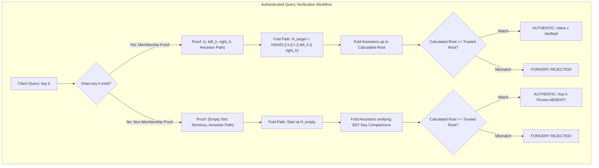

# Authenticated Data Structures: Verifiable Outsourced Storage & Non-Membership Proofs

## 1. Overview & Theoretical Foundations

In cloud computing, distributed databases, and blockchain protocols, data owners frequently outsource storage and query execution to untrusted third-party servers. While standard cryptographic hashes protect static files, outsourced databases require dynamic query capabilities—such as key-value lookups, range scans, and absence queries—without sacrificing security.

In 2000–2004, **Moni Naor, Kobbi Nissim, Michael Martel, and Roberto Tamassia** formalized the field of **Authenticated Data Structures (ADS)**.

### 1.1 The Three-Party Outsourced Storage Model

```
   +----------------------+                     +---------------------------+
   | Data Owner (Source)  |                     | Untrusted Directory/Server|
   | - Holds Private Data |                     | - Stores Full ADS Tree    |
   | - Computes Root Hash |                     | - Answers Queries         |
   | - Signs Digest Sigma |                     | - Generates Proofs Pi     |
   +----------------------+                     +---------------------------+
              |                                               |
       Signed | Digest                                Answer  | + Proof Pi
              v                                               v
   +------------------------------------------------------------------------+
   | Client (Verifier)                                                      |
   | - Holds ONLY Signed Root Digest                                        |
   | - Verifies Pi: Guarantees Authenticity, Soundness, and Completeness!   |
   +------------------------------------------------------------------------+
```

### 1.2 Limitations of Basic Merkle Trees vs. ADS
Standard Merkle trees operate exclusively on **positional array indices** ($i$-th element is $x$). They cannot efficiently solve dictionary queries:
- **Absence Queries**: How can a server prove that key `"user_bob"` does **NOT** exist in the database?
- **Range Queries**: How can a server prove that $\{k_1, k_2, k_3\}$ are **ALL** the keys in range $[100, 200]$, and no items were maliciously omitted?
- **Dynamic Dictionaries**: How can we support $O(\log N)$ key-based insertions and deletions with verifiable subtree digest updates?

Authenticated Data Structures solve these challenges by embedding cryptographic hash commitments directly into hierarchical search structures (such as Binary Search Trees, Treaps, Skip Lists, and Patricia Tries).

---

## 2. Mathematical Definitions, Security Model & Core Invariants

### 2.1 The ADS Security Triad
Let $\mathcal{D}$ be a dataset committed by trusted digest $\mathcal{H}_{\text{root}}$. For any query $\mathcal{Q}$, the untrusted server returns answer $\mathcal{A}$ and cryptographic proof (witness) $\Pi$. The verification algorithm $Verify(\mathcal{H}_{\text{root}}, \mathcal{Q}, \mathcal{A}, \Pi) \in \{\text{true}, \text{false}\}$ must satisfy:
1. **Authenticity**: If $\mathcal{A}$ is the true answer to $\mathcal{Q}$ on $\mathcal{D}$, an honest prover can generate $\Pi$ such that $Verify = \text{true}$.
2. **Soundness**: For any polynomial-time adversarial server, the probability of generating a valid proof $\Pi^*$ for an incorrect answer $\mathcal{A}^* \ne \mathcal{A}$ is negligible:
   $$\Pr\left[Verify(\mathcal{H}_{\text{root}}, \mathcal{Q}, \mathcal{A}^*, \Pi^*) = \text{true}\right] \le \text{negl}(\lambda)$$
3. **Completeness**: If $\mathcal{Q}$ is a range or set query, the server cannot omit any valid element without causing verification to fail.

### 2.2 Domain Separation Invariant (Prefix `0x02`)
To prevent cross-protocol collision attacks, node digests in the Authenticated Search Tree use explicit domain separation:
$$H_{\text{empty}} = H(\text{"ADS\_EMPTY\_NODE"})$$
$$H_{\text{node}}(k, v, H_L, H_R) = H(0\text{x}02 \parallel \text{len}(k) \parallel k \parallel \text{len}(v) \parallel v \parallel H_L \parallel H_R)$$

---

## 3. Structural Anatomy & Topology Diagrams

### 3.1 Authenticated Merkle Treap
An Authenticated Treap combines the binary search tree property on **keys** with the heap property on **randomized priorities**, guaranteeing logarithmic height $O(\log N)$ with high probability while accumulating cryptographic digests:

```
                           [ Key: "cherry", Val: "3.00" ]
                                Subtree Hash: H_root
                               /                    \
              [ "banana", "0.75" ]               [ "elderberry", "8.10" ]
                  Subtree: H_L                       Subtree: H_R
                  /          \                       /            \
             [ "apple" ]    EMPTY               [ "date" ]       EMPTY
```

Every node's digest commits to its own key-value pair and the cryptographic digests of both its left and right subtrees.



---

## 4. Algorithmic Mechanics

### 4.1 Authenticated Membership Proofs ($O(\log N)$)
To prove that key $K$ exists with value $V$:
1. **Search**: Traverse from the root to node $K$.
2. **Witness Generation**:
   - Collect the target node's own child subtree digests: $target\_left\_hash$ and $target\_right\_hash$.
   - For each ancestor $A$ on the path from root to $K$, record $(A.key, A.val, \text{went\_right}, sibling\_subtree\_hash)$.
3. **Verification**:
   - The verifier computes the target node's hash:
     $$H_{\text{target}} = H_{\text{node}}(K, V, target\_left\_hash, target\_right\_hash)$$
   - The verifier folds up the ancestor trail in reverse order:
     $$\text{If went\_right: } H_{\text{parent}} = H_{\text{node}}(A.key, A.val, sibling\_hash, H_{\text{current}})$$
     $$\text{If went\_left: } H_{\text{parent}} = H_{\text{node}}(A.key, A.val, H_{\text{current}}, sibling\_hash)$$
   - Verifier confirms that $H_{\text{parent}} == \mathcal{H}_{\text{root}}$.

---

### 4.2 Cryptographic Non-Membership Proofs ($O(\log N)$)
Proving that an element is **absent** from a dataset without revealing the entire dataset is a foundational primitive in zero-knowledge and verifiable computing.

In an Authenticated Search Tree, keys are sorted. When searching for absent key $K^*$:
1. The search path descends according to binary search comparisons ($<$ or $>$).
2. Because $K^*$ is absent, the search terminates at an empty child pointer (`nullptr`).
3. **The Non-Membership Witness**:
   - The prover outputs the sequence of ancestor nodes along the search path down to the empty slot, along with the sibling subtree hashes.
4. **Verification Protocol**:
   - The verifier checks that the ancestor search path strictly obeyed the BST ordering invariant for $K^*$:
     $$\forall \text{ step } i: \quad (\text{went\_right} \implies K^* > A_i.key) \land (\neg \text{went\_right} \implies K^* < A_i.key)$$
   - The verifier initializes $H_{\text{current}} = H_{\text{empty}}$.
   - The verifier folds $H_{\text{current}}$ up through the ancestor trail to compute the root.
   - If the computed root matches $\mathcal{H}_{\text{root}}$, then by collision resistance, **key $K^*$ cannot possibly exist in the tree**!

---

### 4.3 Authenticated Range Queries (Completeness Proofs)
To query all keys in range $[L, R]$:
1. The server identifies all nodes whose keys fall within $[L, R]$.
2. The server provides:
   - The set of matching key-value pairs: $\mathcal{S} = \{(k_1, v_1), \dots, (k_m, v_m)\}$.
   - The **Boundary Proofs**: A non-membership proof for $L$ (or immediate predecessor $k_{\text{pred}} < L$) and a non-membership proof for $R$ (or immediate successor $k_{\text{succ}} > R$).
3. **Completeness Verification**:
   - The boundary proofs guarantee that no elements exist in $(k_{\text{pred}}, L)$ or $(R, k_{\text{succ}})$.
   - All internal nodes in the subtree spanning $[L, R]$ are fully accounted for, proving that the server did not omit a single matching record.

---

## 5. Security Analysis & Cryptographic Forgery Rejection

| Attack Vector | Adversarial Goal | ADS Cryptographic Defense |
| :--- | :--- | :--- |
| **Value Forgery** | Server claims account balance is $\$50,000$ instead of $\$500$. | Modifying $V$ alters $H_{\text{target}}$. Folding up path fails to produce trusted root $\mathcal{H}_{\text{root}}$ ($P_{\text{forge}} \le 2^{-256}$). |
| **Absence Forgery** | Server claims existing key does NOT exist. | Prover cannot reach an empty terminus without deviating from BST order. Path verification rejects inconsistent comparisons. |
| **Omission Attack** | Server omits an embarrassing record from range query $[L, R]$. | Completeness proof bounds range between immediate predecessor and successor; missing subtree alters hash digest. |
| **Replay Attack** | Server returns an authentic proof from last week's state. | Verifier checks proof against the **current, freshly signed root digest** $\mathcal{H}_{\text{root}}$. |

---

## 6. Asymptotic Complexity & Comparison Matrix

| Authenticated Structure | Lookup Proof Size | Non-Membership Proof | Range Query Proof | Dynamic Update | Storage Overhead |
| :--- | :--- | :--- | :--- | :--- | :--- |
| **Basic Merkle Tree** | $O(\log N)$ | $\mathbf{O(N)}$ (Impossible) | $O(M \log N)$ | $O(\log N)$ | $O(N)$ hashes |
| **Authenticated Treap / BST** | $O(\log N)$ | **$O(\log N)$** | $O(M + \log N)$ | $O(\log N)$ | $O(N)$ hashes |
| **Sparse Merkle Tree (SMT)** | 256 hashes | 256 hashes | $O(M \cdot 256)$ | 256 hashes | $O(N \log U)$ |
| **Merkle Patricia Trie (MPT)** | $O(K)$ nibbles | $O(K)$ nibbles | Complex | $O(K)$ | $O(N \cdot K)$ |
| **Vector Commitment (KZG)**| **$O(1)$** (1 group elem) | Complex | $O(1)$ | $O(N)$ or $O(\sqrt{N})$ | Trusted Setup |

---

## 7. High-Performance C++17 Reference Implementation

The complete, zero-warning reference implementation is available at [`implementations/cpp/authenticated_data_structures.cpp`](../../implementations/cpp/authenticated_data_structures.cpp).

Key Highlights:
- **Self-Contained FIPS 180-4 SHA-256 Engine**: Zero external dependencies.
- **`AuthenticatedTreap`**: Balanced randomized search tree accumulating subtree hashes with domain separation prefix $0\text{x}02$.
- **`prove_membership` & `verify_membership`**: Logarithmic proof generation and verification.
- **`prove_non_membership` & `verify_non_membership`**: Cryptographic absence proofs with BST comparison invariant validation.
- **Tampering Resistance Suite**: Explicitly asserts rejection of forged values and forged non-membership claims.

---

## 8. Idiomatic Python 3 Reference Implementation

The Python reference implementation is available at [`implementations/python/authenticated_data_structures.py`](../../implementations/python/authenticated_data_structures.py).

Features:
- Pure Python 3 using standard library `hashlib.sha256`.
- Identical domain-separated serialization format (`0x02 || len(k) || k || len(v) || v || left_h || right_h`).
- Comprehensive `unittest.TestCase` suite testing membership, non-membership, and forgery rejection.

---

## 9. Testing & Verification Architecture

Testing ADS requires a 4-layer verification strategy:

1. **Layer 1: Authenticated Membership Verification**:
   - Inserts key-value pairs; verifies that every key generates a valid proof verifying against the root.
2. **Layer 2: Cryptographic Non-Membership Verification**:
   - Queries absent keys; asserts that non-membership proofs verify successfully against the root.
3. **Layer 3: Cryptographic Forgery Rejection**:
   - **Value Tampering**: Modifying the proven value from $\$500$ to $\$50,000$ strictly fails verification.
   - **Absence Tampering**: Attempting to claim that an existing key is absent strictly fails verification.
4. **Layer 4: Scalability & Stress Verification ($N = 500$)**:
   - Inserts 500 even keys ($k_0, k_2, k_4, \dots$); verifies that all 500 even keys prove membership, and all 500 odd keys ($k_1, k_3, k_5, \dots$) prove non-membership with 100% precision.

---

## 10. Real-World Systems Engineering

### 10.1 Ethereum Merkle Patricia Trie (MPT)
The Ethereum Virtual Machine (EVM) uses a modified Merkle Patricia Trie to authenticate the entire blockchain state:
- Every account's nonce, balance, storage root, and code hash is stored in the **State Trie**.
- Smart contract execution produces a single 32-byte `stateRoot` committed in the block header.
- Light clients verify account balances and smart contract storage slots via MPT Merkle proofs without running an archival node.

### 10.2 DNSSEC & NSEC3 (Authenticated DNS Absence)
In the Domain Name System Security Extensions (DNSSEC):
- When a client queries a non-existent domain (e.g. `bad.example.com`), the DNS server cannot sign a negative answer on the fly without holding the zone's private key online.
- Instead, **NSEC3** records provide authenticated non-membership proofs by signing the cryptographic hashes of existing domain names in sorted order, proving that no record exists between two hashes.

### 10.3 Zero-Knowledge Rollups
In zk-SNARK rollups (Starknet, zkSync, Scroll):
- Layer-2 operators maintain an authenticated dictionary of user balances.
- State updates and non-membership proofs are verified inside a zk-SNARK circuit in $O(\log N)$ arithmetic constraints, allowing thousands of transactions to be settled on Ethereum in a single transaction.

---

## 11. Practical Trade-Offs & Anti-Patterns

### 11.1 Re-Hashing Overhead on Balancing Rotations
In standard AVL or Red-Black trees, a single insertion can trigger cascading rotations. In an authenticated tree, **every rotation requires re-hashing all rotated nodes**:
- Each tree rotation incurs multiple SHA-256 evaluations ($64$ compression rounds per hash).
- **The Treap Advantage**: Treaps use randomized priorities, which perform significantly fewer rotations on average ($O(1)$ expected rotations per insertion) than AVL trees, minimizing hashing overhead.

### 11.2 SMT vs. Authenticated Treap
- **Sparse Merkle Tree (SMT)**: Fixed 256-level depth. Simple circuit representation for ZK-proofs, but requires 256 hash evaluations per lookup.
- **Authenticated Treap**: Variable logarithmic depth ($\approx 1.44 \log_2 N$). Highly compact proofs ($10$ hashes for $1,000$ items instead of $256$), optimal for user-space client verification.

---

## 12. Comprehensive Problem Set & Systems Extensions

1. **Authenticated B-Tree for Disk Storage**: Design an authenticated $B^+$-Tree where internal nodes store child page hashes, optimized for SSD block reads.
2. **Persistent Authenticated State Trie**: Implement copy-on-write persistence for an authenticated dictionary to support instantaneous state rollbacks.
3. **Verifiable Secret Sharing with ADS**: Combine authenticated search trees with polynomial commitments to authenticate private shares.
