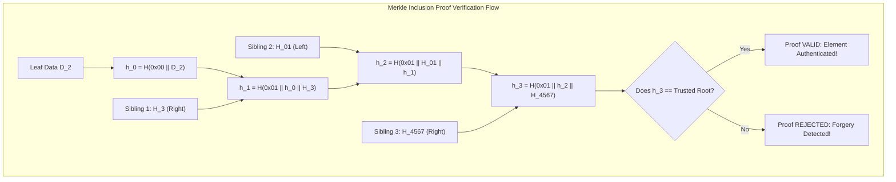

# Merkle Trees: Cryptographic Hash Trees & Audit Proofs

## 1. Overview & Theoretical Foundations

In distributed systems, untrusted networks, and cryptographic ledgers, participants must frequently verify that a specific data item belongs to a large dataset without downloading, storing, or re-hashing the entire dataset.

In 1979, **Ralph C. Merkle** invented the **Cryptographic Hash Tree** (now known as the **Merkle Tree**), described in his patent and landmark paper *A Certified Digital Signature*.

A Merkle tree is a hierarchical data structure where:
1. Every **leaf node** is labeled with the cryptographic hash of a data block.
2. Every **internal node** is labeled with the cryptographic hash of the concatenated labels of its child nodes:
   $$\text{Hash}_{\text{parent}} = H(\text{Hash}_{\text{left}} \parallel \text{Hash}_{\text{right}})$$
3. The single hash at the top of the tree is the **Merkle Root**.

```
                           [ Merkle Root ]
                               /      \
                   [ Node 01 ]          [ Node 23 ]
                    /       \            /       \
               [ Leaf 0 ]  [ Leaf 1 ] [ Leaf 2 ]  [ Leaf 3 ]
                  |           |          |           |
               Data D_0    Data D_1   Data D_2    Data D_3
```

### 1.1 The Merkle Commitment Paradigm
The Merkle Root acts as a constant-size (e.g. 32-byte for SHA-256), collision-resistant **cryptographic commitment** to the entire dataset:
- **Tamper Evidence**: If even a single bit in any leaf data block is modified, the change propagates up the hash chain, drastically altering the Merkle Root due to the cryptographic **avalanche effect**.
- **Logarithmic Proofs**: A prover can demonstrate that leaf $D_k$ belongs to the committed dataset by providing only $\lceil \log_2 N \rceil$ sibling hashes (the **Merkle Inclusion Proof** or **Audit Path**).
- **Zero-Trust Verification**: A verifier holding only the 32-byte Merkle Root can verify the authenticity of $D_k$ in $O(\log N)$ hash operations without possessing or trusting any other data in the tree.

---

## 2. Mathematical Definitions & Core Invariants

### 2.1 Cryptographic Hash Function Assumptions
A cryptographic hash function $H: \{0, 1\}^* \to \{0, 1\}^b$ provides three core security properties:
1. **Preimage Resistance (One-Wayness)**: Given hash $h$, it is computationally infeasible to find message $m$ such that $H(m) = h$ ($O(2^b)$ complexity).
2. **Second-Preimage Resistance**: Given message $m_1$, it is computationally infeasible to find $m_2 \ne m_1$ such that $H(m_1) = H(m_2)$ ($O(2^b)$ complexity).
3. **Collision Resistance**: It is computationally infeasible to find any pair $m_1 \ne m_2$ such that $H(m_1) = H(m_2)$ ($O(2^{b/2})$ complexity via the Birthday Paradox).

### 2.2 Domain Separation Invariant (RFC 6962 Standard)
A naive Merkle tree hashes leaves as $H(data)$ and internal nodes as $H(left \parallel right)$. This naive construction is vulnerable to a dangerous **Second-Preimage Attack**: an attacker can submit an internal node's 64-byte payload $(H_L \parallel H_R)$ as a fake leaf data item!

To prevent cross-level ambiguity, the **RFC 6962 (Certificate Transparency)** standard mandates **Domain Separation Prefixes**:
- **Leaf Hash**:
  $$H_{\text{leaf}}(D) = H(0\text{x}00 \parallel D)$$
- **Internal Node Hash**:
  $$H_{\text{node}}(L, R) = H(0\text{x}01 \parallel L \parallel R)$$

> [!IMPORTANT]
> The single byte prefix ensures that the preimage of an internal node can *never* collide with the preimage of a leaf node, mathematically eliminating structural second-preimage attacks.

### 2.3 The Inclusion Invariant
For a leaf $D_k$ and its associated authentication path $\mathcal{P} = \{(S_1, \text{dir}_1), (S_2, \text{dir}_2), \dots, (S_h, \text{dir}_h)\}$:
$$\text{Fold}(\mathcal{P}, H_{\text{leaf}}(D_k)) \equiv \text{Merkle Root}$$
If $H$ is collision-resistant, constructing a valid proof for data $D^* \ne D_k$ requires finding a hash collision in $H$, which is computationally impossible for SHA-256.

---

## 3. Structural Anatomy & Proof Topologies

### 3.1 Anatomy of a Merkle Inclusion Proof (Audit Path)
Consider an 8-leaf Merkle Tree where we wish to prove that **Leaf 2** ($D_2$) is in the tree:

```
                                  [ Root ]
                                  /      \
                     [ H_0123 ]              [ H_4567 ] (Sibling 3: Right)
                      /      \
          (Sibling 2) [ H_01 ]  [ H_23 ]
                                /     \
                    (Target) [ H_2 ]  [ H_3 ] (Sibling 1: Right)
                                |
                             Data D_2
```

To verify $D_2$, the verifier requires only:
1. The target data $D_2$.
2. **Sibling 1**: $H_3$ (Right).
3. **Sibling 2**: $H_{01}$ (Left).
4. **Sibling 3**: $H_{4567}$ (Right).

The verifier computes:
1. $h_0 = H(0\text{x}00 \parallel D_2) = H_2$
2. $h_1 = H(0\text{x}01 \parallel h_0 \parallel H_3) = H_{23}$
3. $h_2 = H(0\text{x}01 \parallel H_{01} \parallel h_1) = H_{0123}$
4. $h_3 = H(0\text{x}01 \parallel h_2 \parallel H_{4567}) = \text{Root}$
If $h_3 == \text{Root}$, the proof is cryptographically sound!



---

## 4. Algorithmic Mechanics

### 4.1 Tree Construction ($O(N)$)
1. Hash each leaf data string using domain prefix $0\text{x}00$: $level_0[i] = H(0\text{x}00 \parallel D_i)$.
2. Iteratively reduce adjacent pairs bottom-up:
   $$level_{k+1}[j] = H(0\text{x}01 \parallel level_k[2j] \parallel level_k[2j + 1])$$
3. **Odd Node Handling**: If a level has an odd number of nodes $2m + 1$, the canonical RFC 6962 behavior duplicates the final node (or carries it over) to form a balanced pair:
   $$level_{k+1}[m] = H(0\text{x}01 \parallel level_k[2m] \parallel level_k[2m])$$
4. The loop terminates when a level contains exactly 1 node (the root). Total hash invocations: $2N - 1 = O(N)$.

### 4.2 Proof Generation ($O(\log N)$)
Given leaf index $k$:
1. At level $l$, determine whether node $k$ is a left or right child: $\text{is\_right} = (k \pmod 2 == 1)$.
2. If right child, sibling is $level_l[k - 1]$ with direction `Left`.
3. If left child, sibling is $level_l[k + 1]$ (or duplicate $level_l[k]$ if odd) with direction `Right`.
4. Update $k \leftarrow \lfloor k / 2 \rfloor$ and repeat until root level.
5. Returns $\lceil \log_2 N \rceil$ sibling hashes and direction bits.

### 4.3 Dynamic Point Updates ($O(\log N)$)
When a leaf value is updated (e.g. account balance change in a state trie):
1. Re-hash the leaf at $level_0[k]$.
2. Recalculate only the direct ancestor nodes along the path to the root:
   $$parent = \lfloor k / 2 \rfloor$$
3. Re-hash the parent using its left and right children.
4. Ascend to root in exactly $\lceil \log_2 N \rceil$ hash operations.

---

## 5. Security Analysis & Attack Vectors

| Attack Vector | Vulnerability Description | Mitigation |
| :--- | :--- | :--- |
| **Second-Preimage Attack** | Attacker presents internal node payload $(H_L \parallel H_R)$ as a fake leaf data block. | **RFC 6962 Domain Separation** ($0\text{x}00$ leaf vs $0\text{x}01$ node prefixes). |
| **Bit-Flipping / Forgery** | Attacker modifies 1 bit in transaction data or sibling hash. | Cryptographic collision resistance; verification fails with probability $1 - 2^{-256}$. |
| **Path Direction Swapping** | Attacker inverts sibling evaluation order to manipulate intermediate hashes. | Proof explicitly binds directional flags (`is_left`) into the hash evaluation sequence. |
| **Odd-Node Replay Attack**| Maliciously exploiting odd-node duplicate hashing to forge proofs of duplicate items. | Enforce tree size $N$ commitments alongside the Merkle Root. |

---

## 6. Asymptotic Complexity & Performance Profile

| Operation | Time Complexity | Space Complexity | Hash Evaluations |
| :--- | :--- | :--- | :--- |
| **Build Tree** | $O(N)$ | $O(N)$ | $2N - 1$ |
| **Generate Inclusion Proof** | $O(\log N)$ | $O(\log N)$ | $0$ (Precomputed) |
| **Verify Inclusion Proof** | $O(\log N)$ | $O(1)$ | $\lceil \log_2 N \rceil$ |
| **Update Leaf** | $O(\log N)$ | $O(1)$ | $\lceil \log_2 N \rceil$ |
| **Merkle Root Size** | $O(1)$ | 32 bytes | Fixed |

### Cryptographic Hash Function Selection Matrix
- **SHA-256**: Universal standard (Bitcoin, Certificate Transparency, Git). Hardware accelerated on modern x86 (`SHA-NI`) and ARMv8 (`Crypto`).
- **BLAKE3**: Extremely fast tree-hashing primitive on CPU/SIMD (~7x faster than SHA-256).
- **Keccak-256**: Ethereum EVM standard.
- **Poseidon / Rescue**: Algebraic hash functions optimized for Zero-Knowledge Proofs (ZK-SNARKs / ZK-STARKs) over prime fields.

---

## 7. High-Performance C++17 Reference Implementation

The complete, zero-warning reference implementation is available at [`implementations/cpp/merkle_trees.cpp`](../../implementations/cpp/merkle_trees.cpp).

Key Highlights:
- **Self-Contained SHA-256 Engine**: FIPS 180-4 compliant cryptographic engine with zero external dependencies (no OpenSSL required).
- **RFC 6962 Domain Separation**: Enforces $0\text{x}00$ leaf and $0\text{x}01$ internal node prefixes.
- **Arbitrary Size Handling**: Seamlessly supports power-of-two and odd leaf counts.
- **Tampering Resistance Suite**: Verifies failure against data manipulation, sibling bit-flips, and inverted proof directions.
- **Dynamic Leaf Updates**: Demonstrates $O(\log N)$ ancestor path recalculation.

---

## 8. Idiomatic Python 3 Reference Implementation

The Python reference implementation is available at [`implementations/python/merkle_trees.py`](../../implementations/python/merkle_trees.py).

Features:
- Direct integration with `hashlib.sha256`.
- Deterministic cross-language compatibility (exact 32-byte digest match with C++).
- Full `unittest.TestCase` suite verifying inclusion proofs, odd tree sizes, and forgery rejection.

---

## 9. Testing & Verification Architecture

Testing Merkle Trees follows a 5-layer cryptographic verification strategy:

1. **Layer 1: Deterministic Root & Cross-Language Consistency**:
   - Asserts exact hex digest match between C++ and Python on canonical test vectors (`["alice", "bob", "carol", "dave"]` $\to$ `559c8e726262e509065de92d8ad3a30878b49d00517d530f873457fa550a7fa7`).
2. **Layer 2: Power-of-Two Inclusion Proofs**:
   - Validates that every leaf in an $N = 8$ tree generates a proof of length $\log_2 8 = 3$ that verifies against the root.
3. **Layer 3: Arbitrary & Odd Count Proofs**:
   - Validates proof generation and verification across non-power-of-two sizes ($N \in \{1, 3, 5, 7, 13, 31\}$).
4. **Layer 4: Cryptographic Tampering Resistance**:
   - Forged leaf data: asserts `verify_inclusion_proof()` returns `false`.
   - Single-bit flipped sibling: asserts verification returns `false`.
   - Inverted sibling direction: asserts verification returns `false`.
5. **Layer 5: Dynamic State Transitions**:
   - Modifies a leaf in place; asserts old proof fails against the new root while the updated proof succeeds.

---

## 10. Real-World Systems Engineering

### 10.1 Git Version Control
Git stores repository history as a Merkle Directed Acyclic Graph (DAG):
- Blobs (file contents) are hashed with a header: `H("blob " || size || \0 || content)`.
- Trees (directories) hash lists of mode, name, and child blob/tree hashes.
- Commits hash tree root, author, timestamp, and parent commit hashes.
- Changing any past line of code alters every subsequent commit hash in the repository!

### 10.2 Certificate Transparency (RFC 6962)
Web browsers require SSL/TLS certificates to be logged in public append-only Merkle tree logs:
- **Audit Proof**: Proves a domain certificate is published in the public log.
- **Consistency Proof**: Proves that the log operator has never deleted, modified, or reordered historical certificates between log versions.

### 10.3 Blockchain Light Clients (SPV)
In Bitcoin (BIP 37) and Ethereum:
- Mobile wallets cannot store the 500+ GB blockchain.
- Light clients store only the 80-byte block headers (which contain the Merkle Root of transactions).
- To confirm a payment, the merchant provides a 1 KB Merkle Inclusion Proof, allowing the client to verify the transaction in milliseconds.

---

## 11. Practical Trade-Offs & Anti-Patterns

### 11.1 Flat Array vs. Pointer-Based Layout
- **Pointer-Based Node Allocations**: Allocating `Node*` on the heap causes cache misses and memory fragmentation.
- **Flat Contiguous Vector Layout**: In production, Merkle trees should be stored as contiguous arrays (like binary heaps: parent at $i/2$, left child at $2i$, right child at $2i+1$).

### 11.2 Sparse Merkle Trees (SMT)
For key-value stores with $2^{256}$ keys (e.g. Ethereum state trie), building a physical tree is impossible:
- A **Sparse Merkle Tree** initializes all empty leaves to a shared default zero-hash.
- Non-empty leaves are inserted into their key's bit-path.
- Enables efficient **Non-Membership Proofs**: proving that a key does NOT exist by showing an audit path terminating in the zero-hash!

---

## 12. Comprehensive Problem Set & Systems Extensions

1. **RFC 6962 Consistency Proofs**: Implement `generate_consistency_proof(m)` and `verify_consistency_proof(old_root, new_root, m, n)` to prove append-only log integrity.
2. **Merkle Mountain Ranges (MMR)**: Implement an append-only collection of perfect Merkle trees that allows efficient logarithmic appending without re-hashing historical leaves.
3. **ZK-Friendly Merkle Tree**: Implement a Merkle tree utilizing the Poseidon hash function over the BN254 prime field for Groth16 / Plonk SNARK membership verification.
