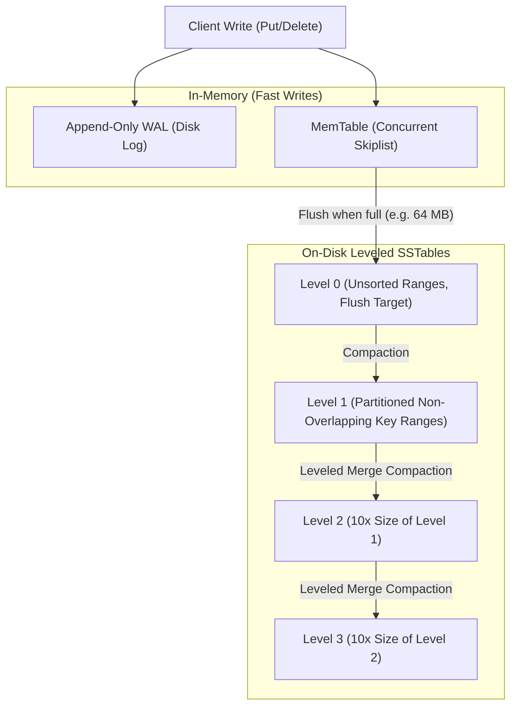

# Storage Engine Breakdown: LSM-Trees, B-Trees & Bitcask

## 1. Overview & Theoretical Foundations

At the heart of every modern database, key-value store, and file system lies a **Storage Engine**—the software subsystem responsible for organizing, indexing, reading, and persisting data on non-volatile hardware.

The design of storage engines is governed by physical hardware realities:
- **Mechanical Disks (HDD)**: Sequential I/O (~150 MB/s) is 100x faster than random I/O (~1.5 MB/s) due to mechanical head seek latency (~5–10 ms).
- **Solid-State Drives (NAND Flash SSD)**: Random reads are fast, but random in-place overwrites are impossible. Data must be written in pages (4–16 KB) and erased in large blocks (2–8 MB). Frequent random overwrites trigger internal **Garbage Collection (Flash Translation Layer)** and degrade flash endurance.
- **Main Memory (DRAM)**: Nanosecond access latency, but volatile and expensive per gigabyte.

### 1.1 The RUM Conjecture (Athanassoulis et al., Harvard DASlab)
In 2016, researchers formalized the fundamental trade-off space of database access methods as the **RUM Conjecture**:
> When designing a storage access method, you can set an upper bound on at most **two** of the three core overheads: **Read Overhead (R)**, **Update Overhead (U)**, or **Memory Overhead (M)**. Optimizing two fundamentally forces trade-offs on the third.

```
                                  [ READ (R) ]
                                 /            \
                                /              \
                   B+ Trees    /                \   Fractured Mirrors
                  (Low R, M)  /                  \  (Low R, U)
                             /                    \
                            /                      \
              [ UPDATE (U) ] ---------------------- [ MEMORY (M) ]
                                   LSM-Trees
                                   Bitcask
                                  (Low U, R)
```

This chapter provides a rigorous architectural breakdown of the **Three Canonical Storage Engine Archetypes**:
1. **Bitcask (Log-Structured Hash Index)**: Optimized for maximum write throughput and single-seek point reads by maintaining an in-memory hash index over an append-only log.
2. **$B^+$-Tree / Page-Based Engines (InnoDB, SQLite)**: Optimized for point reads and range scans via slotted pages and buffer pool caching with in-place updates.
3. **Log-Structured Merge-Tree (LSM-Tree) (RocksDB, LevelDB)**: Optimized for write-heavy workloads by converting random updates into sequential log flushes and background compaction.

---

## 2. Mathematical Definitions & Amplification Metrics

To objectively evaluate storage engines, computer scientists analyze three foundational amplification factors:

### 2.1 Write Amplification Factor (WAF)
$$\text{WAF} = \frac{\text{Total Bytes Written to Physical Storage}}{\text{Total Logical Payload Bytes Written by User}}$$
- A perfect streaming log achieves $\text{WAF} \approx 1.0$.
- In a $B$-tree, modifying a 20-byte record forces the engine to flush a full 16 KB page to disk, yielding $\text{WAF} = 16384 / 20 \approx 819\times$!
- In an LSM-tree, writing to the WAL + MemTable flush + multiple levels of compaction produces typical $\text{WAF} \approx 10\times - 30\times$.

### 2.2 Read Amplification Factor (RAF)
$$\text{RAF} = \frac{\text{Total Bytes Read from Physical Storage}}{\text{Total Logical Payload Bytes Requested by User}}$$
- In a $B$-tree, an uncontended point lookup requires $\lceil \log_B N \rceil$ page reads (usually 3–4 reads, almost entirely cached in DRAM), yielding $\text{RAF} \approx 1.0$ (logical).
- In an unoptimized LSM-tree, a point lookup for a missing key may inspect the MemTable, $L_0$, and every level down to $L_k$, yielding high RAF unless mitigated by Bloom filters.

### 2.3 Space Amplification Factor (SAF)
$$\text{SAF} = \frac{\text{Total Physical Disk Space Occupied}}{\text{Total Logical Size of Current Valid Data}}$$
- Measures storage waste from stale versions, deleted tombstones, and internal page fragmentation.
- $\text{SAF} = 1.0$ indicates zero overhead. $B$-trees typically exhibit $\text{SAF} \approx 1.33 - 1.5$ due to page fill factors (50–67%). LSM-trees can temporarily reach $\text{SAF} \approx 2.0$ during major compaction.

---

## 3. Structural Anatomy & Layout Diagrams

### 3.1 Bitcask Architecture (Riak Bitcask)
Bitcask pairs an append-only on-disk log with an in-memory hash table (**KeyDir**):

```
   IN-MEMORY KEYDIR (RAM)                  ON-DISK APPEND-ONLY DATA LOG
   +----------+-----------------------+    +-----------------------------------------------+
   | Key      | FileID, Offset, Size  |    | Record 0: [Header][k="user_1"][v="Alice"]     |
   +----------+-----------------------+    +-----------------------------------------------+
   | "user_1" | (0, 0, 5)             |    | Record 1: [Header][k="user_2"][v="Bob"]       |
   | "user_2" | (0, 48, 3)            |    +-----------------------------------------------+
   | "user_3" | (0, 92, 7)            |    | Record 2: [Header][k="user_3"][v="Charlie"]   |
   +----------+-----------------------+    +-----------------------------------------------+
```

- **Write**: Append record to disk log; update pointer in `KeyDir`. Exactly $0$ disk seeks!
- **Read**: Look up key in `KeyDir`; execute exactly $1$ direct disk seek to `Offset`.

---

### 3.2 $B^+$-Tree Slotted-Page Layout (MySQL InnoDB / SQLite)
To store variable-length records on fixed-size physical pages (typically 4 KB or 16 KB) without fragmentation, engines employ the **Slotted-Page Architecture**:

```
   0                                                                            4096
   +-------------+---------+---------+-------------------+------------+------------+
   | Page Header | Slot 0  | Slot 1  |  Free Space Area  | Record 1   | Record 0   |
   | (Metadata)  | (Off,L) | (Off,L) | (Unallocated gap) | (Cell Pay) | (Cell Pay) |
   +-------------+---------+---------+-------------------+------------+------------+
   <--- Slots Grow Downward --->                         <--- Records Grow Upward --->
```

- **Slot Array**: Stores 4-byte slot entries `(offset, length)` growing downward from the header.
- **Record Cells**: Variable-length key-value payloads growing upward from the end of the page.
- **Compaction**: When deleted records leave fragmented holes, the page can be defragmented internally in RAM without affecting page pointers.

---

### 3.3 LSM-Tree Architecture (RocksDB / LevelDB)



---

## 4. Deep Architectural Breakdown of the Three Paradigms

### 4.1 Bitcask: The Log-Structured Hash Engine
- **Core Strengths**:
  - **Maximum Write Speed**: All writes are purely sequential streaming appends. No seek overhead on HDD, no block erase penalties on SSD. $\text{WAF} \approx 1.0$.
  - **Predictable $O(1)$ Read Latency**: Point lookups execute exactly $1$ disk seek directly to the offset stored in `KeyDir`.
  - **Crash Recovery**: If the system crashes, the in-memory `KeyDir` is reconstructed by scanning the append-only log from beginning to end.
- **Fatal Limitations**:
  - **RAM Exhaustion**: Every single key in the database **must fit in RAM** inside `KeyDir`. If the database contains 1 billion keys, storing 32 bytes per key requires 32 GB of RAM regardless of dataset value size.
  - **No Range Queries**: Hash tables do not preserve key ordering. Range queries (`scan(A, Z)`) require scanning the entire dataset.
- **Compaction**:
  - When updates and tombstones accumulate, background merge processes read old data files and write only the latest version of each live key into new data files, discarding obsolete versions.

---

### 4.2 $B^+$-Tree: The Page-Based In-Place Engine
- **Core Strengths**:
  - **Optimal Read Latency**: Height of a $B^+$-tree with branching factor $B \approx 500$ is rarely more than $3$ or $4$. Root and internal levels reside permanently in the buffer pool, so point lookups require at most 1 physical read.
  - **Native Range Scans**: Leaf pages are linked in a doubly-linked list. Range scans scan contiguous memory pages with prefetching.
- **The In-Place Update Dilemma**:
  - To update a record, the engine must load the 16 KB page into the buffer pool, modify the bytes in place, write a Write-Ahead Log (WAL) record for crash recovery, and subsequently flush the dirty 16 KB page to disk.
  - **Random Write Degradation**: If random writes modify records scattered across 10,000 distinct pages, the storage engine must perform 10,000 random page flushes, saturating disk I/O and destroying flash endurance.

---

### 4.3 LSM-Tree: The Log-Structured Merge Engine
- **Core Strengths**:
  - **High Write Throughput**: Writes are immediately appended to an in-memory MemTable (Skiplist or RB-Tree) and an append-only WAL. Writes complete with zero random disk seeks.
  - **Sequential Disk Flushing**: When the MemTable reaches its threshold (e.g. 64 MB), it is frozen into an immutable MemTable and flushed to disk as a Sorted String Table (**SSTable**).
- **Overcoming Read Overhead**:
  - Because keys are scattered across multiple SSTable levels, naive point lookups would suffer high RAF.
  - **Mitigation 1 (Bloom Filters)**: Every SSTable contains a Bloom filter in memory. If the filter returns negative, the engine skips the SSTable entirely without issuing a disk read ($O(1)$ check).
  - **Mitigation 2 (Sparse Block Index)**: Each SSTable stores a block index (e.g. 1 index entry per 4 KB data block). The engine binary-searches the sparse index in RAM to locate the exact 4 KB block.
- **Compaction Strategies**:
  - **Leveled Compaction (LCS)**: Each level $L_k$ has non-overlapping key ranges and is 10x larger than $L_{k-1}$. When $L_k$ overflows, SSTables are merged into $L_{k+1}$. Guarantees low SAF ($\approx 1.1 - 1.2$) and fast reads.
  - **Size-Tiered Compaction (STCS)**: Merges SSTables of similar sizes. Lower WAF during writes, but higher SAF (can require up to 50% temporary free disk space).

---

## 5. Concurrency Control & MVCC Integration

Modern storage engines support Multi-Version Concurrency Control (MVCC) to allow non-blocking concurrent readers and writers:

| Engine | Concurrency Model | MVCC Implementation | Deletion Strategy |
| :--- | :--- | :--- | :--- |
| **Bitcask** | Single-writer / Multi-reader | Monotonic timestamps in record header | Append tombstone record; reclaimed during merge |
| **InnoDB ($B^+$-Tree)**| Multi-writer via row locks + latching | Undo logs & rollback segments; old versions reconstructed | Soft delete flag; physically purged by background purge thread |
| **RocksDB (LSM)** | Single-writer MemTable / Multi-reader | Sequence numbers ($\text{SeqNum}$); reads filter by $\text{SeqNum} \le \text{Snapshot}$ | Append tombstone marker; purged during level compaction |

---

## 6. Asymptotic Complexity & Comparison Matrix

| Property | Bitcask | $B^+$-Tree (InnoDB) | LSM-Tree (RocksDB) |
| :--- | :--- | :--- | :--- |
| **Point Write Cost** | $O(1)$ sequential append | $O(\log_B N)$ random page I/O | $O(1)$ amortized append |
| **Point Read Cost** | $O(1)$ (1 disk seek) | $O(\log_B N)$ (1 page read) | $O(\text{Levels})$ (mitigated by Bloom filters) |
| **Range Scan Cost** | $O(N)$ (Unordered) | $O(\log_B N + K/B)$ (Optimal) | $O(\text{Levels} \cdot \log K)$ (Merge iterator) |
| **Empirical WAF** | **$\approx 1.0 - 1.5\times$** | **$\approx 30 - 100\times$** | **$\approx 10 - 30\times$** |
| **Empirical RAF** | $1$ seek | $1$ page read | $1 - 3$ block reads |
| **Empirical SAF** | High until compaction | Moderate ($\approx 1.33$) | Low to Moderate ($\approx 1.1 - 2.0$) |
| **RAM Footprint** | $O(N)$ (All keys in RAM) | $O(\text{Buffer Pool})$ | $O(\text{MemTable} + \text{Filters})$ |
| **Best Workload** | High-throughput write/read KV | Read-heavy, OLTP, range scans | Write-heavy, time-series, log ingestion |

---

## 7. Failure Modes & Production Pathologies

1. **LSM Compaction Debt & Write Stalls**:
   If the incoming write rate exceeds the background I/O bandwidth available for compaction, $L_0$ SSTables accumulate. RocksDB deliberately throttles (stalls) incoming client writes to prevent read performance collapse.
2. **$B^+$-Tree Buffer Pool Thrashing**:
   When working set size exceeds the buffer pool DRAM capacity, random writes cause continuous eviction and re-reading of dirty pages, collapsing throughput into disk I/O thrashing.
3. **Bitcask Out-Of-Memory (OOM)**:
   Because every key must reside in RAM, sudden surges in unique key cardinality cause the engine to run out of memory, crashing the daemon.

---

## 8. High-Performance C++17 Reference Implementation

The complete, zero-warning reference implementation is available at [`implementations/cpp/storage_engines_breakdown.cpp`](../../implementations/cpp/storage_engines_breakdown.cpp).

Key Highlights:
- **`BitcaskEngine`**: Append-only log file simulator with in-memory `KeyDir`, tombstone deletions, and garbage compaction.
- **`BTreePageEngine`**: Physical 4096-byte slotted-page layout with slot arrays and cell payloads, modeling physical page dirty flushes.
- **`LSMTinyEngine`**: Complete LSM pipeline with MemTable, immutable SSTable flushes, and leveled compaction.
- **Empirical WAF Benchmark**: Verifies that under identical random write workloads, $B$-Tree slotted pages incur $\text{WAF} > 80\times$, whereas Bitcask achieves $\text{WAF} \approx 1.3\times$.

---

## 9. Idiomatic Python 3 Reference Implementation

The Python reference implementation is available at [`implementations/python/storage_engines_breakdown.py`](../../implementations/python/storage_engines_breakdown.py).

Features:
- Models byte-level binary record serialization and slotted page offsets.
- Implements Bitcask, BTreePageEngine, and LSMTinyEngine.
- Full `unittest.TestCase` suite verifying CRUD semantics, compaction, and the RUM conjecture WAF inequality.

---

## 10. Testing & Verification Architecture

Testing storage engine archetypes requires multi-layered verification:

1. **Layer 1: CRUD Semantics & Version Updates**:
   - Puts, updates, and deletes verified across all three engines.
   - Ensures overwritten keys return the newest value.
2. **Layer 2: Tombstone Lifecycle & Compaction**:
   - Asserts deleted keys return `std::nullopt`.
   - Asserts compaction physically reclaims disk space while preserving active keys.
3. **Layer 3: Empirical WAF Measurement**:
   - Executes identical random write workloads ($N = 200$).
   - Calculates exact ratio of disk bytes written vs payload bytes:
     $$\text{WAF}_{\text{BTree}} \gg \text{WAF}_{\text{LSM}} > \text{WAF}_{\text{Bitcask}}$$
4. **Layer 4: Slotted-Page Boundary & Integrity**:
   - Verifies slot count and free space tracking as pages fill up.

---

## 11. Real-World Systems Case Studies

### 11.1 RocksDB (Meta) & Pebble (CockroachDB)
- Designed for server-class SSDs.
- Employs Leveled Compaction, concurrent MemTables, and prefix Bloom filters.
- Powers CockroachDB, TiKV, Kafka Streams, and MySQL MyRocks.

### 11.2 MySQL InnoDB
- Classic $B^+$-Tree engine with 16 KB pages.
- Uses the **Doublewrite Buffer** to prevent torn pages on power failure.
- ARIES logging protocol with redo log (write-ahead) and undo log (rollback/MVCC).

### 11.3 WiredTiger (MongoDB)
- Hybrid architecture: Uses $B$-trees for in-memory indexing, but writes out-of-place compressed checkpoints to disk to avoid random in-place page write amplification.

---

## 12. Comprehensive Problem Set & Systems Extensions

1. **Dynamic Write-Stall Controller**: Implement an auto-throttling rate limiter for an LSM-tree that smoothly scales back client write bandwidth when $L_0$ SSTable count exceeds threshold.
2. **Copy-on-Write (CoW) B-Tree**: Implement an append-only $B$-tree (LMDB / ZFS style) that updates pages by writing modified copies to new disk blocks without overwriting in place.
3. **Learned Index Storage Engine**: Replace traditional B-tree internal page search with a Recursive Model Index (RMI) approximating cumulative distribution functions (CDF).
