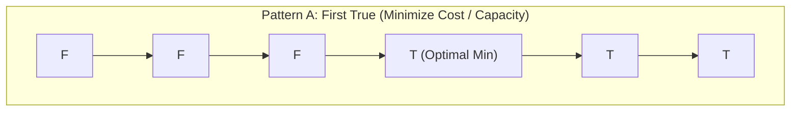
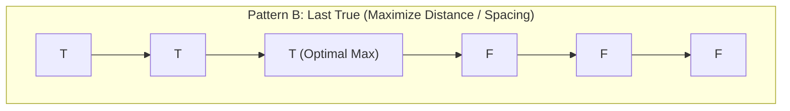

# Binary Search on Answer

> [!NOTE]
> **Binary Search on Answer** transforms difficult global optimization problems into a series of simpler boolean decision queries. Instead of searching across indices in an existing sorted collection, we binary search across the **ordered solution space** $[\text{low}, \text{high}]$ using a monotonic feasibility predicate $P(x) \in \{\text{False}, \text{True}\}$.
>
> Reference implementations: [C++17 Implementation](../../implementations/cpp/binary_search_on_answer.cpp) | [Python Implementation](../../implementations/python/binary_search_on_answer.py)

> [!TIP]
> **The Four Core Archetypes:**
> - **Capacity Allocation (First True):** Minimum container capacity to partition an array into $\le k$ valid segments (e.g., Split Array Largest Sum, Ship Packages in $D$ Days).
> - **Rate and Speed (First True):** Minimum rate required to complete work within a deadline using ceiling arithmetic $\lceil p / k \rceil = (p + k - 1) / k$ (e.g., Koko Eating Bananas).
> - **Maximize Minimum Spacing (Last True):** Maximizing the closest separation when placing $k$ objects (e.g., Aggressive Cows, Router Placement).
> - **Value-Space Rank Counting (First True):** Finding the $k$-th smallest value across implicit grids or unions by counting elements $\le x$ (e.g., K-th Smallest in Sorted Matrix).

> [!WARNING]
> **Cardinal Rules of Binary Search Engineering:**
> 1. **Midpoint Bias to Prevent Infinite Loops:**
>    - **First True ($FFFFTTTT$):** Use downward-biased midpoint `mid = low + (high - low) / 2`.
>    - **Last True ($TTTTFFFF$):** Use upward-biased midpoint `mid = low + (high - low + 1) / 2`. Without `+ 1`, an interval of length 2 where `low` is feasible will set `low = mid`, creating an infinite loop.
> 2. **Overflow-Safe Midpoint:** Never compute `(low + high) / 2` with 32-bit signed integers when search bounds can sum past $2^{31} - 1$.
> 3. **Search Space Enclosure:** The true optimal answer MUST strictly reside inside $[\text{low}, \text{high}]$. Never guess arbitrarily tight bounds without mathematical justification.

Binary search is often introduced as a method for finding a target in a sorted array.

But a much more powerful pattern is:

> binary search over the answer itself

This technique applies when:

- the answer lies in an ordered search space
- we can test whether a candidate answer is feasible
- feasibility changes monotonically as the candidate changes

This is called **binary search on answer**, and it is one of the most reusable problem-solving patterns in algorithm design.

It appears in many classical problems, including:

- split array largest sum
- painter's partition
- ship packages within D days
- Koko eating bananas
- minimum speed to arrive on time
- aggressive cows
- placing routers
- median and k-th order queries on value space
- many optimization problems with greedy or arithmetic feasibility checks

This chapter develops:

- the monotonic feasibility paradigm
- integer and continuous binary search templates
- greedy feasibility checkers
- value-space and answer-space search
- correctness intuition
- engineering traps such as off-by-one errors and bad search bounds

---

## 1. From searching data to searching answers

Classical binary search asks:

> Is this target value in the sorted array?

Binary search on answer asks a different question:

> Is this candidate answer large enough, small enough, or feasible?

This changes the perspective.

We are no longer searching positions in an existing sorted container.

Instead, we search an **ordered solution space**.

That is the key conceptual shift.

---

## 2. The monotonic feasibility paradigm





Suppose we define a boolean predicate:

$$
P(x) \in \{\text{False}, \text{True}\}
$$

where $ x $ is a candidate answer.

Suppose we define a boolean predicate:

$$
P(x) \in \{\text{False}, \text{True}\}
$$

where $ x $ is a candidate answer.

Binary search on answer works when $ P(x) $ is **monotonic**.

Typical forms are:

### False then True
```text
F F F F T T T T
```

meaning:
- small values are not feasible
- large enough values are feasible

Then we usually want the **first True**.

### True then False
```text
T T T T F F F F
```

meaning:
- small values are feasible
- large values fail

Then we usually want the **last True**.

This monotonic boundary is what binary search finds.

---

## 3. Why optimization becomes decision

Many optimization problems ask for:

- the minimum feasible value
- or the maximum feasible value

Instead of solving that directly, we ask a yes-no decision question:

- “Can we do it with capacity $ x $?”
- “Can we finish at speed $ x $?”
- “Can we place elements at distance at least $ x $?”

If this yes-no question is monotonic, we can binary search the answer.

This is the central technique of the chapter.

---

## 4. Identifying the answer space

The answer space may be:

- an integer interval
- a continuous real interval
- a value range rather than an index range

Examples:

- capacity from `max(a)` to `sum(a)`
- speed from 1 to `max(pile)`
- distance from 0 to `max_position - min_position`
- real-valued answer in an interval like $[0, 10^9]$

The first design step is always:

> What ordered range can contain the answer?

---

## 5. Integer binary search: first True template

A very common goal is:

> Find the minimum integer $ x $ such that $ P(x) = \text{True} $

This corresponds to the pattern:

```text
F F F F T T T T
```

We maintain an interval `[low, high]` that is guaranteed to contain the answer.

Then:

- compute `mid`
- if `P(mid)` is true, keep the left half including `mid`
- otherwise keep the right half excluding `mid`

This converges to the first feasible value.

---

## 6. Safe midpoint calculation

In integer binary search, use:

$$
mid = low + \frac{high - low}{2}
$$

instead of:

$$
\frac{low + high}{2}
$$

The first form avoids overflow in languages with fixed-width integers.

This is a standard engineering precaution.

---

## 7. C++17 integer binary search template for first True

```cpp
long long first_true(long long low, long long high, auto feasible) {
    while (low < high) {
        long long mid = low + (high - low) / 2;
        if (feasible(mid)) {
            high = mid;
        } else {
            low = mid + 1;
        }
    }
    return low;
}
```

This assumes:

- the answer exists
- `feasible(x)` is monotonic
- some value in `[low, high]` is true

---

## 8. Python integer binary search template for first True

```python
def first_true(low, high, feasible):
    while low < high:
        mid = low + (high - low) // 2
        if feasible(mid):
            high = mid
        else:
            low = mid + 1
    return low
```

---

## 9. Integer binary search: last True template

Sometimes the predicate has form:

```text
T T T T F F F F
```

and we want the **maximum feasible** value.

Then we search for the last True.

A common implementation uses an upward-biased midpoint.

---

## 10. C++17 integer binary search template for last True

```cpp
long long last_true(long long low, long long high, auto feasible) {
    while (low < high) {
        long long mid = low + (high - low + 1) / 2;
        if (feasible(mid)) {
            low = mid;
        } else {
            high = mid - 1;
        }
    }
    return low;
}
```

The `+1` in the midpoint is important to avoid infinite loops on size-2 intervals.

---

## 11. Python integer binary search template for last True

```python
def last_true(low, high, feasible):
    while low < high:
        mid = low + (high - low + 1) // 2
        if feasible(mid):
            low = mid
        else:
            high = mid - 1
    return low
```

---

## 12. Continuous binary search

Sometimes the answer is real-valued rather than integer.

Examples:

- geometric optimization
- maximum average constraints
- root finding in monotonic settings
- precision-based search problems

Then we binary search over a real interval.

Because real numbers do not terminate naturally like integers, we usually stop by:

- fixed iteration count
- or epsilon threshold

---

## 13. Fixed iterations versus epsilon stopping

| Search Type | Search Domain | Termination Condition | Optimal Answer Guarantee | Notes |
|---|---|---|---|---|
| **Integer First True** | $[\text{low}, \text{high}] \subset \mathbb{Z}$ | `low == high` | Exact integer boundary | Downward bias `(high - low) / 2` |
| **Integer Last True** | $[\text{low}, \text{high}] \subset \mathbb{Z}$ | `low == high` | Exact integer boundary | Upward bias `(high - low + 1) / 2` |
| **Continuous Real Search** | $[\text{low}, \text{high}] \subset \mathbb{R}$ | Fixed iterations ($60 \dots 100$) | Absolute error $\le \frac{\text{high} - \text{low}}{2^{N}}$ | Immune to floating-point epsilon traps |
| **Epsilon Threshold Search**| $[\text{low}, \text{high}] \subset \mathbb{R}$ | `high - low < epsilon` | Within user tolerance $\varepsilon$ | Can stall if $\varepsilon$ is smaller than machine precision |

### Fixed iterations
Run, for example, 60 to 100 iterations. After 80 iterations, the search interval shrinks by a factor of $2^{80} \approx 1.2 \times 10^{24}$, guaranteeing sub-nanometer precision for any physical domain.

### Epsilon stopping
Stop when:

$$
high - low < \varepsilon
$$

This is intuitive, but may be slightly less predictable in some floating-point settings if $\varepsilon$ approaches `DBL_EPSILON`.

### Fixed iterations
Run, for example, 60 to 100 iterations.

This is common and reliable when bounds are known.

### Epsilon stopping
Stop when:

$$
high - low < \varepsilon
$$

This is intuitive, but may be slightly less predictable in some floating-point settings.

Both methods are valid.

For competitive and systems-style coding, fixed iterations are often simpler.

---

## 14. Python continuous binary search template

```python
def binary_search_real(low, high, feasible, iterations=80):
    for _ in range(iterations):
        mid = (low + high) / 2.0
        if feasible(mid):
            high = mid
        else:
            low = mid
    return high
```

This template assumes we are searching for the first feasible real value.

---

## 15. Capacity allocation archetype

A major class of problems asks:

> What is the minimum capacity so that a sequence can be partitioned or processed within some limit?

Examples include:

- Split Array Largest Sum
- Painter's Partition
- Ship Packages Within D Days

These problems often share the same pattern:

- answer = capacity
- check capacity greedily
- binary search the minimum feasible capacity

---

## 16. Split Array Largest Sum

### Problem
Split an array into at most $ k $ nonempty contiguous parts so that the largest part sum is minimized.

### Answer-space insight
If the maximum allowed part sum is $ x $, can we split the array into at most $ k $ parts with each part sum at most $ x $?

That yes-no question is monotonic.

If capacity $ x $ works, then any larger capacity also works.

So we binary search the minimum feasible $ x $.

---

## 17. Search bounds for split-array style problems

If all numbers are nonnegative, then:

### Lower bound
No segment can have sum below the largest element:

$$
low = \max(a)
$$

### Upper bound
One segment containing everything always works:

$$
high = \sum a
$$

These are the standard search bounds.

---

## 18. Greedy feasibility checker for split-array style problems

To test whether capacity $ x $ works:

- scan left to right
- keep adding elements to the current segment
- if adding the next element would exceed $ x $, start a new segment
- count how many segments are needed

If the number of segments is at most $ k $, then $ x $ is feasible.

This greedy check is optimal because delaying a split as long as possible minimizes the number of segments.

---

## 19. C++17 Split Array Largest Sum

```cpp
#include <vector>
#include <numeric>
#include <algorithm>

long long split_array_largest_sum(const std::vector<int>& a, int k) {
    auto feasible = [&](long long cap) -> bool {
        int parts = 1;
        long long cur = 0;

        for (int x : a) {
            if (cur + x <= cap) {
                cur += x;
            } else {
                ++parts;
                cur = x;
            }
        }

        return parts <= k;
    };

    long long low = *std::max_element(a.begin(), a.end());
    long long high = std::accumulate(a.begin(), a.end(), 0LL);

    while (low < high) {
        long long mid = low + (high - low) / 2;
        if (feasible(mid)) {
            high = mid;
        } else {
            low = mid + 1;
        }
    }

    return low;
}
```

---

## 20. Python Split Array Largest Sum

```python
def split_array_largest_sum(a, k):
    def feasible(cap):
        parts = 1
        cur = 0
        for x in a:
            if cur + x <= cap:
                cur += x
            else:
                parts += 1
                cur = x
        return parts <= k

    low = max(a)
    high = sum(a)

    while low < high:
        mid = low + (high - low) // 2
        if feasible(mid):
            high = mid
        else:
            low = mid + 1

    return low
```

---

## 21. Ship Packages Within D Days

This is the same capacity-allocation pattern.

### Problem
Ship packages in order within $ D $ days using the minimum ship capacity.

### Predicate
Can capacity $ x $ ship all packages within $ D $ days?

The checker is exactly the same greedy structure as split array:

- fill as much as possible each day
- start a new day when the next package would exceed capacity

This is a good example of pattern transfer.

---

## 22. Koko Eating Bananas

This is another classic binary-search-on-answer problem.

### Problem
Koko eats bananas at speed $ k $ bananas per hour.
What is the minimum integer speed needed to finish within $ h $ hours?

### Monotonicity
If speed $ k $ is enough, then any larger speed is also enough.

So again we want the first True.

---

## 23. Ceiling-division arithmetic

For one pile of size $ p $, the hours needed at speed $ k $ are:

$$
\left\lceil \frac{p}{k} \right\rceil
$$

A common integer formula is:

$$
\left\lceil \frac{p}{k} \right\rceil = \frac{p + k - 1}{k}
$$

using integer division.

This pattern appears constantly in speed and rate problems.

---

## 24. C++17 Koko Eating Bananas

```cpp
#include <vector>
#include <algorithm>

int min_eating_speed(const std::vector<int>& piles, int h) {
    auto feasible = [&](int k) -> bool {
        long long hours = 0;
        for (int p : piles) {
            hours += (p + k - 1) / k;
        }
        return hours <= h;
    };

    int low = 1;
    int high = *std::max_element(piles.begin(), piles.end());

    while (low < high) {
        int mid = low + (high - low) / 2;
        if (feasible(mid)) {
            high = mid;
        } else {
            low = mid + 1;
        }
    }

    return low;
}
```

---

## 25. Python Koko Eating Bananas

```python
def min_eating_speed(piles, h):
    def feasible(k):
        hours = 0
        for p in piles:
            hours += (p + k - 1) // k
        return hours <= h

    low = 1
    high = max(piles)

    while low < high:
        mid = low + (high - low) // 2
        if feasible(mid):
            high = mid
        else:
            low = mid + 1

    return low
```

---

## 26. Minimum speed to arrive on time

This is another rate problem with similar structure.

### Pattern
- answer = speed
- checker = compute total time at that speed
- monotonicity = larger speed never hurts

Such problems often combine:

- ceiling arithmetic for all but the last segment
- floating-point handling for the last part
- careful bounds

This is a useful reminder that binary search on answer often depends more on the checker than on the search itself.

---

## 27. Aggressive Cows and maximize minimum distance

A different but very important pattern is:

> maximize a minimum

### Problem
Place $ k $ cows in sorted stalls so that the minimum distance between any two cows is as large as possible.

### Predicate
Can we place $ k $ cows with pairwise distance at least $ d $?

This predicate is monotonic in the opposite direction:

- if distance $ d $ is feasible, then any smaller distance is also feasible

So this is a **last True** problem.

---

## 28. Greedy placement checker for aggressive cows

To test whether distance $ d $ works:

- place the first cow in the first stall
- greedily place each next cow in the earliest stall at least $ d $ away from the last placed cow
- count how many cows can be placed

If at least $ k $ cows can be placed, then $ d $ is feasible.

This greedy rule is optimal because placing earlier leaves more room for later cows.

---

## 29. C++17 Aggressive Cows

```cpp
#include <vector>
#include <algorithm>

int aggressive_cows(std::vector<int> pos, int k) {
    std::sort(pos.begin(), pos.end());

    auto feasible = [&](int dist) -> bool {
        int used = 1;
        int last = pos[0];

        for (int i = 1; i < static_cast<int>(pos.size()); ++i) {
            if (pos[i] - last >= dist) {
                ++used;
                last = pos[i];
            }
        }

        return used >= k;
    };

    int low = 0;
    int high = pos.back() - pos.front();

    while (low < high) {
        int mid = low + (high - low + 1) / 2;
        if (feasible(mid)) {
            low = mid;
        } else {
            high = mid - 1;
        }
    }

    return low;
}
```

---

## 30. Python Aggressive Cows

```python
def aggressive_cows(pos, k):
    pos = sorted(pos)

    def feasible(dist):
        used = 1
        last = pos[0]
        for x in pos[1:]:
            if x - last >= dist:
                used += 1
                last = x
        return used >= k

    low = 0
    high = pos[-1] - pos[0]

    while low < high:
        mid = low + (high - low + 1) // 2
        if feasible(mid):
            low = mid
        else:
            high = mid - 1

    return low
```

---

## 31. Binary search on value space

Not all answer searches are on “capacity” or “speed”.

Sometimes we binary search over a **value domain**.

Examples:

- median of two sorted arrays
- k-th smallest element in a sorted matrix
- threshold values satisfying a rank condition

Here the checker often counts:

> How many elements are $\le x$?

If the count is large enough, then $ x $ may be high enough to contain the desired rank.

This is still binary search on answer.

---

## 32. K-th smallest element in a sorted matrix

Suppose each row and column is sorted.

We can binary search the value $ x $.

### Predicate idea
Count how many matrix elements satisfy:

$$
value \le x
$$

If that count is at least $ k $, then the k-th smallest value is at most $ x $.

So again we have a first-True pattern.

The search domain is the value interval:

- low = minimum matrix value
- high = maximum matrix value

---

## 33. Rank-based monotonicity

If:

$$
count(x) = \#\{a_i \le x\}
$$

then `count(x)` is nondecreasing in $ x $.

So the predicate:

$$
count(x) \ge k
$$

is monotonic.

This makes value-space binary search possible.

This is a useful general pattern beyond matrices.

---

## 34. Median of two sorted arrays note

The optimal $ O(\log \min(n,m)) $ algorithm for median of two sorted arrays is usually presented as a partition-based binary search, not a simple value-space search.

But conceptually it still uses the same idea:

- ordered search space
- monotonic partition condition
- binary search for the smallest valid partition

So it belongs naturally near this chapter, even though the implementation is more specialized.

---

## 35. Designing a feasibility checker

The hardest part of binary search on answer is usually not the search loop.

It is designing the checker.

A good checker should be:

- correct
- monotonic
- efficient

Very often the target complexity is:

$$
O(n \log(\text{range}))
$$

which comes from:

- $ O(n) $ feasibility check
- times $ O(\log(\text{range})) $ binary search iterations

---

## 36. Proving monotonicity

Before binary searching, ask:

> If $ x $ is feasible, what happens to larger or smaller values?

Typical possibilities:

### Minimum feasible problem
If $ x $ works, then every $ x' > x $ also works.

### Maximum feasible problem
If $ x $ works, then every $ x' < x $ also works.

If you cannot justify one of these monotonic behaviors, binary search on answer may not apply.

This proof step is essential.

---

## 37. Why greedy checkers often appear

Many answer-space search problems use a greedy checker because the checker itself is a constrained optimization or packing question.

Examples:

- minimum number of partitions under capacity $ x $
- maximum cows placed under spacing $ d $
- total time needed at speed $ k $

Greedy works well when local earliest-placement or maximal-fill decisions preserve feasibility.

So binary search on answer and greedy methods often appear together.

---

## 38. Search-space bounds matter

Binary search is only correct if the true answer lies inside the chosen interval.

Bad bounds can break the method.

### Common mistakes
- choosing `high` too small so the answer is excluded
- ignoring negative values or zero
- using loose but invalid bounds
- forgetting special-case impossibility

Good binary search begins with good bounds.

---

## 39. Off-by-one errors and infinite loops

These are extremely common.

### Problem case
Suppose `low = 5` and `high = 6`.

If you search for last True but use the lower midpoint:

$$
mid = 5
$$

and then set `low = mid`, the interval does not shrink.

This creates an infinite loop.

That is why:

- first True uses downward midpoint
- last True uses upward midpoint

This detail is essential.

---

## 40. Closed intervals and invariant thinking

A good way to avoid mistakes is to think in invariants.

For example, when searching for first True in `[low, high]`, maintain:

- the answer is in `[low, high]`
- `high` is always feasible, or at least the answer boundary remains inside

Then every update should preserve that statement.

Binary search becomes much clearer when you reason with invariants rather than memorizing code.

---

## 41. Continuous search example intuition

Suppose we want the smallest real $ x $ such that a monotone function $ f(x) \ge 0 $.

If $ f $ is monotonic, then the sign change gives a boundary.

Binary search repeatedly shrinks the interval until the uncertainty is small enough.

This is the real-valued analogue of first True search.

---

## 42. Common implementation checklist

Before coding, ask:

1. What exactly is the answer?
2. What is the candidate search interval?
3. Is the predicate first-True or last-True?
4. How do I prove monotonicity?
5. What is the feasibility checker?
6. What is the checker complexity?
7. Are bounds definitely valid?
8. Am I using the correct midpoint bias?

This checklist prevents many errors.

---

## 43. Comparison table

| Problem type | Search domain | Predicate pattern | Typical checker |
|---|---|---|---|
| Split array / shipping / painting | capacity | first True | greedy segment counting |
| Koko / speed problems | speed | first True | arithmetic total-time calculation |
| Aggressive cows / router placement | distance | last True | greedy placement |
| K-th smallest by value | value range | first True | count of values ≤ x |
| Continuous precision search | real interval | first True or sign boundary | monotone function or feasibility test |

---

## 44. Proof intuition summary

Binary search on answer works because:

1. the answer lies in an ordered space
2. the feasibility predicate changes monotonically
3. binary search locates the boundary between feasible and infeasible regions

The search loop itself is simple.

The real reasoning work is:

- designing the predicate
- proving monotonicity
- choosing safe bounds

That is the heart of the technique.

---

## 45. Summary

Binary search on answer transforms optimization problems into monotonic decision problems.

The main pattern is:

- define an ordered answer space
- write a feasibility predicate $ P(x) $
- prove that $ P(x) $ is monotonic
- binary search the boundary

This technique is especially powerful for:

- minimum feasible capacity
- minimum feasible speed
- maximum feasible spacing
- rank and threshold problems
- continuous precision search

The most important practical lessons are:

- understand whether you need first True or last True
- choose valid search bounds
- design a linear or near-linear checker
- handle midpoint bias correctly
- reason with invariants to avoid off-by-one bugs

Binary search on answer is one of the most useful bridges between greedy reasoning, arithmetic reasoning, and optimization.

---

## 46. Practice prompts

1. What is the difference between classical binary search and binary search on answer?
2. What does a monotonic predicate look like?
3. When do we search for first True, and when for last True?
4. Why does split array largest sum use bounds `max(a)` and `sum(a)`?
5. Why does Koko Eating Bananas use ceiling division?
6. Why is aggressive cows a last-True problem?
7. What makes a feasibility checker suitable for binary search on answer?
8. Why must search bounds contain the true answer?
9. Why can the wrong midpoint formula cause an infinite loop?
10. Why is proving monotonicity more important than memorizing the loop?

---

## 47. Suggested next topics

A natural continuation after binary search on answer is:

- interval scheduling
- sweep line
- greedy exchange arguments
- parametric search
- more advanced order-statistics and selection problems
