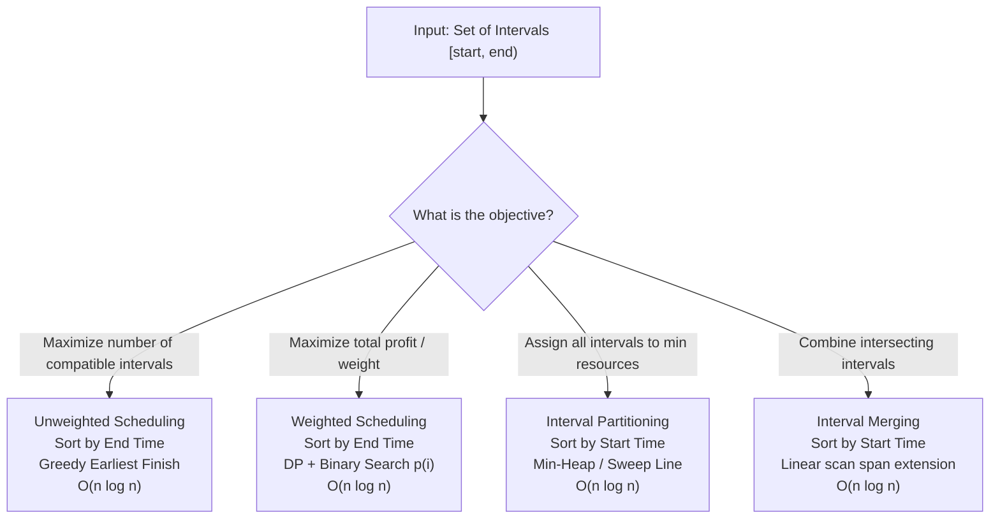
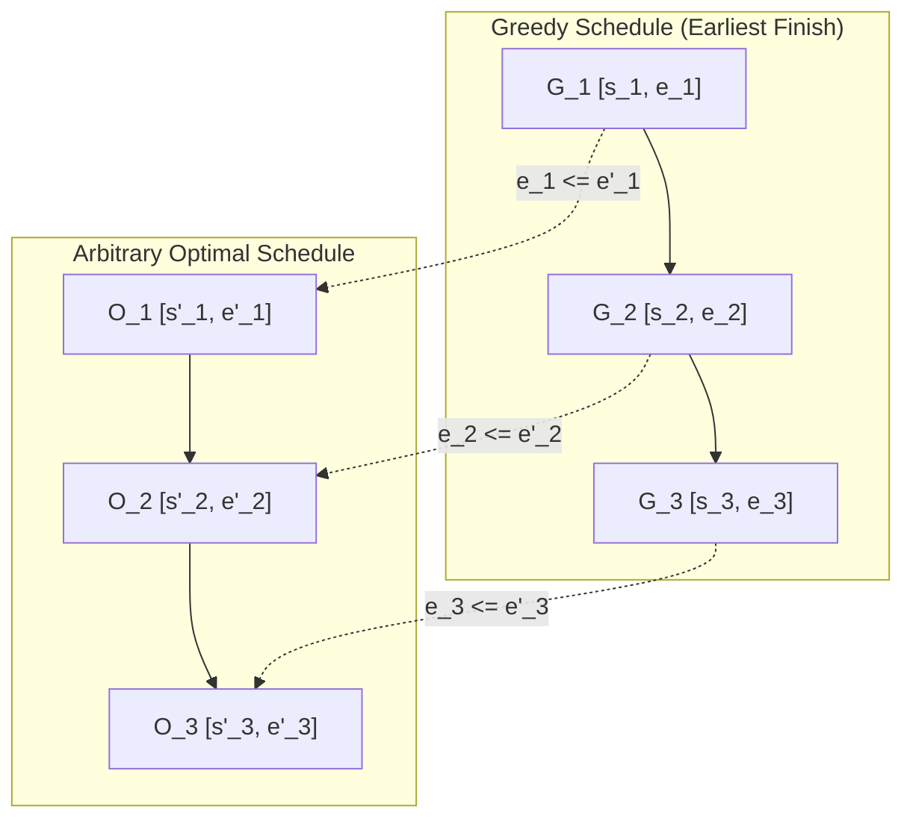
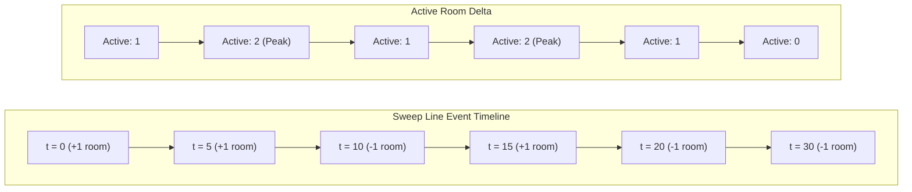
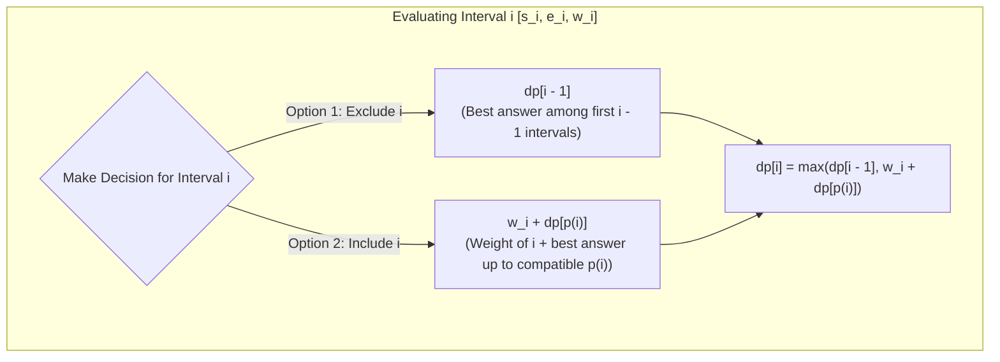

# Interval Scheduling

> [!NOTE]
> **Interval Scheduling & Partitioning Patterns** form one of the most practical and foundational algorithmic families in computer science.
> While all problems operate on 1D intervals $[s, e)$, their algorithmic mechanisms diverge fundamentally based on the objective:
> - **Single-Resource Max Count (Unweighted):** Solved via **Greedy Earliest Finish Time** in $O(n \log n)$.
> - **Interval Partitioning (Meeting Rooms II):** Solved via **Min-Heap** or **Sweep-Line Event Delta** in $O(n \log n)$.
> - **Weighted Interval Scheduling:** Solved via **Dynamic Programming + Binary Search** in $O(n \log n)$.
> - **Interval Merging & Insertion:** Solved via **Linear Scan on Sorted Starts** in $O(n \log n)$ and $O(n)$ respectively.
>
> Reference implementations: [C++17 Implementation](../../implementations/cpp/interval_scheduling.cpp) | [Python Implementation](../../implementations/python/interval_scheduling.py)

> [!TIP]
> **The Sorting Key Decision Matrix:**
>
> | Problem Archetype | Objective | Sort Key | Core Algorithm | Time | Space |
> |---|---|---|---|---|---|
> | **Unweighted Interval Scheduling** | Maximize non-overlapping count | End time (`asc`) | Greedy (Earliest Finish Time) | $O(n \log n)$ | $O(1)$ aux |
> | **Interval Partitioning (Meeting Rooms II)** | Minimize resources / rooms needed | Start time (`asc`) | Min-Heap or Sweep-Line | $O(n \log n)$ | $O(n)$ |
> | **Weighted Interval Scheduling** | Maximize total subset weight | End time (`asc`) | DP + Binary Search ($p(i)$) | $O(n \log n)$ | $O(n)$ |
> | **Merge Overlapping Intervals** | Merge contiguous intersections | Start time (`asc`) | Sequential Span Extension | $O(n \log n)$ | $O(n)$ |
> | **Insert Interval** | Insert & merge into disjoint set | Already sorted starts | 3-Phase Linear Scan | $O(n)$ | $O(n)$ |

> [!WARNING]
> **Two Cardinal Counterexamples to Avoid:**
> 1. **Start-Time Greedy Fails for Unweighted Max Count:** Sorting by start time and picking the earliest interval fails catastrophically on $[1, 10), [2, 3), [4, 5), [6, 7), [8, 9)$. Greedily picking $[1, 10)$ yields a count of $1$, whereas picking earliest finish times yields $4$.
> 2. **Earliest-Finish Greedy Fails for Weighted Scheduling:** Greedily selecting by earliest finish time on $[1, 2, w=2), [2, 3, w=2), [1, 3, w=10)$ selects both short intervals for a weight of $4$, completely missing the optimal single interval of weight $10$. Weighted scheduling demands DP.
> 3. **Endpoint Conventions:** In half-open $[s, e)$, an interval $[1, 3)$ and $[3, 5)$ meet at $3$ without overlapping. In the sweep-line event model, end events ($-1$) must be processed **before** start events ($+1$) when timestamps coincide.

Many real problems can be modeled as intervals on a line:

- meetings with start and end times
- jobs that occupy a machine
- lectures assigned to rooms
- bookings on a calendar
- tasks that cannot overlap on one resource

This leads to a very important family of algorithmic patterns:

- selecting a maximum set of non-overlapping intervals
- scheduling weighted intervals for maximum profit
- partitioning intervals across the minimum number of resources
- merging overlapping intervals

Although these problems all involve intervals, they do **not** all use the same algorithm.

That is one of the most important lessons of this chapter.

Different interval problems require different core ideas:

- greedy by earliest finish time
- dynamic programming with binary search
- min-heaps
- sweep-line event processing
- sorting and merging

This chapter develops:

- interval problem taxonomy
- unweighted interval scheduling
- weighted interval scheduling
- interval partitioning and meeting rooms
- interval merging and insertion
- proof ideas for greedy correctness
- important engineering details such as interval conventions and tie-breaking

---

## 1. Why interval problems are a family, not a single trick

It is tempting to think:

> If the input is intervals, there must be one standard interval algorithm.

That is not true.

For example:

- **maximum number of non-overlapping intervals** uses greedy by finish time
- **maximum total weight of non-overlapping intervals** uses DP
- **minimum number of rooms** uses heaps or sweep-line
- **merge overlapping intervals** uses sorting by start time

So the right first question is not:

> What interval trick should I use?

It is:

> What is the actual optimization objective?

That objective determines the method.

---

## 2. Interval conventions matter

Before solving any interval problem, define what overlap means.

Two common interval conventions are:

### Half-open intervals
$$
[s, e)
$$

This means:

- start is included
- end is excluded

Under this convention, intervals that touch at endpoints do **not** overlap.

Example:

$$
[1, 3) \text{ and } [3, 5)
$$

can coexist.

### Closed intervals
$$
[s, e]
$$

Here touching endpoints do overlap.

So:

$$
[1, 3] \text{ and } [3, 5]
$$

share point 3.

This choice changes comparisons and tie-handling.

---

## 3. Taxonomy of classical interval problems




A useful classification is:

### A. Single-resource unweighted scheduling
Choose the maximum number of mutually non-overlapping intervals.

### B. Weighted interval scheduling
Choose a non-overlapping subset with maximum total weight or profit.

### C. Interval partitioning
Assign all intervals to the minimum number of resources so that no resource has overlap.

### D. Interval merging and insertion
Combine overlapping intervals into disjoint blocks, or insert one interval into an existing disjoint set.

This taxonomy helps learners match the correct tool to the problem.

---

## 4. Single-resource unweighted interval scheduling

This is the classical scheduling problem.

### Problem
Given intervals, choose the largest possible subset of pairwise non-overlapping intervals.

### Goal
Maximize the **number** of selected intervals.

This is the setting where the famous greedy strategy works:

> always take the interval with the earliest finish time among those currently available

---

## 5. Why earliest finish time is the right greedy criterion

Suppose we choose one interval now.

What kind of choice leaves the most room for future intervals?

The interval that finishes earliest leaves the largest remaining suffix of time.

That is the key intuition.

So for unweighted scheduling, we sort by finishing time and greedily take every interval compatible with the last chosen one.

---

## 6. Greedy algorithm for unweighted interval scheduling

Algorithm:

1. sort intervals by increasing end time
2. keep the end time of the last selected interval
3. scan in order
4. take an interval if it starts after or at the current finish boundary, depending on interval convention

For half-open intervals $[s, e)$, the compatibility condition is typically:

$$
s \ge last\_end
$$

---

## 7. C++17 unweighted interval scheduling

```cpp
#include <vector>
#include <algorithm>

struct Interval {
    int start;
    int end;
};

int max_non_overlapping_intervals(std::vector<Interval> intervals) {
    std::sort(intervals.begin(), intervals.end(),
              [](const Interval& a, const Interval& b) {
                  if (a.end != b.end) return a.end < b.end;
                  return a.start < b.start;
              });

    int count = 0;
    int last_end = -2000000000;

    for (const auto& in : intervals) {
        if (in.start >= last_end) {
            ++count;
            last_end = in.end;
        }
    }

    return count;
}
```

---

## 8. Python unweighted interval scheduling

```python
def max_non_overlapping_intervals(intervals):
    intervals = sorted(intervals, key=lambda x: (x[1], x[0]))
    count = 0
    last_end = -10**18

    for s, e in intervals:
        if s >= last_end:
            count += 1
            last_end = e

    return count
```

---

## 9. Reconstructing the chosen schedule

If we want the actual chosen intervals, not only the count, we simply store them during the greedy scan.

Because the greedy decision is final once made, reconstruction is straightforward.

This is much easier than reconstruction in many DP problems.

---

## 10. Python schedule reconstruction

```python
def reconstruct_non_overlapping_schedule(intervals):
    intervals = sorted(intervals, key=lambda x: (x[1], x[0]))
    chosen = []
    last_end = -10**18

    for s, e in intervals:
        if s >= last_end:
            chosen.append((s, e))
            last_end = e

    return chosen
```

---

## 11. Why sorting by start time fails here

A very common mistake is sorting by start time for unweighted scheduling.

That does **not** optimize the number of intervals.

### Counterexample

```text
[1, 10], [2, 3], [4, 5], [6, 7], [8, 9]
```

If we sort by start time and greedily take the first interval, we choose:

```text
[1, 10]
```

and block all the short intervals.

But the optimal answer is to choose:

```text
[2, 3], [4, 5], [6, 7], [8, 9]
```

So earliest start is not the correct greedy rule for this problem.

---

## 12. Greedy stays-ahead proof idea




Why is earliest finish time optimal?

A standard proof is the **greedy stays ahead** argument.

Let:

- $ G_1, G_2, \dots $ be the intervals chosen by the greedy algorithm
- $ O_1, O_2, \dots $ be the intervals in any optimal solution, ordered by finish time

Then we show inductively that:

$$
finish(G_i) \le finish(O_i)
$$

for every $ i $.

So after choosing $ i $ intervals, greedy finishes no later than any optimal schedule of $ i $ intervals.

That means greedy always leaves at least as much room for the future.

Therefore greedy can never do worse in the final count.

---

## 13. Interval partitioning

Now consider a different problem.

### Problem
Assign every interval to some resource so that:

- no two intervals assigned to the same resource overlap

### Goal
Minimize the number of resources.

Examples:

- minimum number of meeting rooms
- minimum number of lecture halls
- machine allocation

This is **not** the same as selecting a subset.
We must place **all** intervals.

---

## 14. Why sorting by start time is right for partitioning

For interval partitioning, we process intervals in order of start time.

Why?

Because when a new interval begins, we need to know which currently active resources may be freed before it starts.

That is naturally a start-time sweep.

So unlike unweighted interval scheduling, here sorting by start time is exactly the right viewpoint.

This contrast is very important pedagogically.

---

## 15. Meeting Rooms II with a min-heap

A classical solution uses a min-heap of current room end times.

Algorithm:

1. sort intervals by start time
2. for each interval:
   - if the earliest-ending active room is free, reuse it
   - otherwise allocate a new room
3. track the maximum number of simultaneous active rooms

The heap stores the end times of rooms currently in use.

---

## 16. Why the min-heap works

At each step, the only room that matters for reuse is the one that frees earliest.

If even that earliest room is not free, then no room is free.

If it is free, reusing it is always safe.

So a min-heap on active end times gives exactly the information needed.

---

## 17. C++17 Meeting Rooms II with min-heap

```cpp
#include <vector>
#include <queue>
#include <algorithm>

struct Interval {
    int start;
    int end;
};

int min_meeting_rooms(std::vector<Interval> intervals) {
    if (intervals.empty()) return 0;

    std::sort(intervals.begin(), intervals.end(),
              [](const Interval& a, const Interval& b) {
                  if (a.start != b.start) return a.start < b.start;
                  return a.end < b.end;
              });

    std::priority_queue<int, std::vector<int>, std::greater<int>> pq;

    for (const auto& in : intervals) {
        if (!pq.empty() && pq.top() <= in.start) {
            pq.pop();
        }
        pq.push(in.end);
    }

    return static_cast<int>(pq.size());
}
```

---

## 18. Python Meeting Rooms II with min-heap

```python
import heapq

def min_meeting_rooms(intervals):
    if not intervals:
        return 0

    intervals = sorted(intervals, key=lambda x: (x[0], x[1]))
    pq = []

    for s, e in intervals:
        if pq and pq[0] <= s:
            heapq.heappop(pq)
        heapq.heappush(pq, e)

    return len(pq)
```

---

## 19. Tracking the maximum active overlap correctly

When using the heap method, the robust way is to track:

- current active rooms
- maximum active rooms seen at any moment

In many implementations, returning the heap size at the end works because the heap represents active rooms after full processing in a monotone reuse pattern, but conceptually the answer is:

> the maximum number of simultaneous active intervals

So explicitly tracking the maximum is clearer and safer.

---

## 20. Safer heap version with explicit maximum

### Python

```python
import heapq

def min_meeting_rooms(intervals):
    if not intervals:
        return 0

    intervals = sorted(intervals, key=lambda x: (x[0], x[1]))
    pq = []
    best = 0

    for s, e in intervals:
        while pq and pq[0] <= s:
            heapq.heappop(pq)
        heapq.heappush(pq, e)
        best = max(best, len(pq))

    return best
```

---

## 21. Sweep-line event-point perspective




The same problem can be solved by a sweep line.

Represent each interval as two events:

- start event contributes $ +1 $
- end event contributes $ -1 $

Sort all events by time, then sweep from left to right, maintaining the number of active intervals.

The maximum active count is the number of required rooms.

This is a beautiful alternative viewpoint.

---

## 22. Tie-breaking in the sweep line

Tie-breaking matters.

For half-open intervals $[s, e)$, if one meeting ends exactly when another starts, they do **not** overlap.

So at equal times, process:

- end events before start events

That ensures the room is freed before the new interval begins.

For closed intervals, the tie rule may be different.

This is an important engineering detail.

---

## 23. C++17 sweep-line room counting

```cpp
#include <vector>
#include <algorithm>

int min_meeting_rooms_sweepline(const std::vector<std::pair<int, int>>& intervals) {
    std::vector<std::pair<int, int>> events;
    events.reserve(intervals.size() * 2);

    for (auto [s, e] : intervals) {
        events.push_back({s, +1});
        events.push_back({e, -1});
    }

    std::sort(events.begin(), events.end(),
              [](const auto& a, const auto& b) {
                  if (a.first != b.first) return a.first < b.first;
                  return a.second < b.second; // -1 before +1
              });

    int active = 0, best = 0;
    for (auto [time, delta] : events) {
        active += delta;
        best = std::max(best, active);
    }

    return best;
}
```

---

## 24. Weighted interval scheduling

Now we move to the most important bridge problem in this chapter.

### Problem
Each interval has:

- a start time
- an end time
- a weight or profit

Choose a non-overlapping subset with maximum total weight.

This looks similar to unweighted scheduling, but greedy by earliest finish time is no longer enough.

Now the objective is total value, not count.

So we need dynamic programming.

---

## 25. Why greedy fails for weighted scheduling

Consider:

```text
A: [1, 2], weight 2
B: [2, 3], weight 2
C: [1, 3], weight 10
```

Greedy by earliest finish time might choose:

```text
A, B
```

with total weight 4.

But the optimal answer is:

```text
C
```

with total weight 10.

So the unweighted greedy rule does not transfer.

This is the key motivation for weighted interval DP.

---

## 26. Sort by finish time for weighted interval scheduling

We sort intervals by increasing end time.

Let intervals be indexed from $ 1 $ to $ n $ after sorting.

For each interval $ i $, define:

$$
p(i) = \text{the largest index } j < i \text{ such that interval } j \text{ does not overlap interval } i
$$

This predecessor function is the key to the recurrence.

---

## 27. Weighted interval scheduling recurrence




Let:

$$
dp[i] = \text{maximum total weight using only the first } i \text{ intervals}
$$

Then for interval $ i $, we have two choices:

### Skip interval $ i $
$$
dp[i-1]
$$

### Take interval $ i $
Then the best compatible earlier contribution is:

$$
weight[i] + dp[p(i)]
$$

So the recurrence is:

$$
dp[i] = \max(dp[i-1],\; weight[i] + dp[p(i)])
$$

This is the standard weighted interval scheduling DP.

---

## 28. Why binary search appears in weighted interval scheduling

Because the intervals are sorted by end time, the function $ p(i) $ can be found by binary search.

We want the rightmost interval whose end time is compatible with the start time of interval $ i $.

So the full time complexity becomes:

- sorting: $ O(n \log n) $
- predecessor search for all $ i $: $ O(n \log n) $
- DP: $ O(n) $

Total:

$$
O(n \log n)
$$

---

## 29. Python weighted interval scheduling

```python
from bisect import bisect_right

def weighted_interval_scheduling(intervals):
    # intervals = [(start, end, weight), ...]
    intervals = sorted(intervals, key=lambda x: x[1])
    n = len(intervals)

    ends = [0]
    for s, e, w in intervals:
        ends.append(e)

    starts = [0]
    weights = [0]
    for s, e, w in intervals:
        starts.append(s)
        weights.append(w)

    p = [0] * (n + 1)
    for i in range(1, n + 1):
        s = starts[i]
        p[i] = bisect_right(ends, s, 0, i) - 1

    dp = [0] * (n + 1)
    for i in range(1, n + 1):
        dp[i] = max(dp[i - 1], weights[i] + dp[p[i]])

    return dp[n]
```

---

## 30. C++17 weighted interval scheduling

```cpp
#include <vector>
#include <algorithm>

struct WeightedInterval {
    int start;
    int end;
    long long weight;
};

long long weighted_interval_scheduling(std::vector<WeightedInterval> intervals) {
    std::sort(intervals.begin(), intervals.end(),
              [](const WeightedInterval& a, const WeightedInterval& b) {
                  if (a.end != b.end) return a.end < b.end;
                  return a.start < b.start;
              });

    int n = static_cast<int>(intervals.size());
    std::vector<int> ends(n + 1, 0);
    std::vector<int> starts(n + 1, 0);
    std::vector<long long> weights(n + 1, 0);

    for (int i = 1; i <= n; ++i) {
        starts[i] = intervals[i - 1].start;
        ends[i] = intervals[i - 1].end;
        weights[i] = intervals[i - 1].weight;
    }

    std::vector<int> p(n + 1, 0);
    for (int i = 1; i <= n; ++i) {
        int s = starts[i];
        p[i] = static_cast<int>(
            std::upper_bound(ends.begin(), ends.begin() + i, s) - ends.begin()
        ) - 1;
    }

    std::vector<long long> dp(n + 1, 0);
    for (int i = 1; i <= n; ++i) {
        dp[i] = std::max(dp[i - 1], weights[i] + dp[p[i]]);
    }

    return dp[n];
}
```

---

## 31. Reconstructing the weighted optimal set

To recover the chosen intervals, backtrack through the DP.

At interval $ i $:

- if $ dp[i] = dp[i-1] $, skip interval $ i $
- otherwise take interval $ i $ and jump to $ p(i) $

Then reverse the collected intervals.

This is a clean reconstruction pattern.

---

## 32. Python weighted schedule reconstruction

```python
from bisect import bisect_right

def weighted_interval_scheduling_reconstruct(intervals):
    intervals = sorted(intervals, key=lambda x: x[1])
    n = len(intervals)

    ends = [0]
    starts = [0]
    weights = [0]
    items = [None]

    for s, e, w in intervals:
        starts.append(s)
        ends.append(e)
        weights.append(w)
        items.append((s, e, w))

    p = [0] * (n + 1)
    for i in range(1, n + 1):
        p[i] = bisect_right(ends, starts[i], 0, i) - 1

    dp = [0] * (n + 1)
    for i in range(1, n + 1):
        dp[i] = max(dp[i - 1], weights[i] + dp[p[i]])

    chosen = []
    i = n
    while i > 0:
        if dp[i] == dp[i - 1]:
            i -= 1
        else:
            chosen.append(items[i])
            i = p[i]

    chosen.reverse()
    return dp[n], chosen
```

---

## 33. Interval merging

Another major interval problem is to merge overlapping intervals.

### Problem
Given intervals, combine all overlapping ones into disjoint merged intervals.

This is not a scheduling optimization problem.
It is a structural normalization problem.

The correct method is:

1. sort by start time
2. scan left to right
3. merge with the current interval if overlap exists
4. otherwise start a new merged block

---

## 34. Why sorting by start time is right for merging

When intervals are sorted by start time, any future overlap with the current merged block must appear next in the scan.

So we only need to compare the current interval with the latest merged interval.

This makes merging linear after sorting.

---

## 35. Python merge intervals

```python
def merge_intervals(intervals):
    if not intervals:
        return []

    intervals = sorted(intervals, key=lambda x: (x[0], x[1]))
    merged = [list(intervals[0])]

    for s, e in intervals[1:]:
        if s <= merged[-1][1]:
            merged[-1][1] = max(merged[-1][1], e)
        else:
            merged.append([s, e])

    return [tuple(x) for x in merged]
```

---

## 36. C++17 merge intervals

```cpp
#include <vector>
#include <algorithm>

std::vector<std::pair<int, int>> merge_intervals(std::vector<std::pair<int, int>> intervals) {
    if (intervals.empty()) return {};

    std::sort(intervals.begin(), intervals.end());
    std::vector<std::pair<int, int>> merged;
    merged.push_back(intervals[0]);

    for (int i = 1; i < static_cast<int>(intervals.size()); ++i) {
        auto [s, e] = intervals[i];
        if (s <= merged.back().second) {
            merged.back().second = std::max(merged.back().second, e);
        } else {
            merged.push_back(intervals[i]);
        }
    }

    return merged;
}
```

---

## 37. Insert interval into disjoint intervals

A closely related problem is:

- given disjoint sorted intervals
- insert one new interval
- merge where necessary

This can be solved in linear time by scanning through three phases:

1. intervals completely before the new one
2. intervals overlapping the new one
3. intervals completely after the new one

This is a common interview-style application of interval merging logic.

---

## 38. Open versus closed endpoint engineering

This detail must be explicit.

### Half-open intervals $[s, e)$
Overlap condition for merging is typically:

$$
next\_start < current\_end
$$

Touching intervals are separate.

### Closed intervals $[s, e]$
Overlap condition becomes:

$$
next\_start \le current\_end
$$

Touching intervals merge.

The same issue appears in scheduling and room-count problems.

A chapter like this should state the convention clearly every time.

---

## 39. Stable tie-breaking

Sorting ties can matter.

### Examples
- for unweighted scheduling: sort by end time, then by start time
- for partitioning: sort by start time, then by end time
- for sweep-line room counting under half-open intervals: process end before start at equal time

Tie rules are not always the core idea, but they often decide whether the implementation matches the intended interval convention.

---

## 40. Complexity summary

### Unweighted interval scheduling
- sorting: $ O(n \log n) $
- scan: $ O(n) $
- total: $ O(n \log n) $

### Meeting rooms via heap
- sorting: $ O(n \log n) $
- heap operations: $ O(n \log n) $
- total: $ O(n \log n) $

### Meeting rooms via sweep line
- event sorting: $ O(n \log n) $
- sweep: $ O(n) $
- total: $ O(n \log n) $

### Weighted interval scheduling
- sorting: $ O(n \log n) $
- predecessor binary search: $ O(n \log n) $
- DP: $ O(n) $
- total: $ O(n \log n) $

### Merge intervals
- sorting: $ O(n \log n) $
- scan: $ O(n) $
- total: $ O(n \log n) $

---

## 41. Common mistakes

### Mistake 1: using the wrong objective
Maximizing count, maximizing weight, minimizing rooms, and merging are different problems.

### Mistake 2: applying earliest-finish greedy to weighted scheduling
That greedy rule does not optimize weight.

### Mistake 3: sorting by start time for unweighted maximum scheduling
That can fail badly.

### Mistake 4: forgetting endpoint convention
Touching intervals may or may not overlap depending on whether intervals are half-open or closed.

### Mistake 5: wrong tie order in sweep-line events
For half-open intervals, ends should usually be processed before starts at the same time.

### Mistake 6: using a heap answer without tracking maximum overlap
The conceptual answer is the maximum active count.

### Mistake 7: wrong predecessor search in weighted scheduling
The index $ p(i) $ must be the rightmost compatible earlier interval, not just any compatible one.

---

## 42. Comparison table

| Problem | Goal | Core method | Sort key |
|---|---|---|---|
| Unweighted interval scheduling | maximize count of non-overlapping intervals | greedy | end time |
| Weighted interval scheduling | maximize total weight | DP + binary search | end time |
| Interval partitioning / Meeting Rooms II | minimize number of resources | min-heap or sweep line | start time or events |
| Merge intervals | combine overlaps into disjoint blocks | sort + scan | start time |
| Insert interval | insert and merge into disjoint set | linear scan | existing order |

---

## 43. Proof intuition summary

### Unweighted scheduling
Earliest finish time is optimal because greedy stays ahead: after selecting the same number of intervals, greedy always finishes no later than any other solution.

### Interval partitioning
The number of rooms needed equals the maximum number of simultaneously active intervals.

### Weighted scheduling
For each interval, either:
- skip it, or
- take it and combine with the best compatible predecessor solution

### Merging
After sorting by start time, any overlap with the current merged block must appear next in scan order.

These proof ideas explain why the methods differ even though the input objects are all intervals.

---

## 44. Summary

Interval problems are a broad family of algorithmic patterns, not a single technique.

The most important classical cases are:

- **unweighted interval scheduling** → greedy by earliest finish time
- **weighted interval scheduling** → DP with predecessor binary search
- **interval partitioning / meeting rooms** → heap or sweep-line active overlap counting
- **merge intervals** → sort by start time and scan

The key practical lesson is:

> first identify the objective, then choose the method

This chapter is especially valuable because it shows how similar-looking inputs can require greedy, DP, heap, or sweep-line thinking depending on the question being asked.

---

## 45. Practice prompts

1. Why is earliest finish time the correct greedy rule for unweighted interval scheduling?
2. Why does sorting by start time fail for maximum-count scheduling?
3. Why is sorting by start time useful for interval partitioning?
4. What does the min-heap store in Meeting Rooms II?
5. Why does maximum active overlap equal the number of needed rooms?
6. What does $ p(i) $ mean in weighted interval scheduling?
7. Why is weighted interval scheduling not solved by the unweighted greedy rule?
8. Why does weighted interval scheduling run in $ O(n \log n) $?
9. Why does merge intervals sort by start time rather than finish time?
10. How does the interval convention affect endpoint-touching cases?

---

## 46. Suggested next topics

A natural continuation after interval scheduling is:

- quickselect and median of medians
- indexed priority queues
- sweep line in two dimensions
- greedy exchange arguments
- advanced scheduling and packing problems
