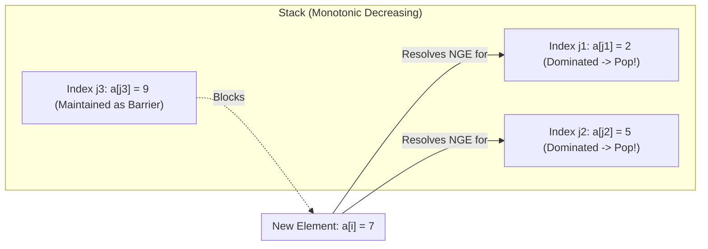

# Monotonic Stack and Queue

> [!NOTE]
> A **monotonic stack** or **monotonic deque** is an algorithmic pattern that maintains candidates in strictly or non-strictly sorted order as we iterate through a sequence. By discarding dominated elements that can never participate in an optimal future answer, monotonic structures answer boundary and sliding-window extremum queries in amortized $O(1)$ time per element ($O(n)$ overall).
>
> Reference implementations: [C++17 Implementation](../../implementations/cpp/monotonic_stack_and_queue.cpp) | [Python Implementation](../../implementations/python/monotonic_stack_and_queue.py)

> [!TIP]
> **The Core Problem Archetypes:**
> - **Boundary Queries (NGE, NSE, PGE, PSE):** Finding the first strictly/non-strictly greater or smaller element to the left or right (e.g., Daily Temperatures, Stock Span).
> - **Area and Basin Enclosures:** Identifying enclosing left and right barriers to compute maximal geometric shapes (e.g., Largest Rectangle in Histogram, Trapping Rain Water).
> - **Sliding Window Extrema:** Monotonic deque maintaining the running maximum or minimum over a moving window of size $k$ in $O(n)$ total time.

> [!WARNING]
> **Engineering Rules of Thumb:**
> 1. **Store Indices, Not Raw Values:** Indices encode both the underlying value ($a[i]$), the horizontal distance/span ($j - i$), and sliding-window expiration ($i - k$). If unsure, always store indices.
> 2. **Strictness Governs Boundary Invariants:** Whether you pop on strictly greater (`>`) or greater-or-equal (`>=`) dictates whether duplicate elements are treated as barriers or absorbed into the same span.
> 3. **Amortized $O(n)$ Guarantee:** Even though inner `while` loops may perform multiple pops, every element enters the container at most once and exits at most once. Across $n$ elements, the total number of push/pop operations cannot exceed $2n$.

A **monotonic stack** or **monotonic deque** is a data-structure pattern for maintaining candidates in sorted order as we scan through an array.

The core idea is simple:

> If one element can never be useful again because a better element has appeared, discard it immediately.

This leads to elegant linear-time solutions for many important problems, including:

- next greater element
- previous smaller element
- daily temperatures
- stock span
- largest rectangle in a histogram
- trapping rain water
- sliding window maximum
- sliding window minimum

These problems may look different on the surface, but many of them are driven by the same pattern:

- maintain a stack or deque with a monotonic invariant
- remove dominated elements
- answer boundary or extremum queries efficiently

This chapter develops:

- monotonic stack invariants
- increasing and decreasing stacks
- amortized $ O(n) $ analysis
- the four canonical boundary queries
- classic problem archetypes
- monotonic deque for sliding windows
- common edge cases and implementation traps

---

## 1. What is a monotonic stack?

A **monotonic stack** is a stack whose elements are kept in monotonic order.

Depending on the problem, the stack may be:

- **increasing**
- or **decreasing**

The stack typically stores:

- indices
- or sometimes raw values

Most real implementations store **indices**, because indices allow us to:

- compare values through the array
- compute distances and spans
- detect window expiration

---

## 2. Increasing and decreasing stacks

### Increasing monotonic stack
Values along the stack are kept in increasing order.

### Decreasing monotonic stack
Values along the stack are kept in decreasing order.

The exact meaning depends on whether you read from bottom to top, but the practical rule is this:

> when a new element arrives, pop elements from the top while they violate the intended order

That is the operational heart of the pattern.

---

## 3. The domination principle



Why is it safe to pop elements?

Because the new element may **dominate** older ones.

Why is it safe to pop elements?

Because the new element may **dominate** older ones.

### Example intuition
Suppose we are looking for the next greater element.

If a new value is larger than smaller values sitting on top of the stack, then those smaller values have now found their answer and can be removed.

In other problems, domination means:

- one candidate is no longer better than another
- one candidate is farther away and not stronger
- one candidate can never be optimal again

This is the key reason monotonic structures work.

---

## 4. Why the total time is $ O(n) $

At first, the inner `while` loop can look expensive.

But each element is:

- pushed at most once
- popped at most once

So the total number of stack operations is linear.

This gives the classic amortized analysis:

$$
O(n)
$$

for the whole scan, not $ O(n^2) $.

This is one of the most important ideas in the chapter.

---

## 5. Amortized proof sketch

Suppose the array has $ n $ elements.

Each element can cause:

- one push when it is first processed
- one pop later when a dominating element removes it

So across the entire algorithm:

- at most $ n $ pushes
- at most $ n $ pops

Therefore the total number of stack operations is at most:

$$
2n
$$

up to constant factors.

So the overall running time is linear.

---

## 6. Why indices are usually better than raw values

It is sometimes possible to store values directly.

But indices are more flexible.

If we store index $ i $, then we can:

- read the value as `a[i]`
- compute distance `j - i`
- decide whether an element is out of a sliding window
- reconstruct left and right boundaries

So in most important monotonic-stack and monotonic-deque problems, storing indices is the best default choice.

---

## 7. The four canonical boundary queries

Many monotonic stack problems reduce to one of four basic queries:

- **Next Greater Element**
- **Next Smaller Element**
- **Previous Greater Element**
- **Previous Smaller Element**

These are the basic boundary patterns.

Once you recognize which one a problem needs, the implementation often becomes straightforward.

---

## 8. Next Greater Element

For each index $ i $, the **Next Greater Element** is the first index $ j > i $ such that:

$$
a[j] > a[i]
$$

If no such index exists, the answer is usually `-1`.

This is often solved by scanning from left to right with a **decreasing stack** of unresolved indices.

When a larger value arrives, it resolves the next-greater query for smaller elements on the stack.

---

## 9. Next Smaller Element

For each index $ i $, the **Next Smaller Element** is the first index $ j > i $ such that:

$$
a[j] < a[i]
$$

This is symmetric to NGE.

A common implementation uses an **increasing stack** of unresolved indices.

When a smaller value arrives, it resolves the next-smaller query for larger stacked elements.

---

## 10. Previous Greater Element

For each index $ i $, the **Previous Greater Element** is the nearest index $ j < i $ such that:

$$
a[j] > a[i]
$$

This is often solved during a left-to-right scan.

Before pushing $ i $, we pop elements that cannot remain a valid previous-greater candidate.

Then the current top gives the answer.

---

## 11. Previous Smaller Element

For each index $ i $, the **Previous Smaller Element** is the nearest index $ j < i $ such that:

$$
a[j] < a[i]
$$

This is another standard left-to-right monotonic-stack query.

Together, these four patterns form a small toolkit that powers many classic problems.

---

## 12. Template idea for boundary queries

A common template is:

1. decide whether you need greater or smaller
2. decide whether you need next or previous
3. choose scan direction
4. choose strict or non-strict comparison
5. store indices
6. pop until the invariant is restored

Most bugs in monotonic-stack problems come from step 4.

The strictness of comparison matters a lot.

---

## 13. C++17 Next Greater Element

```cpp
#include <vector>
#include <stack>

std::vector<int> next_greater_indices(const std::vector<int>& a) {
    int n = static_cast<int>(a.size());
    std::vector<int> ans(n, -1);
    std::stack<int> st;  // stores indices, values decreasing

    for (int i = 0; i < n; ++i) {
        while (!st.empty() && a[i] > a[st.top()]) {
            ans[st.top()] = i;
            st.pop();
        }
        st.push(i);
    }

    return ans;
}
```

---

## 14. Python Next Greater Element

```python
def next_greater_indices(a):
    n = len(a)
    ans = [-1] * n
    st = []  # stores indices

    for i, x in enumerate(a):
        while st and a[i] > a[st[-1]]:
            ans[st.pop()] = i
        st.append(i)

    return ans
```

---

## 15. Daily Temperatures

This is a direct Next Greater Element pattern.

### Problem
For each day, find how many days must pass until a warmer temperature appears.

If none appears, answer 0.

### Observation
We want the next index $ j > i $ such that:

$$
temp[j] > temp[i]
$$

So this is exactly a next-greater query, except we return:

$$
j - i
$$

instead of just the index.

---

## 16. C++17 Daily Temperatures

```cpp
#include <vector>
#include <stack>

std::vector<int> daily_temperatures(const std::vector<int>& temp) {
    int n = static_cast<int>(temp.size());
    std::vector<int> ans(n, 0);
    std::stack<int> st;

    for (int i = 0; i < n; ++i) {
        while (!st.empty() && temp[i] > temp[st.top()]) {
            int j = st.top();
            st.pop();
            ans[j] = i - j;
        }
        st.push(i);
    }

    return ans;
}
```

---

## 17. Python Daily Temperatures

```python
def daily_temperatures(temp):
    n = len(temp)
    ans = [0] * n
    st = []

    for i, x in enumerate(temp):
        while st and temp[i] > temp[st[-1]]:
            j = st.pop()
            ans[j] = i - j
        st.append(i)

    return ans
```

---

## 18. Stock Span Problem

The **stock span** for day $ i $ is the number of consecutive days ending at $ i $ whose prices are less than or equal to the current price.

### Observation
We want to know how far left we can extend before hitting a strictly greater price.

So this is naturally a **Previous Greater Element** style problem.

If `pge[i]` is the index of the previous greater element, then:

$$
span[i] = i - pge[i]
$$

with `pge[i] = -1` if no such index exists.

---

## 19. C++17 Stock Span

```cpp
#include <vector>
#include <stack>

std::vector<int> stock_span(const std::vector<int>& price) {
    int n = static_cast<int>(price.size());
    std::vector<int> span(n, 0);
    std::stack<int> st;  // indices with strictly greater barrier preserved

    for (int i = 0; i < n; ++i) {
        while (!st.empty() && price[st.top()] <= price[i]) {
            st.pop();
        }

        int prev_greater = st.empty() ? -1 : st.top();
        span[i] = i - prev_greater;
        st.push(i);
    }

    return span;
}
```

---

## 20. Python Stock Span

```python
def stock_span(price):
    n = len(price)
    span = [0] * n
    st = []

    for i, x in enumerate(price):
        while st and price[st[-1]] <= price[i]:
            st.pop()

        prev_greater = st[-1] if st else -1
        span[i] = i - prev_greater
        st.append(i)

    return span
```

---

## 21. Largest Rectangle in Histogram

This is one of the most important monotonic-stack problems.

### Problem
Given bar heights, find the largest rectangular area that can be formed in the histogram.

### Key idea
For each bar $ i $, treat its height as the limiting height.

Then find:

- the nearest smaller bar to the left
- the nearest smaller bar to the right

If those boundaries are $ L $ and $ R $, then the width available to bar $ i $ is:

$$
R - L - 1
$$

So the area using height $ h[i] $ is:

$$
h[i] \cdot (R - L - 1)
$$

---

## 22. Why nearest smaller boundaries solve the histogram problem

If we choose bar $ i $ as the height of the rectangle, then the rectangle can extend left and right only while all bars are at least as tall as $ h[i] $.

So the first smaller bar on each side stops the expansion.

That is why previous-smaller and next-smaller boundaries are exactly the right quantities.

---

## 23. Duplicate heights and tie-breaking

This problem is sensitive to strictness.

If there are equal heights, you must choose a consistent rule for left and right boundaries.

A common safe choice is:

- pop `>=` on one side
- pop `>` on the other side

or use a single-pass stack that avoids double counting naturally.

The important point is consistency.

Otherwise equal-height bars may claim overlapping widths incorrectly.

---

## 24. C++17 Largest Rectangle in Histogram

```cpp
#include <vector>
#include <stack>
#include <algorithm>

long long largest_rectangle_histogram(const std::vector<int>& h) {
    int n = static_cast<int>(h.size());
    std::vector<int> left(n), right(n);
    std::stack<int> st;

    // Previous smaller element index
    for (int i = 0; i < n; ++i) {
        while (!st.empty() && h[st.top()] >= h[i]) {
            st.pop();
        }
        left[i] = st.empty() ? -1 : st.top();
        st.push(i);
    }

    while (!st.empty()) st.pop();

    // Next smaller element index
    for (int i = n - 1; i >= 0; --i) {
        while (!st.empty() && h[st.top()] >= h[i]) {
            st.pop();
        }
        right[i] = st.empty() ? n : st.top();
        st.push(i);
    }

    long long ans = 0;
    for (int i = 0; i < n; ++i) {
        long long width = right[i] - left[i] - 1;
        ans = std::max(ans, 1LL * h[i] * width);
    }

    return ans;
}
```

---

## 25. Python Largest Rectangle in Histogram

```python
def largest_rectangle_histogram(h):
    n = len(h)
    left = [-1] * n
    right = [n] * n
    st = []

    for i in range(n):
        while st and h[st[-1]] >= h[i]:
            st.pop()
        left[i] = st[-1] if st else -1
        st.append(i)

    st.clear()

    for i in range(n - 1, -1, -1):
        while st and h[st[-1]] >= h[i]:
            st.pop()
        right[i] = st[-1] if st else n
        st.append(i)

    ans = 0
    for i in range(n):
        width = right[i] - left[i] - 1
        ans = max(ans, h[i] * width)

    return ans
```

---

## 26. Trapping Rain Water with a monotonic stack

The trapping rain water problem can be solved in multiple ways.

One elegant method uses a monotonic stack.

### Idea
When a new bar is taller than the bar at the top of the stack, we may have found a right boundary for a trapped basin.

The popped bar becomes the basin bottom.

Then:

- the new top is the left boundary
- the current bar is the right boundary

The trapped water height is the smaller boundary height minus the bottom height.

---

## 27. Trapping Rain Water formula

Suppose:

- `mid` is the bottom index popped from the stack
- `left` is the new top after popping
- `right` is the current index

Then:

### Width
$$
right - left - 1
$$

### Bounded height
$$
\min(h[left], h[right]) - h[mid]
$$

### Water added
$$
(right - left - 1) \cdot \left(\min(h[left], h[right]) - h[mid]\right)
$$

This accumulates water one trapped basin at a time.

---

## 28. Why compare with the two-pointer method?

The two-pointer solution is often simpler for trapping rain water.

So why include the stack solution?

Because the stack method teaches a general pattern:

- local minima
- enclosing boundaries
- boundary discovery during a scan

It fits naturally into the monotonic-stack toolkit and helps learners recognize when boundaries define an area or span.

---

## 29. C++17 Trapping Rain Water with stack

```cpp
#include <vector>
#include <stack>
#include <algorithm>

long long trap_rain_water_stack(const std::vector<int>& h) {
    int n = static_cast<int>(h.size());
    long long water = 0;
    std::stack<int> st;

    for (int i = 0; i < n; ++i) {
        while (!st.empty() && h[i] > h[st.top()]) {
            int mid = st.top();
            st.pop();

            if (st.empty()) break;

            int left = st.top();
            int width = i - left - 1;
            int bounded_height = std::min(h[left], h[i]) - h[mid];
            water += 1LL * width * bounded_height;
        }
        st.push(i);
    }

    return water;
}
```

---

## 30. Python Trapping Rain Water with stack

```python
def trap_rain_water_stack(h):
    n = len(h)
    water = 0
    st = []

    for i in range(n):
        while st and h[i] > h[st[-1]]:
            mid = st.pop()
            if not st:
                break

            left = st[-1]
            width = i - left - 1
            bounded_height = min(h[left], h[i]) - h[mid]
            water += width * bounded_height

        st.append(i)

    return water
```

---

## 31. Circular arrays and wrapped next-greater queries

Some next-greater problems use a **circular array**.

That means after the last index, we continue from the front.

A standard trick is:

- simulate scanning `2n` positions
- use `i % n` to wrap around
- only push indices from the first pass

This lets later elements resolve answers for earlier indices in wrapped order.

---

## 32. Next Greater Element II idea

For a circular array, the next greater element for index $ i $ may lie:

- to its right in the usual sense
- or after wrapping back to the front

So we scan the array twice.

During the second pass, we do not add new unresolved indices.
We only resolve remaining ones.

This preserves linear total work.

---

## 33. C++17 Next Greater Element II

```cpp
#include <vector>
#include <stack>

std::vector<int> next_greater_circular(const std::vector<int>& a) {
    int n = static_cast<int>(a.size());
    std::vector<int> ans(n, -1);
    std::stack<int> st;

    for (int i = 0; i < 2 * n; ++i) {
        int idx = i % n;

        while (!st.empty() && a[idx] > a[st.top()]) {
            ans[st.top()] = a[idx];
            st.pop();
        }

        if (i < n) {
            st.push(idx);
        }
    }

    return ans;
}
```

---

## 34. Python Next Greater Element II

```python
def next_greater_circular(a):
    n = len(a)
    ans = [-1] * n
    st = []

    for i in range(2 * n):
        idx = i % n

        while st and a[idx] > a[st[-1]]:
            ans[st.pop()] = a[idx]

        if i < n:
            st.append(idx)

    return ans
```

---

## 35. From stack to deque

A stack supports access at one end.

A **deque** supports insertion and removal at both ends.

This is exactly what we need for sliding-window problems, where we must handle two kinds of updates:

- remove expired elements from the front
- remove dominated elements from the back

This leads to the **monotonic deque**.

---

## 36. Monotonic deque for sliding window maximum

### Problem
For each window of size $ k $, find the maximum value.

### Invariant
Keep indices in decreasing order of value inside the deque.

Then:

- the front is the maximum for the current window
- expired indices are removed from the front
- smaller dominated values are removed from the back

This gives total linear time.

---

## 37. Why the deque front is the window optimum

Because the deque is maintained in decreasing order of values.

So the largest value among remaining valid candidates is always at the front.

If that front index leaves the window, it is removed immediately.

This keeps the front correct for every window.

---

## 38. Monotonic deque update rules

When processing index $ i $:

### Step 1: remove expired indices
If the front index is outside the current window, pop it from the front.

### Step 2: remove dominated indices
While the back has value less than or equal to the current value, pop it.

### Step 3: push current index
Append $ i $ to the back.

### Step 4: record answer
Once the first full window is formed, the front gives the answer.

These four steps define the pattern.

---

## 39. C++17 Sliding Window Maximum

```cpp
#include <vector>
#include <deque>

std::vector<int> sliding_window_maximum(const std::vector<int>& a, int k) {
    int n = static_cast<int>(a.size());
    std::deque<int> dq;
    std::vector<int> ans;

    for (int i = 0; i < n; ++i) {
        while (!dq.empty() && dq.front() <= i - k) {
            dq.pop_front();
        }

        while (!dq.empty() && a[dq.back()] <= a[i]) {
            dq.pop_back();
        }

        dq.push_back(i);

        if (i >= k - 1) {
            ans.push_back(a[dq.front()]);
        }
    }

    return ans;
}
```

---

## 40. Python Sliding Window Maximum

```python
from collections import deque

def sliding_window_maximum(a, k):
    dq = deque()
    ans = []

    for i, x in enumerate(a):
        while dq and dq[0] <= i - k:
            dq.popleft()

        while dq and a[dq[-1]] <= a[i]:
            dq.pop()

        dq.append(i)

        if i >= k - 1:
            ans.append(a[dq[0]])

    return ans
```

---

## 41. Sliding Window Minimum

This is the symmetric version.

To maintain the window minimum:

- keep the deque in **increasing** order of values
- pop larger dominated values from the back

Then the front stores the current minimum.

The pattern is identical except for the comparison direction.

---

## 42. C++17 Sliding Window Minimum

```cpp
#include <vector>
#include <deque>

std::vector<int> sliding_window_minimum(const std::vector<int>& a, int k) {
    int n = static_cast<int>(a.size());
    std::deque<int> dq;
    std::vector<int> ans;

    for (int i = 0; i < n; ++i) {
        while (!dq.empty() && dq.front() <= i - k) {
            dq.pop_front();
        }

        while (!dq.empty() && a[dq.back()] >= a[i]) {
            dq.pop_back();
        }

        dq.push_back(i);

        if (i >= k - 1) {
            ans.push_back(a[dq.front()]);
        }
    }

    return ans;
}
```

---

## 43. Python Sliding Window Minimum

```python
from collections import deque

def sliding_window_minimum(a, k):
    dq = deque()
    ans = []

    for i, x in enumerate(a):
        while dq and dq[0] <= i - k:
            dq.popleft()

        while dq and a[dq[-1]] >= a[i]:
            dq.pop()

        dq.append(i)

        if i >= k - 1:
            ans.append(a[dq[0]])

    return ans
```

---

## 44. Strict versus non-strict comparisons

Comparison strictness is one of the most frequent sources of subtle algorithmic bugs.

| Problem / Goal | Stack Order | Typical Pop Condition | Tie Behavior / Rationale |
|---|---|---|---|
| **Next Greater Element (NGE)** | Decreasing | `a[i] > a[top]` | Resolves for strictly smaller; identical values wait for a strictly larger barrier |
| **Next Greater or Equal** | Strictly Decreasing | `a[i] >= a[top]` | Resolves on identical values immediately |
| **Stock Span (Previous Greater)** | Strictly Decreasing | `price[top] <= price[i]` | Pops lesser or equal to find strictly greater barrier to the left |
| **Histogram Left Boundary (PSE)** | Strictly Increasing | `h[top] >= h[i]` | Pops greater or equal; left boundary becomes strict smaller |
| **Histogram Right Boundary (NSE)**| Increasing | `h[top] >= h[i]` | Asymmetric tie-breaking avoids duplicate area over-counting |
| **Sliding Window Maximum** | Decreasing | `a[back] <= a[i]` | Dominated equal or smaller values removed from deque back |
| **Sliding Window Minimum** | Increasing | `a[back] >= a[i]` | Dominated equal or larger values removed from deque back |

The practical rule is:
> **Comparison strictness is a core structural invariant of the algorithm, not a minor formatting detail.** Always trace whether duplicate values should serve as stopping barriers or be absorbed into the active span.

This is the most common source of bugs.

You must decide whether to pop on:

- `>`
- `>=`
- `<`
- `<=`

This depends on the exact meaning of the boundary.

### Example
For histogram boundaries, equal heights often require careful asymmetric handling.

### Example
For stock span, we pop `<=` because equal prices still belong in the span.

Small comparison changes can completely change the result.

---

## 45. Sentinels and padding

Some problems become cleaner with **sentinels**.

### Example uses
- add a zero-height bar at the end of a histogram to flush the stack
- add very small or very large boundary values
- treat missing boundaries as `-1` or `n`

Sentinels can simplify code and remove special-case cleanup logic.

But they must match the mathematical meaning of the problem.

---

## 46. Reusing stack and deque buffers

In multi-testcase settings, a common bug is forgetting to clear the stack or deque between cases.

This can silently corrupt later answers.

Good practice:

- create a fresh container each testcase
- or explicitly clear it before reuse

This is a small engineering detail, but very important in competitive programming and batch testing.

---

## 47. Comparison table

| Pattern | Data structure | Invariant | Typical use |
|---|---|---|---|
| Next greater / smaller | stack | unresolved indices in monotonic order | nearest boundary query |
| Previous greater / smaller | stack | candidate previous boundaries | span and nearest-left query |
| Histogram | stack | increasing heights by index | left and right limiting boundaries |
| Rain water | stack | decreasing boundary structure | basin detection |
| Sliding window max | deque | decreasing values | current window maximum |
| Sliding window min | deque | increasing values | current window minimum |

---

## 48. Recognition checklist

A monotonic stack or deque is often a good fit when you see phrases like:

- next greater
- previous smaller
- nearest larger to the left
- first smaller to the right
- span until blocked
- largest rectangle
- sliding window maximum
- sliding window minimum
- remove dominated candidates

These are strong signals.

---

## 49. Proof intuition summary

The key correctness idea is the **domination principle**:

- if a new element makes an old candidate permanently useless, remove the old one

The key efficiency idea is the **amortized push-pop bound**:

- every element enters once
- every element leaves at most once

That is why these methods stay linear.

---

## 50. Summary

Monotonic stack and monotonic deque methods maintain only the candidates that can still matter.

They solve many important problems in linear time by enforcing an order invariant and removing dominated elements immediately.

The most important practical ideas are:

- choose increasing or decreasing order correctly
- store indices rather than raw values when boundaries matter
- handle strict versus non-strict comparisons carefully
- use amortized reasoning, not per-iteration worst-case reasoning
- for sliding windows, use a deque so the front stores the current optimum and the back removes dominated candidates

This is one of the most reusable problem-solving patterns in algorithm design.

---

## 51. Practice prompts

1. What does it mean for a stack to be monotonic?
2. Why is it safe to pop dominated elements?
3. Why is the total running time $ O(n) $ even with nested `while` loops?
4. When should you store indices instead of values?
5. What is the difference between Next Greater Element and Previous Greater Element?
6. Why does the histogram problem use nearest smaller boundaries?
7. Why is duplicate-height handling delicate in histogram problems?
8. How does the stack solution for trapping rain water identify a basin?
9. Why does a sliding-window maximum use a deque instead of a stack?
10. Why do strict and non-strict comparisons matter so much?

---

## 52. Suggested next topics

A natural continuation after monotonic stack and queue is:

- binary search on answer
- interval scheduling
- prefix sums and difference arrays
- sweep line
- amortized data-structure patterns
