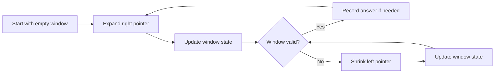

# Sliding Window

> [!NOTE]
> Sliding Window is a linear-time pattern for processing contiguous subarrays or substrings by expanding and shrinking a maintained range instead of recomputing work from scratch.

> [!TIP]
> **Pattern Disambiguation**:
> * **Sliding Window**: Contiguous subsegment + maintained state + monotone boundary expansion/shrinking.
> * **Two Pointers**: Broader pointer coordination (opposite ends, converging, partitioning, cycle detection).
> * **Prefix Sums**: Static range sum/xor queries via precomputed prefix tables ($O(1)$ query, immutable arrays).
> * **Monotonic Deque**: Specialized auxiliary structure to extract window extrema (min/max) in $O(1)$ amortized time.

---

## 1. Why This Matters

Sliding Window exists because many array and string problems ask about a **contiguous range**:

- longest valid subarray
- shortest valid substring
- maximum or minimum value over every window of size $k$
- number of subarrays satisfying a constraint

A naive solution often checks every possible range separately, which can cost $O(n^2)$ or worse. Sliding Window improves this by **reusing information** as the window moves.

This pattern is especially important because it appears everywhere:

- interview problems on strings and arrays
- competitive programming counting and optimization tasks
- streaming and online processing
- systems tasks that analyze recent events or fixed-size buffers

It fits into computer science as a **stateful sequential scanning technique**. Instead of asking, “What is the answer for each interval from scratch?”, it asks, “What can I update cheaply when the left or right boundary moves by one step?”

---

## 2. Core Intuition & Visual Model

The core idea is simple:

- maintain a current window $[l, r]$
- update its internal state as you move
- avoid rebuilding the answer for each range

Think of a transparent frame moving across an array or string.

For a fixed-size window:

- add the new element entering on the right
- remove the old element leaving on the left

For a dynamic window:

- expand right until a condition breaks or becomes satisfied
- shrink left until the window becomes valid again

### Mental Model

A window is not just two indices.  
It is:

- **boundaries**: `left`, `right`
- **state**: counts, sum, distinct characters, max deque, etc.
- **invariant**: a rule that must remain true while processing

If you can maintain that state in $O(1)$ or amortized $O(1)$ per movement, the full scan is often $O(n)$.

### Visual Model



### ASCII Intuition

```text
String:   a   b   c   a   b   c   b   b
Index:    0   1   2   3   4   5   6   7

Window:
          [------- current -------]
          l                       r
```

As `r` moves right, the algorithm absorbs new information.  
As `l` moves right, the algorithm discards old information.

---

## 3. Formal Definition & Invariants

A sliding window algorithm processes a sequence $A[0 \dots n-1]$ using a maintained contiguous interval $A[l \dots r]$, where both pointers move monotonically from left to right.

### Core Invariants

1. **Contiguity Invariant**: The active region is always a contiguous interval of the input.
2. **Monotone Pointer Invariant**: `left` never moves backward, and `right` never moves backward.
3. **State Consistency Invariant**: The maintained state exactly reflects the current window contents.
4. **Validity Invariant**: For dynamic windows, the algorithm maintains a problem-specific validity rule, such as:
   - no repeated characters
   - at most $k$ distinct values
   - current sum $\le$ target
   - all required characters covered
5. **Amortized Movement Invariant**: Each element enters the window at most once and leaves the window at most once, which is the reason many sliding window algorithms run in $O(n)$.

### When to Use Sliding Window vs. Two Pointers

These two ideas overlap, but they are not identical.

#### Use **Sliding Window** when:
- the problem is about a **contiguous subarray or substring**
- you need to maintain **window state**
- the range grows and shrinks while preserving a property
- examples:
  - longest substring without repeating characters
  - minimum window substring
  - fixed-size maximum sum
  - sliding window maximum

#### Use **Two Pointers** more generally when:
- two indices move with a structural purpose, not necessarily as a maintained stateful window
- the data may be sorted
- the goal is pairing, partitioning, or converging
- examples:
  - two-sum in sorted array
  - remove duplicates in-place
  - merge two sorted arrays
  - container with most water
  - slow-fast cycle detection

### Short Distinction
- **Sliding Window** = two pointers + maintained contiguous window + reusable state
- **Two Pointers** = broader family of pointer movement techniques

---

## 4. Key Operations & State Transitions

| Operation | Average Case | Worst Case | Space (Auxiliary) | Description |
| :--- | :--- | :--- | :--- | :--- |
| `ExpandRight()` | $O(1)$ | $O(1)$ | $O(1)$ to $O(\Sigma)$ | Add the element at `right` into the maintained state. |
| `ShrinkLeft()` | $O(1)$ | $O(1)$ | $O(1)$ to $O(\Sigma)$ | Remove the element at `left` from the maintained state. |
| `CheckValid()` | $O(1)$ typical | $O(1)$ typical | $O(1)$ | Test whether the window satisfies the rule. |
| `UpdateAnswer()` | $O(1)$ | $O(1)$ | $O(1)$ | Record best length, best value, or candidate interval. |
| **Full Scan** | **$O(n)$ amortized** | **$O(n)$ amortized** | Problem-dependent | Each pointer moves at most $n$ times. |

### State Transitions

For a dynamic window:
1. Expand `right`.
2. Update state.
3. If invalid, shrink `left` until valid.
4. Update answer.

For a fixed-size window of length $k$:
1. Expand `right`.
2. Update state.
3. Once size exceeds $k$, remove `left`.
4. When size is exactly $k$, record answer.

---

## 5. Hardware & Cache Reality

Sliding Window is usually very cache-friendly compared with many pointer-heavy structures because:
- arrays and strings are contiguous in memory
- access is mostly sequential
- branch behavior is often predictable
- no repeated rescanning of the same region is needed

### Memory Locality
Excellent when working over contiguous arrays, strings, or vectors.

### Cache Line Utilization
High, because adjacent elements are loaded together in 64-byte hardware cache lines.

### Constant Factors
Although the asymptotic cost is often $O(n)$, practical performance depends on the maintained state:
- **Simple running sum**: very small constant factor.
- **Hash map character counts**: larger constant factor (hash collisions, heap indirection).
- **Monotonic deque**: still efficient, but requires pointer/array maintenance.
- **Repeated substring slicing**: can destroy performance if string copies are allocated on each step.

---

## 6. Proof Sketch & Correctness

The usual correctness argument uses a **loop invariant**.

### Generic Proof Idea
At every step of the algorithm:
- the maintained state matches the current window exactly
- the window satisfies the required invariant after the shrink phase
- every candidate answer considered is valid
- no valid candidate is skipped that should have been examined

### Why the Time Complexity is Often $O(n)$
Although there is a nested `while` loop, the total work is strictly linear:
- `right` moves from $0$ to $n - 1$ once
- `left` also moves from $0$ to $n - 1$ once
- neither pointer ever moves backward

$$\text{Total Pointer Advances} \le 2n = O(n)$$

---

## 7. Canonical Implementation

## Universal Template 1: Fixed-Size Window

Use this when the window length is exactly $k$.

### Python (Conceptual & Clean)

```python
def fixed_window(nums: list[int], k: int) -> int:
    left = 0
    window_sum = 0
    best = float("-inf")

    for right in range(len(nums)):
        window_sum += nums[right]

        if right - left + 1 > k:
            window_sum -= nums[left]
            left += 1

        if right - left + 1 == k:
            best = max(best, window_sum)

    return best
```

### C++ (Systems & Memory Layout)

```cpp
#include <vector>
#include <algorithm>
#include <limits>

int fixed_window_max_sum(const std::vector<int>& nums, int k) {
    int left = 0;
    long long window_sum = 0;
    long long best = std::numeric_limits<long long>::min();

    for (int right = 0; right < static_cast<int>(nums.size()); ++right) {
        window_sum += nums[right];

        if (right - left + 1 > k) {
            window_sum -= nums[left];
            ++left;
        }

        if (right - left + 1 == k) {
            best = std::max(best, window_sum);
        }
    }

    return static_cast<int>(best);
}
```

---

## Universal Template 2: Dynamic Variable-Size Window

Use this when the window size is not fixed, but validity depends on a condition.

### Python (Conceptual & Clean)

```python
def dynamic_window(s: str) -> int:
    left = 0
    state = {}
    best = 0

    for right, ch in enumerate(s):
        state[ch] = state.get(ch, 0) + 1

        while state[ch] > 1:   # Example violation condition: duplicate character
            left_char = s[left]
            state[left_char] -= 1
            if state[left_char] == 0:
                del state[left_char]
            left += 1

        best = max(best, right - left + 1)

    return best
```

### C++ (Systems & Memory Layout)

```cpp
#include <string>
#include <vector>
#include <algorithm>

int longest_unique_substring(const std::string& s) {
    std::vector<int> freq(256, 0);
    int left = 0;
    int best = 0;

    for (int right = 0; right < static_cast<int>(s.size()); ++right) {
        unsigned char c = static_cast<unsigned char>(s[right]);
        ++freq[c];

        while (freq[c] > 1) {
            unsigned char lc = static_cast<unsigned char>(s[left]);
            --freq[lc];
            ++left;
        }

        best = std::max(best, right - left + 1);
    }

    return best;
}
```

---

## 8. Variants & Extensions

1. **Fixed-Size Window**: Window size stays exactly $k$.
2. **Dynamic Valid Window**: Window grows and shrinks to maintain a invariant rule.
3. **Monotonic Window**: Used when each window needs a max or min efficiently via a monotonic deque.
4. **Counting Windows**: Count how many subarrays satisfy a property (e.g. subarrays with sum $\le$ target).
5. **Window + Hash Map**: Common for strings and anagram frequency-matching tasks.
6. **Window + Binary Search on Answer**: When checking if a valid window of size $L$ exists to test feasibility.

---

## 9. Real-World Systems Case Studies

### Streaming Analytics
Systems maintain statistics over recent activity:
- Moving average latency over the last 1,000 requests.
- Rolling error rates across 5-minute sliding windows.

### Networking & Rate Limiting
Window logic controls network congestion and API gateways:
- Sliding window counter algorithms for rate-limiting incoming API requests.
- TCP Sliding Window flow control: regulates the number of unacknowledged packets in-flight.

### Observability Platforms
Prometheus and Datadog compute rolling quantiles, moving averages, and alert thresholds over sliding duration intervals.

---

## 10. When NOT to Use This (Tradeoffs & Anti-Patterns)

1. **Non-Contiguous Queries**: If you need arbitrary subsets or subsequences, sliding window is the wrong tool.
2. **Non-Incremental State Updates**: If removing an element cannot be done in $O(1)$ without rescanning the entire window.
3. **Arrays with Negative Numbers in Sum-Based Shrink Logic**: Expanding until sum $\ge K$ and then shrinking relies on monotonicity. Negative numbers violate monotonicity (a smaller window can have a larger sum). Use **Prefix Sums + Hash Map / Monotonic Deque** instead.

---

## 11. Common Pitfalls & Edge Cases

1. **Updating Answer at the Wrong Time**: For dynamic expansion, update the answer after restoring validity; for minimum coverage problems, update while valid before shrinking.
2. **Confusing "At Most $K$" with "Exactly $K$"**: Many counting problems are easier solved as:
   $$\text{count}(\text{exactly } K) = \text{count}(\text{at most } K) - \text{count}(\text{at most } K - 1)$$
3. **Forgetting to Delete Zero-Count Keys**: If using a hash map for distinct element counts, leaving keys with count `0` falsely inflates `len(map)`.
4. **Off-by-One Window Length**: Always compute window length as `right - left + 1`, not `right - left`.
5. **Storing Values Instead of Indices in Monotonic Deque**: When sliding a window, you must store indices in the deque to know when an element has expired outside the left boundary.

---

## 12. Step-by-Step State Trace: Longest Substring Without Repeating Characters

### Trace on `s = "abcabcbb"`

```text
Start:
left = 0, best = 0, freq = {}

Step 1: right = 0, ch = 'a'
Window = "a" | freq = {a: 1} | Valid | best = 1

Step 2: right = 1, ch = 'b'
Window = "ab" | freq = {a: 1, b: 1} | Valid | best = 2

Step 3: right = 2, ch = 'c'
Window = "abc" | freq = {a: 1, b: 1, c: 1} | Valid | best = 3

Step 4: right = 3, ch = 'a'
Window = "abca" | freq = {a: 2, b: 1, c: 1} | Invalid ('a' repeated)
Shrink: remove s[0] = 'a' -> left = 1
Now window = "bca" | Valid | best = max(3, 3) = 3

Step 5: right = 4, ch = 'b'
Window = "bcab" | freq = {a: 1, b: 2, c: 1} | Invalid ('b' repeated)
Shrink: remove s[1] = 'b' -> left = 2
Now window = "cab" | Valid | best = 3

Step 6: right = 5, ch = 'c'
Window = "cabc" | freq = {a: 1, b: 1, c: 2} | Invalid ('c' repeated)
Shrink: remove s[2] = 'c' -> left = 3
Now window = "abc" | Valid | best = 3

Step 7: right = 6, ch = 'b'
Window = "abcb" | freq = {a: 1, b: 2, c: 1} | Invalid
Shrink: remove s[3] = 'a' -> left = 4 | Still invalid (b: 2)
Shrink: remove s[4] = 'b' -> left = 5
Now window = "cb" | Valid | best = 3

Step 8: right = 7, ch = 'b'
Window = "cbb" | freq = {b: 2, c: 1} | Invalid
Shrink: remove s[5] = 'c' -> left = 6 | Still invalid (b: 2)
Shrink: remove s[6] = 'b' -> left = 7
Now window = "b" | Valid | best = 3

Final Result: Length 3 ("abc", "bca", "cab")
```

---

## 13. Curated Problem Mappings

### [LeetCode 3: Longest Substring Without Repeating Characters](https://leetcode.com/problems/longest-substring-without-repeating-characters/)
- **Difficulty**: Medium
- **Pattern**: Dynamic window with violation repair
- **Prerequisites**: [Arrays and Strings](../04-linear-data-structures/dynamic-arrays-and-strings.md), Hash map frequencies
- **Why this matters**: The canonical entry point for variable-size sliding windows.
- **Common Trap**: Only shrinking once with an `if` instead of shrinking in a `while` loop until valid.
- **Hint 1**: Track counts of characters inside the current window.
- **Hint 2**: After adding a character, shrink while its frequency exceeds 1.

### [LeetCode 76: Minimum Window Substring](https://leetcode.com/problems/minimum-window-substring/)
- **Difficulty**: Hard
- **Pattern**: Dynamic window with coverage constraint
- **Prerequisites**: Frequency maps, window validity accounting
- **Why this matters**: Teaches the difference between "window is valid" and "window is minimal".
- **Common Trap**: Checking full dictionary equality repeatedly ($O(\Sigma)$ overhead per step).
- **Hint 1**: Track a single integer `formed` counting how many unique characters meet their target frequency.
- **Hint 2**: Once valid, shrink from the left to minimize length while retaining validity.

### [LeetCode 239: Sliding Window Maximum](https://leetcode.com/problems/sliding-window-maximum/)
- **Difficulty**: Hard
- **Pattern**: Fixed-size window + monotonic deque
- **Prerequisites**: [Deques](../04-linear-data-structures/deques.md), [Monotonic Queue](monotonic-stack-and-queue.md)
- **Why this matters**: Shows that some windows need richer state than running sums or frequency maps.
- **Common Trap**: Storing values instead of indices in the deque.
- **Hint 1**: Maintain elements in monotonically decreasing order in the deque.
- **Hint 2**: Pop front elements that have fallen outside `[right - k + 1, right]`.

### [LeetCode 209: Minimum Size Subarray Sum](https://leetcode.com/problems/minimum-size-subarray-sum/)
- **Difficulty**: Medium
- **Pattern**: Dynamic window on nonnegative numbers
- **Prerequisites**: Arrays, pointer movement
- **Why this matters**: Teaches when sum-based shrink logic works cleanly.
- **Common Trap**: Forgetting that this approach relies strictly on nonnegative numbers.
- **Hint 1**: Expand `right` until running sum $\ge \text{target}$.
- **Hint 2**: Shrink `left` while still meeting the target to find the minimal window.

### [LeetCode 438: Find All Anagrams in a String](https://leetcode.com/problems/find-all-anagrams-in-a-string/)
- **Difficulty**: Medium
- **Pattern**: Fixed-size frequency-matching window
- **Prerequisites**: Character count vectors, fixed-size windows
- **Why this matters**: Demonstrates exact frequency matching across moving windows.
- **Common Trap**: Rebuilding frequency tables on each iteration.
- **Hint 1**: Window length must match pattern length $M$ exactly.
- **Hint 2**: Incrementally add incoming character and decrement outgoing character.

### [CSES 2428: Subarray Distinct Values](https://cses.fi/problemset/task/2428)
- **Difficulty**: Intermediate
- **Pattern**: Counting subarrays with bounded distinct values
- **Prerequisites**: Dynamic windows, counting argument
- **Why this matters**: Shows how a single valid window contributes multiple subarrays at once.
- **Common Trap**: Counting only the current window instead of all valid subsegments ending at `right`.
- **Hint 1**: When $[l, r]$ has at most $K$ distinct elements, every subarray ending at $r$ starting from $i \in [l, r]$ is also valid.
- **Hint 2**: Add $r - l + 1$ to the total count at each valid step.

---

## 14. Related Topics & Further Reading

* [Two Pointers](two-pointers.md)
* [Monotonic Stack & Queue](monotonic-stack-and-queue.md)
* [Dynamic Arrays & Strings](../04-linear-data-structures/dynamic-arrays-and-strings.md)
* [Hash Tables & Collision Resolution](../07-hashing-randomization-and-probabilistic/hash-tables-and-collisions.md)
