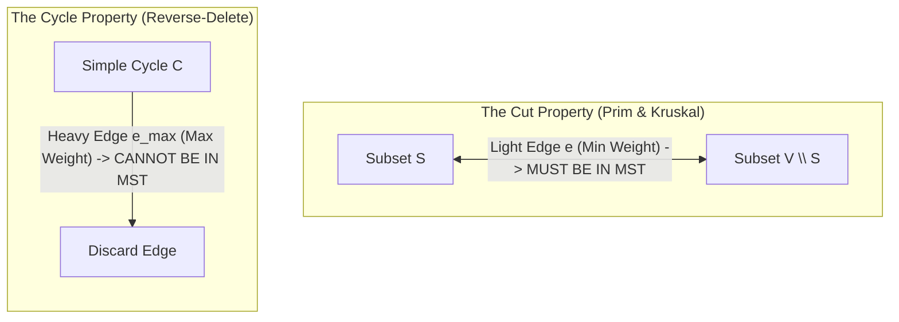
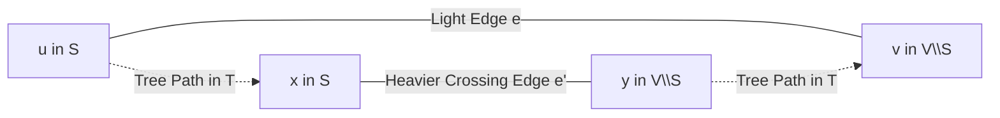
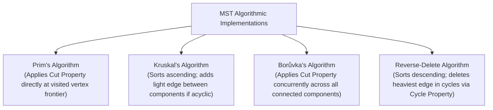

# Cut and Cycle Properties in Graphs and Spanning Trees

> [!NOTE]
> **The Dual Foundations of Spanning Trees:**
> The Minimum Spanning Tree (MST) problem is one of the oldest and most elegant problems in computer science.
> The correctness of every standard MST algorithm (Prim, Kruskal, Borůvka, Reverse-Delete) rests entirely on two complementary graph-theoretic principles:
> 1. **The Cut Property:** Greedily **includes** the cheapest edge crossing any cut.
> 2. **The Cycle Property:** Greedily **eliminates** the most expensive edge in any cycle.

> [!TIP]
> **Distinct Edge Weights Guarantee Uniqueness:**
> If all edge weights in an undirected connected graph $G = (V, E)$ are distinct, then $G$ possesses a **strictly unique Minimum Spanning Tree**.
> Under distinct edge weights:
> * Every cut has a unique minimum-weight crossing edge that *must* be in the MST.
> * Every simple cycle has a unique maximum-weight edge that *cannot* be in the MST.

> [!WARNING]
> **Tied Edge Weights and Multiple MSTs:**
> When edges have identical weights, the minimum crossing edge across a cut is not necessarily unique, and multiple distinct MSTs can exist.
> However, the Cut Property still guarantees that *at least one* MST contains the chosen light edge.

---

## 1. Formal Definitions

* **Cut:** A partition of the vertex set $V$ into two non-empty disjoint sets $(S, V \setminus S)$.
* **Crossing Edge:** An edge $e = (u, v) \in E$ such that $u \in S$ and $v \in V \setminus S$.
* **Light Edge:** A crossing edge across a cut $(S, V \setminus S)$ whose weight is minimal among all crossing edges.
* **Cycle:** A simple closed path $v_1 - v_2 - \dots - v_k - v_1$ with no repeated vertices except the endpoints.

---

## 2. The Cut Property

### 2.1 Formal Statement
> For any cut $(S, V \setminus S)$ in a connected, undirected graph $G$, let $e = (u, v)$ be a minimum-weight crossing edge. Then $e$ belongs to some Minimum Spanning Tree of $G$. If $e$ is the unique minimum-weight crossing edge, it belongs to *all* MSTs of $G$.

### 2.2 Proof via Exchange Argument

1. Let $T$ be an arbitrary MST of $G$.
2. **Case 1:** If $e \in T$, the property holds trivially.
3. **Case 2:** If $e \notin T$:
   * Because $T$ is a spanning tree, there exists a unique simple path $P$ in $T$ connecting $u$ and $v$.
   * Since $u \in S$ and $v \in V \setminus S$, the path $P$ must start in $S$ and end in $V \setminus S$.
   * Therefore, $P$ must cross the cut $(S, V \setminus S)$ at least once. Let $e' = (x, y)$ be an edge on $P$ that crosses the cut.
   * By definition of $e$ as the light edge:
     $$w(e) \le w(e')$$
   * Construct a new spanning subgraph:
     $$T' = (T \setminus \{e'\}) \cup \{e\}$$
   * **Validity:** Removing $e'$ disconnects $T$ into two trees $T_S$ and $T_{V \setminus S}$. Adding $e$ bridges them back into a single connected, acyclic spanning tree $T'$.
   * **Cost:** $w(T') = w(T) - w(e') + w(e) \le w(T)$.
   * Since $T$ was already minimal, we must have $w(T') = w(T)$, proving that $T'$ is also an MST containing $e$. $\blacksquare$

---

## 3. The Cycle Property

### 3.1 Formal Statement
> Let $C$ be any simple cycle in $G$, and let $e = (u, v)$ be the strictly heaviest edge on $C$. Then $e$ cannot belong to any Minimum Spanning Tree of $G$.

### 3.2 Proof by Contradiction and Exchange
1. Assume for contradiction that $e \in T$, where $T$ is an MST of $G$.
2. Removing $e$ disconnects $T$ into two connected components, defining a cut $(S, V \setminus S)$ where $u \in S$ and $v \in V \setminus S$.
3. Since $C$ is a cycle, there exists an alternative path along $C \setminus \{e\}$ connecting $u$ and $v$.
4. This alternative path must cross the cut $(S, V \setminus S)$ via some other edge $e' \in C$.
5. Since $e$ is the *strictly heaviest* edge on $C$:
   $$w(e') < w(e)$$
6. Construct $T' = (T \setminus \{e\}) \cup \{e'\}$.
7. $T'$ is a valid spanning tree, and its total weight is:
   $$w(T') = w(T) - w(e) + w(e') < w(T)$$
8. This contradicts the assumption that $T$ was an MST! Therefore, $e$ cannot belong to any MST. $\blacksquare$

---

## 4. Algorithmic Realizations

| Algorithm | Primary Principle | Time Complexity | Best Suited For |
| :--- | :--- | :--- | :--- |
| **Prim's Algorithm** | Cut Property | $O(E + V \log V)$ (Fibonacci heap) | Dense graphs ($E \approx V^2$) |
| **Kruskal's Algorithm** | Cut & Cycle Properties | $O(E \log E)$ (DSU) | Sparse graphs ($E \approx V$) |
| **Borůvka's Algorithm** | Concurrent Cut Property | $O(E \log V)$ | Parallel and distributed systems |
| **Reverse-Delete** | Cycle Property | $O(E \log V (\log \log V)^3)$ | Theoretical interest & connectivity audits |

---

## 5. Common Pitfalls & Anti-Patterns

### Anti-Pattern 1: Assuming the Heaviest Edge Across a Cut is Excluded
The Cycle Property applies to cycles, not cuts! A heavy edge across a cut *must* be included if it is the *only* bridge connecting $S$ to $V \setminus S$ (a graph bridge).

### Anti-Pattern 2: Unchecked Cycle Checks in Dense Graphs
Implementing Kruskal's algorithm using DFS/BFS to detect cycles ($O(V)$ per edge) instead of Disjoint-Set Union (DSU with near $O(1)$ inverse Ackermann $\alpha(V)$ amortized time).

---

## 6. Curated References

1. **Kruskal, Joseph B. (1956):** *On the shortest spanning subtree of a graph and the traveling salesman problem*.
2. **Prim, Robert C. (1957):** *Shortest connection networks and some generalizations*. Bell System Technical Journal.
3. **Tarjan, Robert E. (1983):** *Data Structures and Network Algorithms* (Chapter 6: Minimum Spanning Trees).
