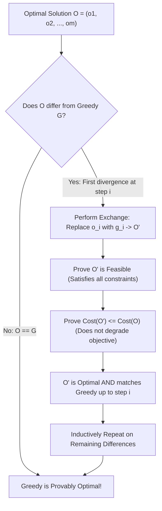
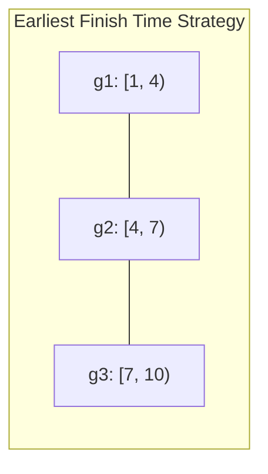

# Greedy Exchange Arguments

> [!NOTE]
> **The Anatomy of Greedy Proofs:**
> A greedy algorithm constructs a solution iteratively by making the locally optimal choice at each step without ever reconsidering.
> While greedy algorithms are easy to design, proving their correctness is notoriously difficult: local optimality frequently leads to global failure.
> The **Exchange Argument** is the universal mathematical technique used to prove greedy optimality:
> *Assume an optimal solution exists that differs from the greedy solution. Incrementally transform the optimal solution into the greedy solution by swapping elements, proving that each swap never degrades solution quality.*

> [!TIP]
> **The 5-Step Exchange Argument Blueprint:**
> 1. **Define the Candidates:** Let $G = \langle g_1, g_2, \dots, g_k \rangle$ be the greedy solution, and let $O = \langle o_1, o_2, \dots, o_m \rangle$ be an arbitrary optimal solution.
> 2. **Identify Divergence:** If $G = O$, we are done. Otherwise, let $i$ be the first index where $g_i \ne o_i$.
> 3. **Construct the Exchange:** Swap $o_i$ with $g_i$ in $O$ to produce a modified solution $O'$.
> 4. **Prove Validity and Feasibility:** Prove that $O'$ satisfies all problem constraints (e.g. non-overlapping intervals, capacity limits).
> 5. **Prove Non-Inferiority:** Prove that $\text{cost}(O') \le \text{cost}(O)$ (for minimization) or $\text{value}(O') \ge \text{value}(O)$ (for maximization).
> 6. **Inductive Conclusion:** By repeating this exchange at most $k$ times, $O$ transforms into $G$ without losing optimality. Therefore, $G$ is optimal!

> [!WARNING]
> **The Feasibility Trap:**
> Showing that $\text{value}(O') \ge \text{value}(O)$ is useless if $O'$ violates problem constraints!
> The hardest and most critical step in an exchange argument is proving that after the swap, $O'$ remains structurally valid (e.g., no interval overlaps or cycles created).

---

## 1. Classical Case Study 1: Interval Scheduling

**Problem:** Given $n$ intervals $[s_i, f_i)$, select the maximum cardinality subset of mutually compatible (non-overlapping) intervals.

**Greedy Strategy:** Sort intervals by earliest finish time ($f_i$) and greedily pick the next compatible interval.

### The Exchange Proof:
1. Let $G = \langle g_1, g_2, \dots, g_k \rangle$ be the greedy schedule.
2. Let $O = \langle o_1, o_2, \dots, o_m \rangle$ be an optimal schedule sorted by finish time, with $m \ge k$.
3. We prove by induction on $r$ that for all $r \le k$, there exists an optimal schedule whose first $r$ intervals match $G$.
4. **Base Case ($r = 1$):**
   By greedy definition, $g_1$ has the minimum finish time among all available intervals:
   $$f(g_1) \le f(o_1)$$
   Construct $O' = \{g_1\} \cup (O \setminus \{o_1\})$.
   Since $o_2, o_3, \dots, o_m$ start at or after $f(o_1) \ge f(g_1)$, $g_1$ cannot overlap with any subsequent interval in $O$.
   $O'$ is valid and $|O'| = |O| = m$. Thus $O'$ is optimal and shares $g_1$.
5. **Inductive Step ($r \to r+1$):**
   Assume $O$ matches $G$ for the first $r$ intervals ($o_1 = g_1, \dots, o_r = g_r$).
   Greedy selects $g_{r+1}$ with earliest finish time among intervals starting $\ge f(g_r)$.
   Since $o_{r+1}$ is also valid after $g_r$, $f(g_{r+1}) \le f(o_{r+1})$.
   Replacing $o_{r+1}$ with $g_{r+1}$ preserves compatibility with all intervals $o_{r+2}, \dots, o_m$.
   The resulting schedule is optimal.
6. **Termination:** Greedy cannot stop before $O$ ($k = m$), because if $k < m$, interval $o_{k+1}$ would be compatible after $g_k$, contradicting greedy's stopping condition. Thus $k = m$ and $G$ is optimal! $\blacksquare$

---

## 2. Classical Case Study 2: Minimizing Lateness (Scheduling)

**Problem:** Single machine, jobs with processing times $t_i$ and deadlines $d_i$. Minimize maximum lateness $L = \max_i (\text{finish}_i - d_i)$.

**Greedy Rule (Earliest Due Date - EDD):** Sort jobs by deadline $d_1 \le d_2 \le \dots \le d_n$.

### The Inversion Exchange Proof:
* An **inversion** in a schedule is a pair of adjacent jobs $(i, j)$ such that job $i$ runs immediately before job $j$, but $d_i > d_j$.
* Greedy (EDD) has **0 inversions**.
* Let $O$ be an optimal schedule with no idle time. If $O$ has inversions, there must exist at least one adjacent inversion $(i, j)$.
* Swapping adjacent jobs $(i, j)$ in $O$:
  * Job $j$ finishes earlier, so its lateness decreases.
  * Job $i$ finishes at the time job $j$ used to finish ($f_j$), so its lateness is $f_j - d_i < f_j - d_j$.
  * The maximum lateness of the swapped pair does not increase!
* Each adjacent swap strictly reduces the number of inversions by 1 without increasing maximum lateness.
* Therefore, the inversion-free greedy schedule EDD is globally optimal. $\blacksquare$

---

## 3. Decision Matrix: When Exchange Arguments Apply

| Algorithm Paradigm | Characteristic | Applicable Proof Method |
| :--- | :--- | :--- |
| **Greedy Interval Scheduling** | Earliest finish time | Exchange Argument (Step-by-step prefix swap) |
| **Kruskal / Prim MST** | Minimum edge across cut | Cut Property / Exchange Argument |
| **Huffman Coding** | Lowest frequency characters | Tree Structural Exchange |
| **0/1 Knapsack** | Indivisible items | **Exchange FAILS** (Requires Dynamic Programming) |
| **Longest Path in DAG** | Substructure sharing | Topological DP (Greedy fails) |

---

## 4. Common Pitfalls & Anti-Patterns

### Anti-Pattern 1: Forgetting to Prove Equal Cardinality / Termination
Proving that $G$ matches $O$ on element values, but forgetting to prove that $G$ doesn't terminate prematurely (e.g. missing intervals in the schedule).

### Anti-Pattern 2: Non-Adjacent Swaps in Ordering Proofs
Attempting to swap arbitrary non-adjacent jobs in scheduling problems. Non-adjacent swaps shift all intermediate jobs, which can drastically increase intermediate lateness. Always swap **adjacent inversions** to isolate perturbations.

---

## 5. Curated References

1. **Kleinberg & Tardos:** *Algorithm Design* (Chapter 4: Greedy Algorithms & Exchange Arguments).
2. **CLRS:** *Introduction to Algorithms* (Chapter 16: Greedy Algorithms).
3. **Roughgarden, Tim:** *Algorithms Illuminated (Part 3: Greedy Algorithms and Dynamic Programming)*.
