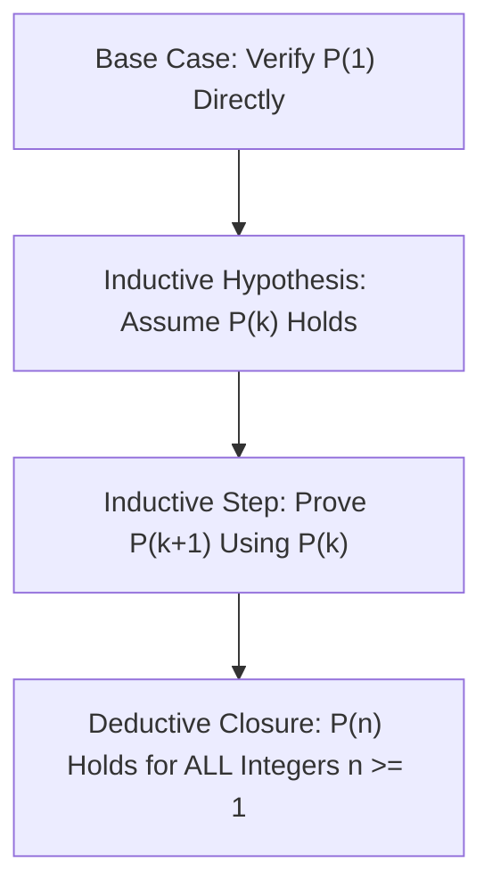
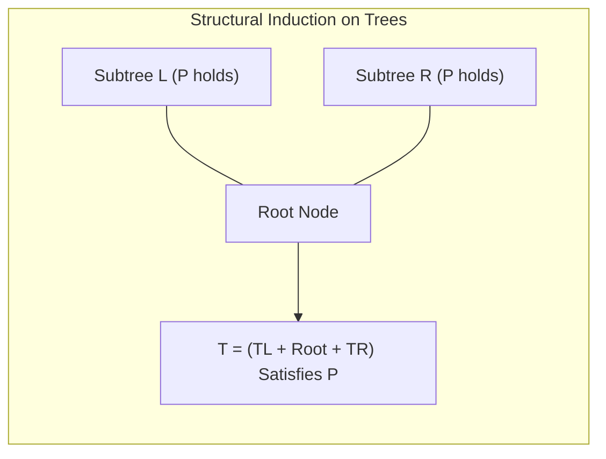
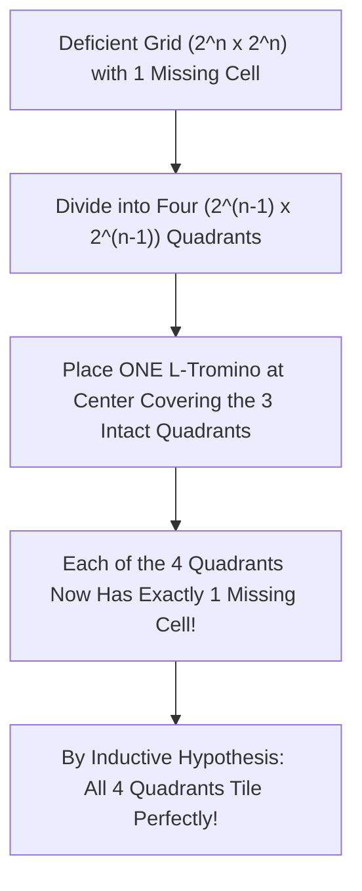

# Mathematical Induction in Algorithm Correctness

> [!NOTE]
> **The Foundation of Recursive Correctness:**
> Mathematical induction is the deductive engine that mirrors recursive computation.
> While loop invariants prove iterative algorithms, **mathematical induction** proves recursive algorithms, divide-and-conquer paradigms, and structural properties of trees and graphs.
> Every recursive function with a terminating base case is an executable inductive proof:
> $$\text{Base Case: } P(n_0) \quad \land \quad \text{Inductive Step: } (\forall k \ge n_0, P(k) \implies P(k+1)) \implies \forall n \ge n_0, P(n)$$

> [!TIP]
> **Strong Induction for Divide-and-Conquer:**
> When an algorithm breaks a problem of size $n$ into subproblems of arbitrary sizes $k < n$ (e.g. Merge Sort splitting $n \to \lfloor n/2 \rfloor, \lceil n/2 \rceil$, or QuickSelect), standard weak induction fails because the step does not transition from $n-1 \to n$.
> **Strong Induction** resolves this by assuming the predicate holds for **all** strictly smaller inputs:
> $$\left( \forall k < n, P(k) \right) \implies P(n)$$

> [!WARNING]
> **The False Base Case Trap:**
> The most infamous failure in inductive arguments is proving an inductive step that relies on transitions that do not hold for the smallest base cases (e.g. George Pólya's "All horses are the same color" paradox, which fails at the transition from $n = 1$ to $n = 2$).
> Always verify the base case up to the smallest $n$ where the inductive machinery is fully active.

---

## 1. The Three Flavors of Induction in Computer Science

### 1.1 Weak Induction (Step-by-Step)
Used for linear recursive structures (linked lists, iterative loops, monotonic counters):
* **Base Case:** Prove $P(0)$.
* **Hypothesis:** Assume $P(k)$ holds for an arbitrary $k \ge 0$.
* **Step:** Prove $P(k+1)$ holds.

### 1.2 Strong Induction (Complete Induction)
Essential for divide-and-conquer, binary trees, dynamic programming:
* **Base Case:** Prove $P(n_0)$ (and $P(n_0 + 1)$ if needed).
* **Hypothesis:** Assume $P(j)$ holds for all $n_0 \le j \le k$.
* **Step:** Prove $P(k+1)$ holds using the truth of earlier states.

### 1.3 Structural Induction
Used for inductively defined algebraic data structures:
* **Base Case:** Property holds for empty structures or leaf nodes.
* **Hypothesis:** Property holds for child subtrees $T_L$ and $T_R$.
* **Step:** Property holds for composite tree $T = \text{Node}(\text{value}, T_L, T_R)$.

---

## 2. Canonical Case Study 1: Correctness of Merge Sort

**Theorem:** For any array $A$ of length $n \ge 1$, $\text{MergeSort}(A)$ returns a permutation of $A$ in non-decreasing order.

* **Base Case ($n = 1$):**
  An array with a single element is sorted by definition. $\text{MergeSort}$ immediately returns $A$. Predicate $P(1)$ holds.
* **Inductive Hypothesis:**
  Assume $\text{MergeSort}$ correctly sorts any array of length $k$ for all $1 \le k < n$.
* **Inductive Step (Size $n$):**
  1. The array is split into two halves: $A_L$ of size $\lfloor n/2 \rfloor$ and $A_R$ of size $\lceil n/2 \rceil$.
  2. Because $n \ge 2$, both $\lfloor n/2 \rfloor < n$ and $\lceil n/2 \rceil < n$.
  3. By the inductive hypothesis, $\text{MergeSort}(A_L)$ and $\text{MergeSort}(A_R)$ correctly return sorted subarrays.
  4. The merge subroutine combines two sorted arrays into a single sorted array of size $n$ (proven via loop invariant).
  5. Therefore, $P(n)$ holds for all $n \ge 1$. $\blacksquare$

---

## 3. Canonical Case Study 2: Constructive Tromino Tiling

**Theorem:** Any $2^n \times 2^n$ grid with exactly one arbitrary square removed (a deficient board) can be completely tiled using $L$-trominoes (3-square tiles).

* **Base Case ($n = 1$):** A $2 \times 2$ grid has 4 cells. With 1 cell removed, exactly 3 cells remain in an $L$-shape, which is covered by exactly one $L$-tromino. $P(1)$ holds.
* **Inductive Hypothesis:** Assume any $2^{k} \times 2^{k}$ deficient board can be tiled.
* **Inductive Step (Grid $2^{k+1} \times 2^{k+1}$):**
  1. Decompose the board into four quadrants of size $2^k \times 2^k$.
  2. The missing cell resides in exactly one quadrant $Q_{\text{def}}$.
  3. Place a single $L$-tromino at the intersection of the other three intact quadrants at the center.
  4. Now, all four quadrants are $2^k \times 2^k$ grids each missing exactly one cell.
  5. By the inductive hypothesis, all four quadrants can be tiled completely.
  6. Thus, $P(k+1)$ holds. $\blacksquare$

---

## 4. Inductive Proof vs Program Implementation Mapping

| Mathematical Concept | Algorithmic Equivalent |
| :--- | :--- |
| **Base Case ($P(0), P(1)$)** | Recursive termination guard (`if (n <= 1) return;`) |
| **Inductive Hypothesis** | Recursive contract / Precondition guarantee |
| **Inductive Step ($k \to k+1$)** | Combining subproblem solutions (`merge()`, partition) |
| **Well-Ordering Principle** | Guarantee of termination (decreasing recursion depth) |

---

## 5. Common Pitfalls & Anti-Patterns

### Anti-Pattern 1: Inadequate Base Cases in Multi-Step Recurrences
Proving a property that depends on two prior steps ($P(k+1)$ depends on $P(k)$ and $P(k-1)$, such as Fibonacci) while only checking a single base case ($n = 0$). You must verify both $P(0)$ and $P(1)$ to anchor the two-step dependency.

### Anti-Pattern 2: Hidden Division by Zero in Geometric Steps
Proving statements of the form $\sum_{i=0}^n r^i = \frac{r^{n+1}-1}{r-1}$ without isolating the singular case $r = 1$ in the base case analysis.

---

## 6. Curated References

1. **Donald Knuth:** *Concrete Mathematics: A Foundation for Computer Science* (Chapter 1: Recurrent Problems).
2. **Cormen, Leiserson, Rivest, Stein (CLRS):** *Introduction to Algorithms* (Mathematical Background & Induction).
3. **George Pólya:** *How to Solve It* (Induction and Analogy in Mathematics).
