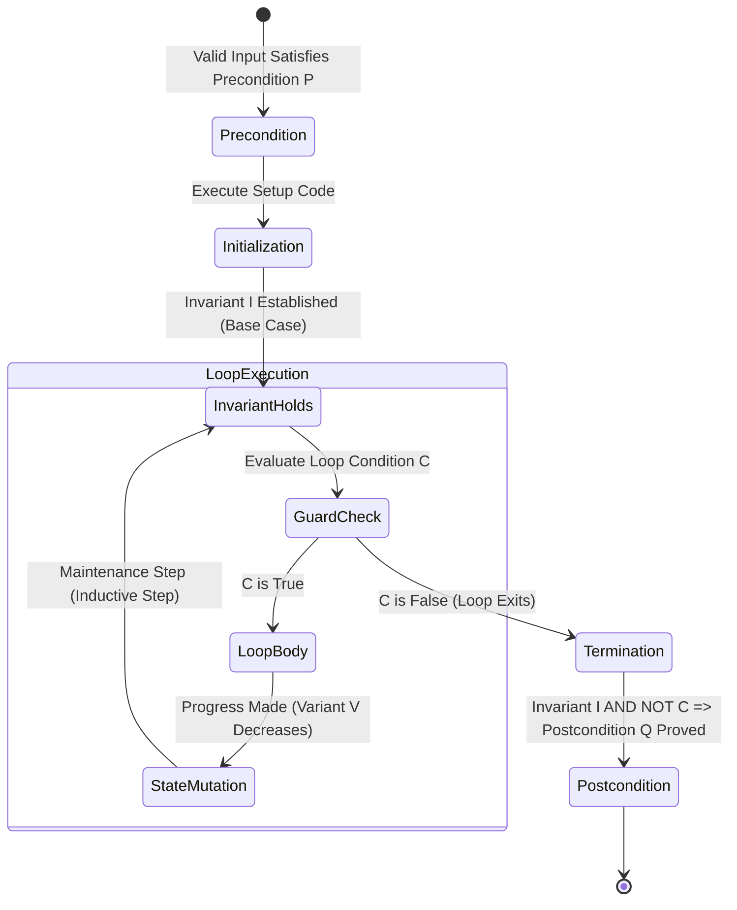
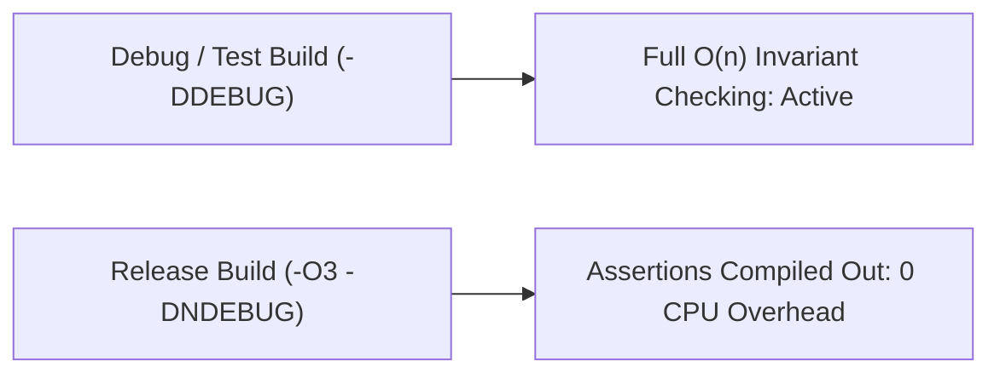

# Loop Invariants and Correctness

> [!NOTE]
> **The Inductive Engine of Iterative Verification:**
> In computer science, an algorithm is correct if it halts and produces the mathematically expected result for all valid inputs.
> A **loop invariant** is a formal predicate $I$ over program variables that captures the structural progress of an iterative algorithm.
> Like mathematical induction, proving correctness via loop invariants requires establishing three formal obligations:
> 1. **Initialization:** $I$ is true prior to the first loop iteration.
> 2. **Maintenance:** If $I$ is true before an iteration and the loop guard holds, $I$ remains true after the iteration.
> 3. **Termination:** When the loop terminates, the conjunction of the invariant and the negated loop guard ($I \land \neg C$) establishes the algorithmic postcondition.

> [!TIP]
> **Loop Variants Guarantee Finite Termination:**
> While an invariant proves *partial correctness* (if the loop stops, the result is correct), a **loop variant** proves *total correctness* (the loop is guaranteed to stop).
> A loop variant is an integer quantity $V(\text{state}) \in \mathbb{N}$ such that:
> 1. $V$ strictly decreases with each iteration: $V_{k+1} < V_k$.
> 2. The loop continues only while $V \ge 0$.
> By the Well-Ordering Principle of $\mathbb{N}$, no sequence of non-negative integers can decrease infinitely; therefore, the loop must terminate in at most $V_0$ steps.

> [!WARNING]
> **The Boundary State Off-by-One Trap:**
> Invariants are frequently broken at the loop termination boundary.
> For example, in binary search over array $A[0 \dots n-1]$:
> If the loop condition is `while (low <= high)`, upon termination $low = high + 1$.
> If an implementation checks $A[low]$ or $A[high]$ without guarding against out-of-bounds indices, it produces undefined memory access. The termination assertion must strictly handle empty residual intervals.



---

## 1. The Three Hoare Logic Invariant Obligations

Let $P$ be the precondition, $Q$ be the postcondition, $C$ be the loop condition (guard), and $I$ be the invariant.

$$\{P\} \quad \text{Init} \quad \{I\} \quad \text{\textbf{while} } C \text{ \textbf{do} } \{I \land C\} \quad \text{Body} \quad \{I\} \quad \{I \land \neg C\} \implies Q$$

### 1.1 Initialization (Base Case)
Must show that the invariant $I$ holds immediately after variable initialization and before the loop guard $C$ is evaluated for the first time.

### 1.2 Maintenance (Inductive Step)
Must show that if $I$ holds before an iteration and the loop guard $C$ is satisfied, the execution of the loop body leaves $I$ true at the end of the iteration.

### 1.3 Termination (Conclusion)
Must show that:
1. The loop guard eventually becomes false (finite termination via loop variant).
2. Upon exit, the combination of $I$ and $\neg C$ logically implies the desired output specification $Q$.

---

## 2. Canonical Case Studies

### 2.1 Insertion Sort Correctness Proof

```cpp
void insertion_sort(std::vector<int>& A) {
    for (size_t i = 1; i < A.size(); ++i) {
        int key = A[i];
        int j = static_cast<int>(i) - 1;
        while (j >= 0 && A[j] > key) {
            A[j + 1] = A[j];
            --j;
        }
        A[j + 1] = key;
    }
}
```

- **Invariant $I(i)$:** At the start of each iteration of the outer `for` loop, the subarray $A[0 \dots i-1]$ consists of the elements originally in $A[0 \dots i-1]$, but in monotonically sorted order.
- **Initialization:** Prior to the first iteration ($i = 1$), the subarray $A[0 \dots 0]$ consists of a single element, which is trivially sorted. $I(1)$ holds.
- **Maintenance:** The inner `while` loop shifts elements $A[i-1], A[i-2], \dots$ that are greater than `key` right by one position until the correct insertion position $j+1$ is found. Placing `key` at $A[j+1]$ produces a sorted subarray $A[0 \dots i]$. Incrementing $i$ preserves $I(i+1)$.
- **Termination:** The loop terminates when $i = n$. By the invariant, $A[0 \dots n-1]$ consists of the original elements in sorted order. The entire array is sorted. $\blacksquare$

---

### 2.2 Binary Search Invariant & Termination

```cpp
int binary_search(const std::vector<int>& A, int target) {
    int low = 0;
    int high = static_cast<int>(A.size()) - 1;

    // Invariant: If target in A, target in A[low .. high]
    while (low <= high) {
        int mid = low + (high - low) / 2;
        if (A[mid] == target) return mid;
        else if (A[mid] < target) low = mid + 1;
        else high = mid - 1;
    }
    return -1;
}
```

- **Invariant $I(\text{low}, \text{high})$:** If `target` exists anywhere in $A$, it must be located within index range $[\text{low}, \text{high}]$.
- **Loop Variant:** $V(\text{low}, \text{high}) = \text{high} - \text{low} + 1$.
- **Initialization:** $\text{low} = 0, \text{high} = n - 1$. The interval $[0, n-1]$ covers the entire array. $I(0, n-1)$ holds.
- **Maintenance:**
  - If $A[\text{mid}] < \text{target}$: Because $A$ is sorted, $\forall k \le \text{mid}, A[k] \le A[\text{mid}] < \text{target}$. The target cannot exist in $A[0 \dots \text{mid}]$. Setting $\text{low} = \text{mid} + 1$ preserves the invariant.
  - If $A[\text{mid}] > \text{target}$: Target cannot exist in $A[\text{mid} \dots n-1]$. Setting $\text{high} = \text{mid} - 1$ preserves the invariant.
  - In both cases, $V$ strictly decreases by at least $\lceil V/2 \rceil$.
- **Termination:** The loop terminates either when $A[\text{mid}] == \text{target}$ (returning correct index), or when $\text{low} > \text{high}$ ($V \le 0$). When $\text{low} > \text{high}$, the candidate interval $[\text{low}, \text{high}]$ is empty. By the invariant, the target cannot exist in $A$. Returning $-1$ is correct. $\blacksquare$

---

### 2.3 Two Pointers: Container with Most Water

Given non-negative heights $H[0 \dots n-1]$. Maximize $(j - i) \cdot \min(H[i], H[j])$.

```cpp
int max_area(const std::vector<int>& H) {
    int l = 0, r = static_cast<int>(H.size()) - 1;
    int best = 0;
    while (l < r) {
        best = std::max(best, (r - l) * std::min(H[l], H[r]));
        if (H[l] < H[r]) ++l;
        else --r;
    }
    return best;
}
```

- **Invariant:** The global maximum container is either stored in `best`, or its boundaries lie strictly within $[l, r]$.
- **Maintenance Proof:**
  Assume $H[l] < H[r]$. Any container formed by pairing $l$ with an interior index $k \in (l, r)$ has width $k - l < r - l$ and height $\min(H[l], H[k]) \le H[l] = \min(H[l], H[r])$.
  Therefore:
  $$\text{Area}(l, k) \le (k - l) \cdot H[l] < (r - l) \cdot H[l] = \text{Area}(l, r) \le \text{best}$$
  No container involving $l$ can ever beat `best`. Discarding $l$ by executing `++l` preserves the invariant.

---

## 3. Runtime Verification via Invariant Instrumentation

In high-reliability systems and safety-critical software, invariants are translated into executable runtime assertions enabled in test builds:

```cpp
#ifndef NDEBUG
#define ASSERT_INVARIANT(expr) assert(expr)
#else
#define ASSERT_INVARIANT(expr) ((void)0)
#endif
```



---

## 4. Common Pitfalls & Anti-Patterns

### Anti-Pattern 1: Weak Invariants That Fail to Prove Postconditions
An invariant stating merely that variables are within bounds (e.g., $0 \le i < n$) is true, but too weak to deduce correctness at termination. An invariant must capture the **cumulative work completed** by prior iterations (e.g., "all elements in $A[0 \dots i-1]$ are in sorted order").

### Anti-Pattern 2: Invariant Invalidation During State Transitions
Modifying one array element without immediately restoring associated balance metadata creates a window where intermediate invariants fail. Always execute mutations atomically or guard assertions after complete state restoration.

---

## 5. Curated References & Related Problems

1. **CLRS Chapter 2.1:** *Insertion Sort and Loop Invariants*.
2. **David Gries:** *The Science of Programming* (Formal derivation of programs from invariants).
3. **LeetCode 11:** *Container With Most Water* (Two-pointer elimination invariant).
4. **LeetCode 26:** *Remove Duplicates from Sorted Array* (Slow/fast pointer invariant).
5. **LeetCode 283:** *Move Zeroes* (Partition invariant maintenance).
