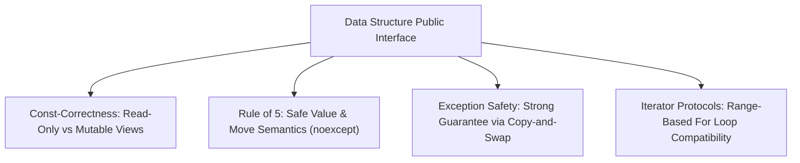
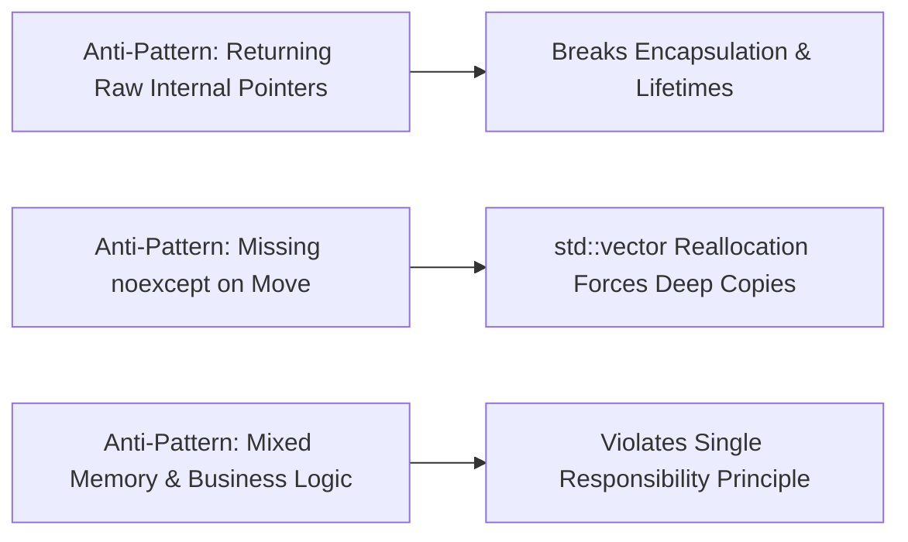

# API Design for Data Structures

> [!NOTE]
> **The Dual Obligations of a Data Structure API:**
> A great data structure is more than an asymptotic complexity guarantee. Its public interface must satisfy two competing demands:
> 1. **Ergonomic Safety:** Prevent user errors, memory corruption, and undefined behavior at compile-time.
> 2. **Mechanical Sympathy:** Impose **zero runtime overhead** over raw pointer manipulation (C++ Zero-Overhead Principle: *what you don't use, you don't pay for*).

> [!TIP]
> **The Rule of 5 and Idiomatic Resource Management:**
> Any C++ class managing dynamic heap memory must explicitly implement the **Rule of 5**:
> * Destructor (`~T()`)
> * Copy Constructor (`T(const T&)`)
> * Copy Assignment Operator (`T& operator=(const T&)`)
> * Move Constructor (`T(T&&) noexcept`)
> * Move Assignment Operator (`T& operator=(T&&) noexcept`)
> *Marking move constructors and move assignments as `noexcept` is mandatory*; otherwise standard containers (`std::vector`) will silently fall back to slow deep copies during reallocations.

> [!WARNING]
> **The Exception Safety Hierarchy:**
> An operation that mutates a data structure must guarantee one of three formal exception safety levels:
> 1. **Basic Guarantee:** Invariants hold and no memory is leaked, but the structure's state may be changed to an arbitrary valid state.
> 2. **Strong Guarantee (Commit-or-Rollback):** If an exception is thrown, state is rolled back exactly as if the operation never occurred (achieved via the **Copy-and-Swap idiom**).
> 3. **Nothrow Guarantee (`noexcept`):** The operation is guaranteed to never throw under any condition (essential for destructors, swaps, and moves).



---

## 1. Ergonomic Resource Management: The Copy-and-Swap Idiom

The Copy-and-Swap idiom provides both the strong exception guarantee and eliminates duplicate code between copy and move assignment operators:

```cpp
template <typename T>
class ArrayBuffer {
private:
    T* data_ = nullptr;
    size_t size_ = 0;

public:
    // Move Constructor (Nothrow)
    ArrayBuffer(ArrayBuffer&& other) noexcept
        : data_(other.data_), size_(other.size_) {
        other.data_ = nullptr;
        other.size_ = 0;
    }

    // Unified Assignment Operator (Pass by value invokes copy or move constructor!)
    ArrayBuffer& operator=(ArrayBuffer other) noexcept {
        swap(*this, other);
        return *this;
    }

    friend void swap(ArrayBuffer& first, ArrayBuffer& second) noexcept {
        using std::swap;
        swap(first.data_, second.data_);
        swap(first.size_, second.size_);
    }
};
```

---

## 2. Const-Correctness and Overloading

A well-designed container must expose pairs of const and non-const member accessors:

```cpp
// Non-const overload: Allows reading and mutating
T& operator[](size_t index) {
    return data_[index];
}

// Const overload: Allows read-only access on const instances
const T& operator[](size_t index) const {
    return data_[index];
}
```
Failing to provide `const` overloads prevents the container from being passed into `const&` functions, breaking composability.

---

## 3. Standard Iterator Protocol Support

To allow idiomatic modern range loops (`for (auto& item : container)`), expose `begin()` and `end()` pointer or iterator adapters:

```cpp
T* begin() noexcept { return data_; }
T* end() noexcept { return data_ + size_; }

const T* begin() const noexcept { return data_; }
const T* end() const noexcept { return data_ + size_; }
const T* cbegin() const noexcept { return data_; }
const T* cend() const noexcept { return data_ + size_; }
```

---

## 4. API Design Anti-Patterns



### Anti-Pattern 1: Leaking Raw Resource Handles
Exposing `T* get_raw_storage()` without restricting access. If external code modifies pointers or frees memory, the container's internal invariants collapse.

### Anti-Pattern 2: Allocating in Move Constructors
Move constructors should strictly transfer ownership of existing pointers (`noexcept`). Performing dynamic allocation inside a move constructor introduces points of failure, preventing the compiler from applying move optimizations.

---

## 5. Curated References

1. **Scott Meyers:** *Effective Modern C++* (Items 11, 14, 17 on Rule of 5 and noexcept).
2. **Herb Sutter:** *Exceptional C++* (Exception Safety & Copy-and-Swap Idiom).
3. **Bjarne Stroustrup:** *The C++ Programming Language* (Resource Management & Zero-Overhead Principle).
