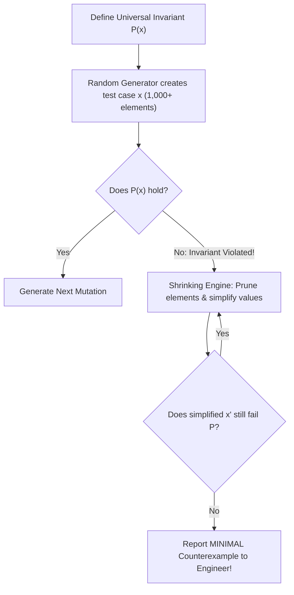

# Fuzzing and Property-Based Testing

> [!NOTE]
> **Beyond Example-Based Unit Testing:**
> Traditional unit tests test specific, hand-crafted input/output pairs:
> $$\text{assert}(\text{sort}([3, 1, 2]) == [1, 2, 3])$$
> While useful for smoke testing, human authors consistently fail to anticipate pathological edge cases (e.g. integer overflows, cycle-inducing deletions, deep skewing).
> **Property-Based Testing** inverts this relationship:
> *The engineer defines universal mathematical invariants that must hold for ALL inputs, and a randomized engine generates tens of thousands of pseudo-random test vectors trying to break them.*

> [!TIP]
> **The Four Fundamental Algebraic Properties:**
> 1. **Idempotence:** Applying an operation twice produces the same result as applying it once:
>    $$\text{sort}(\text{sort}(A)) \equiv \text{sort}(A) \quad \text{and} \quad \text{insert}(S, x); \text{insert}(S, x) \equiv \text{insert}(S, x)$$
> 2. **Round-Trip (Inverses):** An operation followed by its dual restores the original state:
>    $$\text{deserialize}(\text{serialize}(T)) \equiv T \quad \text{and} \quad \text{pop}(\text{push}(Q, x)) \equiv x$$
> 3. **Commutativity / Order Independence:** The order of commutative mutations does not alter the final state:
>    $$\text{insert}(S, a); \text{insert}(S, b) \equiv \text{insert}(S, b); \text{insert}(S, a)$$
> 4. **Monotonicity:** An ordered transformation preserves relations:
>    $$x \le y \implies f(x) \le f(y)$$

> [!WARNING]
> **The Necessity of Counterexample Shrinking:**
> If a fuzzer breaks an invariant on an input array containing 10,000 randomized integers, debugging the failure is nearly impossible.
> A proper property-testing harness must implement **test-case shrinking**: iteratively pruning, halving, and reducing the failing input until it discovers the **minimal failing counterexample** (e.g., a 2-element array `[0, -1]`).

---

## 1. Property-Based Testing vs Coverage-Guided Fuzzing

| Dimension | Property-Based Testing (QuickCheck / Hypothesis) | Coverage-Guided Fuzzing (AFL++ / libFuzzer) |
| :--- | :--- | :--- |
| **Input Generation** | Type-directed generators (integers, trees, graphs). | Raw byte mutation (bit flips, chunk deletions, splicing). |
| **Feedback Mechanism** | Black-box random generation with shrinking. | Grey-box feedback: tracks new branches/edges in binary. |
| **Primary Target** | Logical correctness, algebraic invariants. | Crash detection, memory corruption, buffer overflows. |
| **Execution Speed** | 1,000 – 10,000 tests/sec in memory. | 50,000+ executions/sec via persistent in-process fuzzing. |

---

## 2. The Mechanics of Counterexample Shrinking

When an assertion fails on candidate input $X$, the shrinker applies a hierarchy of reduction heuristics:

1. **Length Reduction:** Attempt to discard the first half or second half of the sequence. If the failure persists, discard that half permanently.
2. **Element Pruning:** Remove individual elements one by one.
3. **Value Simplification:** Replace large integers with $0$, $1$, or $-1$, or subtract powers of two toward zero.

---

## 3. Property Testing State Machines (Model-Based Testing)

For complex data structures (e.g., Concurrent Queues, B-Trees, LSM-Trees):
1. Maintain an abstract reference model $M$ (e.g., a simple `std::vector` or hash map).
2. Generate an arbitrary sequence of commands: `[Insert(5), Delete(3), Find(5), Clear(), ...]`.
3. Execute each command on both the candidate and model:
   $$\text{Candidate}.\text{execute}(c) \equiv \text{Model}.\text{execute}(c)$$
4. Assert that the candidate's postcondition matches the model at every step.

---

## 4. Common Pitfalls & Anti-Patterns

### Anti-Pattern 1: Re-implementing the Algorithm Inside the Property
Writing a property for `my_sort(A)` as: `assert(my_sort(A) == reference_sort(A))`.
While useful, this is differential testing, not pure property testing. Pure property testing checks intrinsic mathematical truths:
1. `len(sorted_A) == len(A)`
2. `is_sorted(sorted_A)`
3. `is_permutation(sorted_A, A)`

### Anti-Pattern 2: Non-Deterministic Seeds Without Reproducibility
Running property tests with unrecorded random seeds. When CI fails once every 10,000 runs, you cannot debug the failure without the seed! Always log:
`Property test failed with SEED: 0xDEADBEEF42ULL`.

---

## 5. Curated References

1. **Claessen & Hughes (2000):** *QuickCheck: A Lightweight Tool for Random Testing of Haskell Programs*. ICFP.
2. **MacIver, David (Hypothesis Lead):** *In-Depth Property-Based Testing and Test-Case Reduction*.
3. **Zalewski, Michal (lcamtuf):** *American Fuzzy Lop (AFL) Technical Whitepaper*.
4. **LLVM Compiler Infrastructure:** *libFuzzer: A library for coverage-guided fuzz testing*.
