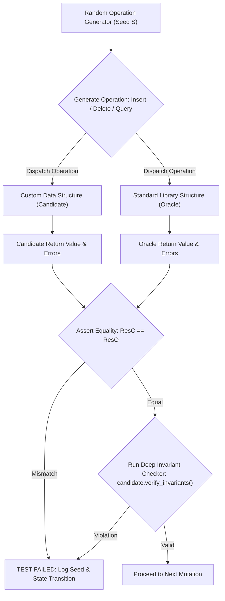
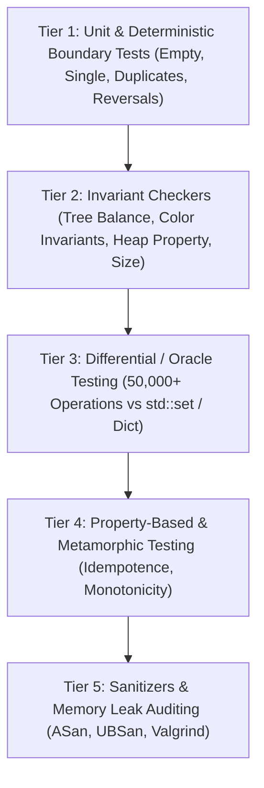

# Testing Data Structures

> [!NOTE]
> **The State-Space Explosion in Mutable Structures:**
> Unlike stateless pure functions ($f(x) = y$), data structures are stateful, mutable state machines.
> A data structure's behavior depends not only on the current operation and input arguments, but on the entire sequence of prior mutations:
> $$S_k = \delta(S_{k-1}, \text{op}_k, \text{arg}_k)$$
> A data structure supporting 10 operations over an alphabet of 1,000 keys produces an astronomically large state graph.
> Unit testing alone cannot uncover deep corner cases resulting from complex operation histories (e.g., node deletions triggering double rotations in AVL trees or cascaded node mergers in B-Trees).

> [!TIP]
> **Differential Testing Against Reference Models (Oracles):**
> The most powerful technique for validating custom, high-performance data structures is **differential testing** (dual execution):
> 1. Execute identical sequences of randomized operations on both the custom candidate structure $C$ and an existing, battle-tested standard library oracle $O$ (e.g., custom AVL tree vs `std::set`, custom heap vs `std::priority_queue`).
> 2. After every mutation or query, assert that candidate returns identical values to the oracle:
>    $$\forall \text{op}: C.\text{execute}(\text{op}) \equiv O.\text{execute}(\text{op})$$
> 3. Verify candidates internal invariants (tree balance, heap property, size counters) after each mutation.

> [!WARNING]
> **The Seed Logging Imperative in Randomized Testing:**
> Randomized stress tests and fuzzers are useless if failures cannot be reproduced.
> Never seed pseudo-random number generators with unrecorded entropy (`std::random_device()` without logging).
> Always record the initial 64-bit seed at test startup. When an assertion fails, print the seed, the sequence index, and the minimal operation sequence required to reproduce the regression.



---

## 1. The Multi-Tier Testing Pyramid for Data Structures

Verifying stateful data structures requires a layered verification architecture:



---

## 2. Invariant Checkers (Self-Verification)

Every robust data structure implementation should expose a non-public or conditionally compiled verification method (e.g., `bool verify_invariants() const`).

### 2.1 Binary Search Tree Invariants
For any node $u$:
1. **Ordering Invariant:** $\forall x \in \text{Left}(u): x.\text{key} < u.\text{key}$ and $\forall y \in \text{Right}(u): y.\text{key} > u.\text{key}$.
2. **Structural Balance Invariant (AVL):** $|\text{height}(\text{Left}(u)) - \text{height}(\text{Right}(u))| \le 1$.
3. **Subtree Size Invariant (Order-Statistic Tree):** $u.\text{size} = 1 + \text{size}(\text{Left}(u)) + \text{size}(\text{Right}(u))$.
4. **Pointer Consistency Invariant:** If $u.\text{left} \ne \text{null}$, then $u.\text{left}.\text{parent} \equiv u$.

```cpp
bool verify_avl_invariants(const Node* root) {
    if (!root) return true;
    
    // Check height metadata correctness
    int lh = root->left ? root->left->height : 0;
    int rh = root->right ? root->right->height : 0;
    if (root->height != 1 + std::max(lh, rh)) return false;
    
    // Check balance factor within [-1, 1]
    if (std::abs(lh - rh) > 1) return false;
    
    // Check BST key ordering
    if (root->left && root->left->key >= root->key) return false;
    if (root->right && root->right->key <= root->key) return false;
    
    return verify_avl_invariants(root->left) && verify_avl_invariants(root->right);
}
```

---

## 3. Differential Testing (Dual-Execution with Oracles)

### 3.1 Choosing the Oracle
An oracle is an alternate implementation of the abstract data type (ADT) whose correctness is trusted:
- **Custom AVL / Red-Black Tree Candidate** $\implies$ Oracle: `std::set<T>` or `std::map<K, V>`.
- **Custom Min-Heap / Fibonacci Heap Candidate** $\implies$ Oracle: `std::priority_queue<T, std::vector<T>, std::greater<T>>` or sorted array.
- **Custom Disjoint-Set Union (DSU) Candidate** $\implies$ Oracle: BFS component search on an adjacency list.
- **Custom Suffix Automaton / Trie Candidate** $\implies$ Oracle: Quadratic substring matching (`std::string::find`).

### 3.2 Operation Generation Distribution
A naive generator that only inserts elements will rarely trigger deletion rotations or underflow handling.
A realistic test generator defines a weighted probability distribution over valid ADT operations:

| Operation | Typical Weight | Purpose |
| :--- | :--- | :--- |
| `Insert(random_key)` | 40% | Expands state space, triggers tree splits and rotations. |
| `Delete(random_key)` | 30% | Shrinks tree, triggers node merging, successor swaps. |
| `Find / Contains(key)` | 20% | Verifies lookup correctness across existing and non-existing keys. |
| `RangeQuery / LowerBound` | 10% | Tests iterator traversal and boundary comparison semantics. |

---

## 4. Metamorphic Testing

When an oracle is unavailable or prohibitively slow, **metamorphic testing** checks relationships between related inputs and outputs rather than absolute correctness:

1. **Order Independence:** Inserting a set of keys in random order $P_1$ vs sorted order $P_2$ must yield identical in-order traversals:
   $$\text{Traverse}(\text{Build}(P_1)) \equiv \text{Traverse}(\text{Build}(P_2))$$
2. **Idempotence:** Inserting an existing key in a unique-key set must not alter tree structure or size:
   $$\text{Insert}(S, k) = S \quad \forall k \in S$$
3. **Round-Trip Reversibility:** Deleting an element immediately after insertion must restore the original set size:
   $$k \notin S \implies |S \cup \{k\} \setminus \{k\}| = |S|$$

---

## 5. Decision Matrix: Testing Techniques Comparison

| Testing Strategy | Strengths | Limitations | Best Used For |
| :--- | :--- | :--- | :--- |
| **Deterministic Unit Tests** | Fast, repeatable, documents API usage directly in CI. | Poor coverage of deep pathological state mutations. | Smoke testing, boundary condition verification (empty, null). |
| **Differential (Oracle) Testing** | Uncovers subtle state-machine discrepancies in millions of ops. | Requires an existing trusted reference implementation. | Trees, Heaps, Hash Tables, Graph algorithms. |
| **Internal Invariant Assertions** | Fails at the exact line of code where the invariant broke. | Overhead in production if not disabled via `#ifndef NDEBUG`. | Complex rebalancing logic (Red-Black, AVL, Splay, B-Tree). |
| **Memory Sanitizers (ASan/UBSan)** | Catches use-after-free, dangling pointers, memory leaks, signed overflows. | Increases runtime overhead (2x–3x slow down). | Raw pointer structures, custom allocators, intrusive lists. |

---

## 6. Common Pitfalls & Anti-Patterns

### Anti-Pattern 1: Static Tests with Constant Sequences
Testing an AVL tree by inserting $1, 2, \dots, 10$ and deleting $1, 2, \dots, 10$.
This only tests right-heavy cascades and simple leaf deletions, completely missing double-rotation corner cases (Left-Right and Right-Left) triggered when deleting internal nodes with two children.

### Anti-Pattern 2: Missing the Empty and Boundary Edge Cases
Testing with thousands of elements but neglecting:
- Querying an empty structure (`find`, `min`, `max`, `pop`).
- Deleting the only element in a structure.
- Inserting duplicate keys when duplicates are disallowed.
- Re-inserting previously deleted keys.

### Anti-Pattern 3: Inadequate Memory Reclamation Checks
Verifying that `size == 0` without checking whether nodes were actually deallocated. In C/C++, use AddressSanitizer (`-fsanitize=address`) and leak checking to ensure zero allocated bytes remain upon destruction.

---

## 7. Curated References & Related Problems

1. **Claessen & Hughes (2000):** *QuickCheck: A Lightweight Tool for Random Testing of Haskell Programs*.
2. **McKeeman (1998):** *Differential Testing for Software*. Digital Technical Journal.
3. **Chen et al. (1998):** *Metamorphic Testing: A New Approach for Generating Next Test Cases*.
4. **LeetCode 380:** *Insert Delete GetRandom O(1)* (Classic stateful structure differential verification).
