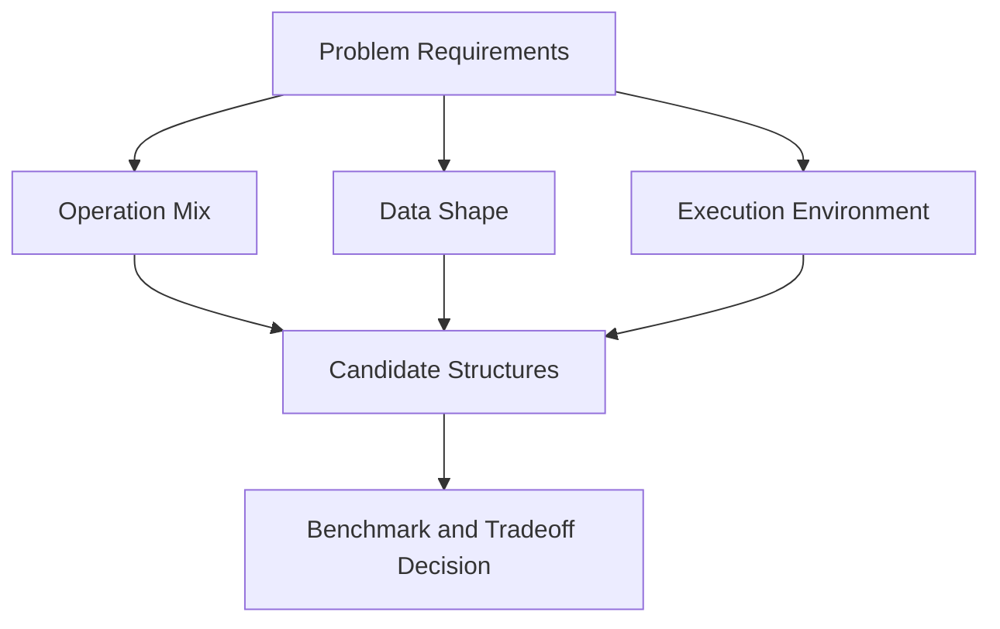
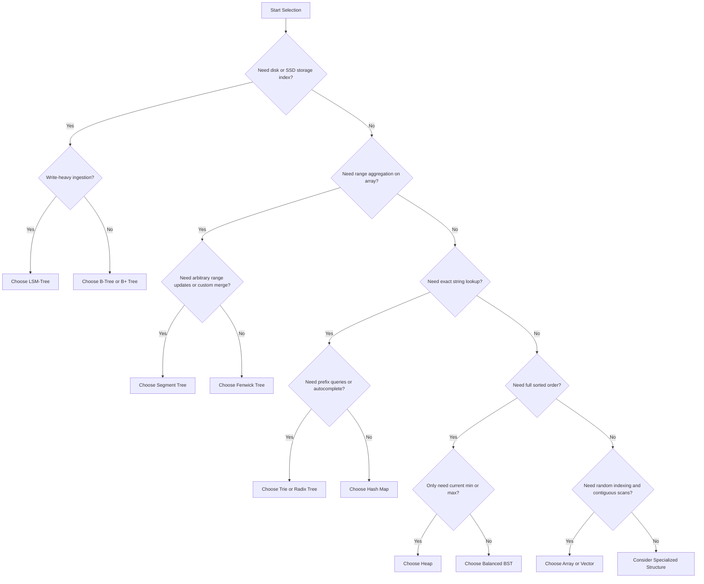

# Choosing the Right Data Structure

> [!NOTE]
> The best data structure is not the one with the most impressive asymptotic bound; it is the one whose operations, memory behavior, implementation cost, and real workload match your problem.

---

## 1. Why This Matters

Many students learn data structures as isolated chapters:
- arrays
- linked lists
- heaps
- trees
- hash tables
- tries

But real engineering does not ask:
> *"What is a heap?"*

It asks:
> *"Should I use a heap, a balanced tree, or a hash map here?"*

That is a fundamentally different skill.

Data structure choice affects:
- Asymptotic time complexity
- Memory overhead
- Cache locality
- Implementation complexity
- Concurrency behavior
- Disk and SSD performance
- Maintainability and bug risk

A structure that is theoretically elegant may perform poorly in production due to CPU cache stalls or memory fragmentation. A structure that is simple may be the best choice because it is easier to implement, debug, and optimize.

This guide is about **selection under physical and architectural tradeoffs**.

---

## 2. Core Intuition & Visual Model

Choosing a data structure is a matter of matching four dimensions:

1. **Access Pattern**: What operations happen most frequently?
2. **Data Shape**: Is the data contiguous, hierarchical, ordered, sparse, string-based, or disk-resident?
3. **Constraint Type**: Do you need exact order, prefix lookup, range aggregation, fast writes, or low memory overhead?
4. **Execution Environment**: Is this in RAM, on NVMe/SSD, on disk, in a concurrent system, or in a latency-sensitive hot path?

### Mental Model



A good engineer does not choose from habit alone. A good engineer asks:
- What must be fast?
- What may be slower?
- What memory footprint is acceptable?
- What implementation complexity is justified?

---

## 3. Formal Decision Criteria & Dimensions

### Core Evaluation Dimensions

1. **Operation Set**: Lookup, insert, delete, predecessor/successor, prefix search, range query, min/max extraction, ordered iteration.
2. **Workload Ratio**: Read-heavy, write-heavy, mixed, append-only, batched, streaming.
3. **Memory Layout**: Contiguous, pointer-heavy, page-oriented, compressed, probabilistic.
4. **Ordering Requirements**: Unordered, sorted order, partial order, hierarchical prefix structure.
5. **Update Locality**: Point update, range update, merge-heavy, immutable/static.
6. **Hardware Model**: CPU cache sensitivity, branch prediction, SSD/disk page reads, allocator overhead, concurrency locks.

> [!IMPORTANT]
> **The Selection Invariant**: A data structure is an optimal fit only if its strongest operations align with the workload's dominant operations.

---

## 4. Master Operations & Decision Matrix

| Structure | Strength | Weakness | Best For | Avoid When |
| :--- | :--- | :--- | :--- | :--- |
| **Array / Vector** | Excellent locality, $O(1)$ indexing | Expensive middle insertions and deletions | Indexed access, iteration, compact storage | Frequent arbitrary insertions in the middle |
| **Linked List** | Cheap local insertions once node is known | Poor locality, expensive traversal ($O(N)$) | Niche cases with stable iterators or intrusive structures | General-purpose hot paths |
| **Hash Map** | Expected $O(1)$ exact lookup | No sorted order, collision sensitivity | Exact key lookup, membership tests | Prefix queries or ordered traversal |
| **Balanced BST** | Ordered operations, predecessor and successor | More pointer overhead than arrays and heaps | Ordered sets and maps | Exact lookup only with no ordering need |
| **Heap** | Fast min/max access ($O(1)$ peek, $O(\log N)$ pop) | No full sorted iteration | Priority scheduling, top-$K$ element extraction | Frequent arbitrary deletions or ordered scans |
| **Trie** | Prefix search and string decomposition | High memory overhead in naive form | Prefix dictionaries, autocomplete | General exact lookup with weak prefix needs |
| **Fenwick Tree** | Compact and elegant prefix aggregates | Less flexible than segment tree | Prefix sums and point updates | Complex range operations |
| **Segment Tree** | Very flexible range query framework | Larger memory constant and code complexity | Range queries with custom merge logic | Very simple static workloads |
| **B-Tree / B+ Tree** | Excellent page efficiency and range scans on storage | Complex implementation | Databases and on-disk indexes | Tiny in-memory one-off tasks |
| **LSM-Tree** | Extreme write throughput via sequential appends | Read amplification and compaction cost | Write-heavy storage engines | Low-latency point reads under heavy read pressure |

---

## 5. Hardware & Cache Reality

In practice, physical silicon changes many textbook conclusions:

* **Memory Locality**: A contiguous array often beats a theoretically superior pointer-based structure because contiguous memory triggers CPU hardware prefetchers, loading 64-byte cache lines in $1\text{ ns}$ instead of causing $100\text{ ns}$ RAM stalls.
* **Disk and SSD Page Behavior**: On storage devices, page-oriented structures like B+ Trees reduce random I/O by matching node size to the $4\text{ KB}$ OS page size.
* **LSM-Trees for Write Ingestion**: By buffering in memory (MemTable) and writing sequential runs to disk (SSTables), LSM-trees convert expensive random disk writes into high-throughput sequential appends.
* **Constant Factors**: Two structures may both possess $O(\log N)$ time, but an array-backed heap will run circles around a pointer-based balanced BST due to pointer indirection and heap allocator pressure.

---

## 6. Canonical Decision Helpers

### Python Decision Helper

```python
def choose_structure(
    needs_indexing=False,
    needs_sorted_order=False,
    needs_prefix_search=False,
    needs_range_queries=False,
    write_heavy_storage=False,
    needs_top_priority=False
) -> str:
    if write_heavy_storage:
        return "Consider an LSM-Tree (RocksDB, Cassandra)"
    if needs_prefix_search:
        return "Consider a Trie or Radix Tree"
    if needs_range_queries:
        return "Consider a Fenwick Tree or Segment Tree"
    if needs_top_priority:
        return "Consider a Binary or D-ary Heap"
    if needs_sorted_order:
        return "Consider a Balanced BST (Red-Black / AVL) or B+ Tree"
    if needs_indexing:
        return "Consider a Contiguous Array or Dynamic Vector"
    return "Consider a Hash Map for O(1) exact lookup"
```

### Modern C++ Decision Helper

```cpp
#include <string>

std::string choose_structure(
    bool needs_indexing,
    bool needs_sorted_order,
    bool needs_prefix_search,
    bool needs_range_queries,
    bool write_heavy_storage,
    bool needs_top_priority
) {
    if (write_heavy_storage) return "Consider an LSM-Tree (RocksDB, Cassandra)";
    if (needs_prefix_search) return "Consider a Trie or Radix Tree";
    if (needs_range_queries) return "Consider a Fenwick Tree or Segment Tree";
    if (needs_top_priority) return "Consider a Binary or D-ary Heap";
    if (needs_sorted_order) return "Consider a Balanced BST (Red-Black / AVL) or B+ Tree";
    if (needs_indexing) return "Consider a Contiguous Array or std::vector";
    return "Consider a Hash Map (std::unordered_map) for O(1) exact lookup";
}
```

---

## 7. Head-to-Head Architectural Comparisons

### 7.1 Array vs. Linked List

> **Core Question**: Do you want contiguous memory and fast indexing, or pointer-linked nodes with local insertion flexibility?

| Dimension | Array / Vector | Linked List |
| :--- | :--- | :--- |
| **Index Access** | **$O(1)$** | $O(N)$ |
| **Append** | **$O(1)$ amortized** | $O(1)$ with tail pointer |
| **Insert in Middle** | $O(N)$ due to shifting | **$O(1)$ after node handle is known** |
| **Delete in Middle** | $O(N)$ due to shifting | **$O(1)$ after node handle is known** |
| **Traversal Locality** | **Exceptional** (L1 prefetching) | Poor (pointer-chasing cache misses) |
| **Memory Overhead** | **Zero per element** | 8–16 bytes per node for pointers |
| **Production Default** | **Always Yes** | Almost Never (Except specialized intrusive lists) |

* **Engineering Verdict**: For 99% of general-purpose software, **Array / Vector is the strictly superior default**.

---

### 7.2 B-Tree vs. LSM-Tree

> **Core Question**: Do you want page-oriented balanced search with low read amplification, or write-optimized storage with batched compaction?

| Dimension | B-Tree / B+ Tree (Postgres, SQLite) | LSM-Tree (RocksDB, Cassandra) |
| :--- | :--- | :--- |
| **Point Read Latency** | **Fast & Predictable** ($O(\log_B N)$, 1–2 I/Os) | Higher (Touches MemTable + multiple SSTable runs) |
| **Write Performance** | Moderate (Dirty page flushes cause random writes) | **Extreme** (Append-only sequential disk writes) |
| **Range Scan** | **Unbeatable** (Follow leaf node linked list) | Slower (Merges multi-level sorted iterators) |
| **Storage Layout** | In-place slotted page updates | Append-only files + background compaction |
| **Write Amplification** | Moderate | Higher (compaction rewrites data across levels) |
| **Best Environment** | Read-heavy or balanced transactional databases (OLTP) | High-velocity write ingestion (Metrics, Logs, Time-series) |

---

### 7.3 Fenwick Tree vs. Segment Tree

> **Core Question**: Do you want the simplest, lowest-memory structure for prefix aggregation, or a generalized framework for complex range queries and updates?

| Dimension | Fenwick Tree (BIT) | Segment Tree |
| :--- | :--- | :--- |
| **Implementation** | **Trivial** (10 lines of bitwise math) | Moderate (Recursive node hierarchy) |
| **Memory Usage** | **$1N$ array elements** | $4N$ array elements |
| **Point Update** | $O(\log N)$ | $O(\log N)$ |
| **Prefix Query** | $O(\log N)$ | $O(\log N)$ |
| **Arbitrary Range Updates** | Complex without difference tricks | **Natural with Lazy Propagation** |
| **Custom Merges (Max/Min/GCD)** | Limited to invertible operations (or complex) | **Arbitrary associative operations** |
| **Best For** | Prefix sums, frequency counts, inversion counting | Dynamic range min/max, lazy updates, range assignments |

---

### 7.4 Trie vs. Hash Map for Strings

> **Core Question**: Do you need exact string matching only, or do you need prefix-aware structure and lexicographic traversal?

| Dimension | Trie / Radix Tree | Hash Map |
| :--- | :--- | :--- |
| **Exact Lookup** | $O(L)$ where $L = \text{length}$ | **Expected $O(1)$** (Hash then compare) |
| **Prefix Lookup** | **Natural & $O(L)$** | Unnatural (Requires scanning all keys) |
| **Lexicographic Traversal** | **Natural in-order DFS** | Impossible without sorting keys |
| **Memory Overhead** | High in naive form (pointer matrix per node) | **Compact** |
| **Best For** | Autocomplete, IP routing, dictionary segmentation | Key-value caching, user session lookup |

---

### 7.5 Heap vs. Balanced BST

> **Core Question**: Do you only need fast access to the current min or max, or do you need full sorted order and richer order-statistic queries?

| Dimension | Binary / D-ary Heap | Balanced BST (Red-Black, AVL) |
| :--- | :--- | :--- |
| **Find Min / Max** | **$O(1)$** | $O(1)$ with cached pointer, else $O(\log N)$ |
| **Insert** | $O(\log N)$ ($O(1)$ average for binary heap) | $O(\log N)$ |
| **Extract Min / Max** | $O(\log N)$ | $O(\log N)$ |
| **Arbitrary Deletion** | Inefficient ($O(N)$ search without handle map) | **$O(\log N)$** |
| **In-Order Traversal** | Destructive ($O(N \log N)$ popping) | **Natural $O(N)$** |
| **Predecessor / Successor** | Not supported | **Natural $O(\log N)$** |
| **Best For** | Task schedulers, Dijkstra's algorithm, top-$K$ elements | Dynamic ordered sets, range queries over keys |

---

## 8. Master Decision Flowchart



---

## 9. Common Pitfalls & Selection Anti-Patterns

1. **The Linked List Anti-Pattern**: Choosing linked lists because insertion is theoretically $O(1)$, ignoring that finding the insertion location requires an $O(N)$ sequential walk that stalls CPU cache lines.
2. **The Segment Tree Overkill**: Using a 100-line Segment Tree when a 10-line Fenwick Tree or simple prefix-sum array solves the problem with $4\times$ less memory.
3. **The Uncompressed Trie Trap**: Allocating a naive 26-pointer array for every node in a sparse dictionary, wasting hundreds of megabytes of RAM. Use a compressed Radix Tree or ternary search tree instead.
4. **LSM-Tree Hype in Read-Heavy Systems**: Choosing an LSM-Tree for a read-heavy system, resulting in severe read amplification across multiple SSTable runs.
5. **Heap for General Sorted Access**: Using a heap when arbitrary key deletion or sorted range scanning is required, forcing frequent $O(N)$ scans.

---

## 10. Related Problems & Further Reading

### Curated Problems
* [LeetCode 146: LRU Cache](https://leetcode.com/problems/lru-cache/) *(Hash Map + Doubly Linked List hybrid design)*
* [LeetCode 208: Implement Trie](https://leetcode.com/problems/implement-trie-prefix-tree/) *(Exact lookup vs. prefix tree design)*
* [LeetCode 307: Range Sum Query Mutable](https://leetcode.com/problems/range-sum-query-mutable/) *(Fenwick Tree vs. Segment Tree)*
* [LeetCode 703: Kth Largest Element in a Stream](https://leetcode.com/problems/kth-largest-element-in-a-stream/) *(Heap vs. Balanced BST)*
* [CSES Range Queries Section](https://cses.fi/problemset/) *(Comprehensive practical tests for Fenwick vs. Segment trees)*

### Related Internal Documentation
* [CPU Cache, Memory Hierarchy & Data Locality](../03-machine-model-and-performance/cpu-cache-and-memory.md)
* [B-Trees & B+ Trees](../05-trees-and-hierarchical-structures/b-trees-and-b-plus-trees.md)
* [Fenwick Trees](../05-trees-and-hierarchical-structures/fenwick-trees.md)
* [Segment Trees](../05-trees-and-hierarchical-structures/segment-trees.md)
* [Tries & Radix Trees](../05-trees-and-hierarchical-structures/tries-and-radix-trees.md)
