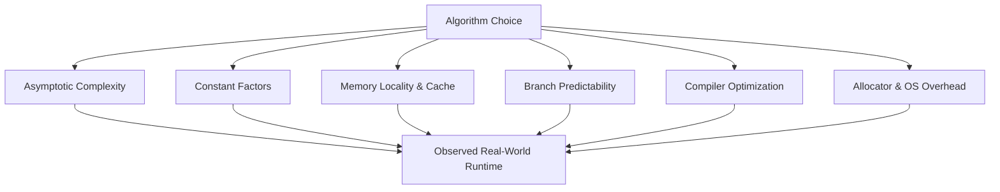

# Theoretical vs Practical Performance

> [!NOTE]
> Asymptotic complexity explains how cost grows with input size, but real runtime also depends on constant factors, memory locality, branching behavior, compiler optimizations, and the actual workload.

> [!TIP]
> Use asymptotic analysis to rule out bad scaling. Use empirical benchmarking and hardware awareness to choose among plausible good designs.

---

## 1. Why This Matters

Algorithm analysis usually begins with asymptotic notation:
- $O(n)$
- $O(\log n)$
- $O(n \log n)$
- $O(n^2)$

That is essential. It provides a shared mathematical language for growth rates and helps reject fundamentally unscalable solutions.

However, real software systems do not execute abstract Big-O notation. They run on physical machines:
- Multi-tier CPU caches ($L1, L2, L3$) and instruction pipelines
- Hardware branch predictors
- Dynamic memory allocators
- Optimizing compilers
- Operating system schedulers and page caches
- Finite, bounded problem sizes

This creates an important engineering reality:

> Two algorithms with the same Big-O can have vastly different execution times. In practice, a contiguous $O(n)$ scan can easily beat an $O(\log n)$ or even expected $O(1)$ pointer-heavy structure for real-world input sizes.

Understanding the gap between theory and physical reality prevents common architecture mistakes:
- A flat array scan often outperforms a linked list traversal by up to $50\times$ due to hardware prefetchers.
- A Fenwick Tree routinely runs $3\times$ faster than a Segment Tree for prefix queries despite identical $O(\log n)$ complexity.
- A flat sorted vector with binary search often beats a hash map at small sizes ($N \le 64$) because it avoids hashing overhead and bucket indirection.
- Recursive code with deep call stacks incurs call-frame overhead that tight iterative loops avoid.

---

## 2. Core Intuition & The Tripartite Model

Theoretical analysis answers:
* How does cost grow as input size $n$ approaches infinity?
* Which algorithm eventually scales better?

Practical performance answers:
* How many CPU instructions execute per item?
* How predictable are the conditional branches?
* How many 64-byte cache lines are transferred across the memory bus?
* How many dynamic memory allocations occur on the heap?
* How effectively can the compiler vectorize and inline the loops?

### The Tripartite Performance Model

$$\text{Observed Runtime} \approx \text{Algorithmic Growth } O(f(n)) \times \text{Constant Factors } (c) \times \text{Hardware Effects } (\mu)$$



For astronomical $n$, asymptotic growth dominates. But for practical $n$ ($10^2$ to $10^6$), constant factors and hardware mechanics often determine the winner.

---

## 3. Formal Invariants & Evaluation Principles

1. **Asymptotic Analysis Remains Inviolable**: An $O(n^2)$ algorithm will never magically beat an $O(n \log n)$ algorithm as $n \to \infty$, no matter how many cache optimizations are applied.
2. **Big-O Discards Constant Multipliers by Definition**: $T_1(n) = 2n$ and $T_2(n) = 200n$ are both $O(n)$, but $T_1$ executes $100\times$ faster across all realistic input sizes.
3. **Hardware Has Non-Uniform Topology**: Accessing an $L1$ cache register takes $\sim 1\text{ ns}$; accessing DRAM takes $\sim 100\text{ ns}$. Memory access is neither uniform nor constant.
4. **Workload Shape Decides Utility**: A data structure tuned for uniform random reads will behave completely differently under skewed Zipfian access or sequential write bursts.

---

## 4. Key Factors Separating Theory from Physical Reality

| Factor | Theoretical Word-RAM Model | Physical Silicon Reality | Engineering Implication |
| :--- | :--- | :--- | :--- |
| **Constant Factors** | Ignored ($c \cdot f(n) \to f(n)$) | Can dominate for realistic $n$ | An $O(n)$ scan can beat an $O(\log n)$ tree for small $n$. |
| **Memory Access** | Uniform $O(1)$ latency | $L1$ ($1\text{ ns}$) vs DRAM ($100\text{ ns}$) | Contiguous memory structures dominate pointer-heavy graphs. |
| **Branch Prediction** | Zero-cost branching | Mispredict stalls pipeline for 15–20 cycles | Branchless, predictable code runs much faster. |
| **Memory Allocation** | Free infinite memory | Heap allocator locks, fragmentation, headers | Dynamic node allocation degrades throughput. |
| **Compiler Optimization** | Unmodeled | Inlining, loop unrolling, SIMD auto-vectorization | Clean array loops compile to vector instructions. |
| **Recursion Overhead** | $O(1)$ stack frame cost | Register spilling, call overhead, stack limits | Iterative implementations avoid call-stack overhead in hot paths. |

---

## 5. Hardware, Cache Lines & Data-Oriented Design

### Cache Line Streaming vs. Pointer Chasing
Modern CPUs fetch memory in **64-byte blocks (Cache Lines)**:
* **Contiguous Arrays**: Accessing element $A[0]$ loads $A[1 \dots 7]$ simultaneously into L1 cache for free. The CPU hardware prefetcher detects the sequential stride and streams future elements into cache ahead of execution.
* **Pointer Chasing**: Traversing a linked list or tree node dereferences an arbitrary 64-bit heap address. Each step produces an L1/L2 cache miss, forcing the execution pipeline to stall for hundreds of CPU cycles.

```text
Contiguous Array (High Cache Residency):
[ 8B ][ 8B ][ 8B ][ 8B ][ 8B ][ 8B ][ 8B ][ 8B ]  <-- 1 Single Cache Line Fetch (64B)
▲
└── Next 7 elements accessed with 0 ns latency!

Linked List (Scattered Heap Nodes):
[ Node A ] ───(pointer hop)───► [ Node B ] ───(pointer hop)───► [ Node C ]
0x1040A0 (Cache Miss)           0x78B240 (Cache Miss)           0x33F900 (Cache Miss)
```

---

## 6. Constant Factors: Where They Come From

Big-O deliberately drops constant factors. In practice, constants originate from:
1. **Instruction Density**: How many assembly instructions execute per inner loop iteration.
2. **Indirect Loads**: Following pointers through multiple memory indirection levels (`a->b->c`).
3. **Hash Computations**: Evaluating cryptographic or non-cryptographic hashes, computing modulo operations, and resolving bucket collisions.
4. **Memory Allocation Bookkeeping**: Heap allocators (`malloc`, `new`) maintain size headers, free lists, and thread-local caches.
5. **Bounds Checks & Virtual Dispatch**: Dynamic dispatch (vtable lookups) and runtime bounds checks prevent compiler loop vectorization.

---

## 7. Branch Prediction & Instruction Pipelines

Modern out-of-order processors deploy deep instruction pipelines (14 to 20 stages). The CPU anticipates branch outcomes using historical branch predictor tables:
* **Predictable Branches**: Fixed-stride loops, monotone boundaries, and sorting networks allow the pipeline to remain saturated.
* **Unpredictable Branches**: Data-dependent comparisons (e.g. quicksort partitions with random pivots or irregular tree walks) cause **branch mispredictions**, flushing instructions in-flight and wasting 15 to 20 CPU cycles per miss.

---

## 8. Compiler Optimization Effects

Modern optimizing compilers (`gcc -O3`, `clang -O3`) perform aggressive transformations:
* **Function Inlining**: Eliminates call overhead and enables cross-function register allocation.
* **Auto-Vectorization**: Employs SIMD registers (AVX-512, NEON) to process 4 to 16 data elements simultaneously in a single CPU cycle.
* **Loop Unrolling**: Reduces loop-counter branch overhead.

> [!WARNING]
> **Benchmarking Trap**: Never benchmark algorithms in Debug mode. Abstractions that cost zero overhead in `-O3` (like modern C++ `std::span` or template wrappers) incur severe function call and bounds-check penalties in debug builds.

---

## 9. Concrete Case Studies

### 1. Flat Array Scan vs. Linked List Traversal
* **Theory**: Both are asymptotically identical at $O(n)$ time.
* **Practice**: Linear array scans routinely run **$10\times$ to $50\times$ faster** because of hardware prefetching, zero allocation overhead, and superior branch predictability.

### 2. Fenwick Tree vs. Segment Tree
* **Theory**: Both support point updates and range queries in $O(\log n)$ time.
* **Practice**: Fenwick trees consistently outperform Segment trees by **$2\times$ to $4\times$** for prefix sums due to zero pointer overhead, a compact $1N$ memory footprint, and tight bitwise loops (`i & -i`).

### 3. Binary Heap vs. Balanced BST
* **Theory**: Both insert and extract extrema in $O(\log n)$ time.
* **Practice**: An array-backed binary heap has superior cache locality and near-zero memory overhead per element compared to a pointer-based Red-Black tree (`std::set`).

---

## 10. Benchmarking Methodology: Common Traps

Benchmarking is critical, but trivial to perform incorrectly:

1. **The Dead Code Elimination Trap**: If the compiler detects that the result of an algorithmic benchmark is never used, it may delete the entire loop during optimization. Always consume results using volatile reads or benchmark do-not-optimize sinks (`benchmark::DoNotOptimize` in Google Benchmark).
2. **Cold Cache vs. Warm Cache**: The first iteration measures memory page fault and cold cache loading latency; subsequent iterations measure warm cache throughput. Explicitly state whether you are measuring cold or warm performance.
3. **Timing Noise & High-Resolution Clocks**: Use monotonic high-resolution timers (`std::chrono::steady_clock`), run thousands of iterations, and report median and percentiles ($P_{50}, P_{99}$) rather than a single noisy run.
4. **Synthetic Data Bias**: Benchmarking exclusively on uniformly distributed random integers can hide worst-case branch mispredictions or pathological hash collisions.

---

## 11. Engineering Rules of Thumb

1. **Big-O rules out bad scaling; hardware decides actual latency.**
2. **Contiguous memory layout beats pointer-heavy abstraction by default.**
3. **Small and medium inputs ($N \le 100$) often behave contrary to asymptotic predictions.**
4. **Choose the simplest data structure that satisfies your workload requirements.**
5. **Always measure optimized release builds under realistic workloads.**

---

## 12. Related Topics & Further Reading

### Internal Documentation
* [CPU Cache, Memory Hierarchy & Data Locality](../03-machine-model-and-performance/cpu-cache-and-memory.md)
* [Choosing the Right Data Structure](choosing-the-right-data-structure.md)
* [Fenwick Trees](../05-trees-and-hierarchical-structures/fenwick-trees.md)
* [B-Trees & B+ Trees](../05-trees-and-hierarchical-structures/b-trees-and-b-plus-trees.md)

### Seminal References
* **Mike Acton (2014)**: *"Data-Oriented Design and C++"*. CppCon Keynote.
* **Ulrich Drepper (2007)**: *"What Every Programmer Should Know About Memory"*. Red Hat.
* **Cliff Click**: *"Modern Hardware and the JVM"*. JavaOne.
