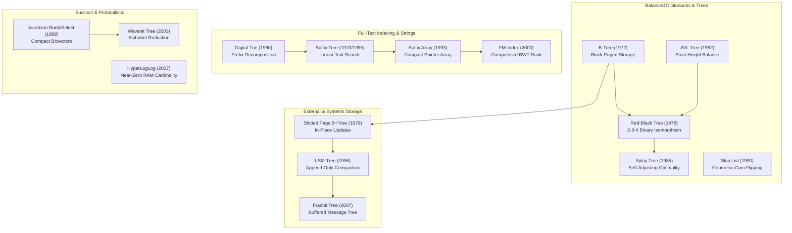

# Landmark Data Structures: Architectural Evolution & Historical Milestones

## 1. Executive Summary & The Genealogical Perspective

Every fundamental breakthrough in computer science has been accompanied—and often precipitated—by the invention of a new data structure. From the dawn of magnetic core memory to modern distributed datacenters, the history of data structures is a continuous dialectic between **hardware constraints** and **mathematical invariants**.

When memory was tiny and random access expensive, researchers invented the **Hash Table** and **B-Tree**. When pointer overhead became prohibitive, they developed **Succinct Data Structures** and **Implicit Heaps**. When disks gave way to solid-state drives and write-heavy workloads exploded, they created the **LSM-Tree**.

This chapter chronicles the **Ten Landmark Data Structures** that defined modern computer science, tracing their architectural lineages, design trade-offs, and enduring design principles.

---

## 2. The Grand Lineage of Landmark Data Structures



---

## 3. The Ten Landmark Milestones

### 3.1 The Hash Table & Universal Hashing (1953 Luhn; 1979 Carter & Wegman)
- **The Physical Reality**: In 1953, Hans Peter Luhn at IBM needed to search chemical formulas on punched cards. He introduced "bucket hashing."
- **The Theoretical Crisis**: In the 1960s, mathematicians realized that any deterministic hash function has worst-case inputs where all $N$ keys collide into a single bucket, collapsing lookup to $O(N)$.
- **The Breakthrough**: In 1979, Carter and Wegman introduced **Universal Hashing**: randomly selecting a hash function from a universal family ($h(x) = ((ax + b) \pmod p) \pmod m$) guarantees that for any two distinct keys, the collision probability is strictly $\le 1/m$.
- **Modern Legacy**: Universal hashing and its derivatives (MurmurHash, CityHash, xxHash) power every hash map in modern software.

### 3.2 The B-Tree Family (1972 Bayer & McCreight)
- **The Physical Reality**: Main memory was measured in kilobytes; data was stored on rotating magnetic disks where a random seek took 10 milliseconds ($10,000,000\text{ ns}$). Binary search trees were catastrophic because traversing 30 pointers incurred 30 disk seeks ($300\text{ ms}$).
- **The Breakthrough**: Rudolf Bayer and Edward McCreight widened nodes to match the physical disk block size (4–8 KB). A node with branching factor $B \approx 1000$ indexes billions of records in just 3 to 4 disk reads.
- **Modern Legacy**: $B^+$-Trees remain the storage engine indexing backbone of PostgreSQL, SQLite, MySQL InnoDB, and NTFS/ext4 file systems.

### 3.3 The Red-Black Tree (1978 Guibas & Sedgewick)
- **The Physical Reality**: AVL trees enforced strict height balance ($|h_L - h_R| \le 1$), requiring frequent, complex double rotations during insertions and deletions.
- **The Breakthrough**: Guibas and Sedgewick formalized Rudolf Bayer's Symmetric Binary B-Tree into the **Red-Black Tree**, an elegant binary representation of 2-3-4 B-trees. Coloring edges red (intra-node) and black (inter-node) relaxed the height balance while guaranteeing $h \le 2 \log_2(n + 1)$ with at most 3 rotations per delete and 2 per insert.
- **Modern Legacy**: Powers C++ `std::set` and `std::map`, Java `TreeMap`, and the Linux kernel Completely Fair Scheduler (`rb_root_cached`).

### 3.4 The Splay Tree (1985 Sleator & Tarjan)
- **The Physical Reality**: In real workloads, data access is rarely uniform. Over $80\%$ of lookups target a small "working set" of $20\%$ of the keys. Maintaining explicit balance tags wastes memory and processor cycles.
- **The Breakthrough**: Sleator and Tarjan introduced the **Splay Tree**, which self-adjusts on every access by rotating the accessed node to the root via zig-zig and zig-zag steps. They proved the **Access Lemma**, establishing that Splay Trees match the static optimal search tree for any access distribution!
- **Modern Legacy**: Unmatched elegance for caching, data compression (Unix `pack`), and network routing tables.

### 3.5 Disjoint-Set Union (DSU / Union-Find) (1975 Tarjan)
- **The Physical Reality**: Tracking dynamic graph connectivity across millions of nodes required near-constant time operations without complex tree restructuring.
- **The Breakthrough**: Tarjan analyzed two simple heuristics: **Union by Rank** and **Path Compression**. He proved that combining them yields an amortized cost per operation of:
  $$O(\alpha(n))$$
  where $\alpha(n)$ is the inverse Ackermann function. For any conceivable input size in the universe ($n \le 10^{80}$ atoms in the observable cosmos), $\alpha(n) \le 4$. DSU is practically $O(1)$!
- **Modern Legacy**: Kruskal's Minimum Spanning Tree, image segmentation, percolation theory, and unification in type checkers.

### 3.6 The Fibonacci Heap (1987 Fredman & Tarjan)
- **The Physical Reality**: Network graph algorithms (Dijkstra's shortest path, Prim's MST) execute thousands of `decrease-key` operations for every `extract-min`. Binary heaps cost $O(\log n)$ per `decrease-key`, creating an asymptotic bottleneck.
- **The Breakthrough**: Fredman and Tarjan deferred consolidation work: `insert`, `merge`, and `decrease-key` execute in $O(1)$ lazy time by simply severing nodes and adding them to a root list. Cleanup is amortized and deferred to `extract-min`.
- **Modern Legacy**: Unlocked the legendary $O(E + V \log V)$ bound for single-source shortest paths.

### 3.7 The Suffix Tree & Suffix Automaton (1973 Weiner; 1995 Ukkonen)
- **The Physical Reality**: Searching large texts (DNA sequences, literature, dictionaries) required answering substring queries in time proportional to the pattern length $O(m)$, independent of the corpus size $N$.
- **The Breakthrough**: Peter Weiner invented suffix trees; Esko Ukkonen perfected the online $O(n)$ construction algorithm using implicit trees and suffix links. A compressed trie of all $n$ suffixes represents all substrings in linear space.
- **Modern Legacy**: BLAST bioinformatics alignment, full-text database search, and plagiarism detection.

### 3.8 The FM-Index (2000 Ferragina & Manzini)
- **The Physical Reality**: Suffix trees require 20–40 bytes of pointer overhead per character, exceeding available RAM for human genomes (3.2 billion base pairs).
- **The Breakthrough**: Ferragina and Manzini combined the Burrows-Wheeler Transform (BWT) with succinct rank bitvectors, creating the **FM-Index**. It compresses text down to its entropy limit while simultaneously supporting exact pattern matching in $O(m)$ time!
- **Modern Legacy**: Bowtie and BWA (the standard genomic aligners mapping modern DNA sequencing reads).

### 3.9 The Log-Structured Merge-Tree (LSM-Tree) (1996 O'Neil et al.)
- **The Physical Reality**: With the advent of web crawlers, telemetry, and distributed databases, write throughput eclipsed read throughput. $B$-trees collapsed under write amplification because modifying a 100-byte record forced a 16 KB page flush.
- **The Breakthrough**: Patrick O'Neil et al. inverted the design: incoming writes append to an in-memory sorted MemTable (RAM) and a Write-Ahead Log. Flushed runs are sequentially merged across tiered levels in the background, converting random disk writes into high-speed sequential streaming.
- **Modern Legacy**: RocksDB, Apache Cassandra, Google Bigtable, LevelDB, and ClickHouse.

### 3.10 Succinct Rank/Select Bitvectors (1989 Jacobson)
- **The Physical Reality**: Storing tree topologies with explicit pointers consumes $2 \times 64 \text{ bits} = 128 \text{ bits}$ per node, dwarfing the payload.
- **The Breakthrough**: Guy Jacobson proved that any $n$-node static tree can be encoded in exactly $2n + o(n)$ bits—the information-theoretic lower bound—while still supporting navigational operations (`parent`, `left_child`, `right_child`) in $O(1)$ time using auxiliary $O(n / \log n)$ rank/select summary directories.
- **Modern Legacy**: Compressed web graphs, compressed suffix trees, and high-performance search engine indices.

---

## 4. Enduring Design Patterns of Landmark Data Structures

```
+-------------------------------------------------------------------------------+
| Pattern 1: The Pointer-Elimination Pattern                                    |
| Pointers waste memory and induce CPU cache-line stalls. Landmark structures   |
| repeatedly replace pointer graphs with arithmetic offsets:                    |
| - Binary Heap: Array arithmetic parent(i) = i / 2                             |
| - Suffix Array: Sorted integer indices replace Suffix Tree pointer nodes      |
| - Succinct Bitvectors: Level-order bits replace node pointers                 |
+-------------------------------------------------------------------------------+

+-------------------------------------------------------------------------------+
| Pattern 2: The Amortized Lazy Deferral Pattern                                |
| Do not perform expensive re-balancing immediately upon every mutation.        |
| Defer structural maintenance until it can be amortized across a batch:       |
| - Fibonacci Heaps: Lazy decrease-key, batch consolidation on extract-min      |
| - LSM-Trees: Lazy log flushing, batch merging during compaction               |
| - DSU: Lazy path compression during search                                    |
+-------------------------------------------------------------------------------+

+-------------------------------------------------------------------------------+
| Pattern 3: The Hardware Hierarchy Alignment Pattern                           |
| Match algorithm step sizes to physical hardware transfer chunks:              |
| - B-Tree: Fanout calibrated to 4 KB - 16 KB disk blocks                       |
| - Cache-Oblivious Trees: Recursive Van Emde Boas layout matches all cache tiers|
| - Intrusive Lists: Embeds pointers into domain struct to avoid allocator hops |
+-------------------------------------------------------------------------------+
```

---

## 5. Comparative Tradeoff Matrix of the Landmark Eras

| Era | Dominant Hardware Bottleneck | Archetypal Landmark Structure | Core Mathematical Innovation |
| :--- | :--- | :--- | :--- |
| **1960s** | Main RAM capacity (< 64 KB) | AVL Trees, Quicksort | Height invariants, in-place partitioning |
| **1970s** | Magnetic Disk seek latency (10 ms) | B-Trees, Universal Hashing | Block fanout, randomized collision bounds |
| **1980s** | Amortization & Theoretical Limits | Fibonacci Heaps, Splay Trees | Potential functions, Access Lemma |
| **1990s** | Memory Hierarchy & Cache Lines | Cache-Oblivious Trees, LSM-Trees | Recursive tiling, out-of-place merge |
| **2000s** | Multi-Core Interconnects & Big Data | Lock-Free Queues, FM-Index | CAS consensus, compressed BWT rank |
| **2010s+** | NVMe Flash, NUMA & Massive RAM | W-TinyLFU, Learned Indexes | Frequency sketches, neural interpolation |

---

## 6. Exercises & Historical Retrospective

1. **Re-deriving the Binary Heap Array Invariant**:
   Prove why 1-indexed binary heaps have the property that the children of node $i$ are at $2i$ and $2i+1$, and why 0-indexed binary heaps require $2i+1$ and $2i+2$.
2. **From 2-3-4 Trees to Red-Black Trees**:
   Draw a 2-3-4 tree containing a 4-node with keys $\{10, 20, 30\}$. Convert it into its isomorphic Red-Black tree representation, showing the red links and the equivalent black height.
3. **The Suffix Array Space Win**:
   Calculate the exact byte difference between an explicit pointer-based suffix tree (nodes with child pointers, suffix link, string indices) and a suffix array + LCP array for the human genome ($3.2 \times 10^9$ characters).
