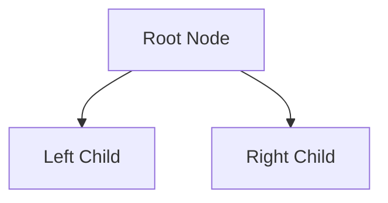

# Topic Name

> [!NOTE]
> One-sentence elevator pitch: what this data structure or algorithm does, its core purpose, and its primary performance signature.

---

## 1. Why This Matters
* Why does this structure/algorithm exist?
* What specific limitation of simpler structures does it overcome?
* Where does it fit in the computer science landscape?

---

## 2. Core Intuition & Visual Model
* Mental model and plain-English explanation.
* Visual ASCII or Mermaid diagram illustrating state or memory organization:



---

## 3. Formal Definition & Invariants
* Rigorous mathematical or structural rules that must never be broken:
  1. **Invariant 1**: e.g., Shape property.
  2. **Invariant 2**: e.g., Heap order / BST ordering property.
  3. **Invariant 3**: e.g., Balance factor or color invariants.

---

## 4. Key Operations & State Transitions

| Operation | Average Case | Worst Case | Space (Auxiliary) | Description |
| :--- | :--- | :--- | :--- | :--- |
| `Search(key)` | $O(\dots)$ | $O(\dots)$ | $O(1)$ | Lookup behavior. |
| `Insert(item)` | $O(\dots)$ | $O(\dots)$ | $O(1)$ | Insertion & rebalancing. |
| `Delete(key)` | $O(\dots)$ | $O(\dots)$ | $O(1)$ | Removal & structural repair. |

---

## 5. Hardware & Cache Reality
* **Memory Locality**: Contiguous vs pointer-chasing traversal overhead.
* **Cache Line Utilization**: How many 64-byte cache lines are fetched per access.
* **Constant Factors**: Hidden overheads (pointer indirection, allocator malloc calls, branch mispredictions).

---

## 6. Proof Sketch & Correctness
* Intuition or sketch of why the algorithm is correct (e.g., Loop Invariant, Induction hypothesis, or Cut Property).
* Why the asymptotic time/space bounds hold.

---

## 7. Canonical Implementation

### Python (Conceptual & Clean)
```python
class ExampleStructure:
    def __init__(self):
        self.data = []

    def insert(self, value):
        pass
```

### C++ (Systems & Memory Layout)
```cpp
#include <iostream>
#include <vector>

template <typename T>
class ExampleStructure {
private:
    std::vector<T> data_;
public:
    void insert(const T& value) {
        // Implementation
    }
};
```

---

## 8. Variants & Extensions
* Specialized variations (e.g., Min vs Max, Persistent variant, Concurrent variant).
* How parameters adjust tradeoffs.

---

## 9. Real-World Systems Case Studies
* **System 1**: e.g., PostgreSQL / Linux Kernel / Redis.
* **Why chosen**: Why the designers chose this specific structure over alternatives.
* **Real-world nuance**: How production implementations deviate from academic theory (e.g., batching, lock-free optimizations, hybrid structures).

---

## 10. When NOT to Use This (Tradeoffs & Anti-Patterns)
* Situations where simpler or alternative structures dominate.
* Performance pitfalls in practice.

---

## 11. Common Pitfalls & Edge Cases
* Off-by-one errors, recursion depth stack overflows, integer overflow in midpoint calculations (`(l + r) / 2` vs `l + (r - l) / 2`).
* Empty collection inputs or duplicate keys.

---

## 12. Related Problems & Further Reading
* **Curated Problems**:
  * [LeetCode XXX - Title](https://leetcode.com/) (Difficulty)
  * [Codeforces XXX - Title](https://codeforces.com/) (Rating)
* **Seminal Papers**:
  * Author(s), *"Paper Title"*, Year.
